## Prerequisites
- You have an environment set up and you can access your SAP Work Zone.
&nbsp;
**Note that SAP Work Zone is not available in a trial account.**

## Details
### You will learn
  - How to create a new workspace
  - How to add content to it and design the layout

In this tutorial, you're going to create a workspace where employees who joined the company hackathon challenge, can interact with other members of the workspace, ask questions, and find out all that they need to know.

>Note that SAP Work Zone is not available in a trial account.

---

[ACCORDION-BEGIN [Step 1: ](Download images for your workspace)]

Before you start, download these image files so that they're on your computer ready for you to add to your workspace pages:

- [`workspace_row2_image1.jpg`](Workspace_Images/workspace_row2_image1.jpg)
- [`workspace_row2_image2.jpg`](Workspace_Images/workspace_row2_image2.jpg)
- [`workspace_header_image.jpg`](Workspace_Images/workspace_header_image.jpg)
- [`workspace_image_with_icon1.png`](Workspace_Images/workspace_image_with_icon1.png)
- [`workspace_image_with_icon2.png`](Workspace_Images/workspace_image_with_icon2.png)
- [`workspace_image_with_icon3.png`](Workspace_Images/workspace_image_with_icon3.png)
- [`workspace_image_with_icon4.png`](Workspace_Images/workspace_image_with_icon4.png)

[DONE]
[ACCORDION-END]

[ACCORDION-BEGIN [Step 2: ](Create a workspace)]

Workspaces are the building blocks of SAP Work Zone. You can add pages, content such as widgets, apps, forums and more, and you can invite other members to join.

1. In your work zone, click **Workspaces** in the top-level menu, and then click **New Workspace**.

    !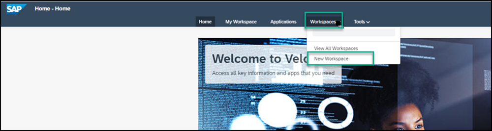

2. Select **No Template** from the dropdown list of available templates.

    !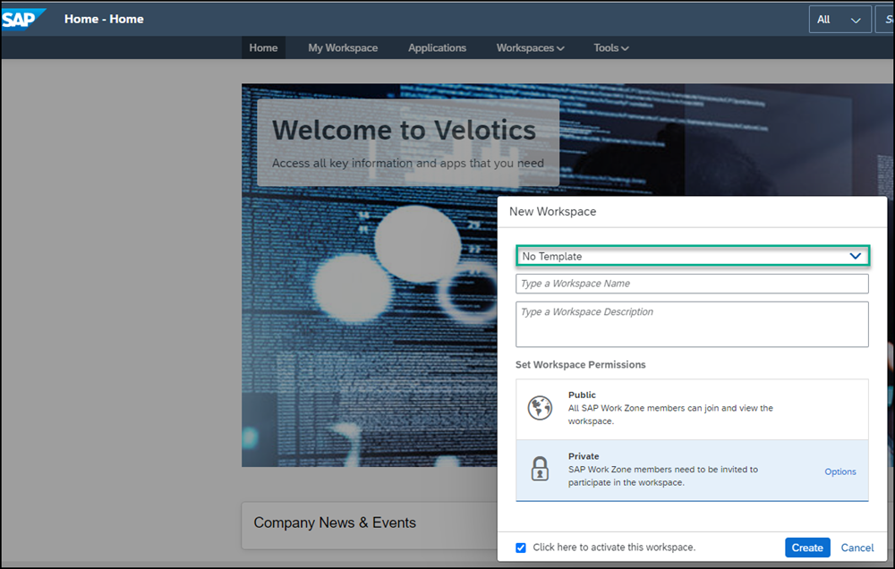

    >You can also select one of SAP's out-of-the-box templates. In this case, you'll get a professionally designed overview page with widgets including everything you need to get started quickly. You can then customize the content to suit your needs. For this tutorial you won't use a template.

3. Enter this name for your workspace: `Employee Innovation Hackathon`. If you're taking part in a workshop, please add your unique identifier to the workspace name like this: `<your unique identifier>_Employee Innovation Hackathon`.

    >**Tip:** Always use a name that would help users distinguish your workspace from others.

4. Copy and paste this description for your workspace: `Get together and find the answers to your questions about the hackathon!`

5. Select `Private`.

    >Selecting private makes your workspace available to a specific set of members that you've invited to the workspace. If you later want to make it public so that everyone in the company can see it, click **Edit Workspace Settings** at the top of your screen and change the setting to `Public`.

6. Click **Create**.

    !

Your workspace is created.

[DONE]
[ACCORDION-END]

[ACCORDION-BEGIN [Step 3: ](Configure your workspace notifications)]

When you create your workspace, you are prompted to define the frequency of email notifications.

1. Select **Daily** to get any updates to the workspace every day.

2. Click **Accept** to ensure that you've joined the workspace.

  !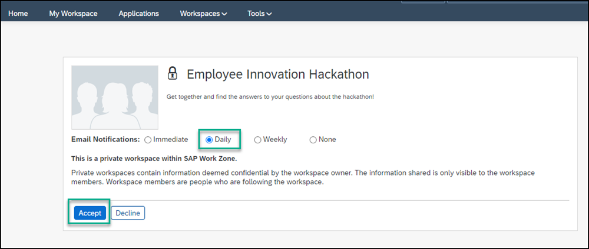

You can now start building your workspace.

!

Now, let's add content to the workspace.

[DONE]
[ACCORDION-END]

[ACCORDION-BEGIN [Step 4: ](Change the image in the workspace header)]

When you create a new workspace, the header has a dark and light blue background. You can replace this background with your own.

1. Hover over the background in the workspace header to expose the  **Edit cover photo** button and select **Upload Photo**.

    !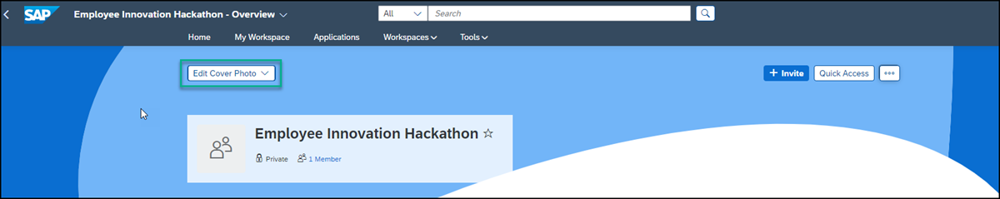

2. Browse for the following image that you downloaded: `worspace_header-image`.

3. Reposition your photo to display it as you want, and then click **Save**.

    !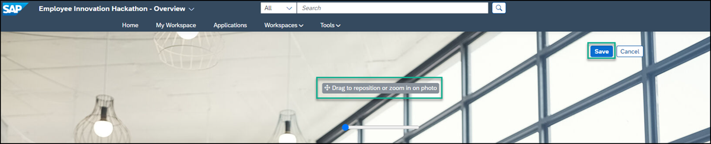

[DONE]
[ACCORDION-END]

[ACCORDION-BEGIN [Step 5: ](Create an Overview page for your workspace)]

The **Overview** page is the home page of a workspace. You can add all types of different content to it - its common to add content which describes the purpose of the workspace and to feature important content.

1. Click **+** to add a page tab.

    !

2. From the **Add New Page** screen, select the **Overview** tile.

    !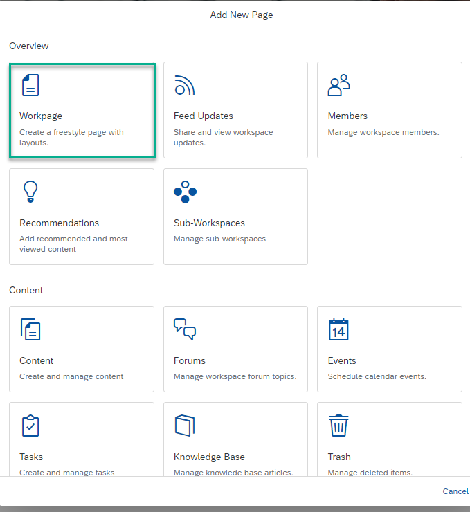

3. Select the blank layout at the bottom right of the screen and click **OK**. The Page Designer is now active.

    !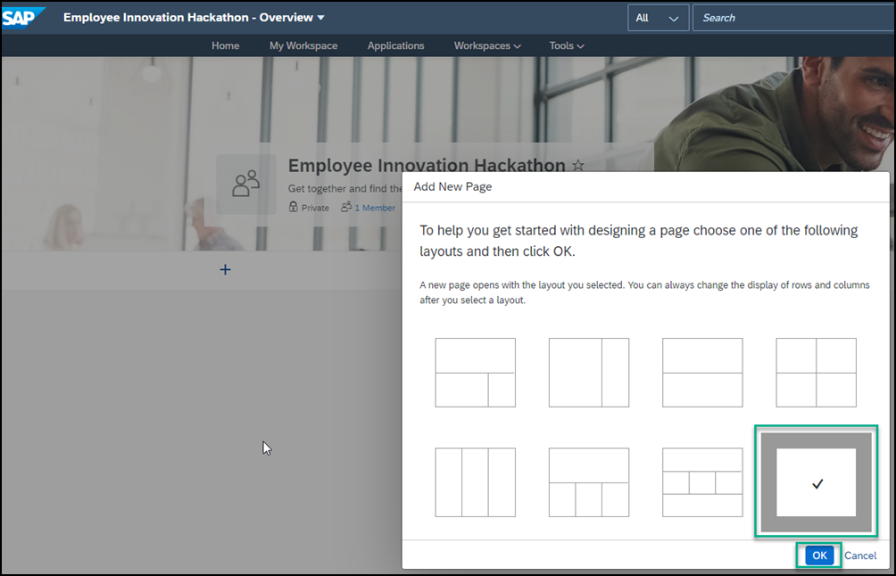

4. Close the **Page Designer Tips** page for now.

5. Enter a title for the **Overview** page: `About the Hackathon`. Note that the name will only be visible on the workspace once you publish the workspace.

    !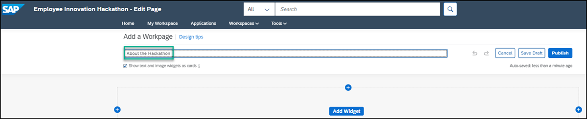

[DONE]
[ACCORDION-END]

[ACCORDION-BEGIN [Step 6: ](Design the first row of the overview page)]

In this step, you'll add two text widgets next to each other in the first row of the page.

1. Click **Add Widget** in the first row to open the widget gallery.

    !

2. Under **Standard Tools**, select the **Text** widget.

    !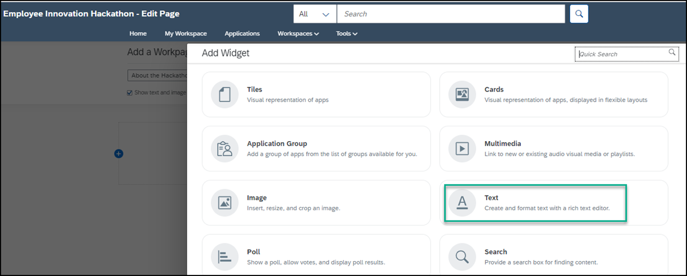

3. Design the **Text** widget as follows:

    |  :------------- | :-------------
    | Text            | Type in the following: `Approach our experts with all your questions`.
    | Font            | Select the text and change to Arial 14pt.
    | Color           | With the text already selected, choose black from the chart.

    !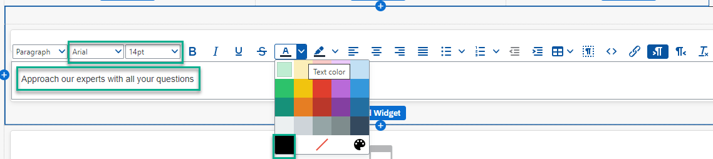

4. On the right side of the widget that you've just added, click the  **+** to add another column.

    !

5. Click **Add Widget** in the second column and select the **Text** widget.

6. Design the **Text** widget as follows:

    |  :------------- | :-------------
    | Text            | Type in the following: `More Information`
    | Font            | Select the text and change to Arial 14pt.
    | Color           | With the text already selected, choose black from the chart.

7. Click outside of the widget row to see how your page looks so far. This is what your first row looks like:

    !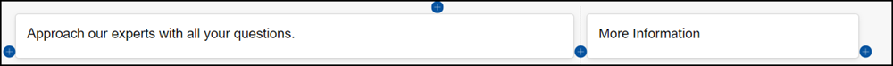

[DONE]
[ACCORDION-END]

[ACCORDION-BEGIN [Step 7: ](Design the second row of the overview page)]

In this step, you'll add images to the second row.

1. Click the **+** under the first row to add a new row.

    !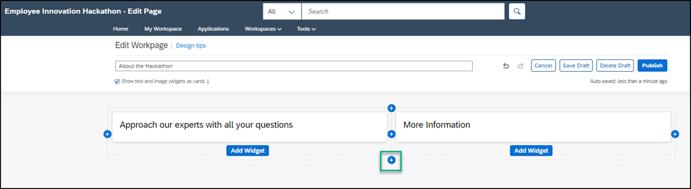

2. In the second row, click **Add Widget**.

    !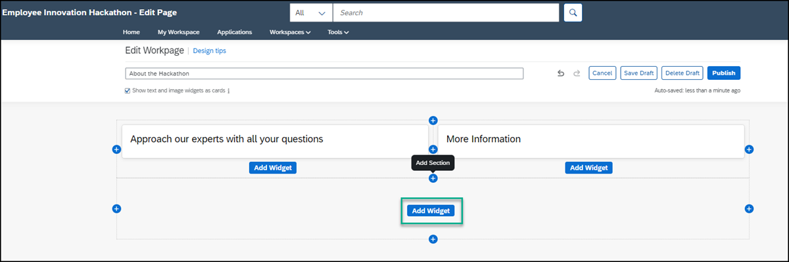

3. Under **Standard Tools**, select the **Image** widget.

    !

4. Click the link in the widget to browse for the image that you saved on your computer: `workspace_row2_image 1`

    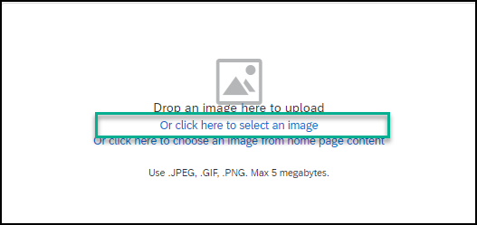

5. Click the pencil icon in the top right of the image to edit the image.

    !

6. Design the **Image** widget as follows:

    |  :-------------     | :-------------
    | Caption             | `Carla Grant, IT Expert`
    | Caption Layout      | Inline
    | Caption Alignment   | Left

7. Click **OK**.

    !

8. On the right side of this widget, click the **+** to add a new column.

    !

9. Click **Add Widget** in the new column, select the **Image** widget, and then click the link in the widget to add this image that you saved on your computer: `workspace_row2_image2`.

10. On the top right of the widget that you've just added, click the pencil icon.

    !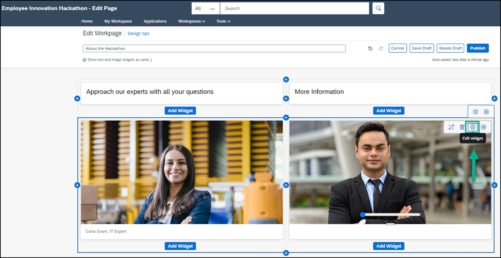

11.  Design the second **Image** widget as follows and then click **OK**:

    |  :-------------     | :-------------
    | Caption             | `Michael Hill, ML Expert`
    | Caption Layout      | Inline
    | Caption Alignment   | Left

12. Click **+** next to the second image widget to open a third column.

    !

13. Add the following 4 image widgets one under each other in the third column. Keep clicking **Add Widget** and select an image each time until you've added all these images:

    |  :-------------     | :-------------
    | First image         | `workspace_image_with_icon1`
    | Second image        | `workspace_image_with_icon2`
    | Third image         | `workspace_image_with_icon3`
    | Fourth image        |`workspace_image_with_icon4`

    !

14. Click the **Edit widget** pencil icon at the top right of the first image widget and design as follows. When you're done, click **OK**.

    |  :-------------     | :-------------                
    | Caption             |`Real Customer Challenges`
    | Caption Layout      |Overlay
    | Background Opacity  |0%
    | Caption Alignment   |Left

15. In the same way, design the other 3 images as follows. When you're done click **OK** each time:

    |  :-------------     | :-------------                
    | Caption             | Second image: `Product Documentation`
&nbsp;

Third image: `Submission Criteria`
&nbsp;

Fourth image: `Stay Involved`
    | Link To        |Add this link to the **second** image widget that you named `Product Documentation`: <https://help.sap.com/viewer/product/WZ/Cloud/en-US> 
&nbsp;

 Once you've published your site you can click on this image to open the SAP Work Zone documentation product page.
    | Caption Layout        |All images: Overlay
    | Background Opacity    |All images: 0%
    | Caption Alignment     |All images: Left

16. Click outside of the row to see how your page looks so far:

    !

17. To increase the spacing between this row and the first row, hover over the row to expose the row settings on the right, click **Edit row settings**. Click the edit row settings icon (cog wheel).

    !

18. Under **Row Padding**, add the value `30` pixels in the **Top** value box and click **Save**.

    !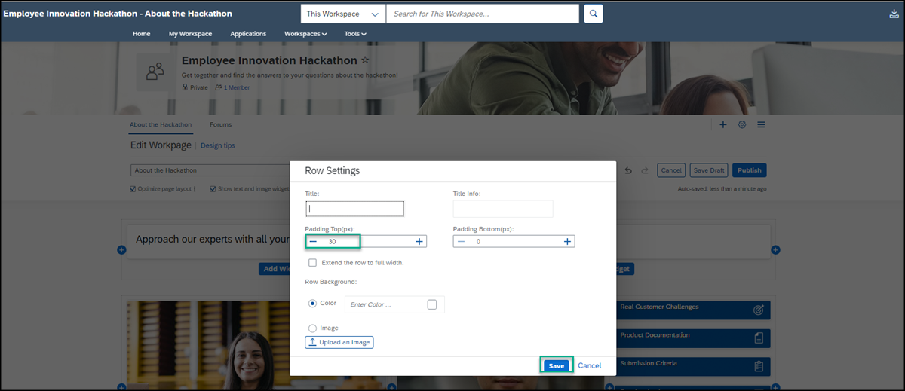

[DONE]
[ACCORDION-END]

[ACCORDION-BEGIN [Step 8: ](Design the third and last row of your workspace)]

In this step, you'll add an **Action** widget, a **Forum** widget, and a **Feed** widget.

1. Click **+** at the bottom of the second row to add another row.

    !

2. Click **Add Widget**.

3. Under the **Productivity** section,  select the **Action** widget.

    >Adding an **Action** widget enables workspace members to choose from a selection of commonly used action types. In this tutorial, we want the workspace members to ask questions or add ideas.

    !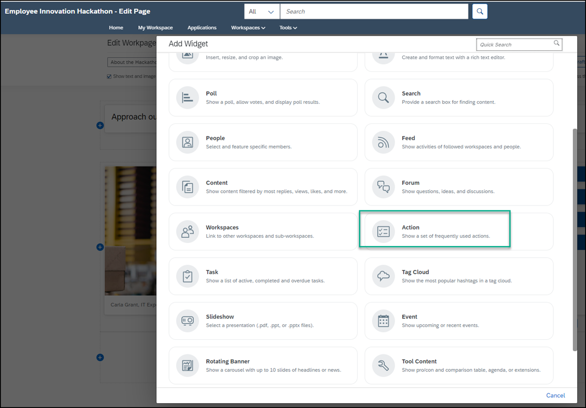

4. Enter the **Widget Title**: `Add your Hackathon Questions & Ideas`.

5. Uncheck all options except for **Ask a Question** and **Add an Idea**. Use the scroller on the right to make sure you uncheck all the other action options. Click **OK** to add the widget to your overview page.

    !

    Now let's create the **Forum** widget.

6. Click the **+** next to the widget you just created to add another column.

    !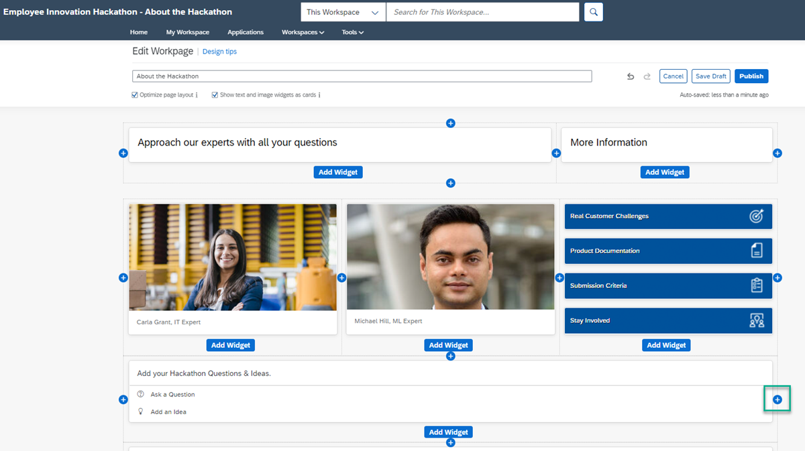

7. Click **Add Widget**.

    !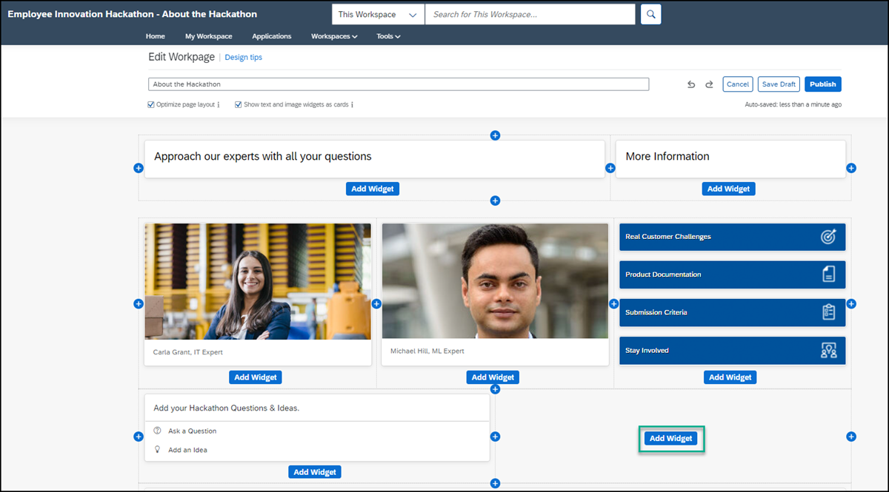

8. Under the **Content & Documents** section, select the **Forum** widget.

    > Adding a **Forum** widget enables a workspace member to view questions, ideas, and discussions submitted by their workspace members.

    !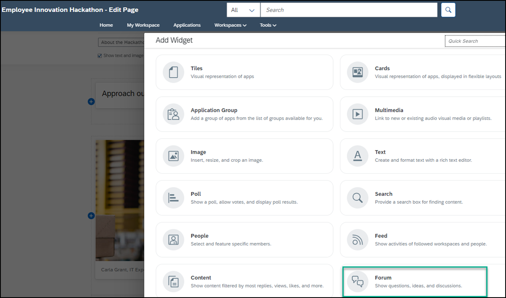

9. Under **Maximum Items to Display**, move the slider to number **2**, change the title to `Ask Questions About the Hackathon`, and click **OK**.

    > On the overview page, only 2 of the questions, ideas or discussions from the forum will be displayed.  

    !

    Now let's add the **Feed** widget.

10. In the same row, directly under the **Action** widget that you added, click **Add Widget**.

    !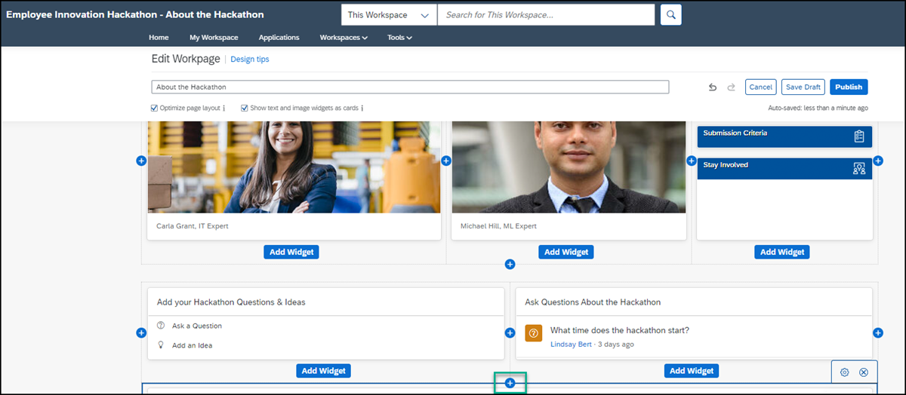

11. Scroll down the widget gallery and under the **Productivity** section, select the **Feed** widget.

12. In the **Feed Widget** settings screen, change **Maximum Items to Display** to `2` and click **OK**.

    !

    You've now added all three widgets.

13. To increase the spacing between this row and the row above, hover over the row to expose the row settings on the right, click **Edit row settings**.

    !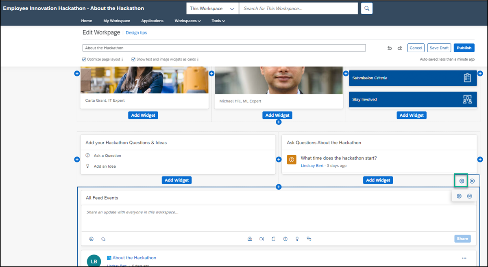

14. Under **Row Padding**, add the value `30`pixels in the **Top** value box and click **Save**.

15. Click **Save Draft** to save a draft version of your overview page.

    !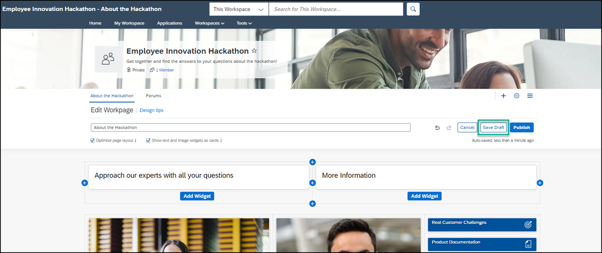

[DONE]

[ACCORDION-END]

[ACCORDION-BEGIN [Step 9: ](Add a forums tab and ask a question)]

Apart from the **Forum** widget, you're going to add a dedicated **Forum** page tab. From this page, workspace members can see all the questions, ideas and discussions in the forums that have been created for the workspace.

1. Click the **+** to add a page tab.

    !

2.  In the **Add New Page** screen, under the **Content** category, select **Forums** to add the **Forums** tab to your workspace. The forum page opens displaying all the different forum topics.

    Now ask a question in the forum.

3. Go back to your workspace overview page by clicking the Overview page (it's displayed as **Untitled** until you publish the workspace).

    !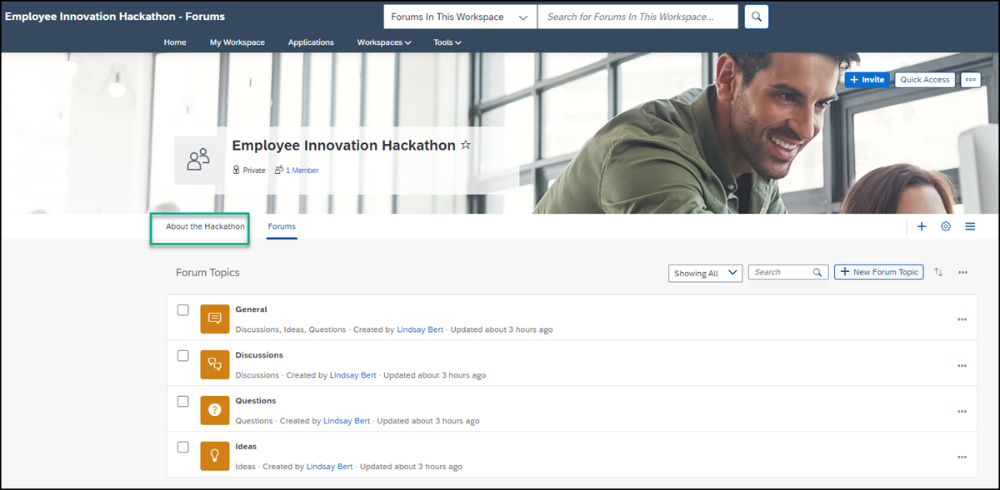

4. Scroll down to your **Actions** widget that you added previously and click **Ask a question**.

    !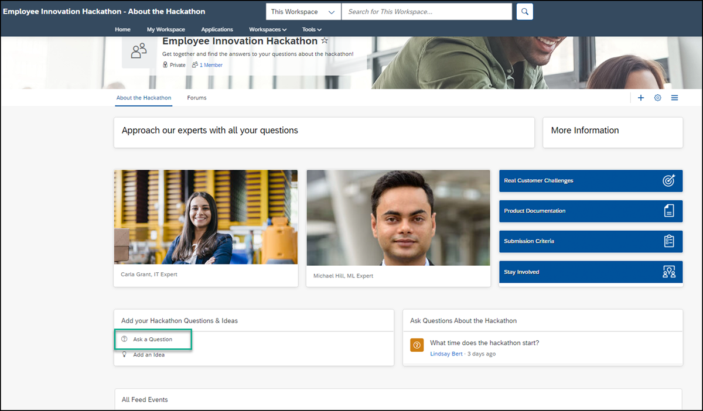

2. Add this question: `What time does the hackathon start?` Then click **Publish** so that members will be able to see your question. You'll get a confirmation message that your question was created.

    !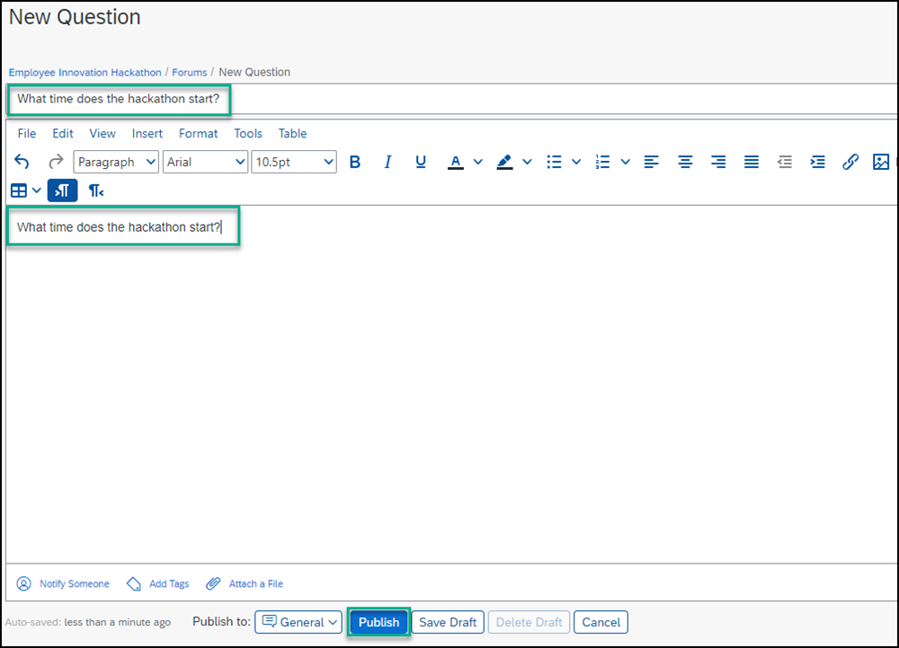

3. Go back to your workspace by using the breadcrumbs at the top.

    !

You can see that your question has been added to your overview page as well as to your feed.

!

[DONE]

[ACCORDION-END]

[ACCORDION-BEGIN [Step 10: ](Publish and view your workspace)]

  1. Make sure to **Publish** the design of the page and to make your workspace visible to its members. Without doing this, the page is only visible to you.

    !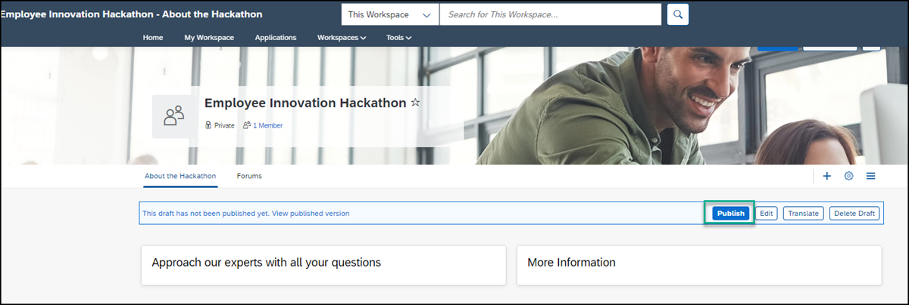

    >You can also save as a draft and check your page before you are ready to publish.

  2. In the popup, leave the option checked to **Show in Feed Updates** and then click **Publish**.

    > By leaving the **Show in Feed Updates** checked, all workspace members will be informed of your changes. In the future, if the changes you make to your workspace aren't significant, you can uncheck this option.

    !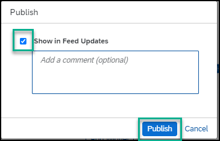

This is how your workspace looks - note the overview page name that you defined is now visible:

!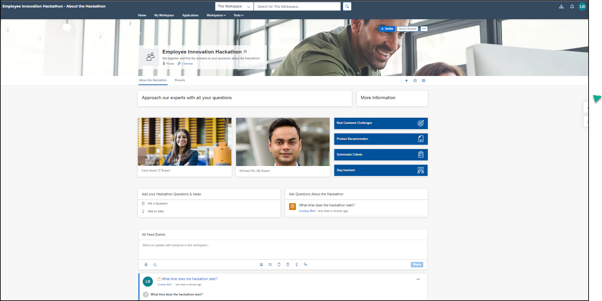

[VALIDATE_7]

[ACCORDION-END]Closing
