# Add a Workspace to SAP Build Work Zone, advanced edition
<!-- description --> Create a workspace and add content to it that you can share with other members of your workspace.

## Prerequisites
 - You have an environment set up and you can access your SAP Build Work Zone, advanced edition.
 - You have created an app in SAP Build Apps and a process in SAP Process Automation by following this mission: [Create Sales Order Workflow with SAP Build](https://developers.sap.com/mission.sap-build-apps-create-trigger-process.html) 

&nbsp;
>**SAP Build Work Zone, advanced edition isn't available in a trial account.**

## You will learn
  - How to create a new workspace
  - How to add content to it and design the layout

## Intro
In this tutorial, you're going to create a workspace where employees who are part of the sales team can interact with other members of the workspace, ask questions, and find information, tools, and assets to help them close more deals.

### Download images for your workspace

Before you start, download these image files so that they're on your computer ready for you to add to your workpage for the workspace that you'll create.

- [`workspace_sales_header.png`](Workspace_Images/workspace_sales_header.png)
- [`workspace_row2_image1.jpg`](Workspace_Images/workspace_row2_image1.jpg)
- [`workspace_row2_image2.jpg`](Workspace_Images/workspace_row2_image2.jpg)
- [`workspace_image_with_icon1.png`](Workspace_Images/workspace_image_with_icon1.png)
- [`workspace_image_with_icon2.png`](Workspace_Images/workspace_image_with_icon2.png)
- [`workspace_image_with_icon3.png`](Workspace_Images/workspace_image_with_icon3.png)
- [`workspace_image_with_icon4.png`](Workspace_Images/workspace_image_with_icon4.png)

### Create a workspace

Workspaces are the building blocks of SAP Build Work Zone, advanced edition. You can add all kinds of content to your workspace and you can invite other users to join as members.

1. In your site, click **Workspaces** in the top-level menu, and then click **New Workspace**. You can also use the **New Workspace** button on the right.

    <!-- border -->

2. Select **No Template** from the dropdown list of available templates.

    <!-- border -->

    >You can also select one of SAP's out-of-the-box templates. In this case, you'll get a professionally designed workpage with widgets including everything you need to get started quickly. You can then customize the content to suit your needs. For this tutorial, you won't use a template.

3. Enter this name for your workspace: `Sales Management`. In workshops, use: `<your unique identifier>_Sales Management`.

    >**Tip:** Always use a name that would help users distinguish your workspace from others.

4. Copy and paste this description for your workspace: `Use this workspace to manage our team sales orders and collaborate!`

5. Select `Private`.

    >Selecting private makes your workspace available to a specific set of members that you've invited to the workspace. If you later want to make it public so that everyone in the company can see it, click **Edit Workspace Settings** at the top of your screen and change the setting to `Public`.

6. Click **Create**.

    <!-- border -->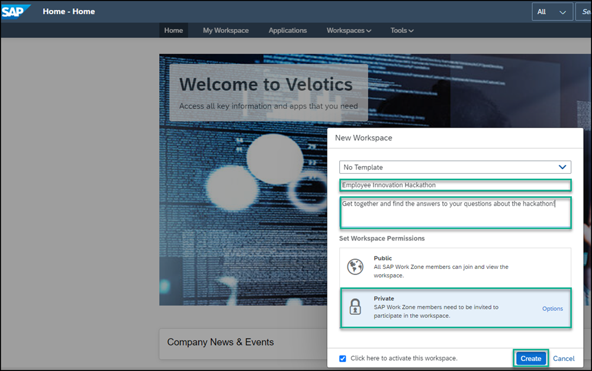

Your workspace is created and you can now start building your workspace.

<!-- border -->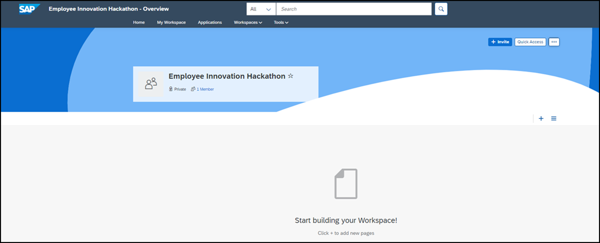

Now, let's add content to the workspace.

### Change the image in the workspace header

When you create a new workspace, the header has a dark and light blue background. You can replace this background with your own.

1. Hover over the background in the workspace header to expose the  **Edit cover photo** button and select **Upload Photo**.

    <!-- border -->

2. Browse for the following image that you downloaded: `workspace_sales_header`.

3. Reposition your photo to display it as you want, and then click **Save**.

    <!-- border -->

### Create a workpage for your workspace

In this step, you'll add a workpage to your workspace - this workpage will describe the purpose of the workspace and will feature relevant content.

1. Click **+** to add a tab for your workpage to the workspace navigation bar.

    <!-- border -->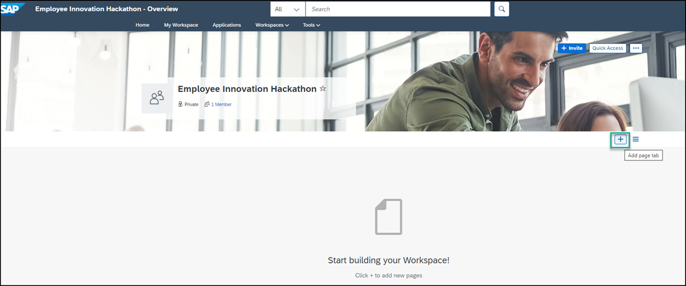

2. From the **Add Tab to Navigation Bar** screen, select the **Workpage** tile.

    <!-- border -->

3. Enter a title for the workpage: `Sales Orders`.

    <!-- border -->

4. Select the **Workpage Type**. You can either select an existing workpage or you can create a new one. In this tutorial, we'll select **New Workpage**. Select the folder where you want to save it (usually the Content folder), and click **Add**.

    <!-- border -->

This is your new workpage and you can start adding content to it:

<!-- border -->

### Design the first section of your workpage

In this step, you'll add two text widgets next to each other in the first section of the workpage.

1. Click **+** to add a section to your workpage.

    <!-- border -->

2. Click **Add Widget** in the first section to open the widget gallery.

    <!-- border -->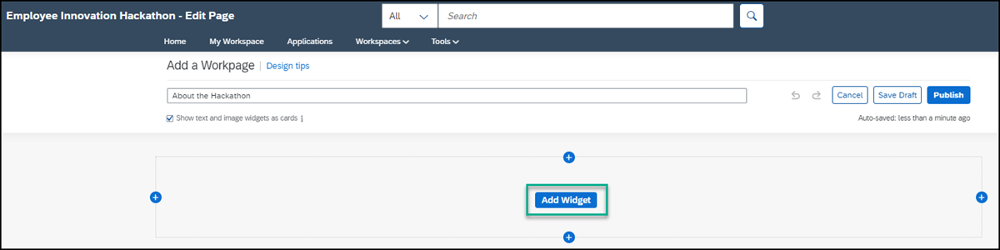

3. Select the **Text** widget.

    <!-- border -->

3. Design the **Text** widget as follows:

    |  :------------- | :-------------
    | Text            | Type in the following: `Verify your sales orders with our sales managers`.
    | Font            | Select the text and change to Arial 14pt.
    | Color           | With the text already selected, choose black from the chart.

    <!-- border -->

4. On the right side of the widget that you've just added, click the  **+** to add another column.

    <!-- border -->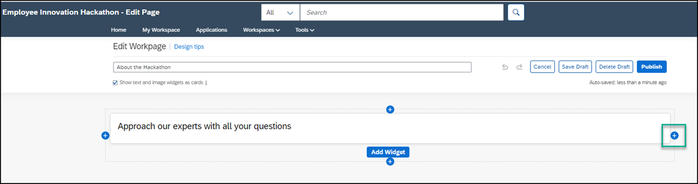

5. Click **Add Widget** in the second column and select the **Text** widget.

6. Design the **Text** widget as follows:

    |  :------------- | :-------------
    | Text            | Type in the following: `More Information`
    | Font            | Select the text and change to Arial 14pt.
    | Color           | With the text already selected, choose black from the chart.

### Design the second section of your workpage

In this step, you'll add images to the second section.

1. Click the **+** under the first section to add a new section.

    <!-- border -->

2. In the second section, click **Add Widget**.

    <!-- border -->

3. Select the **Image** widget.

    <!-- border -->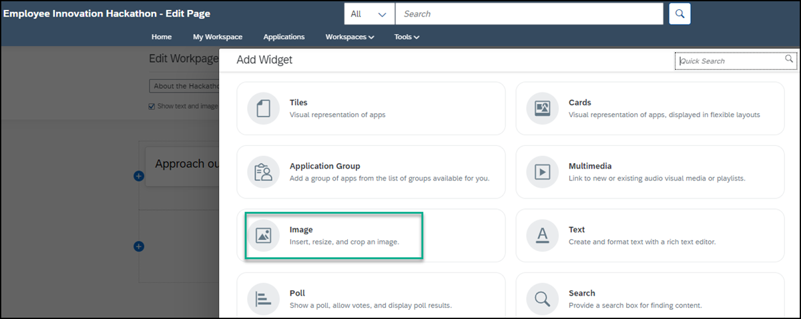

4. Click the link in the widget to browse for the image that you've saved on your computer and open it: `workspace_row2_image 1`

    

5. Hover over the image to expose the settings at the top right and click the cog icon to edit the image widget.

    <!-- border -->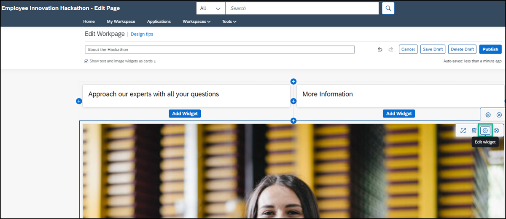

6. Design the **Image** widget as follows:

    |  :-------------     | :-------------
    | Caption             | `Carla Grant, Sales Manager`
    | Caption Layout      | Inline
    | Caption Alignment   | Left

7. Click **Save**.

    <!-- border -->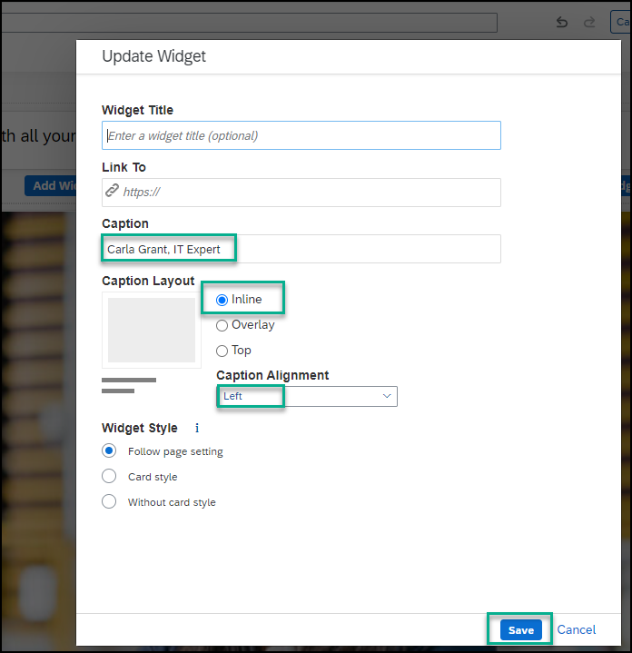

8. On the right side of this widget, click the **+** to add a new column.

    <!-- border -->

9. Click **Add Widget** in the new column, select the **Image** widget, and then click the link in the widget to add this image that you saved on your computer: `workspace_row2_image2`.

10. On the top right of the widget that you've just added, click the cog icon to edit your image widget.

    <!-- border -->

11.  Design the second **Image** widget as follows and then click **Save**.

    |  :-------------     | :-------------
    | Caption             | `Michael Hill, Sales Fulfillment Manager`
    | Caption Layout      | Inline
    | Caption Alignment   | Left

12. Click **+** next to the second image widget to open a third column.

    <!-- border -->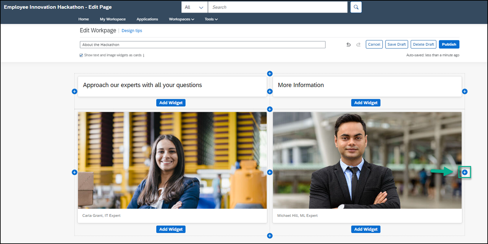

13. Add the following 4 image widgets one under each other in the third column. Keep clicking **Add Widget** and select an image each time until you've added all these images:

    |  :-------------     | :-------------
    | First image         | `workspace_image_with_icon1`
    | Second image        | `workspace_image_with_icon2`
    | Third image         | `workspace_image_with_icon3`
    | Fourth image        |`workspace_image_with_icon4`

    <!-- border -->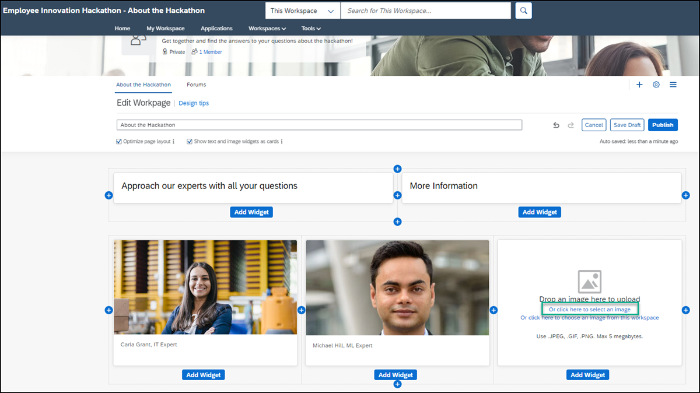

14. Click the cog icon at the top right of the first image widget and design as follows. When you're done, click **Save**.

    |  :-------------     | :-------------                
    | Caption             |`Sales Invoices`
    | Caption Layout      |Overlay
    | Background Opacity  |0%
    | Caption Alignment   |Left

15. In the same way, design the other 3 images as follows. When you're done click **Save** each time:

    |  :-------------     | :-------------                
    | Caption             | Second image: `Product Documentation`
&nbsp;

Third image: `Consider Your Sales Pitch`
&nbsp;

Fourth image: `Stay Involved`
    | Link To           |Add this link to the **second** image widget that you named `Product Documentation`: <https://help.sap.com/viewer/product/WZ/Cloud/en-US> 
&nbsp;

 Once you've published your site, you can click on this image to open the SAP Work Zone documentation product page.
    | Caption Layout        |All images: Overlay
    | Background Opacity    |All images: 0%
    | Caption Alignment     |All images: Left

16. Use the dividers between the 3 columns to align all the images. Also make sure to adjust the `More Information` heading in line with the third column.

    <!-- border -->

    This is how your second section looks:

    <!-- border -->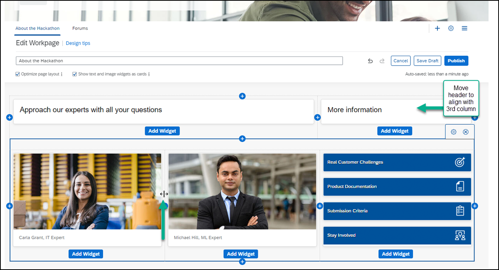

17. To increase the spacing between this section and the first section, hover over the section to expose the settings on the right, and click the cog icon to edit the spacing.

    <!-- border --> 

18. Under **Padding Top**, add the value `30` pixels and click **Save**.

    <!-- border -->

### Design the third section of your workspace

In this step, you'll add an **Action** widget, a **Forum** widget, and a **Feed** widget.

1. Click **+** at the bottom of the second section to add another section.

    <!-- border -->

2. Click **Add Widget**.

3. Select the **Action** widget in the new section.

    > Adding an **Action** widget enables workspace members to choose from a selection of commonly used action types. In this tutorial, we want the workspace members to ask questions or add ideas.

    <!-- border -->

4. Enter the **Widget Title**: `Add Your Questions & Ideas`.

5. Uncheck all options except for **Ask a Question** and **Add an Idea**. Click **Save** to add the widget to your workpage.

    <!-- border -->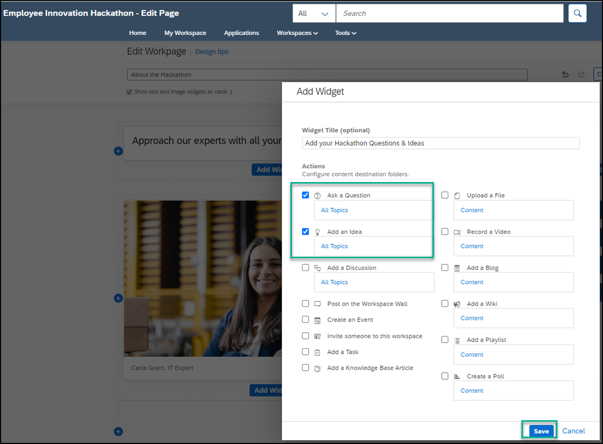

    Now let's create the **Forum** widget.

6. Click the **+** next to the widget you just created to add another column.

    <!-- border -->

7. Click **Add Widget**.

    <!-- border -->

8. Select the **Forum** widget.

    > Adding a **Forum** widget enables a workspace member to view questions, ideas, and discussions submitted by their workspace members.

    <!-- border -->

9. Under **Maximum Items to Display**, move the slider to number **2**, change the title to `What would you like to know?`, and click **Save**.

    > On the workpage, only 2 of the questions, ideas or discussions from the forum will be displayed.  

    <!-- border -->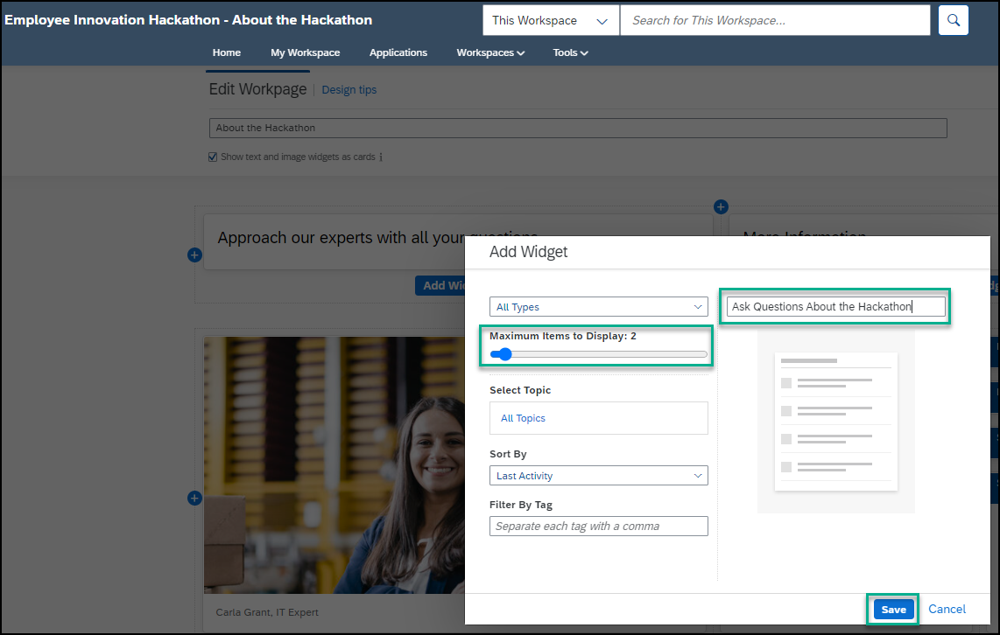

10. To increase the spacing between this section and the section above, hover over the section to expose the settings on the right, and click the cog icon to edit the spacing.

    <!-- border -->

11. Under **Padding Top**, add the value `30`pixels and click **Save**.

    Now let's add the **Feed** widget.

12.  Add another section.

    <!-- border -->

13. Click **Add Widget**

      <!-- border -->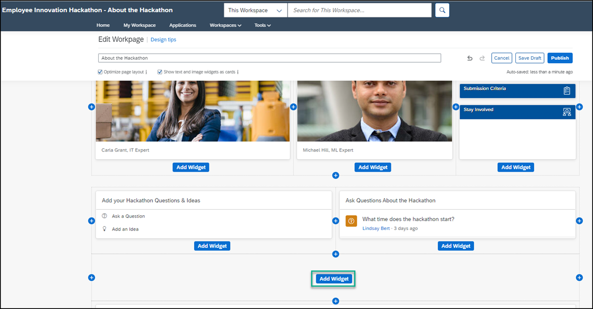

14. Select the **Feed** widget and keep the default setting to show all events in the feed.  Click **Save**.

15. Now **Publish** the workpage to make it visible to members of the workspace. Without doing this, the workpage is only visible to you.

    > You can save your workpage as a draft so check how it looks before publishing.

    <!-- border -->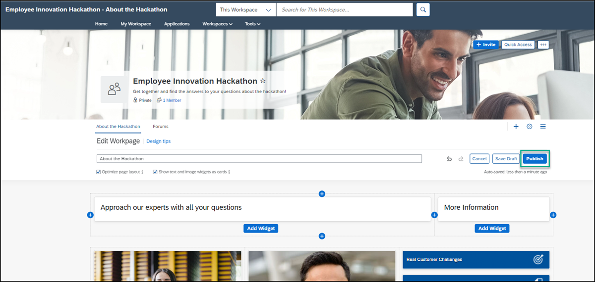

16. In the popup, leave the **Show in Feed Updates** selected and click **Publish**.

    <!-- border -->

    > By leaving the **Show in Feed Updates** checked, all workspace members will be informed of your changes. In the future, if the changes you make to your workspace aren't significant, you can uncheck this option.

### Add a forums tab and ask a question

Apart from the **Forum** widget, you're going to add a dedicated **Forum** tab to the navigation bar of your workspace. From this tab, workspace members can see all the questions, ideas, and discussions in the forums that have been created for the workspace.

1. Click the **+** icon.

    <!-- border -->

2.  In the **Add Tab to Navigation Bar** screen, under the **Content** category, select the **Forums** tile to add it as a tab to your workspace navigation bar. You'll get a list of all the forum topics in the workspace.

    In the next steps, you'll ask a question in the forum.

3. Go back to your workpage by clicking the **Sales Orders** workpage in the navigation bar.

    <!-- border -->

4. Scroll down to your **Actions** widget that you added previously and click **Ask a Question**.

    <!-- border -->

5. Add this question: `What is our sales forecast for the coming year?` Then click **Publish** so that members will be able to see your question. You'll get a confirmation message that your question was created.

    <!-- border -->

6. Go back to your workspace by using the breadcrumbs at the top.

    <!-- border -->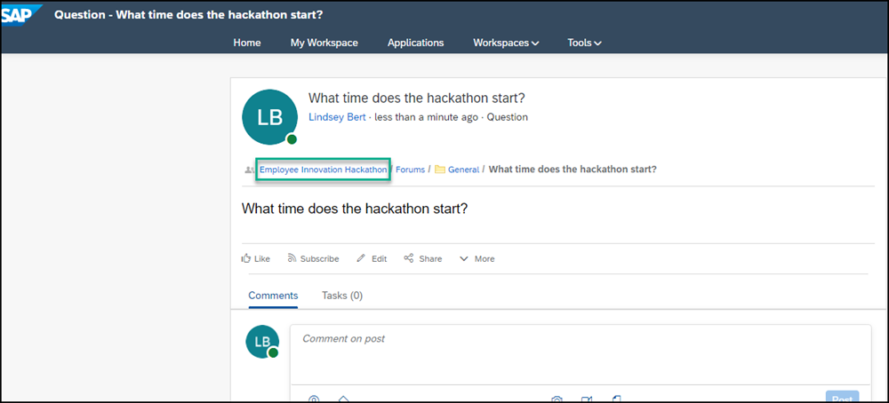

Note that your question has been added to your workpage as well as to your feed.

<!-- border -->

### View your workspace

This is how your workspace looks:

<!-- border -->

Closing
