## Prerequisites
 - A subaccount in SAP BTP that includes a subscription to the SAP Work Zone service has already been setup for you. Note that SAP Work Zone is not available in a trial account.
 - You've already designed the **Home** page where you'll add this app.   

## Details
### You will learn
  - How to add an SAPUI5 app to SAP Work Zone's **Home** page.

To add business apps to SAP Work Zone, you need to configure them in a tool called the **Content Manager**, located in the Work Zone Manager. The **Content Manager** includes various editors that you can use to configure apps, groups, roles, and catalogs.

Once configured, the app appears as a tile in the **Applications** page of your work zone - a single page that acts as an embedded launchpad. The page is accessed from the top-level menu of SAP Work Zone and displays the business apps that a user has permissions to launch.

[ACCORDION-BEGIN [Step 1: ](Open the Content Manager)]

1. Access the **Administration Console** from the user actions dropdown menu under your avatar.

    !

    >Note that this option is only available to SAP Work Zone administrators.

2. Go to the **External Integrations** section, expand it, and click **Business Content**.

    !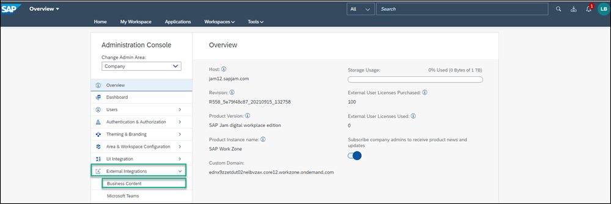

3. Click **Content Manager**.

    !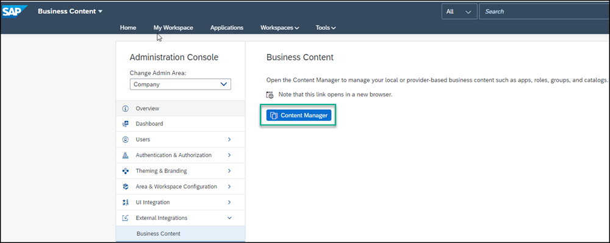

The Content Manager has two tabs:

- **My Content** where you can manually configure content items (such as apps, roles, groups, and catalogs) and view any other available content items in your subaccount.

- The **Content Explorer** where you can explore exposed content from available content providers and add it to your subaccount (added content is displayed in **My Content**).

The **Content Manager** is part of the Work Zone Manager, and it allows SAP Work Zone administrators to configure SAP Work Zone. The Work Zone Manager includes the following tools:

- The **Work Zone Directory** where the SAP Work Zone tile resides. From here you can update the Work Zone settings - for example, assign the work zone to a specific role.

- The **Content Manager** where you manage business content that you can add to your work zone.

- The **Provider Manager** where you manage content providers. Content providers expose business content that you can integrate into your work zone.

- The **Work Zone Configurator** where work zone administrators can set up SAP Work Zone when onboarding to the product. For the tutorial, we assume this configuration has already been done for you.

- The **Settings** where you can configure various settings related to your subaccount.
&nbsp;

!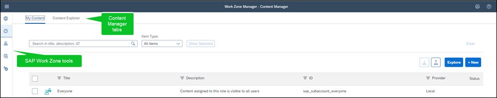

[DONE]
[ACCORDION-END]

[ACCORDION-BEGIN [Step 2: ](Create and configure a new app)]

First you need to create and configure the app.

1. Click **+ New** and select **App** from the list. The app editor opens with the **PROPERTIES** tab in focus.

    !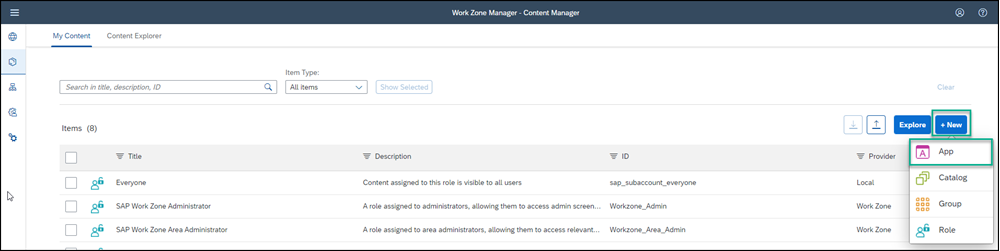

2. Enter the following values:

    * **Title**: `New Orders`

    * **Open App**: In place

    * **URL**:  `https://sapui5.hana.ondemand.com/test-resources/sap/m/demokit/cart/webapp/index.html`

      !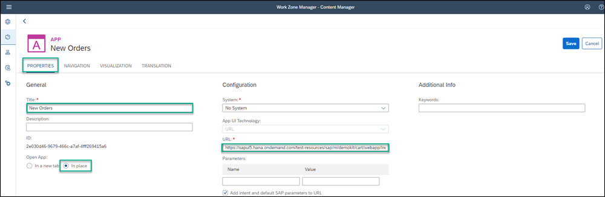

    >When working in your own environment, it's better to integrate SAPUI5 apps by configuring a destination to the relevant system and setting the app properties to use this destination. In this case in the App UI Technology dropdown list, you would select SAPUI5. This configuration allows you to better manage your content in the Dev-QA-Prod lifecycle.

3. Click the **NAVIGATION** tab to specify the intent of your app.

    >The unique combination of a semantic object and an action is called an intent. It is used to define navigation to an application.

4. Enter the following values:

    * **Semantic Object**: `Order`

    * **Action**: `Display`

      !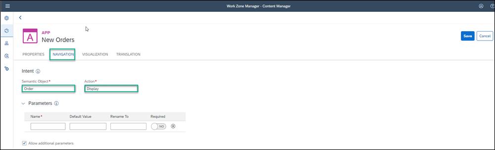

5. Click the **VISUALIZATION** tab. In this tab, you specify how the app tile will appear in the **Applications** page of your work zone.

6. Enter the following values:

    * **Subtitle**: `Shopping Cart `

    * **Information**:  `Order Now!`

    * **Icon**: Click the browse icon, type `my-sales-order`, click on the displayed icon, and click **OK**.

7.  On the right, you can see a preview of the tile with all the properties you entered.
 Click **Save**.

    !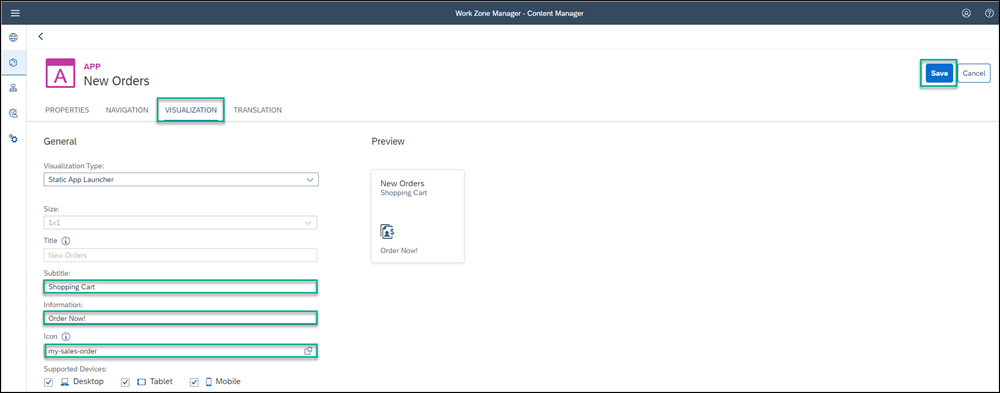

[DONE]
[ACCORDION-END]

[ACCORDION-BEGIN [Step 3: ](View the app in the Content Manager)]

Click the **Content Manager** icon in the left side panel to navigate back to the Content Manager.

!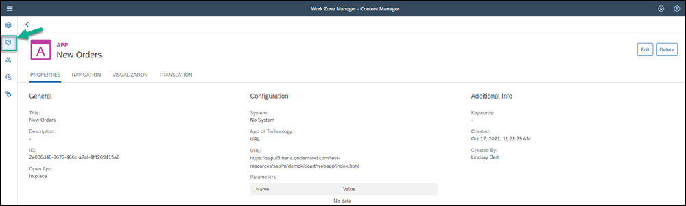

You can see your app in the list of content items in **My Content**:

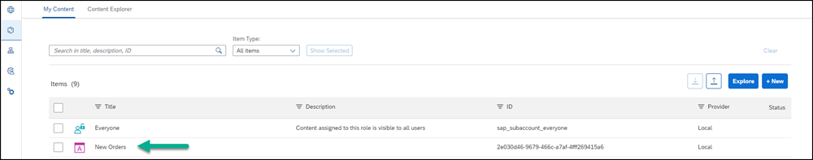

[DONE]
[ACCORDION-END]

[ACCORDION-BEGIN [Step 4: ](Assign the app to the Everyone role)]

The `Everyone` role already exists in the **Items** list of the **Content Manager** by default. Content assigned to the `Everyone` role is visible to all users.

1. In the **Items** list, click the **Everyone** role to open the Role editor.

    !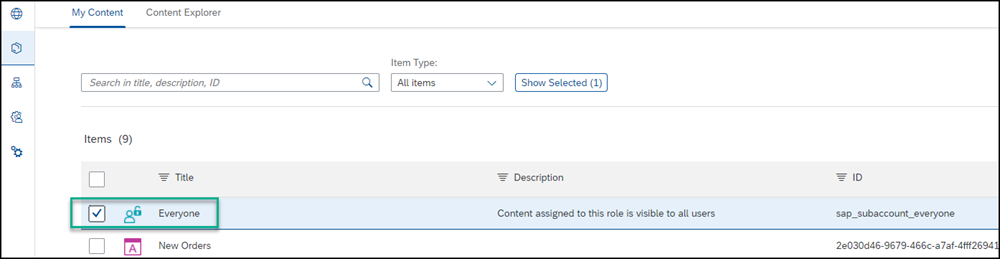

2. Click **Edit**.

    !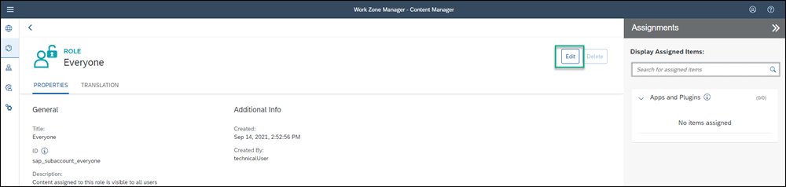

3. Click the search box in the **Assignments** panel on the right. Any available apps are shown in the list below.

    >If you have many apps, you can type some letters of your app name in the search bar, (for example, `Or`) to search for the app.

4. In the **Results** list, click the **+** icon next to the `New Orders` app to assign this role to your app. You'll see that the icon changes.

5. Click **Save**.

    !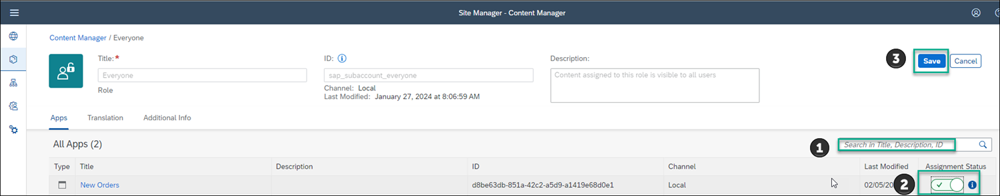

Once an application is configured, it becomes available to be added as a widget to the SAP Work Zone home page and workspaces.

[DONE]
[ACCORDION-END]

[ACCORDION-BEGIN [Step 5: ](Create a group and assign the app to it)]

A group is a set of one or more apps displayed together on the **Applications** page of SAP Work Zone. Assigning apps to groups, makes them visible to the user on this page. In this step you'll create a new group and assign the app to it.

1. Click the icon in the side panel to navigate back to the **Content Manager**.

2. Click **+ New** and select **Group** to create a group.

    !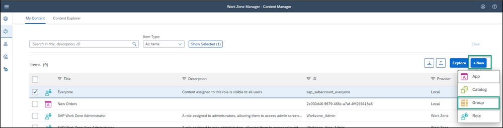

3. Enter `Purchasing` as the **Title** and in the **Assignments** panel, click inside the search box on the right of the screen, to show all available apps. You should see `New Orders`.

4. In the **Results** list, click **+** next to the `New Orders` app to assign it to your group.

5. Click **Save**.

    !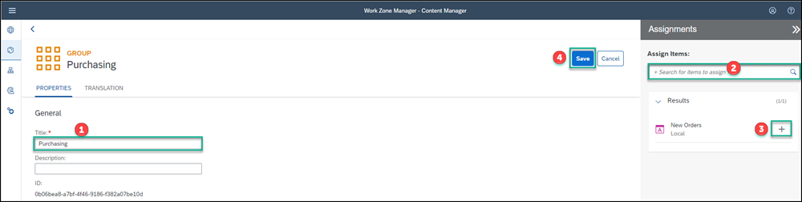

Your app is configured. Now you'll go to the SAP Work Zone **Applications** page to see that the app appears there.

[DONE]
[ACCORDION-END]

[ACCORDION-BEGIN [Step 6: ](View the app in the Applications page at runtime)]

1. Click the **Work Zone Directory** icon in the side panel.

    !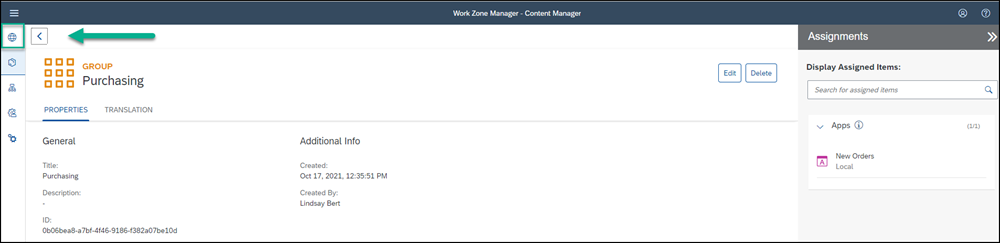

2. Click the **Open work zone** icon.

    !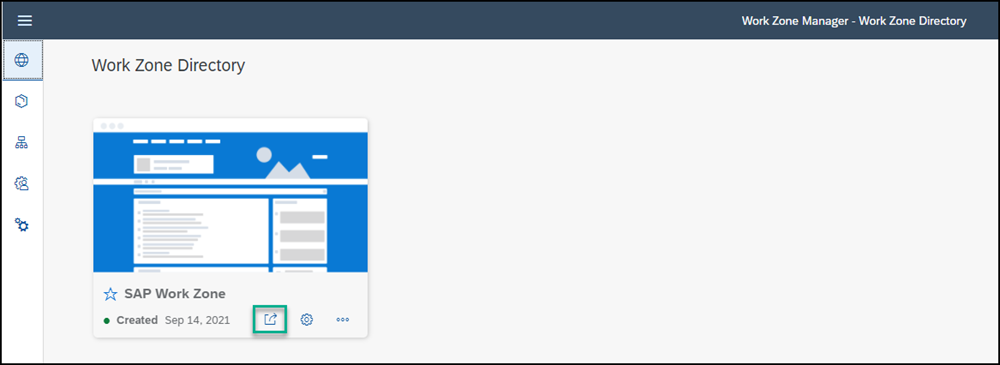

3.  In the top-level menu of your work zone, click **Applications**.

    !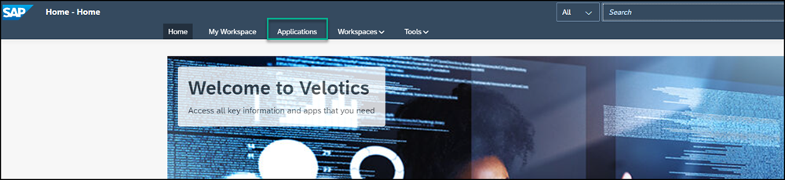

You'll see your app is displayed as a tile in the group you assigned it to:

!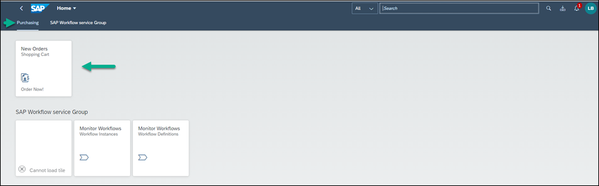

Now that the app is configured, you're going to add it to your **Home** page.

[DONE]
[ACCORDION-END]

[ACCORDION-BEGIN [Step 7: ](Add a header for your most commonly used apps)]

To design your home page to be more practical, we'll add a header for the app and then add the app under it.

1. From the **Applications** page, you can quickly navigate back to the **Home** page by clicking **Home** in the top navigation bar of your work zone. Then click **Home**.

    !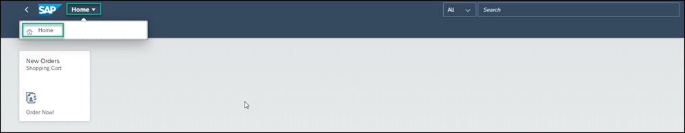

    >You can also simply click the back arrow to navigate back to the **Home** page.

2. Click the **Expand page settings** wand on the right of the page to expose various icons and then click the pencil icon directly under the wand to open the Page Designer. You can close the tips screen.

    !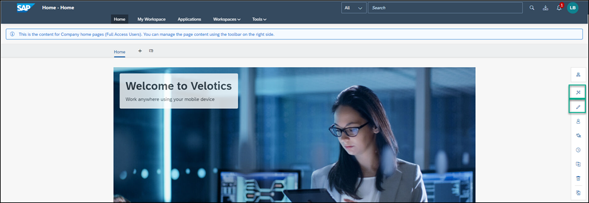

3. Scroll down to the last row on the page and click **+** to add another row.

    !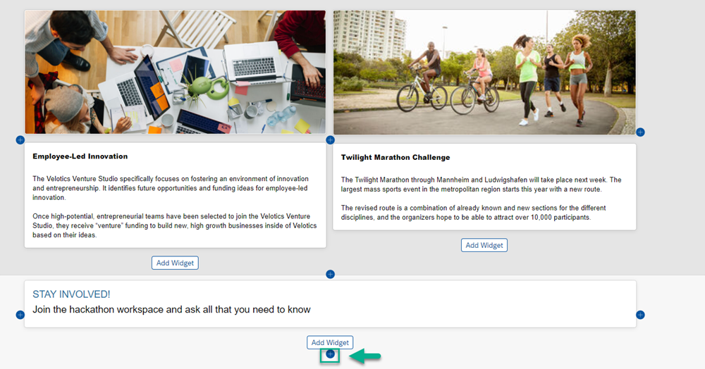

4. Click **Add Widget** to open the widget gallery and under **Standard Tools**, select the **Text** widget.

5. Design the text widget as follows:

    |  :------------- | :-------------
    | Text            | Type in the following: `Most Popular Apps`.
    | Font            | Select the text and change to Arial 14pt.
    | Color           | With the text still selected, choose the color black from the chart.

    !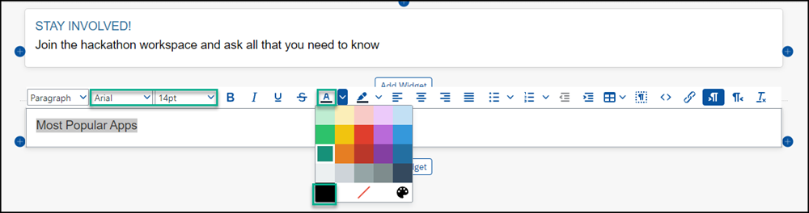

6. To increase the spacing between this row and the row above, hover over the row to expose the row settings at the top right, and click **Edit row settings**.

    !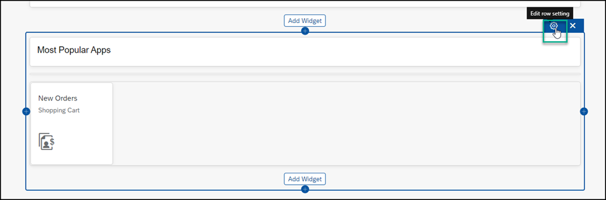

5. Enter the following values:

    * Check the box **Extend the row to full width**.

    * Under **Row Padding**, add the value `30` pixels in the **Top** value box and click **Save**.

    !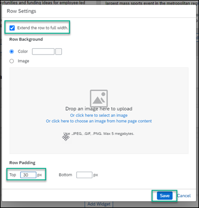

Now you're going to add your first app under this header.

[DONE]
[ACCORDION-END]

[ACCORDION-BEGIN [Step 8: ](Add your app to the page)]

1. Click **+** to add another row.

    !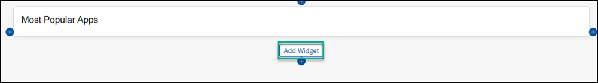

2. Click **Add Widget**.

3. Under **Standard Tools**, select the **Applications** widget.

4. In the Search box, start typing in the name of your app `New Orders`, select the app, and then click **Select**.

    !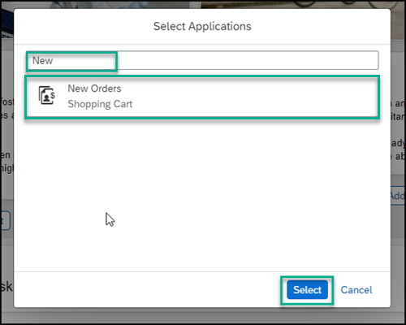

5. Click outside of the row to see that your app has been added.

6. Scroll to the top of the page, and click **Publish**.

    This is how your **Home** page looks with the app added to it:

    !

7. Click the app to open it.

[VALIDATE_7]
[ACCORDION-END]
