# Add an SAPUI5 App to a Workpage in SAP Build Work Zone, advanced edition
<!-- description --> Add an existing SAPUI5 app to your workpage

## Prerequisites
 - A subaccount in SAP BTP that includes a subscription to the SAP Build Work Zone, advanced edition service has already been setup for you. Note that it is not available in a trial account
 - You've already designed the **Home** workpage where you'll add this app   

## You will learn
  - How to add an SAPUI5 app to a workpage in your site

## Intro
To add business apps to your site, you need to configure them in a tool called the **Content Manager**, located in the Site Manager. The **Content Manager** includes various editors that you can use to configure apps, groups, roles, and catalogs.

Once configured, the app appears as a tile in the **Applications** page of your site - a single page that acts as an embedded launchpad. The page is accessed from the top-level menu and displays the business apps that a user has permissions to launch.

### Open the Content Manager

1. Access the **Administration Console** from the user actions dropdown menu under your avatar.

    <!-- border -->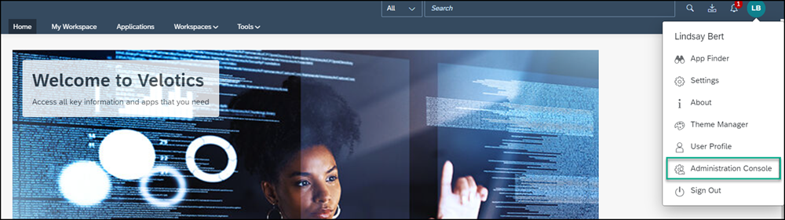

    >This option is only available to SAP Build Work Zone, advanced edition administrators.

2. Go to the **External Integrations** section, expand it, and click **Business Content**.

    <!-- border -->

3. Click **Content Manager**.

    <!-- border -->

The Content Manager has two tabs:

- **My Content** where you can manually configure content items (such as apps, roles, groups, and catalogs) and view any other available content items in your subaccount.

- The **Content Explorer** where you can explore exposed content from available content providers and add it to your subaccount (added content is displayed in **My Content**).

The **Content Manager** is part of the Site Manager, where administrators can configure their business content. The Site Manager also includes the following tools:

- The **Site Directory** where the site's tile is located. From here you can update the site settings - for example, assign the site to a specific role.

- The **Channel Manager** where you manage content providers. Content providers expose business content that you can integrate into your site.

- The **Configurator** where administrators can set up onboarding to SAP Build Work Zone, advanced edition. For the tutorial, we assume this configuration has already been done for you.

- The **Settings** where you can configure various settings related to your subaccount.
&nbsp;

<!-- border -->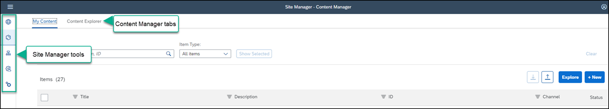

### Create and configure a new app

First you need to create and configure the app.

1. Click **+ New** and select **App** from the list. The app editor opens with the **PROPERTIES** tab in focus.

    <!-- border -->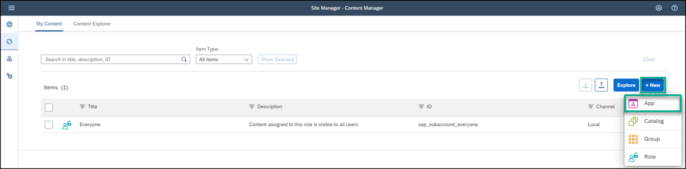

2. Enter the following values:

    * **Title**: `New Orders`

    * **Open App**: In place

    * **URL**:  `https://sapui5.hana.ondemand.com/test-resources/sap/m/demokit/cart/webapp/index.html`

      <!-- border -->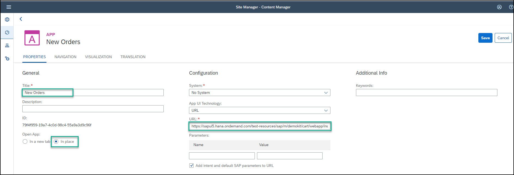

    >When working in your own environment, it's better to integrate SAPUI5 apps by configuring a destination to the relevant system and setting the app properties to use this destination. In this case in the App UI Technology dropdown list, you would select SAPUI5. This configuration allows you to better manage your content in the Dev-QA-Prod lifecycle.

3. Click the **NAVIGATION** tab to specify the intent of your app.

    >The unique combination of a semantic object and an action is called an intent. It is used to define navigation to an application.

4. Enter the following values:

    * **Semantic Object**: `Order`

    * **Action**: `Display`

      <!-- border -->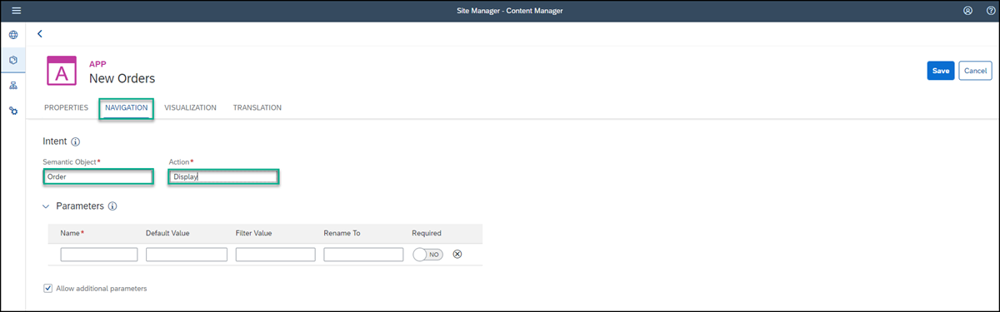

5. Click the **VISUALIZATION** tab. In this tab, you specify how the app tile will appear in the **Applications** page of your site.

6. Enter the following values:

    * **Subtitle**: `Shopping Cart `

    * **Information**:  `Order Now!`

    * **Icon**: Click the browse icon, type `my-sales-order`, click on the displayed icon, and click **OK**.

7.  On the right, you can see a preview of the tile with all the properties you entered.
 Click **Save**.

    <!-- border -->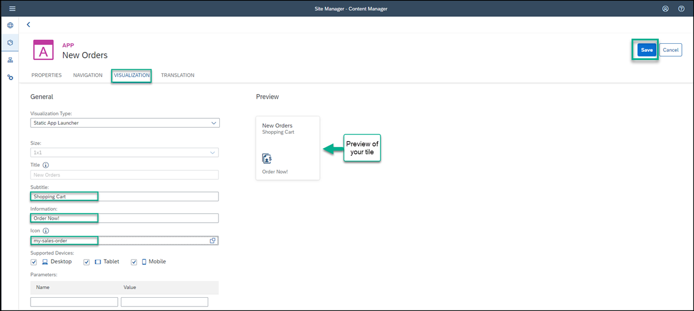

### View the app in the Content Manager

Click the **Content Manager** icon in the left side panel to navigate back to the Content Manager.

<!-- border -->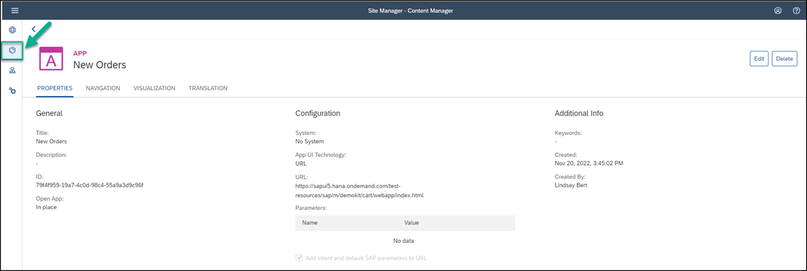

You can see your app in the list of content items in **My Content**:

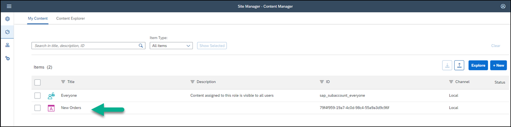

### Assign the app to the Everyone role

The `Everyone` role already exists in the **Items** list of the **Content Manager** by default. Content assigned to the `Everyone` role is visible to all users.

1. In the **Items** list, click the **Everyone** role to open the Role editor.

    <!-- border -->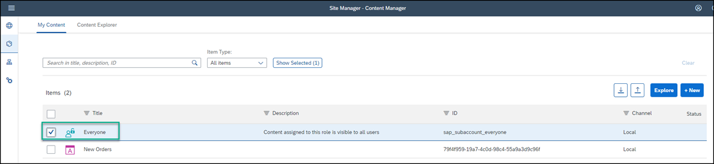

2. Click **Edit**.

    <!-- border -->

3. Click the search box in the **Assignments** panel on the right. Any available apps are shown in the list below.

    >If you have many apps, you can type some letters of your app name in the search bar, (for example, `Or`) to search for the app.

4. In the **Results** list, click the **+** icon next to the `New Orders` app to assign this role to your app. You'll see that the icon changes.

5. Click **Save**.

    <!-- border -->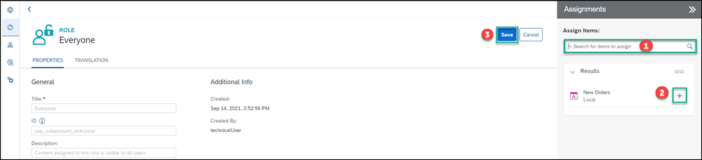

Once an application is configured, it becomes available to be added to your workpages.

### Create a group and assign the app to it

A group is a set of one or more apps displayed together on the **Applications** page of your site. Assigning apps to groups, makes them visible to the user from this page. In this step you'll create a new group and assign the app to it.

1. Click the icon in the side panel to navigate back to the **Content Manager**.

2. Click **+ New** and select **Group** to create a group.

    <!-- border -->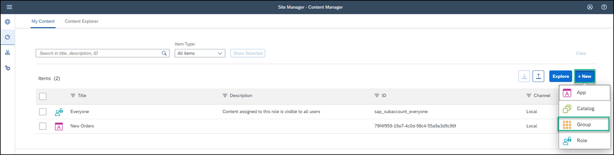

3. Enter `Purchasing` as the **Title** and in the **Assignments** panel, click inside the search box on the right of the screen, to show all available apps. You should see `New Orders`.

4. In the **Results** list, click **+** next to the `New Orders` app to assign it to your group.

5. Click **Save**.

    <!-- border -->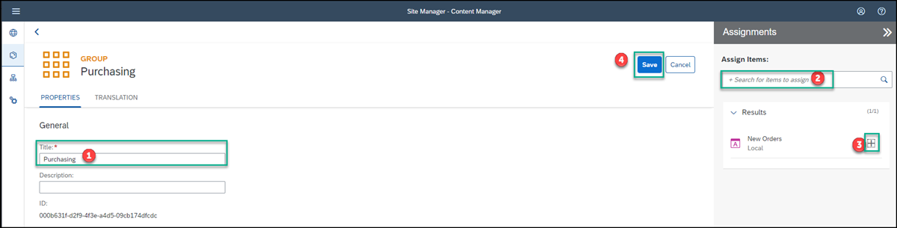

Your app is configured. Now you'll go to the **Applications** page to see that the app appears there.

### View the app in the Applications page at runtime

1. Click the **Site Directory** icon in the side panel.

    <!-- border -->

2. Click the **Open site** icon.

    <!-- border -->

3. In the top-level menu of your workpage, click **Applications**.

    <!-- border -->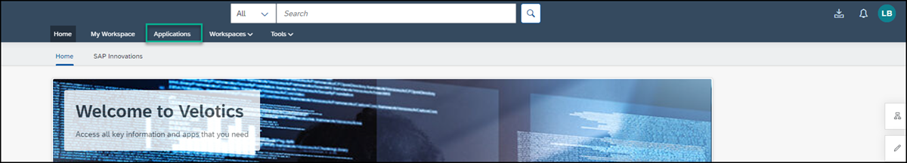

You'll see your app is displayed as a tile in the group you assigned it to:

<!-- border -->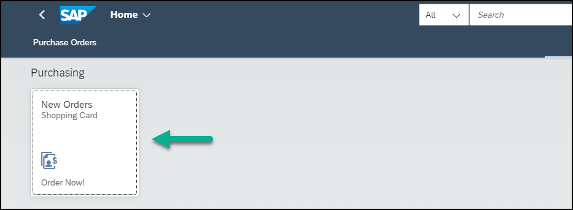

Now that the app is configured, you're going to add it to your **Home** workpage.

### Add a header for your most commonly used apps

To design your workpage to be more practical, we'll add a header for the app and then add the app under it.

1. From the **Applications** page, you can quickly navigate back to the **Home** page by clicking **Home** in the top navigation bar of your site. Then click **Home**.

    <!-- border -->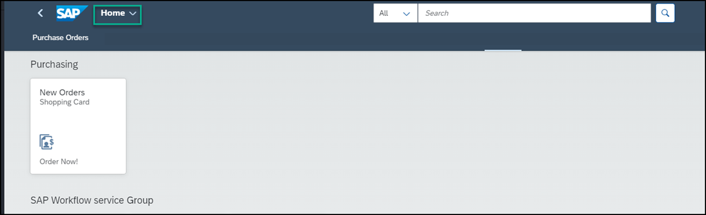

    >You can also simply click the back arrow to navigate back to the **Home** workpage.

2. Click the pencil icon to open the Page Designer.

    <!-- border -->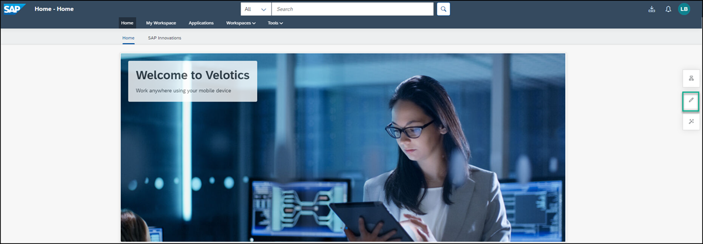

3. Scroll down to the last section on the page and click **+** to add another section.

    <!-- border -->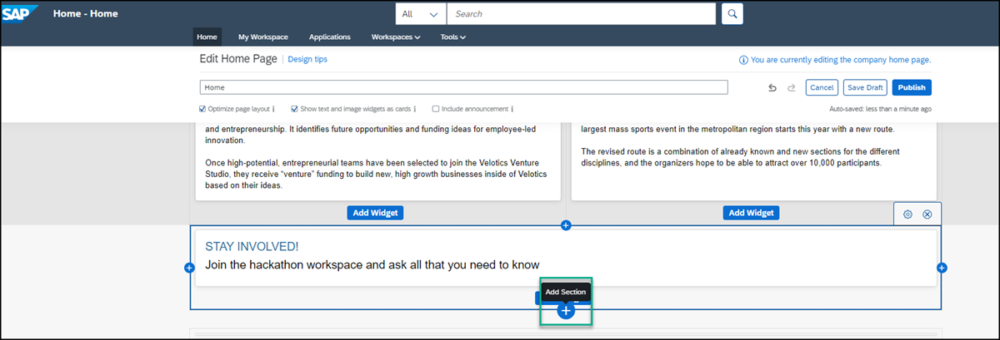

4. Click **Add Widget** to open the widget gallery and select the **Text** widget.

5. Design the text widget as follows:

    |  :------------- | :-------------
    | Text            | Type in the following: `Most Popular Apps`.
    | Font            | Select the text and change to Arial 14pt.
    | Color           | With the text still selected, choose the color black from the chart.

    <!-- border -->

6. To increase the spacing between this section and the section above, hover over the section to expose the settings at the top right, and click the cog icon.

    <!-- border -->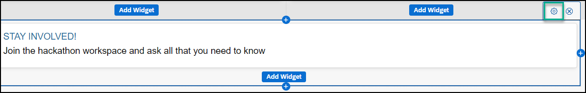

5. Enter the following values:

    * Under **Padding Top**, add the value `30` pixels and click **Save**.

    * Check the box **Extend the row to full width**.

    <!-- border -->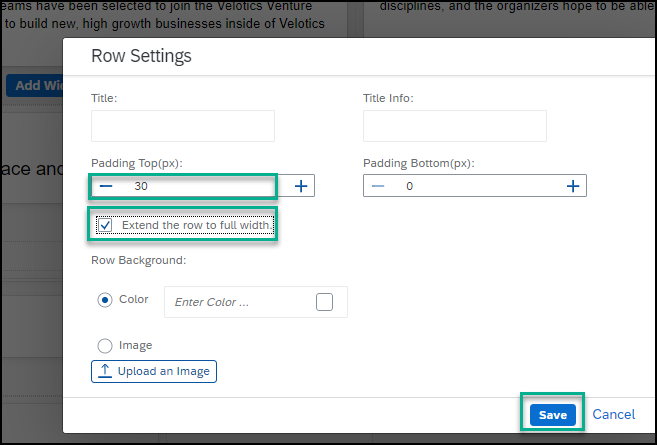

Now you're going to add your first app under this header.

### Add your app to the workpage

1. Click **+** to add another section and then click **Add Widget**.

    <!-- border -->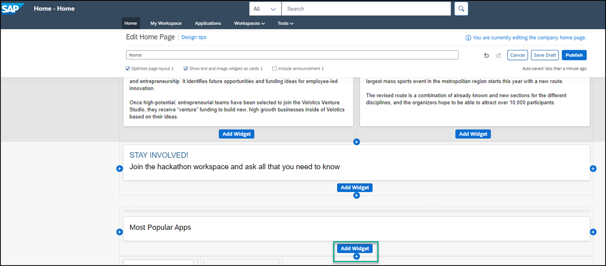

2. Click **Tiles**.

    <!-- border -->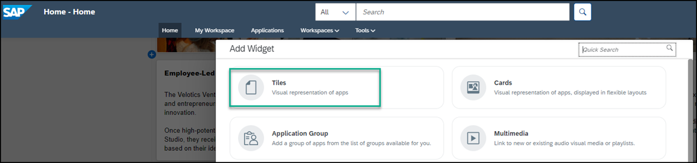

3. In the Search box, start typing in the name of your app `New Orders`, select the app, and then click **Add**.

    <!-- border -->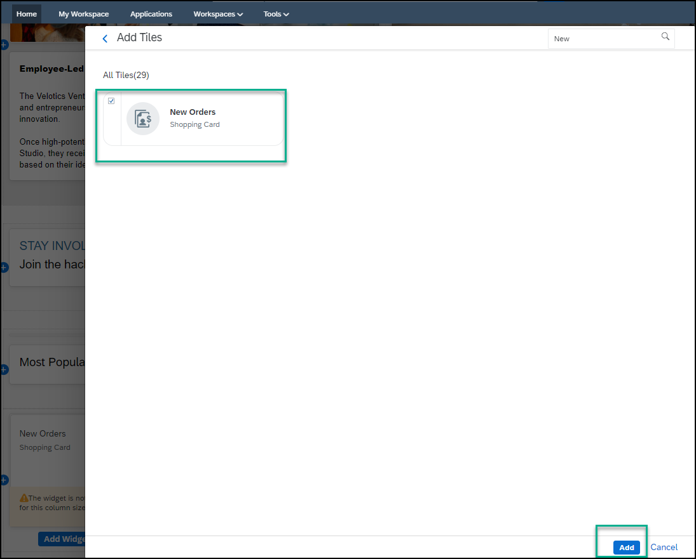

5. Scroll to the top of the page, and click **Publish**.

    This is how your **Home** workpage looks with the app added to it:

    <!-- border -->

6. Click the app to open it.
