# Add a URL App to Your Workpage in SAP Build Work Zone, advanced edition
<!-- description --> Create a URL app and add it to your workpage in an SAP Build Work Zone, advanced edition site.

## Prerequisites
- A subaccount in SAP BTP that includes a subscription to the SAP Build Work Zone, advanced edition service has already been setup for you. Note that SAP Build Work Zone, advanced edition is not available in a trial account
- You've already designed the **Home** page where you'll add this app  

## You will learn
  - How to configure a URL app and add it to your **Home** page

## Intro
You've already added a SAPUI5 app to your **Home** page under the **Most Popular Apps** header. Now in this tutorial, you'll use the **Content Manager** to add a URL app under the same header.

---

### Open the Content Manager

1. Access the **Administration Console** from the user actions dropdown menu under your avatar.

    <!-- border -->

2. Go to the **External Integrations** section, expand it, and click **Business Content**.

    <!-- border -->

3. Click **Content Manager**.

    <!-- border -->

    The **Content Manager** opens with the **My Content** tab in focus.

### Create and configure a new app

1. From the **Content Manager**, click **+ New** and select **App** from the list.

    <!-- border -->

    The App editor opens with the **PROPERTIES** tab in focus.

2. Enter the following values:

    * **Title**: `Innovation at SAP`

    * **Open App**: In place

    * **URL**: `https://sap.io`

      <!-- border -->

3. Click the **NAVIGATION** tab to specify the intent of your app.

    >The unique combination of a semantic object and an action is called an intent. It is used to define navigation to an application.

4. Enter the following values:

      * **Semantic Object**: `Innovation`

      * **Action**: `Display`

        <!-- border -->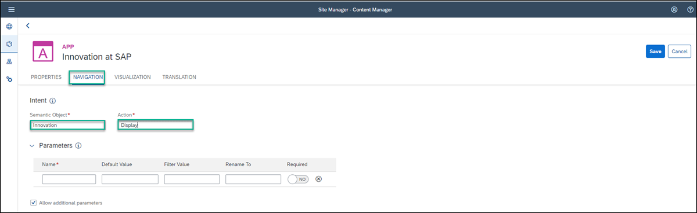

5. Click the **VISUALIZATION** tab. In this tab, you specify how the app tile will appear in the **Applications** page of your site.

6. Enter the following values:

      * **Subtitle**: `SAP.iO program `

      * **Information**:  `Learn about SAP.iO`

      * **Icon**: Click the browse icon, type `visits`, click on the displayed icon, and click **OK**.

7.  On the right, you can see a preview of the tile with all the properties you entered.
     Click **Save**.

      <!-- border -->

You've configured the URL app and in the next step you'll go back to the **Content Manager** to see it in the list of content items.

### View the app in the Content Manager

Click the **Content Manager** icon in the left side panel to navigate back to it.

  <!-- border -->

You can see your app in the list of content items in the **My Content** screen:

  <!-- border -->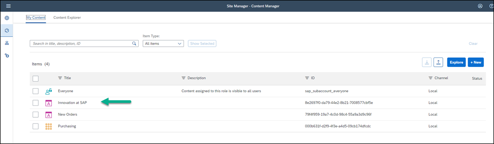

To view the app in runtime, you must assign the app to a role. You also need to assign the app to a group so that it'll be visible in the **Applications** page of your site. This is described in the following steps.

### Assign the app to the Everyone role

The `Everyone` role already exists in the **Items** list of the **Content Manager** by default. Content assigned to the `Everyone` role is visible to all users.

1. In the **Items** list, click the **Everyone** role to open the Role editor.

    <!-- border -->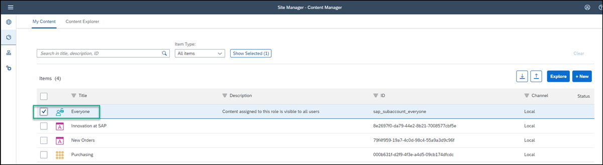

2. Click **Edit**.

    <!-- border -->

3. Click the search box in the **Assignments** panel on the right. Any available apps are shown in the list below.

    >If you have many apps, you can type some letters of your app name in the search bar, (for example, `In`) to search for the app.

4. In the **Results** list, click the **+** icon next to the `Innovation at SAP` app to assign this role to your app. You'll see that the icon changes.

5. Click **Save**.

    <!-- border -->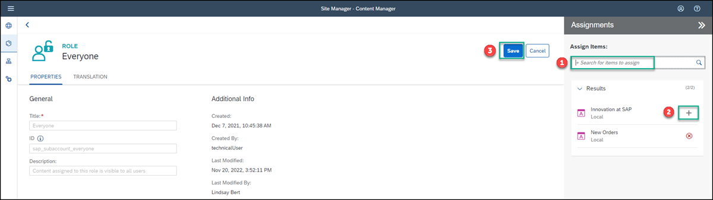

### Create a group and assign the app to it

A group is a set of one or more apps displayed together on the **Applications** page of your site. Assigning apps to groups, makes them visible to the user on the workpage. In this step you'll create a new group and assign the app to it.

1. Click the icon in the side panel to navigate back to the **Content Manager**.

    <!-- border -->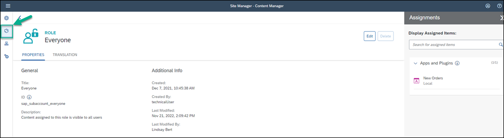

2. Click **+ New** and select **Group** to create a group.

    <!-- border -->

3. Enter `SAP` as the **Title** and in the **Assignments** panel, click inside the search box on the right of the screen, to show all available apps.

4. In the **Results** list, click **+** next to the `Innovation at SAP` app to assign it to your group.

5. Click **Save**.

    <!-- border -->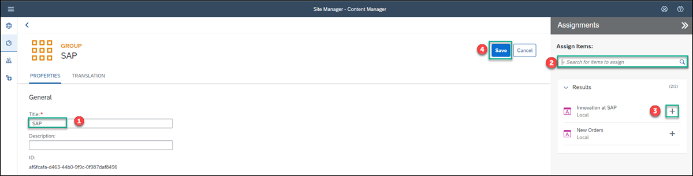

Your app is configured. Now you'll go to the **Applications** page to see that the app appears there.

### View the app in the Applications page of your site

1. Click the **Site Directory** icon in the side panel.

    <!-- border -->

2. Click the **Open site** icon.

    <!-- border -->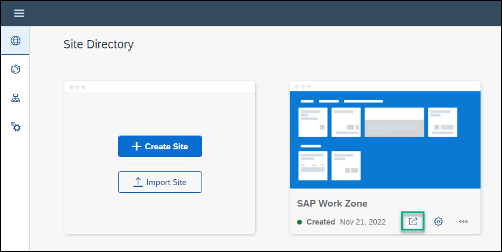

3. In the top-level menu of your site, click **Applications**.

    <!-- border -->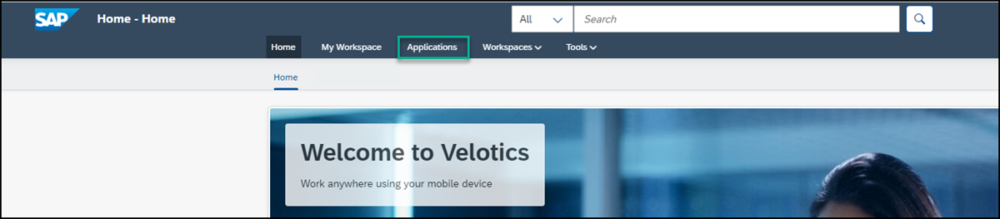

You'll see your app displayed as a tile in the new group you assigned it to:

<!-- border -->

Now you're going to add this app to the **Home** page.

### Open the Page Designer

1. Click the back arrow to go back to the **Home** page.

    <!-- border -->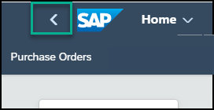

    > You can also navigate back to the **Home** page from the top navigation bar.  Click **Home** and then select **Home** next to the little house icon.

2. Click the pencil icon to open the Page Designer.

    <!-- border -->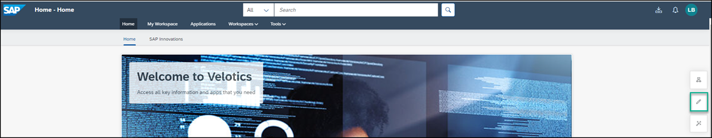

### Add the URL app to the Home page

In the previous tutorial, you added a header to your **Home** page and underneath it, you added a SAPUI5 app. You're now going to add the URL app next to the existing app.

1. Scroll down to the bottom of the page and in the same section as the `New Orders` app, click the **+ Add Application Tiles**.

    <!-- border -->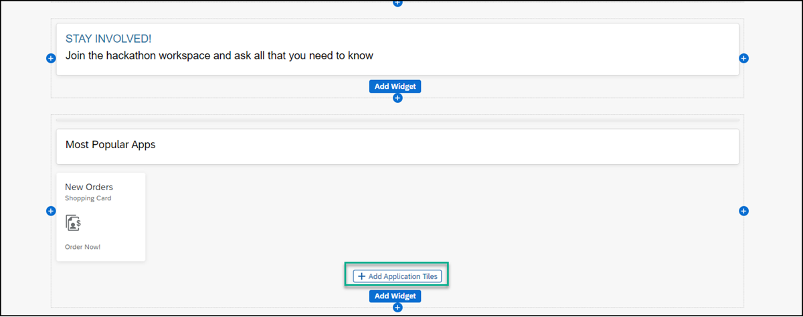

2. In the **Tiles** screen, from the search box, start typing in the name of your app `Innovation at SAP`, select the app, and then click **Add**. The app is added to the section on your workpage.

    <!-- border -->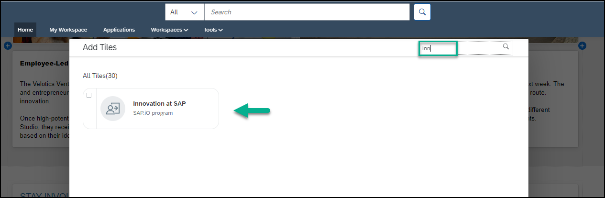

6. Scroll to the top of the screen and click **Publish**.

    This is how your **Home** page looks now with the 2 added apps:

    <!-- border -->

7. Click the apps to open them.
