# Integrate an SAP Build Apps application into SAP Build Work Zone, advanced edition
<!-- description --> Add an SAP Build Apps application to a workpage in your workspace.

## Prerequisites
- You've already created the `Sales Management` workspace using SAP Build Work Zone, advanced edition
- The SAP Build Apps application called `Sales Order Trigger' has been deployed to SAP BTP and is available to add to your workspace

## You will learn
  - How to add a SAP Build Apps application to your workspace

  
## Intro
In this tutorial,  you'll add a SAP Build Apps application to your workspace. Later you will learn how to use the app and create an approval process.

---

### Access the Channel Manager

The **Channel Manager** is used to manage content providers. Once a content provider is configured, it's added to the **Content Explorer** - a tab on the **Content Manager** screen that exposes business content from content providers. This business content can then be integrated into your site.

1. Access the **Administration Console** from the user actions dropdown menu under your avatar.

    <!-- border -->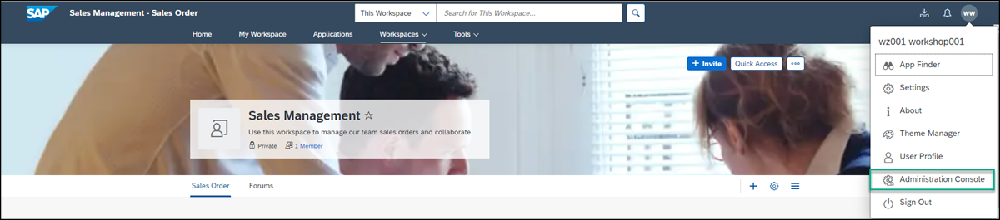

2. Go to the **External Integrations** section, expand it, and click **Business Content**.

    <!-- border -->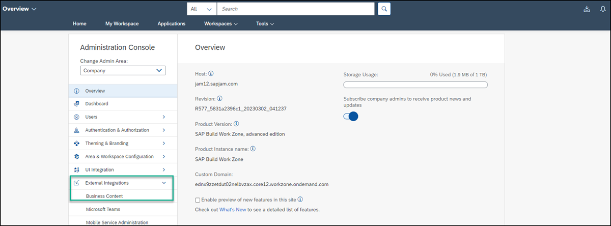

3. Click **Content Manager**.

    <!-- border -->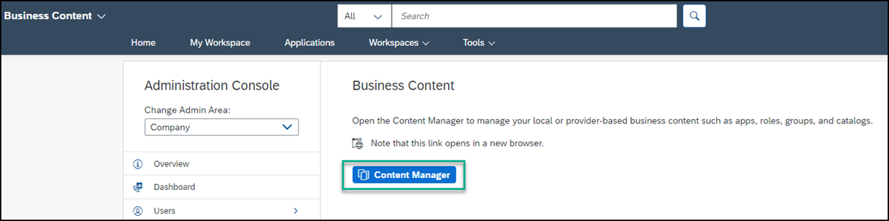

    The **Content Manager** opens with the **My Content** tab in focus.

    > The **Content Manager** has two tabs: **My Content** where you can manually configure content items and view any other available content items, and the **Content Explorer** where you can explore exposed content from available content providers, select the content, and add it to your own content.

4. From the side navigation panel, click the **Channel Manager** icon to open it. 

    <!-- border -->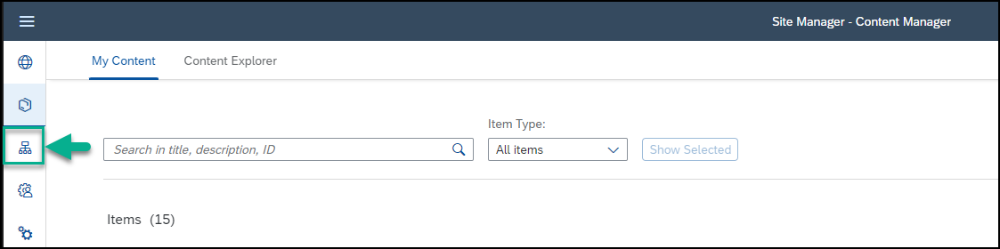

### Fetch updated content and add your SAP Build Apps application to your content

In this step, you're going to fetch updated content from the **HTML5 Apps** content provider that is located in the **Channel Manager**. The updated content is then exposed in the **Content Explorer**. From here you can add it to your content in the **Content Manager**.

> The **HTML5 Apps** content provider is created automatically. Any app that you deploy to SAP BTP is automatically added as content to this provider. 

1. In the **Channel Manager**, at the end of the **HTML5 Apps** content provider row, click the **Fetch updated content** icon. You'll see in the **Status** column that the content of this provider is being updated. 

    <!-- border -->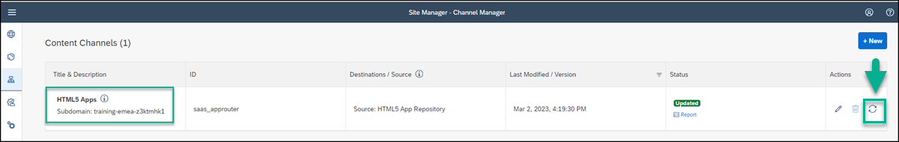

    Once updated, the **HTML5 Apps** content provider will expose your newly deployed SAP Build Apps application that you will add to your content.

2. Click the icon in the side panel to open the **Content Manager**.

    <!-- border -->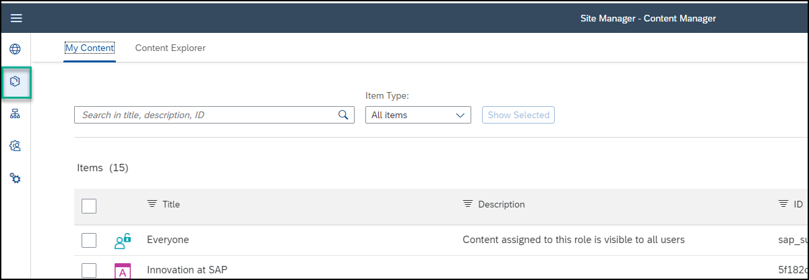 

3. Click the **Content Explorer** tab to explore content from the available content providers.

    <!-- border -->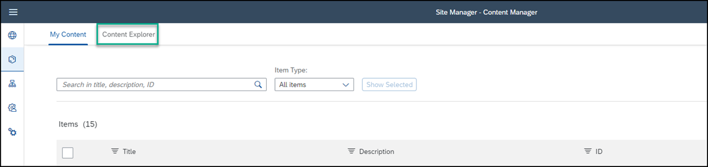

4. Select the **HTML5 Apps** provider.

    <!-- border -->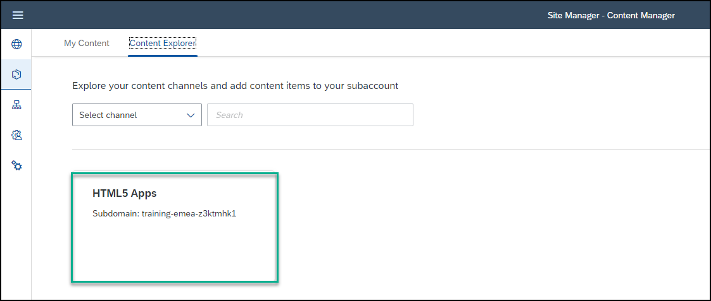

4. You’ll see that your `Sales Order Trigger` app created in SAP Build Apps, is displayed in this provider. Select it and click **+ Add to My Content**.

    <!-- border -->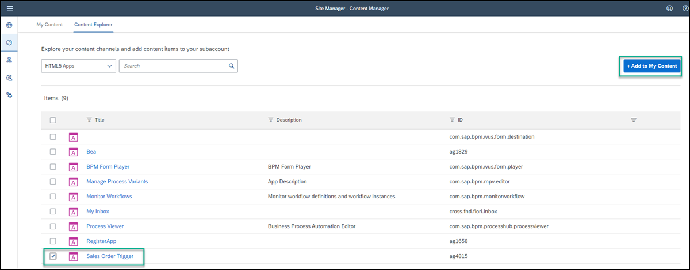

6. Click the **My Content** tab.

    <!-- border -->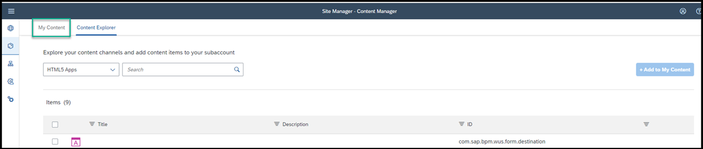

7. You can see your `Sales Order Trigger` app is now in the list of content items.

    <!-- border -->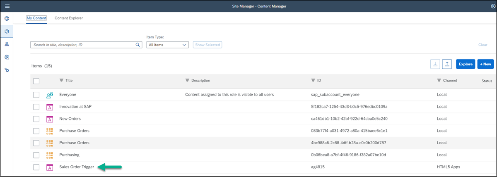

### Assign app to Everyone role

To view the app in runtime, you must assign the app to a role. In this step, you’ll assign the `Sales Order Trigger` app to the `Everyone` role. This is a default role - content assigned to the `Everyone` role is visible to all users.

1. Open the **Content Manager** from the side panel.

    <!-- border -->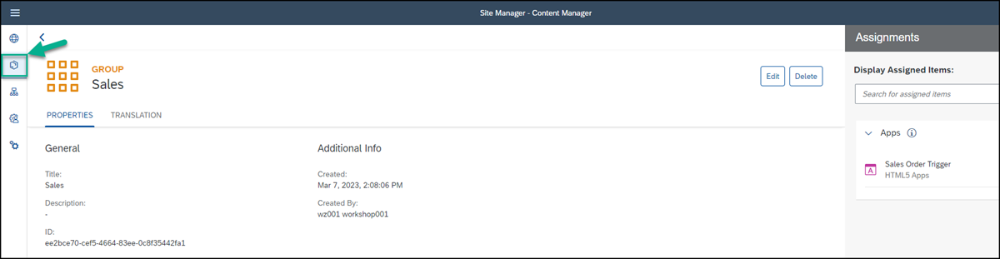

2. Click the `Everyone` role to open the role editor.

    <!-- border -->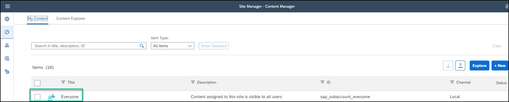

3. Click **Edit**.

    <!-- border -->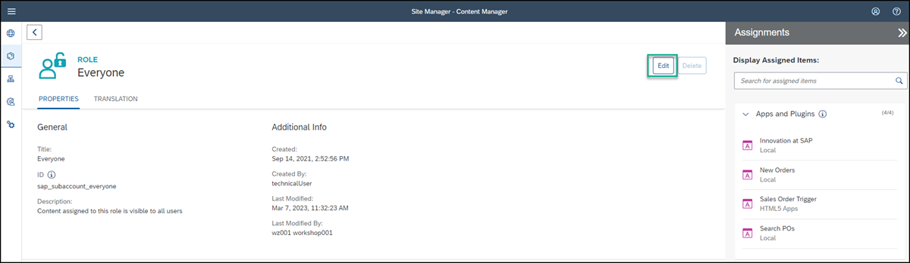

4. Click the search box in the **Assignments** panel on the right. Any available apps are shown in the list below.

5. Next to the `Sales Order Trigger` app, click the + icon. You’ll see that the icon changes.

6. Click **Save**.

> To see the app in the **Applications** page, you can assign it to a new or existing group. This is an optional step and is not required for this tutorial.

### Add a header for your most frequently used apps 

Before you add the `Sales Order Trigger` app to your workspace, first add a header for a section where you will add most frequently used apps. 

1. Open your workspace. 

    <!-- border -->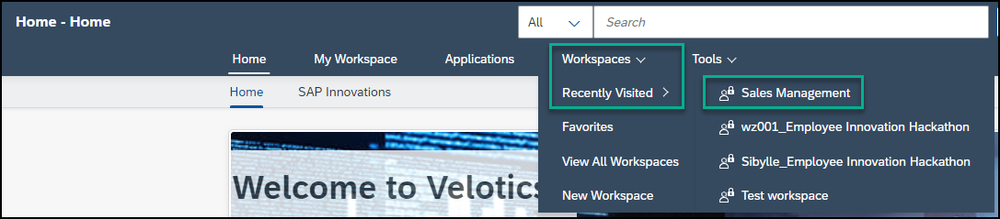

2. Click the pencil icon to open the Page Designer.

    <!-- border -->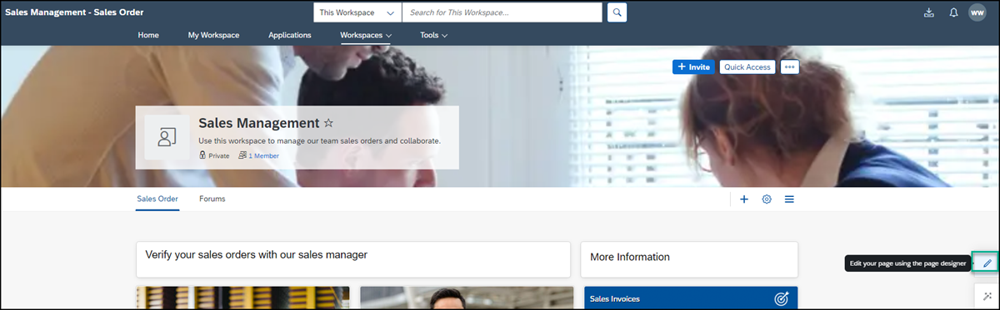

3. Scroll down to the section just before the **Feed** and click **+** to add another section.

    <!-- border -->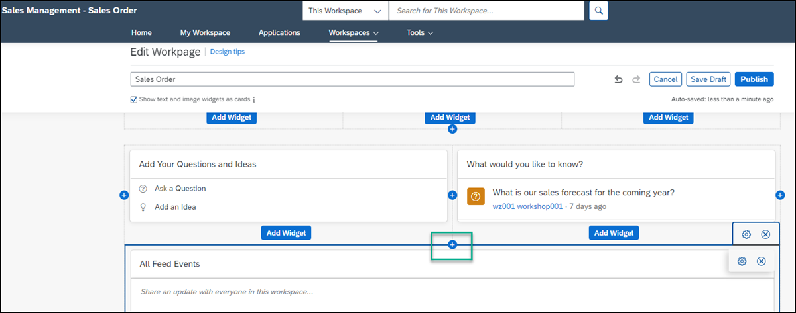

4. Click **Add Widget** to open the widget gallery.

    <!-- border -->

6. Select the **Text** widget and design it as follows: 

    |  :------------- | :-------------
    | Text            | Type in the following: `Most Popular Apps`.
    | Font            | Select the text and change to Arial 14pt.
    | Color           | With the text still selected, choose the color black from the chart.

    <!-- border -->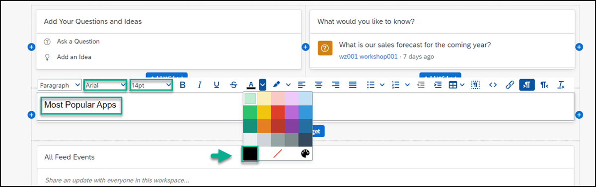

7. To increase the spacing between this section and the section above, hover to expose the settings on the right, and click the cog icon to edit the spacing.

    <!-- border -->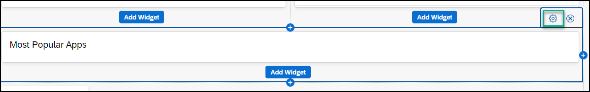

8. Under **Padding Top** add the value `30` pixels and click **Save**.

     <!-- border -->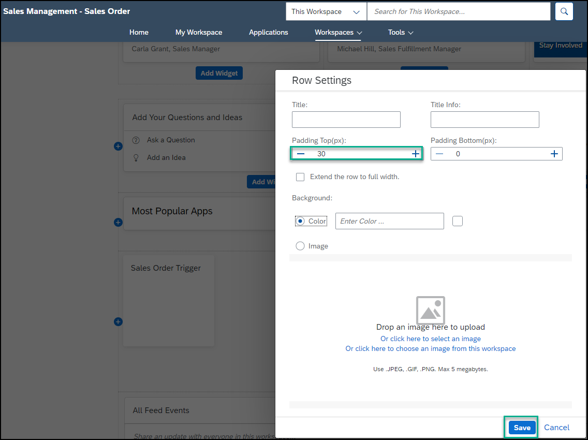

Now you’re going to add your app under this header.

### Add your app to the workspace

1. Add another section.

    <!-- border -->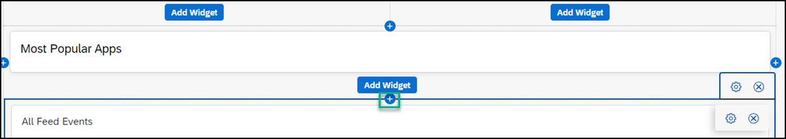

2. Click **Add Widget**.

    <!-- border -->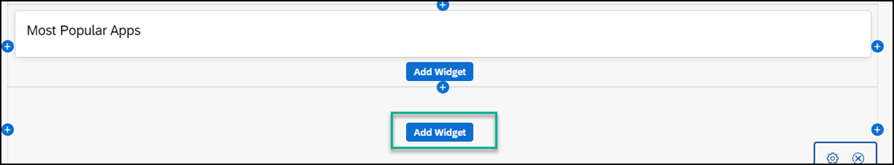

3. Click **Tiles** in the widget gallery.

    <!-- border -->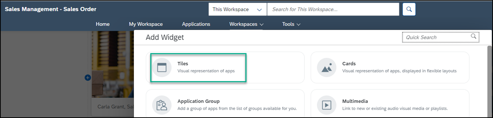

4. In the search box, start typing the name of your app `Sales`, select the `Sales Order Trigger`app, and then click **Add**.

    <!-- border -->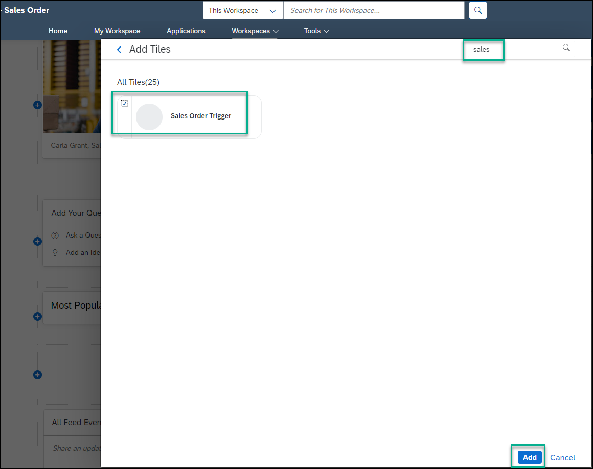

5. Scroll to the top of your page and click **Publish**.

    <!-- border -->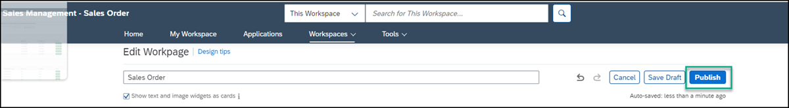

This is how your workspace looks - note that the `Sales Order Trigger`app is under the header that you created:

<!-- border -->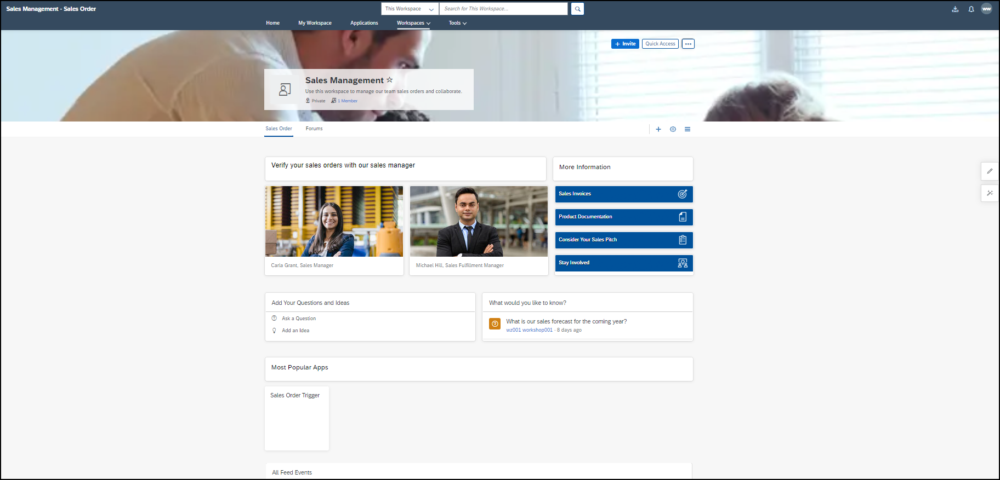