# Experience the End-to-End Flow
<!-- description --> Navigate through your site and experience the benefits of SAP Build end to end.

## Prerequisites
- You've completed the tutorials in this group: [Create a Workspace With Apps, Information, and Processes Using SAP Build Work Zone](group.build-work-zone-build-apps-integrate)

## You will learn
  - How to experience the site that you've built by navigating through the content. 

  
## Intro
In this tutorial, you'll experience the digital workplace you created in this mission as well as the entire SAP Build capabilities you created. You'll see how end users (or employees in this case), can access the company portal, view relevant company content, easily launch applications, launch the application you created with SAP Build Apps and use the automated process for the Sales Order you created. You will also see how the sales team can collaborate in a dedicated SAP Build Work Zone, advanced edition workspace.

---

### View the Home page of your site

When you open your site, the landing page is the company home page - a centralized information hub that all employees can see. This is where the company shares important information, company news, events, special notices, and useful apps that navigate to company-specifc information.  

<!-- border -->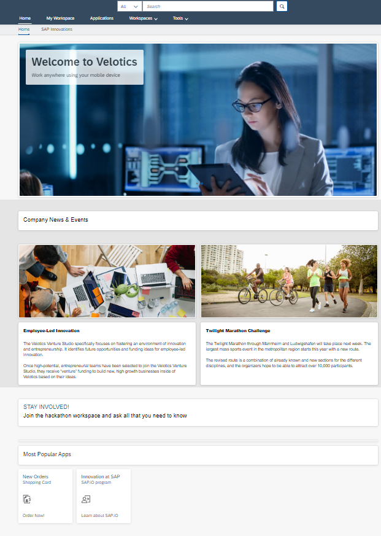

### Navigate to the Applications page

 - Access the **Applications** page from the top menu bar. This is where you'll see all the applications that you have permissions to see. Note that the apps are displayed in groups. These groups ensure that the apps are visually displayed on the screen. If you want, you can personlize this page by navigating to the user actions menu and selecting the relevant action. 

      <!-- border -->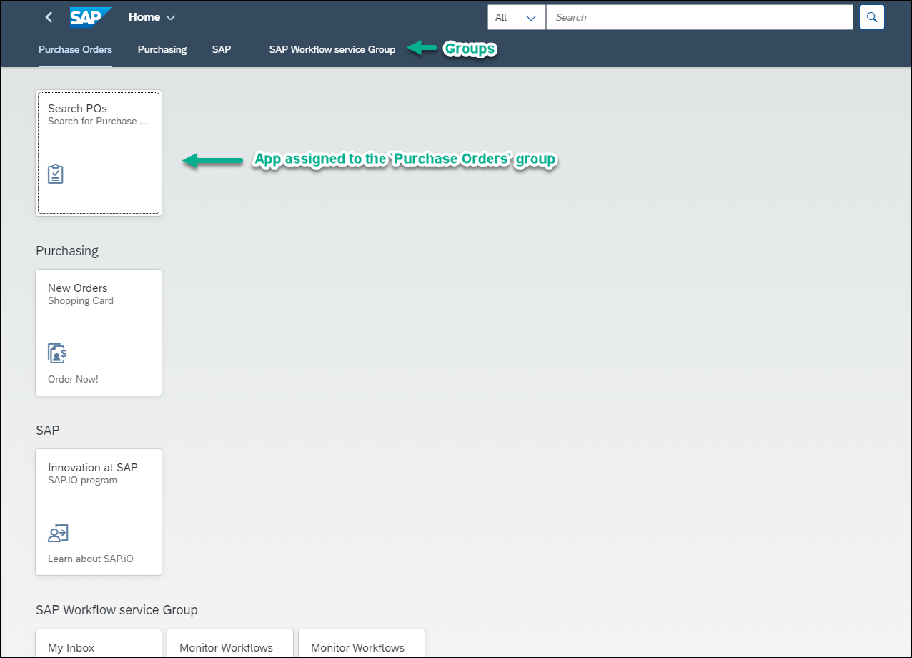

 - Click the `Search POs` app under the `Purchase Orders` group and click **Go** to display the backend data. 

      <!-- border -->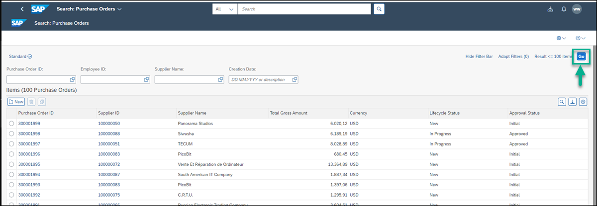

 ### Navigate to your workspace and experience how to collaborate with your colleagues and place a sales order.

 Because you're a member of the sales team you can access the **Sales Management** workspace. In the workspace you can brainstorm with your sales colleagues, share knowledge, solve problems together, and track progress within a private space.

 - Click the SAP logo to get back to your menu.

      <!-- border -->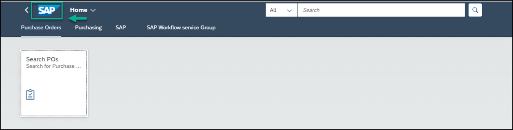
 
 - Open your `Sales Management` workspace.

      <!-- border -->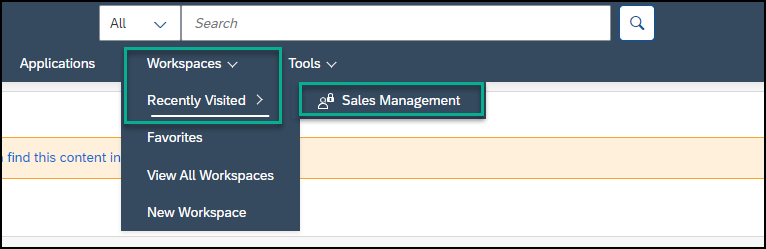

 - Consult with your colleagues and ask them questions in the forum, browse for answers from your sales managers or from other members of your team.

 - Under **Computer Systems - Best Sellers**, use the dropdown list to browse the different items you can order. For example, select  **Computer Systems**  and check out the available computers. Select `Notebook Basic 15` to view its details before you decide what you want to order. 

      <!-- border -->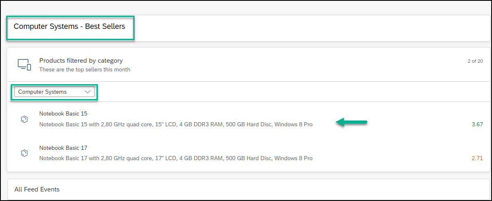

 - You may want to get advice about the computer so , click **Ask a Question** and post your question.

      <!-- border -->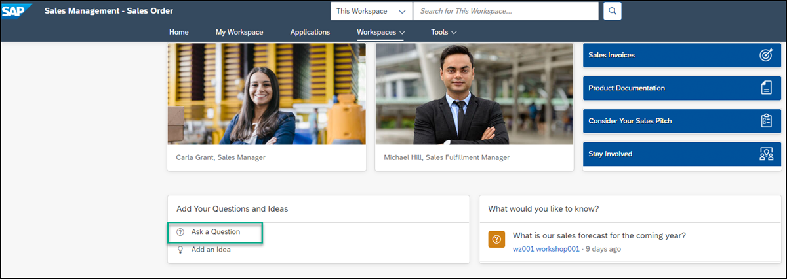

 - Now you can order the computer. Under **Most Popular Apps**, click the `Sales Order Trigger` app. 

      <!-- border -->

 -  Click the app to create your order. Add your details in the relevant fields. For example:

    |  :------------- | :-------------
    | Customer        | `SAP`
    | Material        | Select `Notebook Basic 15` - this list is retrieved from the backend, when you select an item, the `Material` field is populated automatically.
    | Amount          | `120000`
    | Delivery Date   | `2023-10-10`

 -  Click **Get Approval** to trigger the workflow process. When you send a sales order for approval, an automated process is triggered and the sales order process is digitized so that it can be handled quickly and efficiently.

      <!-- border -->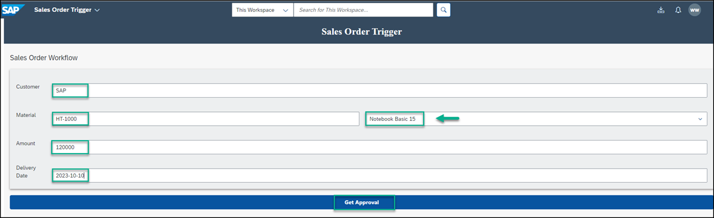

     Note the process was triggered with a notification. Remember that the sales order in the process automation flow is based on the size of the Sales Order- under 100,000 items are approved automatically, larger sales orders are sent to the approver’s inbox.

     <!-- border -->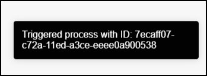

 - As a general rule, you would send the approval to an approver. In this workshop, we'll send the task to the user who submitted the order to save time.

 - Click the **My Inbox** app from the shell to view the task you need to approve. 

      <!-- border -->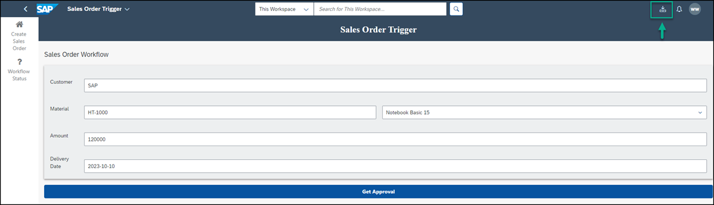
 
 - From the **Approve Sales Order** form, click **Approve**. You'll be notified that that task has been completed successfully.

      <!-- border -->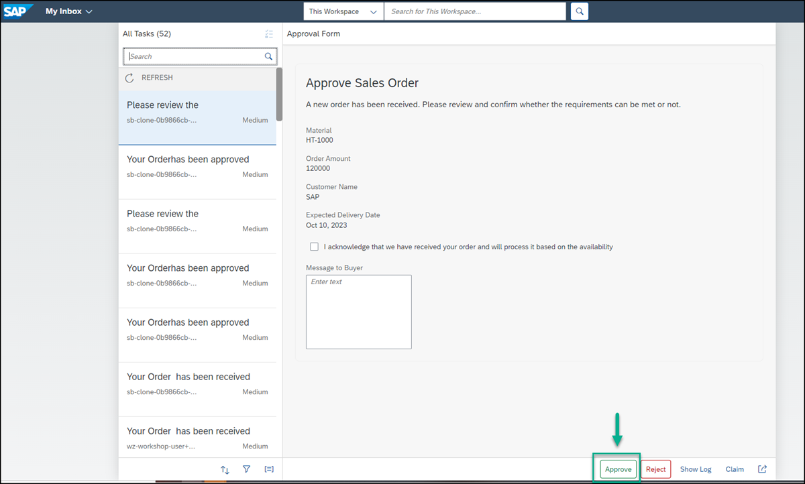

 - Click **Refresh** to view the **Order Confirmation** form.

     <!-- border -->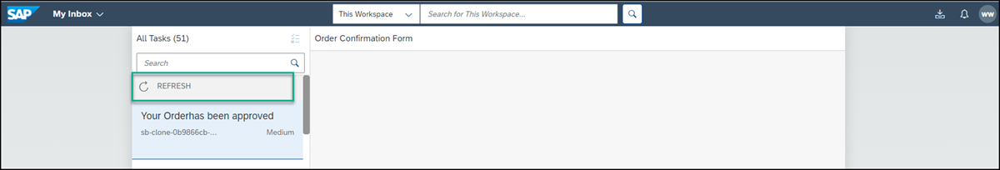

 - Click **Submit**.

     <!-- border -->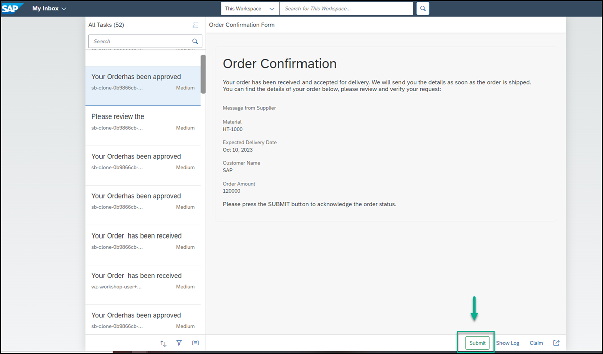

     You'll see that once submitted, the order has been handled and it's no longer in the **My Inbox**.
   