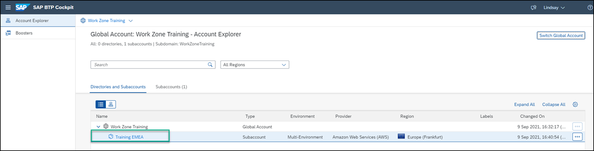
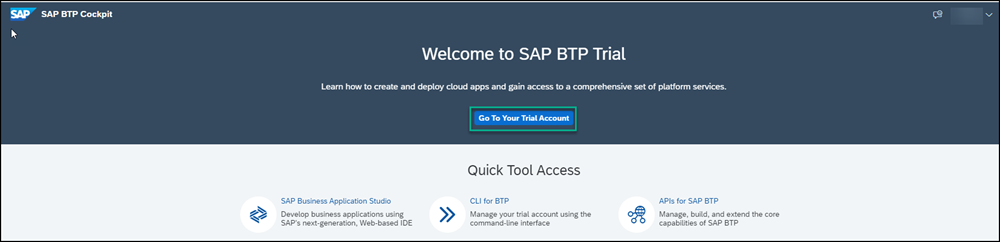
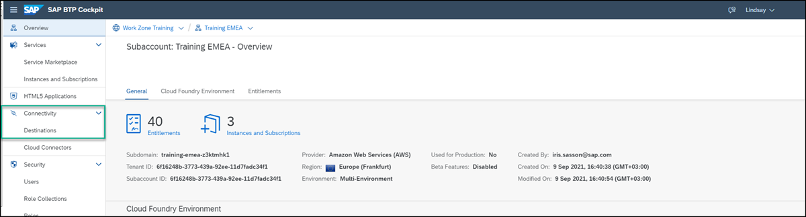
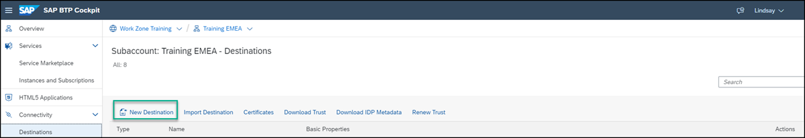
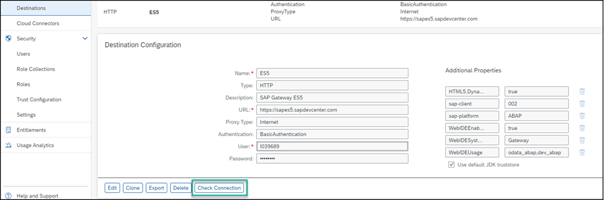
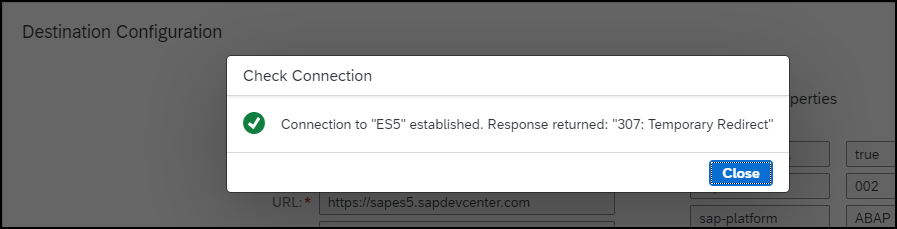

# Connect the SAP BTP Training Subaccount to Your Gateway Demo System Account (ES5)
<!-- description --> Create a connection between SAP BTP, Cloud Foundry environment and the SAP Gateway Demo System (ES5).

## Prerequisites
- You've created an account in SAP BTP and have subscribed to and configured the SAP Launchpad service.

## You will learn
  - How to create a destination between SAP BTP and the SAP Gateway Demo System account  

---

### Open your subaccount

1. Log on to SAP BTP.

2. Select your subaccount.

    <!-- border -->

> If you're using an SAP BTP Trial account, after you log in to SAP BTP, you would first need to click **Go To Your Trial Account**.  <!-- border -->

### Create destination to SAP Gateway Demo System

In this step, you'll create connectivity between SAP BTP and the SAP Gateway Demo system account.

1.  In the left navigation panel, click **Destinations** under **Connectivity**.

    <!-- border -->  

2. Click **New Destination**.

    <!-- border -->

3.  Add the following destination properties:

    >Important: If you haven't already created a user in ES5 as explained in the prerequisites above, please do so now and follow the steps in this topic:  [Create an Account on the Gateway Demo System](gateway-demo-signup).

    |  Field     | Value
    |  :------------- | :-------------
    |  Name           | `ES5` In workshops, use: `<your unique identifer>ES5`
    |  Type          | `HTTP`
    |  Description    | `SAP Gateway ES5`
    |  URL           | `https://sapes5.sapdevcenter.com`
    |  Proxy Type          | `Internet`
    |  Authentication    | `BasicAuthentication`
    |  User Name          | Your ES5 Gateway user
    |  Password    | Your ES5 Gateway password

4. Make sure that the **Use default JDK truststore** checkbox is checked.

5. Enter the following **Additional Properties** depending on your scenario. Click the **New Property** button each time to add a new property.

    >If you're not sure which ones to enter, enter all of them.

    |  Field     | Value
    |  :------------- | :-------------
    | `WebIDEEnabled`          | `true`
    | `WebIDESystem`    | `Gateway`
    | `WebIDEUsage`           | `odata_abap`,`dev_abap`     
    | `sap-platform`          | `ABAP` (enter this property manually as it is not available in the dropdown list)
    | `sap-client`          | `002`
    | `HTML5.DynamicDestination`          | `true`

    >Note that SAP Business Application Studio reuses SAP Web IDE properties. In this way, the destination configuration as well as the migration from SAP Web IDE to SAP Business Application Studio, is much simpler.

    >For more information about these properties, see [Connecting to External Systems](https://help.sap.com/viewer/9d1db9835307451daa8c930fbd9ab264/Cloud/en-US/7e49887e6fd34182bebeca5a6841a0cc.html) and [Configure (HTML5) Destinations](https://help.sap.com/viewer/ad4b9f0b14b0458cad9bd27bf435637d/Cloud/en-US/fab4035652cb4fc48503c65dc841d335.html).

    Your screen will look like this:

    

6. Click **Save**.

7. Click **Check Connection** to make sure that everything is working.

    <!-- border -->

    You'll get confirmation that the connection is established.

    

    >This is not an error. The check connection operation tries to open the ES5 URL and gets redirected to the login page.

---
