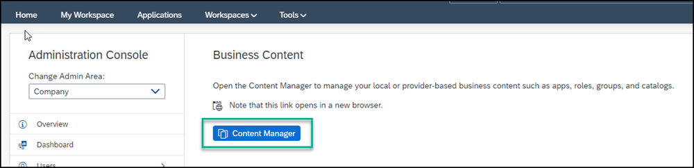
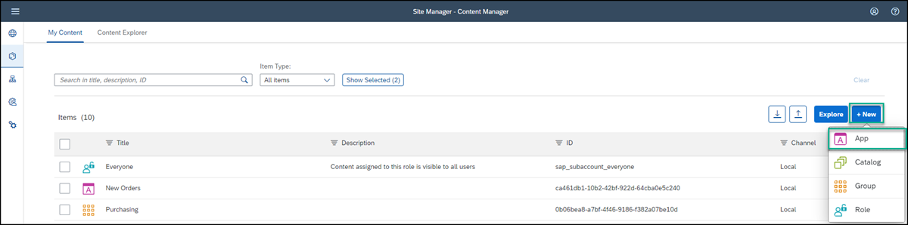
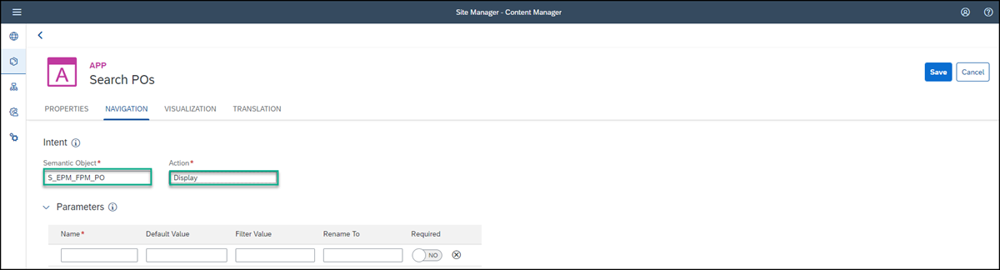
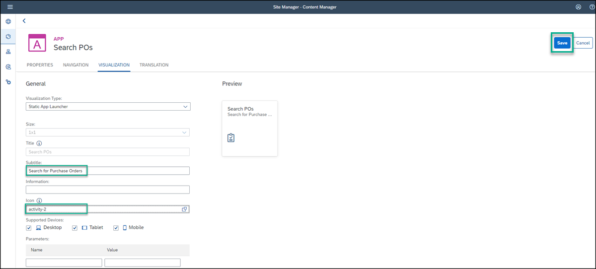
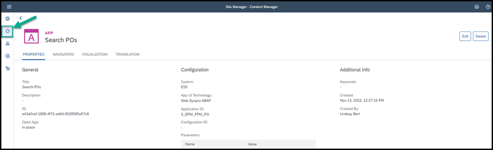
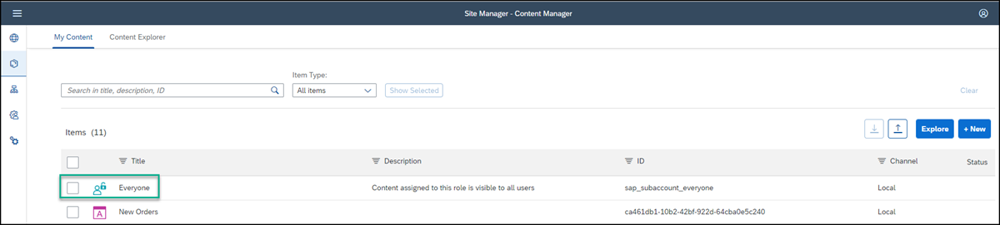
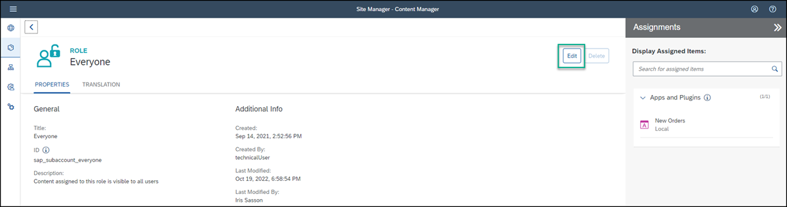
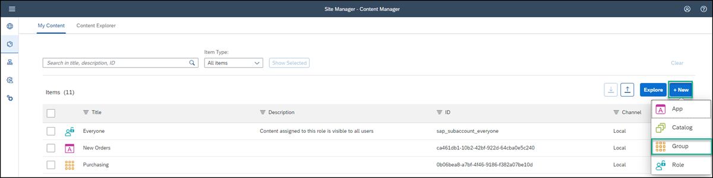
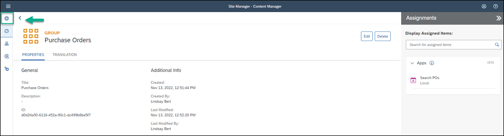
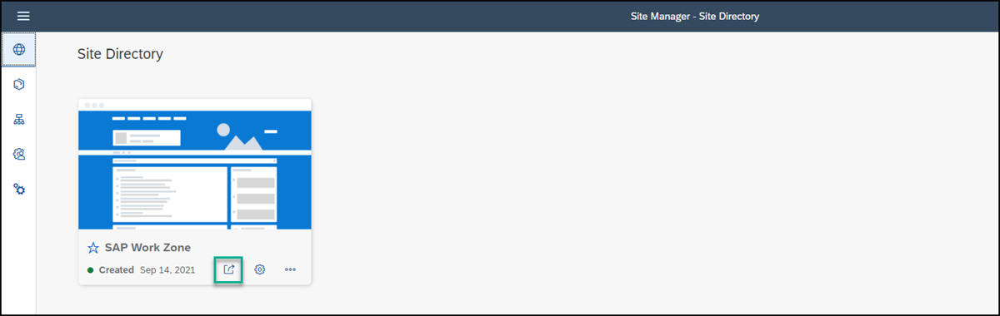

# Add an App From the Backend to SAP Build Work Zone, advanced edition
<!-- description --> Add a classic SAP application (like those typically run by SAP customers on the data center backends), to your SAP Build Work Zone, advanced edition.

## Prerequisites
 - You have created a destination in SAP BTP cockpit to the SAP Gateway Demo System
 - You have an environment set up and you can access your SAP Build Work Zone, advanced edition
 - You have opened SAP Build Work Zone, advanced edition 

## You will learn
  - How to add a Web Dynpro ABAP backend application to your workpage
  -

## Intro
To add business apps to SAP Build Work Zone, advanced edition, you configure them in a tool called the **Content Manager**, located in the Site Manager. The **Content Manager** includes various editors that you can use to configure apps, groups, roles, and catalogs. Once configured, the app appears as a tile in the **Applications** page of your site - a single page that acts as an embedded launchpad. The page is accessed from the top-level menu and displays the business apps that the user has permissions to launch.

---

In this tutorial, you're going to add one of SAP's classic applications, a Web Dynpro ABAP app, to your site using the **Content Manager**. SAP's classic applications typically run on the backend of a data center.

### Open the Content Manager

1. Access the **Administration Console** from the user actions dropdown menu under your avatar.

    <!-- border -->

2. Go to the **External Integrations** section, expand it, and click **Business Content**.

    <!-- border -->

3. Click **Content Manager** to open it.

    <!-- border -->

The **Content Manager** opens with the **My Content** tab in focus.

### Configure the Web Dynpro ABAP app

1. In the **Content Manager**, click **+ New** and select **App** from the dropdown list.

    <!-- border -->

    The app editor opens with the **PROPERTIES** tab in focus.

2. Enter the following values:

    |  Field     | Value
    |  :------------- | :-------------
    |  Title           | `Search POs` In a workshop, use: `<your unique identifier>_Search POs`.
    |  System          | Select the value `ES5`. In a workshop use: `<your unique identifier>_ES5`.
    |  App UI Technology    | Select `Web Dynpro ABAP`
    |  Application ID           | `S_EPM_FPM_PO`

    <!-- border -->

3. In the **NAVIGATION** tab, enter these values:

    |  Field     | Value
    |  :------------- | :-------------
    |  Semantic Object           | `S_EPM_FPM_PO`
    |  Action          | `Display`

    <!-- border -->

4. In the **VISUALIZATION** tab, enter these values and then click **Save**.

    |  Field     | Value
    |  :------------- | :-------------
    |  Subtitle           | `Search for Purchase Orders`
    |  Icon          | Click the browse icon, type `activity-2`. You'll see two icons. Click the first one and then click **OK**.

    <!-- border -->

### View the app in the Content Manager

Click the icon in the left side panel to open the **Content Manager**.

  <!-- border -->

You can see your Web Dynpro ABAP app in the list:

  <!-- border -->

To view the app in runtime, you must assign the app to a role. You also need to assign the app to a group so that it'll be visible in the **Applications** page of your site. This is described in the following steps.

### Assign the app to the Everyone role

>The `Everyone` role already exists in the **Items** list of the **Content Manager** by default. Content assigned to the `Everyone` role is visible to all users.

1. In the **Content Manager** in the **Items** list, click the `Everyone` role to open up the Role editor.

    <!-- border -->

2. Click **Edit**.

    <!-- border -->

3. Click the search box in the **Assignments** panel on the right, any available apps are shown in the list below.

4. Click the **+** icon next to the `Search POs` app to assign the app to the `Everyone` role. You'll see that the icon changes to an **X**.

5. Then click **Save**.

    <!-- border -->

The `Search POs` app is now assigned to the `Everyone` role. In the next step you'll assign the app to a group.

### Assign the app to a group

>A group is a set of one or more apps displayed together in the **Applications** page of your site. Assigning apps to groups, makes them visible to users.

1. Click the icon in the side panel to navigate back to the **Content Manager**.

2. Click **+ New** and select **Group** to open the Group editor.

    <!-- border -->

3. Name the group `Purchase Orders`.

4. In the **Assignments** panel, click inside the search box on the right of the screen, to show all available apps. You should see the  `Search POs` app.  

5. In the list, click **+** to assign the `Search POs` app to your group.

    You'll see that the icon changes to an **X**.

6. Click **Save**.

    <!-- border -->

    Now that the app is configured, it is automatically added to the **Applications** screen in your site. You can also add it to one of your workpages.

### View the app in the Applications screen

1. Click the **Site Directory** icon in the side panel.

    <!-- border -->

2. Click the **Open site** icon.

    <!-- border -->

3. In the top-level menu of your site, click **Applications**.

    <!-- border -->

You'll see your app is displayed as a tile in the group you assigned it to:

  <!-- border -->
