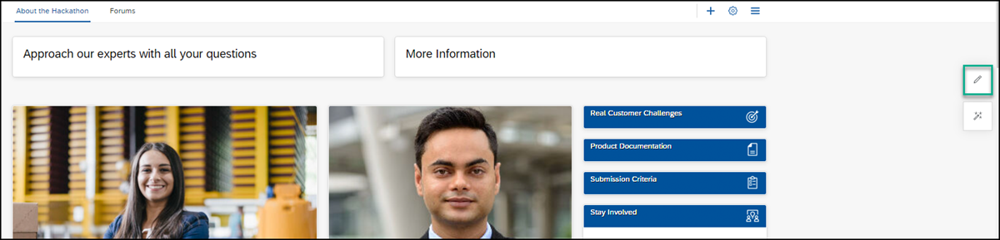
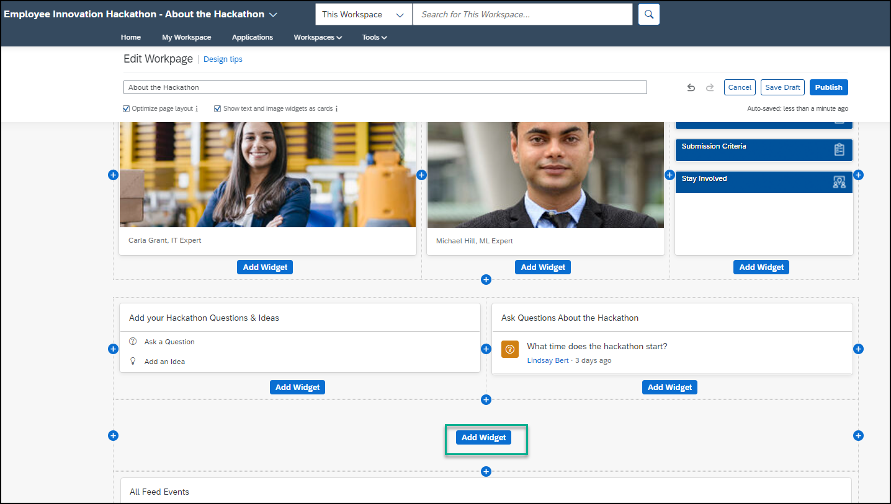
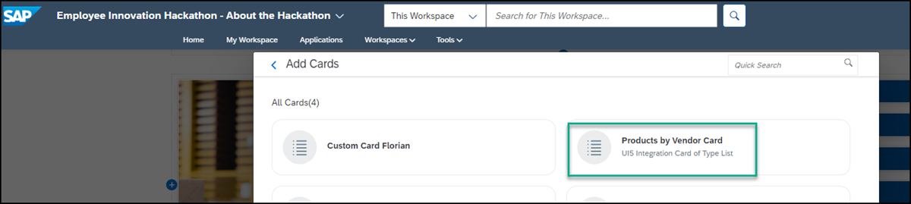
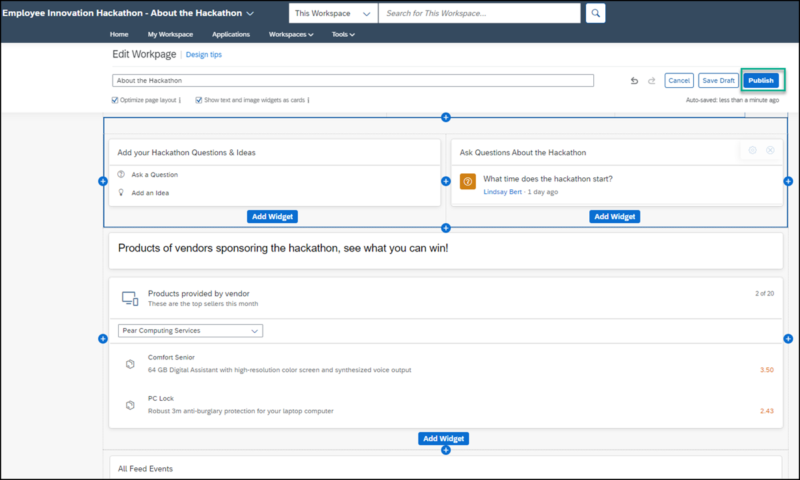

## Prerequisites
 - You have deployed a UI5 integration card to SAP Work Zone.

## Details
### You will learn
  -  How to make a deployed UI5 integration card available in SAP Work Zone and add it to the SAP Work Zone home page or workspace.

You've already deployed a UI5 integration card. Now in this tutorial, you'll enable it to make it available in SAP Work Zone and later add it to your workspace.

---

[ACCORDION-BEGIN [Step 1: ](Enable your deployed UI5 integration card )]

1. Access the **Administration Console** from the user actions dropdown menu under your avatar.

    !

2. Go to the **UI Integration** section, expand it, and click **Cards**.  

    !

3. Scroll down to view the **Uploaded Cards** section.

    >Note: if you don't see your deployed card, you may need to refresh the browser.

4. Click the slider button to enable the card and make it available for users who can then add it to Work Zone pages.

    !

The card is now enabled and can be added to SAP Work Zone pages.

>In this step you select your own card with your unique identifier `<your unique identifier>_Products by Vendor Card`.

>Note: you can click on **Configure** to select a different destination for this UI5 integration card. As you used the same ES5 destination in this SAP BTP subaccount and also when you developed the card, this step is not required to complete this tutorial.

[DONE]
[ACCORDION-END]

[ACCORDION-BEGIN [Step 2: ](Configure the card settings )]

Before you add the card to your workspace, let's configure one of the settings of the card.

1. On the `Products by Vendor Card`, click **Configure**.

    !

2. Under **General Settings**, change the **Maximum Items** to 2 and click **Save Changes**.

    !

    > On the **Configure** screen, when you click the **More settings** icon there are more settings that you can configure for the end user.
    !

In the next step you'll add the card to your SAP Work Zone workspace.

[DONE]
[ACCORDION-END]

[ACCORDION-BEGIN [Step 3: ](Add your UI5 integration card to your SAP Work Zone workspace)]

1. Click the **Workspaces** menu and select `Employee Innovation Hackathon` to navigate to your workspace.

    !

2. Click the pencil icon on the right side of the screen to open the Page Designer.

    !

3. Click the **+** below the **Forum** widget and above the **Feed** widget to add a new row to your workspace.

    !

4. In the added row, click **Add Widget**.

    !

5. Under **Cards**, select the `Products by Vendor Card` widget that you previously created. If you're taking part in a workshop, select your own card with your unique identifier `<your unique identifier>_Products by Vendor Card`.

    !

6. Click **Add**.

    !

The card you created was added to your workspace.

>Note: you can also add UI integration cards to a SAP Work Zone Home page.

Now let's add a title for the card.

[DONE]
[ACCORDION-END]

[ACCORDION-BEGIN [Step 4: ](Finalize the design of your workspace)]

1. Click **Add Widget** below the card widget you just added.

    !

2. Under **Standard Tools**, select the **Text** widget.

3. Design the **Text** widget as follows:

    |  :------------- | :-------------
    | Text            | Type in the following: `Products of vendors sponsoring the hackathon, see what you can win!`.
    | Font            | Select the text and change to Arial 14pt.
    | Color           | With the text already selected, choose black from the chart.

4. Click outside of the widget row to see how your page looks so far.

5. Select the text widget you just added, and drag it above the card widget that you added before.

    !

6. Click **Publish** to publish your workspace.

    !

Your workspace should look like this - note that the card is only showing 2 out of 20 products because you configured it that way.

!

[VALIDATE_7]
[ACCORDION-END]
