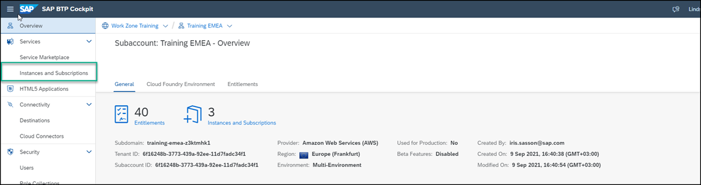
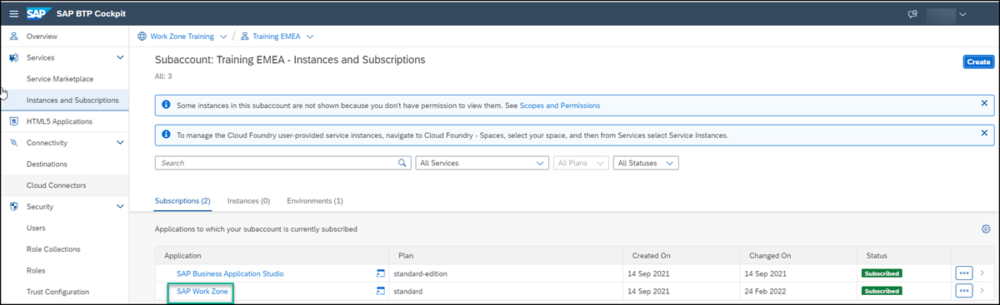

# Access SAP Build Work Zone, advanced edition from the SAP BTP Training Subaccount
<!-- description --> Access the SAP Build Work Zone, advanced edition from the SAP BTP subaccount.

## Prerequisites
To follow the trainings, the instructor will give you the following:
 - A URL to a SAP BTP subaccount used for this training
 - A user name and password for the SAP Business Technology Platform account used in this training

## You will learn
  How to access SAP Build Work Zone, advanced edition

## Intro
In this workshop tutorial mission, you'll be accessing the SAP Build Work Zone, advanced edition tutorial environment from a SAP BTP subaccount that has already been set up for you, including a subscription to SAP Build Work Zone, advanced edition service. Once you've accessed the service, in the next tutorial, you'll create a workspace in your site and add content to it.

>This workshop is conducted on a shared environment. Therefore we will be asking you to enter unique IDs in some of the steps. We have specified in each of the tutorials of this mission when to enter your unique ID. For example, `<your unique identifier>_<name of entity>`. In addition, please don't edit the **Home** page as it's a shared asset.  

>Please note that SAP Launchpad service and SAP Work Zone come together under the SAP Build Work Zone brand, with two editions: standard edition (formerly SAP Launchpad service) and advanced edition (formerly SAP Work Zone).
 This means, SAP Work Zone was recently renamed to `SAP Build Work Zone, advanced edition`.

---

### Access SAP Build Work Zone, advanced edition

1. Open your browser and navigate to the subaccount in SAP BTP that you received from the instructor.

2. Click **Services** and then **Instances and Subscriptions** in the left navigation panel.

    

3. Under the **Subscriptions** tab, click `SAP Build Work Zone, advanced edition`.

    

4. Enter your log on credentials that were given to you by the instructor.

Your SAP Build Work Zone, advanced edition site opens displaying the **Home** page that has already been configured for you.

In the next tutorial, you'll create a workspace and add apps and other content to it.
