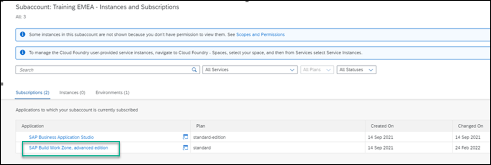

## Prerequisites
To follow the trainings, the instructor will give you the following:
 - A user name and password for the SAP Business Technology Platform account used in this training.
 - A user for the Identity Authorization service (IAS) used in this training. IAS is the authentication service that is used to access the training environment for SAP Work Zone and SAP Business Application Studio.

## Details
### You will learn
  How to access SAP Work Zone

In this workshop tutorial mission, you'll be accessing the SAP Work Zone tutorial environment from a SAP BTP subaccount that has already been set up for you including a subscription to SAP Work Zone. Once you've accessed SAP Work Zone, in the next tutorial, you'll create a workspace and add content to it.

  >Please note that due to the high number of participants that register for SAP Work Zone workshops, we have provided a single subaccount for multiple users. Therefore, you will be using a shared subaccount with others. In order to allow the exercises to run smoothly for all, please don't edit the SAP Work Zone Home page as it's a shared asset.

---

[ACCORDION-BEGIN [Step 1: ](Access SAP Work Zone)]

1. Open your browser and navigate to your subaccount in SAP BTP.

2. Click **Instances and Subscriptions** in the left navigation panel.

    

3. Under the **Subscriptions** tab, click `SAP Work Zone`.

    

4. Enter your IAS log on credentials that were given to you by the instructor.

SAP Work Zone opens displaying the Home Page that has already been configured for you.

[VALIDATE_6]
[ACCORDION-END]

In the next tutorial, you'll create a workspace and add apps and other content to it.
