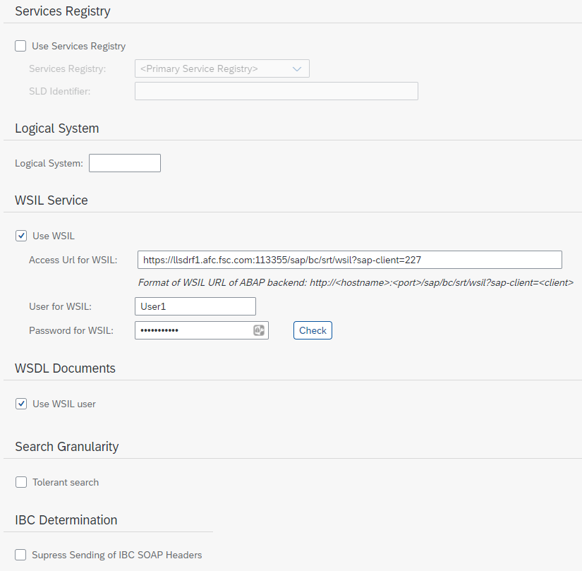

# Set Up Local Configuration in SOAMANAGER
<!-- description --> Learn how to set up local configuration in ABAP web services to create the runtime configuration for multiple proxy entities.

## Prerequisites
- Basic knowledge about web services and SOAMANAGER
- User in two development systems with permission to run transaction SOAMANAGER
- Two development systems in which no local configuration exists yet
- Service definition and a service group containing a service consumer, e.g. `srt_test_group` and `srt_test_provider` (available in every ABAP system)
- You can use your own service group and service definition.
    - **Important:** The service consumer must not already be used by another local configuration.

## You will learn
  - What local configuration is
  - How to set up local configuration in SOAMANAGER

## Intro
In this tutorial, wherever **`XXX`** appears, use a number (e.g. **`000`**).

In this case, system A acts as consumer and system B as provider.

---

### What is local configuration

Local configuration is a technique to automatically create the runtime configuration of multiple proxy entities by defining a so-called integration scenario once in both systems.

In general, endpoints and logical ports often rely on the same settings, such as security settings. Creating single configurations manually for these entities is therefore repetitive and time-consuming. The local configuration acts as a mass configuration tool. A profile describes the common configuration settings of the endpoints.

A set of consumer proxies is collected within a service group. The service definitions in the underlying profile create a relationship between the service group. In result, they can automatically configure the corresponding endpoints for each service definition and the corresponding logical ports for each consumer proxy.

Another advantage is that the local configuration of a service group makes it possible to define so-called logical receiver determinations to route web service messages to different provider systems.

In older releases or documentation, local configuration is often called smart configuration or mass configuration.

### Required entities

Local configuration in SAP NetWeaver is based on the following entities:

- Profile
- Logon data assignment
- Provider system
- Business scenario

In this tutorial, you are going to create these entities step by step.

### Create a profile

In a profile, a certain set of parameters is included which is then used for configuration of end points for service definitions and logical ports for consumer proxies.

1. Run transaction SOAMANAGER in system A.
2. On tab **Technical Administration**, choose **Profiles**.
3. Choose **Create Profile**.
    - Name: **`MYPROFILE_XXX`**
    - Profile Description: **`MYPROFILE`**
    - Uncheck **Old Profile Mode** if necessary.
4. Choose Next.
5. In the step **Security** under **Authentication Method** > **Transport Channel Authentication**, choose **User ID/Password**.
6. Choose **Next**.
7. Choose **Finish**.
8. Activate the profile by choosing **Yes** in the pop-up window.

### Create a user account

A user account stores credentials. These are then used to store them in the corresponding logical port. When the endpoint is called via the logical port of the consumer proxy, these stored credentials are used.

1. On tab **Service Administration**, choose **Logon Data Management**.
2. Choose **Create**.
    - Logon Data Name: **`MYUSER_XXX`**
    - Description: **`Logon User`**
3. Choose **Next**.
4. In the step **Credentials**, choose **User/Password or X.509** from the list.
    - Enter the credentials of system B.
5. Choose **Finish**.
6. Activate the logon data by choosing **Yes** in the pop-up window.

### Create a provider system

A provider system describes the parameters and access to a system that contains the service definitions. In a provider system, a profile/version is referenced. The profile is then used during configuration to create parameters for the logical port.

1. On tab **Technical Administration**, choose **Provider Systems**.

2. Choose **Create**.
    - Name: **`PROVIDER_SYSTEM_A_XXX`**
    - Profile Description: **`Provider System for System A`**
    - Profile Name: **`MYPROFILE_XXX`**.

3. Choose **Next**.

4. Uncheck **Use Services Registry** as this requires a services registry connection. In this tutorial, the connection is configured only WSIL based.

5. Enter access URL for WSIL.

    - Run transaction SOAMANAGER in system B.

    - Copy the SOAMANAGER URL of system B.

    - We recommend to open a text editor of your choice. Paste the URL you've copied. 

    - Copy the highlighted part to /sap/bc/:

        <!-- border -->

    - Go back to the SOAMANAGER of system A. Add the part from /sap/bc of the placeholder URL to the part you have copied in step 4. Add the corresponding client of system B.

        <!-- border -->

    - In this example, this results in:

        <!-- border -->

6. Enter the credentials of a user in system B with permission to display the WSIL.

7. Check **Use WSIL user**.

8. Your settings should look like this:

    <!-- border -->

9. Choose **Next**.

10. Choose **Retrieve Business Applications** and **Finish**.

11. Activate the system by choosing **Yes** in the pop-up window.

### Create a profile and a provider system in system B

In system B, Repeat step 3 with the same settings as in system A, and 5 with the provider system settings below. Do not repeat step 4.

**In order to ensure that the consumer proxy configuration (logical port) can work with a service definition configuration (end-point), create the profile with exactly the same settings and name as in the provider.**

Use the following provider system settings:

- Name: **`PROVIDER_SYSTEM_B_XXX`**
- Description: **`Provider System for System B`**
- Profile Name: **`MYPROFILE_XXX.`**
- Access URL for WSIL: Use the same WSIL URL as in step 5 (see step 5 **Enter access URL for WSIL**).

### Create a business scenario in system B

In system B, the service definitions are assigned to profiles which result in end points for the service definitions after configuration. The profile information is used during configuration to enrich the end points with the required parameter settings.

1. On tab **Service Administration**, choose **Local Integration Scenario Configuration**.

2. Choose **Create**.
    - Name: **`MYSCENARIO_B_XXX`**
    - Description: **`Scenario B`**

3. Choose **Next**.

4. In step **Service Definitions**, choose **Add** and search for your service definition. In this case, the service definition is **`SRT_TEST_PROVIDER`**.

5. Choose **Assign Profiles**, choose your profile from the list, and click **Assign Profiles**.

    <!-- border -->

6. Skip step **Service Groups**.
7. Go to step **Logon Data Assignment** and choose **Finish**.
8. Activate the integration scenario by choosing **Yes** in the pop-up window.

### Create business scenario in system A

In a business scenario, the setup is prepared for the logical ports and endpoints.

On consumer side, it is specified which consumer proxies need to be configured for which provider systems (or business applications). With this information, the logical ports for the consumer proxies are created. As in the system connection, the profile is also assigned. This information is also used to create the logical ports.

1. In system A on tab **Service Administration**, choose **Local Integration Scenario Configuration**.

2. Choose **Create**.
    - Name: **`MYSCENARIO_A_XXX`**
    - Description: **`Consumer Scenario`**

3. Skip step **Service Definitions**.

4. Go to step **Service Groups**.

5. Choose **Add**.

6. Search for your service group, choose it, and click **OK**.  In this case, the service group is `srt_test_group`.

7. Choose **Assign IBC Reference**.

8. Choose your provider system from the list. Ignore this **Is Configured** checkbox and choose **Assign to Service Group**.

    <!-- border -->

9. Choose **Next**.

10. In the step **Logon Data Assignment**, choose your logon data from the list.

    <!-- border -->

11. Choose **Finish**.
12. Activate the integration scenario by choosing **Yes** in the pop-up window.

### Process pending tasks

To apply your profiles and business scenarios, you have to process the pending tasks in both systems. Start with the system that contains the service definition. In this case, start with system B and then proceed with system A.

1. On tab **Service Administration**, choose **Pending Tasks**.

2. Choose **Process List**.

    - If **Process List** is greyed out, choose **Rebuild List** and afterward **Process List**.

### Test your service

1. In the SOAMANAGER of system A, go to tab **Service Administration** and choose **Web Service Configuration**.

2. Search for your consumer proxy. It is named like the service definition with the prefix `CO_`. You can also search for your service definition and choose the consumer proxy from the search results. In this case, it is `CO_SRT_TEST_PROVIDER`.

    <!-- border -->

3. Click on the consumer proxy.

4. Copy the name of the logical port. In the column **Creation Type**, you can see that the logical port is created based on your profile.

    <!-- border -->

5. Logon to system A in SAP GUI.

6. Run transaction `SPROXY_START`.

7. Enter the name of your consumer proxy. In this case, it is `CO_SRT_TEST_PROVIDER`.

8. Choose **Test** (F8).

9. Paste the logical port name you have copied in step 4.

10. Choose **Execute** (F8). The request opens.

11. Choose **Execute** (F8). The response opens. In this case, the result should look like this:

    <!-- border -->

### Test yourself

