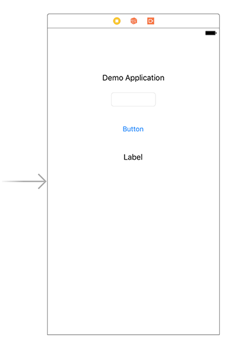
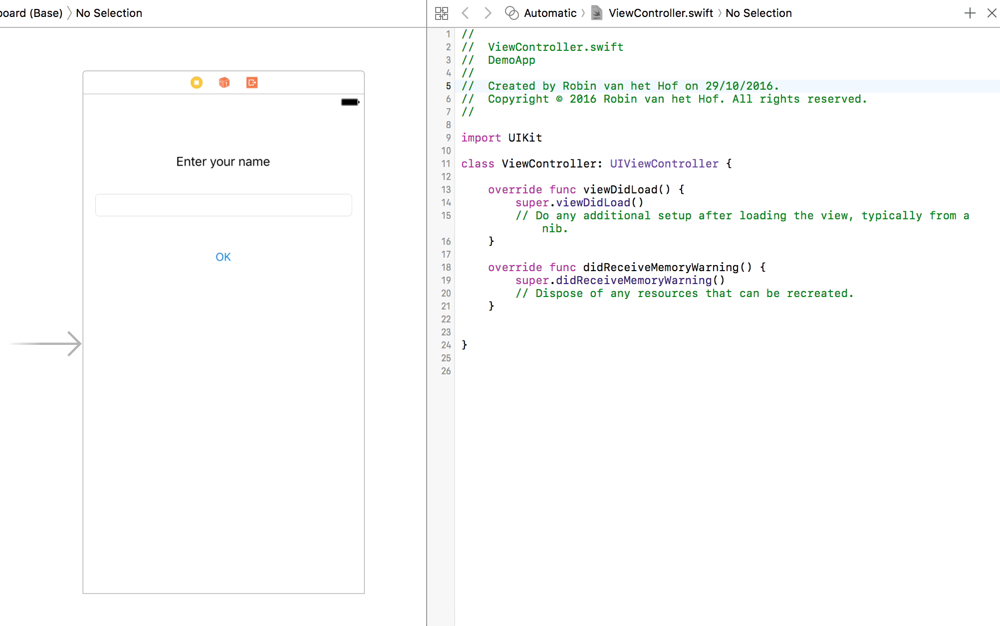
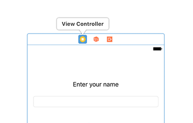
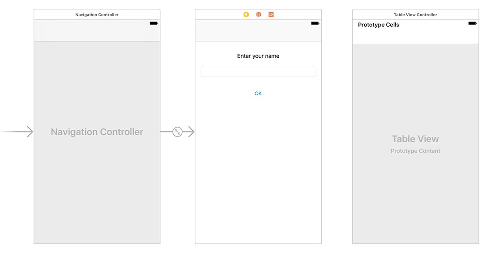
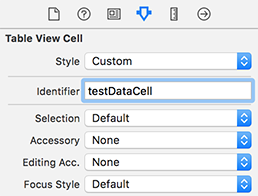
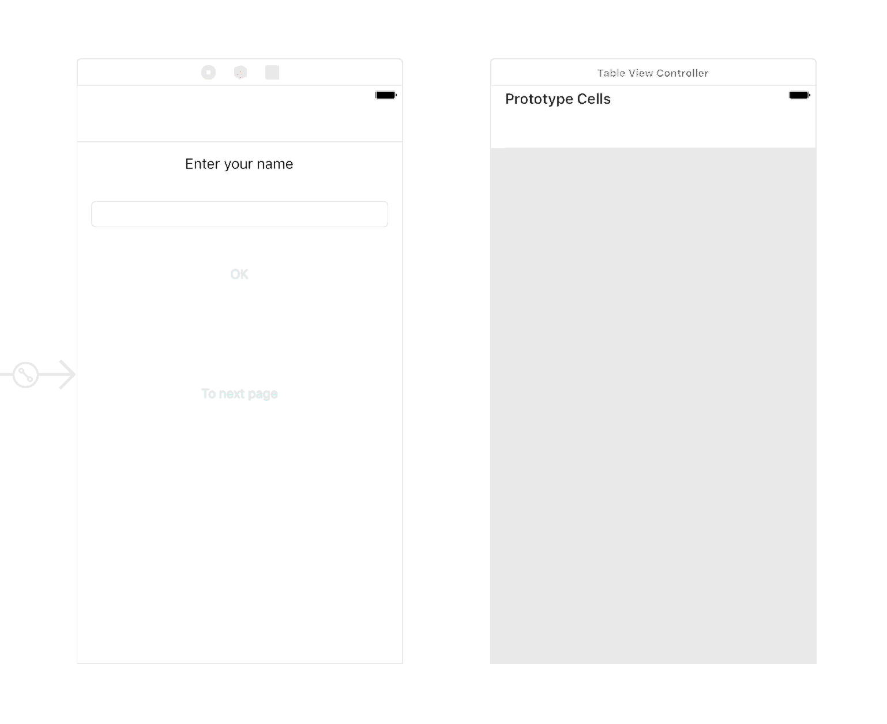
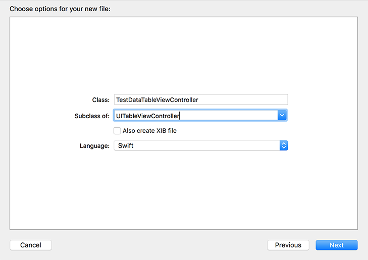
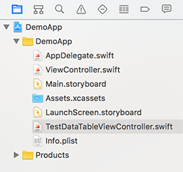

## Prerequisites  
 - **Proficiency:** Beginner
 - **Development machine:** Access to a Mac computer
 - **Tutorials:** [Introduction to iOS development resources and Xcode](http://www.sap.com/developer/tutorials/xcode-introduction.html)

## Next Steps
 - [Debug and deploy the iOS app to an iPad](http://www.sap.com/developer/tutorials/xcode-debug-deploy.html)

## Details
### You will learn  
In the previous tutorial, you have created a single view application. In this tutorial, you will create a second view, and learn how the concept of Storyboards helps in the development.  
You will also learn how to use actions and outlets, and tie them all together to create a basic application with navigation.

### Time to Complete
**10 Min**.

---

[ACCORDION-BEGIN [Step 1: ](Open the Storyboard)]

Have a look at the **Project Navigator** pane of the single-view application you have created in the previous tutorial. It should contain a Storyboard file called `Main.storyboard`.

> A **Storyboard** is the visual representation of an application's user interface, showing the various screens and how they interact together. Using Storyboards, you define the application's navigation and flow. A Storyboard consists of one or more **Scenes** (your application's views), and you can go from one Scene to another via **Segues** (transitions).

Single-click the file  `Main.storyboard`. The Storyboard opens in a visual editor (sometimes referred to as **Interface Builder**). Your Storyboard should look like this:


[DONE]
[ACCORDION-END]

[ACCORDION-BEGIN [Step 2: ](Add more controls)]

In the previous tutorial, you added a **Label** to the view with text `Demo Application`.  Using that same procedure, add a:

  - **Text Field**
  - **Button**
  - **Label**
  - Another **Button**

Your view should now look like this:



[DONE]
[ACCORDION-END]

[ACCORDION-BEGIN [Step 3: ](Modify top-most Label control)]

Select the top-most **Label** control.

In the **Attributes Inspector** in the right pane, change the value of the **Text** property from `Demo Application` to **`Enter your name`** and press **Return**.

As you see, the label is a bit too small to display the new text, and needs to be resized. Select the **Label** control in your view, and resize the control using the resize handlers until the complete text is shown. Use the dashed blue grid lines to align the control to the view's horizontal center.

[DONE]
[ACCORDION-END]

[ACCORDION-BEGIN [Step 4: ](Modify remaining controls)]

Select the **Text Field** control, and resize it so it aligns with both the left and right blue dashed grid lines, similar to the picture below:


Change the value of the **Button**'s **Text** property to `OK`.

Select the bottom-most **Label** and remove the value of its **Text** property so no text is shown, and resize it so it aligns with both the left and right blue dashed grid lines.

Your view should now resemble the following:


[DONE]
[ACCORDION-END]

[ACCORDION-BEGIN [Step 5: ](Create Outlet for Text Field)]

In this part of the tutorial, you connect the UI controls to the view's controller using **Outlets**. Outlets are references to UI controls in your storyboard from a Swift language source code file. A property for the control will be created in the view controller source code, so you can access and manipulate this control at runtime.

From the Storyboard, click the **Assistant Editor** button. This will open the view controller's source code.

To create an Outlet from the **Text Field** to the view controller, hold down the **Ctrl** key while dragging the text control to the view controller, just below the `class ViewController: UIViewController {` line. After dropping it at the correct position, in the dialog that appears, perform the following:

  - Set the **Name** field to `textField`.
  - Press **Connect** to finalize the changes:

 

[DONE]
[ACCORDION-END]

[ACCORDION-BEGIN [Step 6: ](Create Outlet for Label)]

Using the same procedure, do the same for the bottom-most **Label** control (the one which has no visible text) and drop it right under the just created Outlet for the **Text Field** control. Name the **Label**'s Outlet `amendedText`.

You should now have the following Outlet references added to your code:

```swift
@IBOutlet weak var textField: UITextField!
@IBOutlet weak var amendedText: UILabel!
```

> **Note: exclamation mark syntax**  
> You may have noticed the exclamation mark at the end of the 'optional variable' declarations. An optional variable means: it either _has_ a value, or none at all. It can freely change between having a value or not. An optional variable is suffixed with a **question mark**:  

> ```swift
> var optionalVar: String? = "Value is set"
> optionalVar = nil //made empty, does not contain any value anymore
> ```
> However, if you add an **exclamation mark**, it indicates the optional variable does not have a value _yet_, but will be set immediately. Also, once set, it will _always_ have a value (in your case, a label or text field).  

> ```swift
> var optionalVar: String!   // no value yet
> optionalVar = "Some value" // assigned a value
> print(optionalVar) // no need to check for nil
> ```
>
> The compiler therefore does not need to check and unwrap the variable every time it is being accessed.  
> An optional variable with an exclamation mark is also called an **Implicitly Unwrapped Optional**
>
> More information about the Swift language can be found at [https://developer.apple.com/swift/](https://developer.apple.com/swift/)

[DONE]
[ACCORDION-END]

[ACCORDION-BEGIN [Step 7: ](Create Action for Button)]

In your application, the user can perform various actions that trigger events. An **Action** (i.e. event handler) is linked to an event that is triggered from a control in your app. These events are handled in the application code.

You create an Action similar to creating an Outlet: by **Ctrl-dragging** from a control in your view to the view controller file.

To create an Action from the **Button** to the view controller, hold down the **Ctrl** key while dragging from the button to the view controller, this time just before the last closing bracket `}`. After dropping it at the correct position, in the dialog that appears, perform the following:

  - Set the **Connection** type to `Action`.
  - Set the **Name** field to `onOKButtonPress`.
  - Set the **Type** drop-down to `UIButton`.
  - Press **Connect** to finalize the changes:

  

[DONE]
[ACCORDION-END]

[ACCORDION-BEGIN [Step 8: ](Review code changes)]

You should now have the following action function added to your code:

```swift
@IBAction func onOKButtonPress(_ sender: UIButton) {
}
```

[DONE]
[ACCORDION-END]

[ACCORDION-BEGIN [Step 9: ](Implement Button's Action function)]

The Action is now registered, but doesn't do anything. To access any entered text in the **Text Field** control, manipulate it, and display it in the still empty **Label** control, you need to implement this logic. Change the Action function to the following:

```swift
@IBAction func onOKButtonPress(_ sender: UIButton) {
    amendedText.text = textField.text! + " has entered text"
}
```

[DONE]
[ACCORDION-END]

[ACCORDION-BEGIN [Step 10: ](Add second view)]

Before you can navigate to a second view, you need to add a **Navigation Controller**. A **Navigation Controller** manages **Segues** (transitions) from one **View Controller** to another.

  - From the **Scene Dock**, select the **View Controller**

  

  - With the **View Controller** selected, from the top-menu select **Editor &gt; Embed in &gt; Navigation Controller**
  - From the **Object Library** in the lower right, drag and drop a **Table View Controller** onto the Storyboard, next to the already existing **View Controller**. Your Storyboard should now resemble the following:

  

[DONE]
[ACCORDION-END]

[ACCORDION-BEGIN [Step 11: ](Add navigation Button)]

Add a new **Button** to the first view, and change its **Text** value to `To next page`

[DONE]
[ACCORDION-END]

[ACCORDION-BEGIN [Step 12: ](Add identifier to table cell)]

From the **Storyboard** hierarchy pane, select the **Table View Cell** control from the **Table View**:


From the **Attributes Inspector** in the right pane, set the **Table View Cell** property **Identifier** to `testDataCell`:



[DONE]
[ACCORDION-END]

[ACCORDION-BEGIN [Step 13: ](Add Segue to second view)]

In this part you create a **Segue** to the second view. The word 'Segue' is derived from the film and music world, and means a transition from one scene or part to the next one.

To create a Segue, **Ctrl-drag** the just created **Button** and drop it onto the **Table View Controller**. In the pop-up that displays, select **Action Segue &gt; Show**:



[DONE]
[ACCORDION-END]

[ACCORDION-BEGIN [Step 14: ](Create View Controller for second view)]

The second view does not yet have a View Controller class behind it. From the top menu, select **File &gt; New &gt; File...** and from the dialog, select **Cocoa Touch Class**. Click **Next**.

In the dialog that appears, enter the following:

  - Class : `TestData`
  - Subclass of : `UITableViewController`

       >Please note when you select `UITableViewController`, the name `TestData` you entered at **Class** will be changed to `TestDataTableViewController`:

       >

  - Click **Next** and **Create** to finish. Your project structure should now look like this:

  

[DONE]
[ACCORDION-END]

[ACCORDION-BEGIN [Step 15: ](Add static table data)]

Click on the `TestDataTableViewController.swift` file to open it in the editor.

Just below the `class TestDataTableViewController: UITableViewController {` line, add the following:

```swift
var testData = ["Rose", "Tulip", "Orchid"]
```

You have assigned an array of Strings to variable `testData`, which you will use later in this tutorial.

[DONE]
[ACCORDION-END]

[ACCORDION-BEGIN [Step 16: ](Modify function 'numberOfSections')]

Change function `numberOfSections(in:)` to return `1` instead of `0`:

```swift
override func numberOfSections(in tableView: UITableView) -> Int {
    return 1
}
```

[DONE]
[ACCORDION-END]

[ACCORDION-BEGIN [Step 17: ](Modify function 'tableView')]

Change the function `tableView(_:numberOfRowsInSection:)` to return the length of the test data array instead of `0`:

```swift
override func tableView(_ tableView: UITableView, numberOfRowsInSection section: Int) -> Int {
    return testData.count
}
```

[DONE]
[ACCORDION-END]

[ACCORDION-BEGIN [Step 18: ](Modify commented-out function 'tableView')]

Below the just edited function is a commented out function `tableView (_:cellForRowAt:)`. Uncomment this function and replace its implementation with the following:

```swift
override func tableView(_ tableView: UITableView, cellForRowAt indexPath: IndexPath) -> UITableViewCell {
    let cell = tableView.dequeueReusableCell(withIdentifier: "testDataCell", for: indexPath)

    cell.textLabel?.text = testData[indexPath.row]

    return cell
}
```

This will bind the reference to the current row's cell to variable `cell`, and sets the cell's `textLabel` property to the respective `testData` array item which matches that row. The identifier `testDataCell` is the same identifier you set for the prototype cell in the storyboard in **Step 12**.

> In **Step 6 - Create Outlet for Label** you briefly learned about the exclamation mark and question mark variable declaration.
> Here you see an example of the question mark syntax. In this case, the table cell may have a text label assigned, or not.
>
> More information about the Swift language can be found at [https://developer.apple.com/swift/](https://developer.apple.com/swift/)

[DONE]
[ACCORDION-END]

[ACCORDION-BEGIN [Step 19: ](Review TableView controller source)]

The complete `TestDataTableViewController.swift` code should now resemble the following:

```swift
import UIKit

class TestDataTableViewController: UITableViewController {

    var testData = ["Rose", "Tulip", "Orchid"]

    override func viewDidLoad() {
        super.viewDidLoad()
    }

    override func didReceiveMemoryWarning() {
        super.didReceiveMemoryWarning()
    }

    override func numberOfSections(in tableView: UITableView) -> Int {
        return 1
    }

    override func tableView(_ tableView: UITableView, numberOfRowsInSection section: Int) -> Int {
        return testData.count
    }

    override func tableView(_ tableView: UITableView, cellForRowAt indexPath: IndexPath) -> UITableViewCell {
        let cell = tableView.dequeueReusableCell(withIdentifier: "testDataCell", for: indexPath)

        cell.textLabel?.text = testData[indexPath.row]

        return cell
    }
}
```

[DONE]
[ACCORDION-END]

[ACCORDION-BEGIN [Step 20: ](Attach TableView controller source to view)]

Go back to the Storyboard, and from the **Navigator Pane**, select the **Table View Controller** object just below the **Table View Controller Scene** object.

In the right pane, switch to the **Identity Inspector** and from the **Custom Class** panel, and select `TestDataTableViewController` from the drop-down:


The table view is now assigned to the view controller.

[DONE]
[ACCORDION-END]

### Next Steps
 - [Debug and deploy the iOS app to an iPad](http://www.sap.com/developer/tutorials/xcode-debug-deploy.html)
