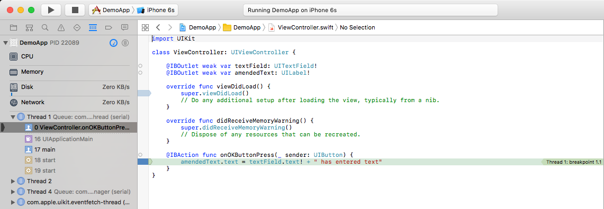
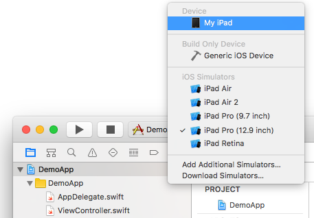
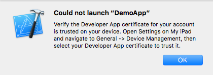
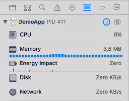

## Prerequisites  
- **Proficiency:** Beginner
- **Development machine:** Access to a Mac computer
- **Tutorials:** [Build your first Xcode & Swift App](http://go.sap.com/developer/tutorials/xcode-build-swift-app.html)

## Next Steps
- Select a tutorial from the [Tutorial Navigator](http://go.sap.com/developer/tutorial-navigator.html) or the [Tutorial Catalog](http://go.sap.com/developer/tutorials.html)

## Details
### You will learn  
How to debug your application and how to deploy your app to an iPad

### Time to Complete
**10 Min**.

---

[ACCORDION-BEGIN [Step 1: ](Introduction to debugging in Xcode)]

When the application is not doing exactly what you expect it to do, the need arises to examine portions of the application to be able to determine where the problem occurs. A breakpoint is usually very instrumental in this process. A breakpoint pauses an app during execution at a predetermined location, so that you can inspect the state of variables and the app’s control flow.

The illustration above shows the source editor, with the app paused by an enabled breakpoint. The green pointer and highlight in the source code indicates the location of the instruction pointer and the current line of code to be executed.

[DONE]
[ACCORDION-END]

[ACCORDION-BEGIN [Step 2: ](Set, remove, disable and enable a breakpoint)]

The easiest way to set a breakpoint is using the source code editor. To go to the source code editor, (single) click on `ViewController.swift` in the navigation tree. This will bring up the `ViewController` logic of your application. To set a breakpoint, click the gutter next to the line where you want execution to pause. When you add a breakpoint, Xcode automatically enables it. When an enabled breakpoint is encountered during execution, the app pauses and a green indicator shows the position of the program counter. You can create breakpoints at any time, including when your app is running in a debugging session. If a breakpoint is not in the ideal location, drag the indicator to a better location. To delete a breakpoint, drag the indicator out of the gutter.

Try to set the breakpoint on the same line as the illustration above by clicking in the gutter. Observe what happens to the breakpoint when you click it again. You disable a breakpoint in the source editor by clicking the breakpoint indicator, even while your app is running; this allows you to adjust set locations where the app will be paused as you work through a problem. Disabled breakpoints display a dimmed blue indicator. Enable the breakpoint by clicking the indicator again and make sure it is not dimmed anymore.

[DONE]
[ACCORDION-END]

[ACCORDION-BEGIN [Step 3: ](Start a debugging session)]

To start a debugging session, just press the „Build and Run“ button. This will launch the simulator again if you closed it, and will start your application in the simulator. The breakpoint you set is in the section of the code that is run when the "OK" button is pressed. Enter your name in the text field and press the "OK" button. Once the app execution reaches the breakpoint, Xcode will show the position of the program counter, allowing you to have a closer look at the state of variables.

> Note that when the debugger opens, the navigation pane will also change from the Project Navigator to the Debug Navigator.

Inspection of variables is made possible using the Variables View on the left side below the code editor. The Variables View lists each variable available in the context where the app is paused.

To see the value of `textField`, Ctrl-click the variable in the Variables View, and select **Print description of `textField`**. This will print the current state of the `textField` to the Console that is located on the right of the Variables View. In that view you should now see something similar to:

> `Printing description of self.textField: &lt;UITextField: 0x7fb76c407340; frame = (16 110; 343 30); text = 'John Doe'; clipsToBounds = YES; opaque = NO; autoresize = RM+BM; gestureRecognizers = &lt;NSArray: 0x608000242040&gt;; layer = &lt;CALayer: 0x608000225be0&gt;&gt;`

In the example above you can see that the current value of the text attribute is „John Doe“. The output you will see in the Console will include the text that you entered.

To resume execution of the application, press the **Continue/Pause** button in the debug bar:

[DONE]
[ACCORDION-END]

[ACCORDION-BEGIN [Step 4: ](End the debugging session)]

To stop the application, press the **Stop** button in the toolbar controls:

> Note: do not remove the breakpoint. You will be using it in the next steps.

[DONE]
[ACCORDION-END]

[ACCORDION-BEGIN [Step 5: ](Deploy the application to your iPad)]

With the iPad connected to your Mac, click on the **target device** on the left section of the top toolbar (this is currently set to the simulator device). You will notice that the device connected to your Mac will show in the top of the list:

Select your device so that its name appears in the toolbar. With your iPad selected, click on the **Build and Run** button to build and run the app.

When you launch your app for the first time, there is a good chance you will see this alert:

In this case, just follow the instructions of the message. Open the Settings app on the iPad, and navigate to **General \> Device Management**. From there, tap on the certificate associated to the team, and trust it by tapping the **Trust** button.

Once the application has just been trusted, it will not automatically be launched again. To launch it, just press the **Build and Run** button in Xcode again. You should now see your app appear on your iPad.

[DONE]
[ACCORDION-END]

[ACCORDION-BEGIN [Step 6: ](Inspect the debug gauges)]

When the app is running, you can see that Xcode has changed its appearance into debugging mode again. In the left pane, the Debug Navigator is active and debug gauges are shown.

Can you see how much memory your app is currently using?

[DONE]
[ACCORDION-END]

[ACCORDION-BEGIN [Step 7: ](Navigate the app to the breakpoint)]

While the app is running on the iPad, enter your name again and press the **OK** button. This should go to the same portion of the app’s logic as you debugged before.

When the app on the iPad encounters the breakpoint, you can see that Xcode highlights the line where the breakpoint was set and will show the Variables View. This means that Xcode does not only allow you to debug your apps in a simulator, but also on your device.

From the Variables View you will be able to have a closer look at your app's variables again. Can you find your name?

Congratulations, you have now deployed and debugged your self-built app to an iPad!

[DONE]
[ACCORDION-END]

### Next Steps
- Select a tutorial from the [Tutorial Navigator](http://go.sap.com/developer/tutorial-navigator.html) or the [Tutorial Catalog](http://go.sap.com/developer/tutorials.html)
