## Prerequisites  
 - **Proficiency:** Beginner | Intermediate | Advanced

## Details
### You will learn  
 - Create a Cloud Foundry space in the SAP Cloud Platform cockpit
 - Install the Cloud Foundry Command Line Interface (CLI) tools
 - Configure the CLI to log in to your SAP Cloud account

### Time to Complete
**15 Min**

---

> **IMPORTANT**: If you haven't yet set up an account in SAP Cloud Platform, that is the
> first thing you need to start this process.  Follow this link, then return to this tutorial.
>
> [Create a SAP Cloud Platform trial account](http://www.sap.com/developer/tutorials/hcp-create-trial-account.html)

[ACCORDION-BEGIN [Step 1: ](Log in to the SAP Cloud Platform)]

Start by [logging in to the SAP Cloud Platform](https://account.hanatrial.ondemand.com/).

[ACCORDION-END]

[ACCORDION-BEGIN [Step 2: ](Go to the HOME region)]

At the top of the page, click the word **Home** (next to the home icon).  This will take you to the HOME page, as seen below

[ACCORDION-END]

[ACCORDION-BEGIN [Step 3: ](Create a new CloudFoundry Trial)]

Click on the button **Start Cloud Foundry Trial**

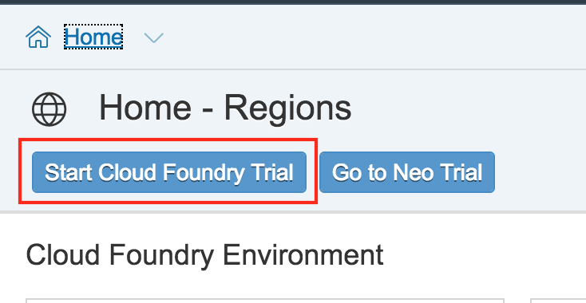

Approve the legal disclaimer:

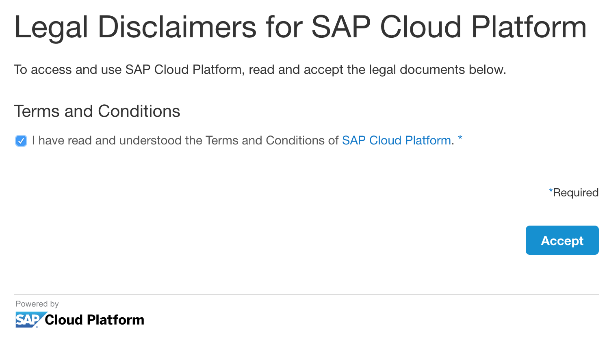

[ACCORDION-END]

[ACCORDION-BEGIN [Step 4: ](Choose the trial region)]

A dialog box will appear, asking where to create the account.

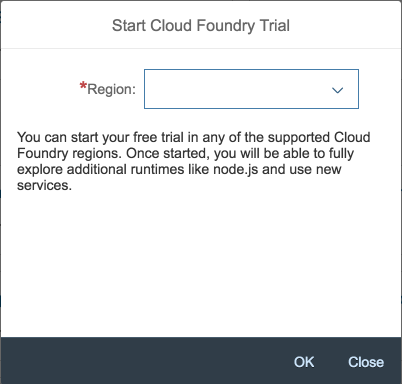

For this trial, create the account in the **US East (VA)** region.

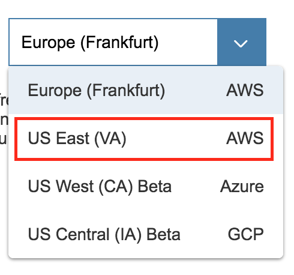

A dialog will appear, creating the new account.

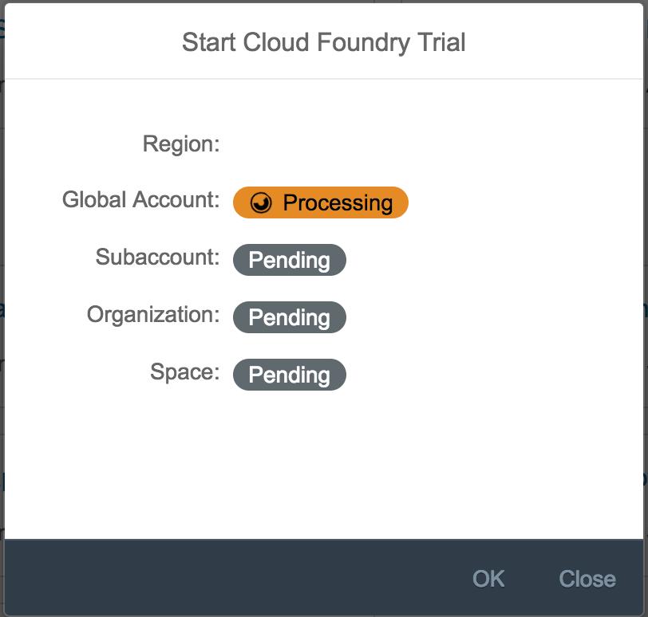

[ACCORDION-END]

[ACCORDION-BEGIN [Step 5: ](Download the files for the class)]

The files for these tutorials are stored on the `GitHub` website.  To download the files, go to your browser, open a new tab, and enter the following URL, or [click this link to download immediately](https://github.com/jonathanbaker7/xom-demos/archive/master.zip):

    https://github.com/jonathanbaker7/xom-demos/archive/master.zip

This will download a large ZIP file to your download directory.  

>  The file is about 62 MB in size, so it may take a while to download.

[ACCORDION-END]

[ACCORDION-BEGIN [Step 6: ](Extract the files to the desktop)]

Click on the file (in the Download bar) and it will open a Download directory.

Double click the `xom-demos-master` folder, and it will display the two project files for this project.

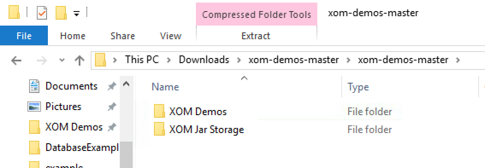

Drag these two folders to your desktop.  

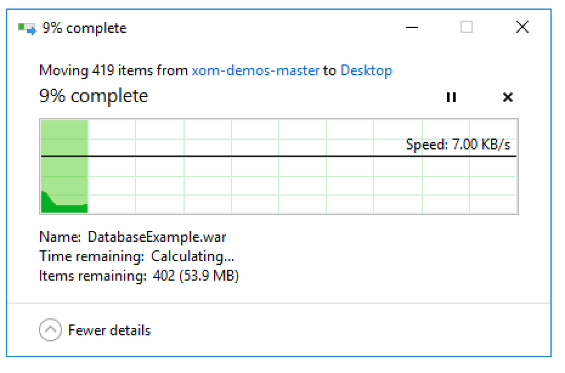

The folders should now appear on your desktop:

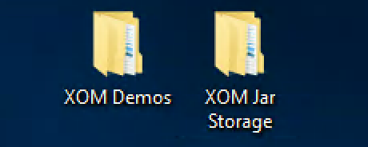

[ACCORDION-END]

[ACCORDION-BEGIN [Step 7: ](Set up the environment variables)]

In order to use the Cloud Foundry CLI inside the `ExxonMobil` network, several environment variables must be set.   These include the proxy server, the java home, and the path to run the `mvn` command.

To set the environment variables, type the following command in the Command Prompt, and press Enter.

    rundll32 sysdm.cpl,EditEnvironmentVariables

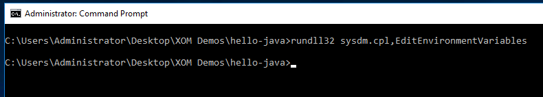

This will bring up the Environment Variables screen.  Click `New...` in the User variables section (the top one).  

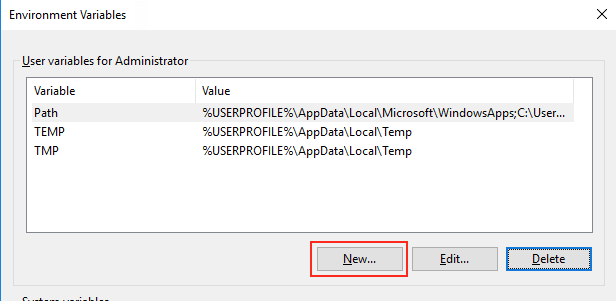

You should see a dialog box called `New User Variable`.  Enter the following information:

| Variable Name| Value |
| ------------ | ----- |
| HTTPS_PROXY  | DALPRX01.na.xom.com:8080 |

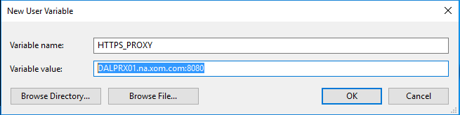

Finally, we will add to the existing PATH.  Choose the variable called PATH, and click the **Edit...** button.

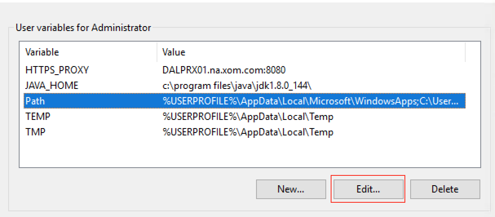

Now, click the **New** button.  It will ask for a new path variable:

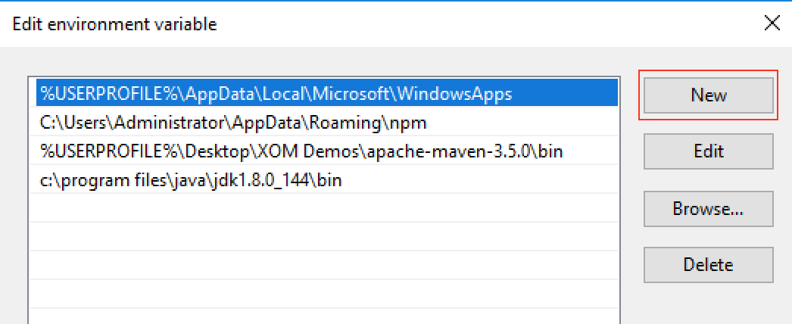

| Variable Name| Value |
| ------------ | ----- |
| Path | %USERPROFILE%\Desktop\XOM Demos\apache-maven-3.5.0\bin |

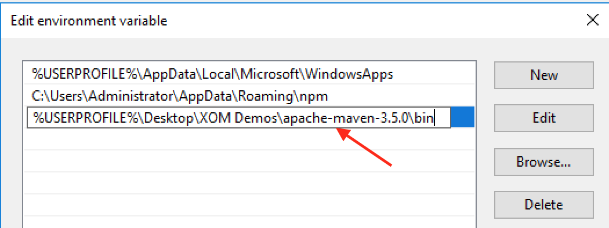

Click **OK** to exit this screen.  

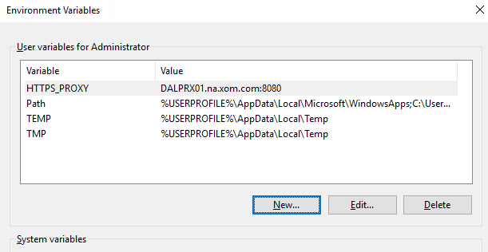

Now that you have set the environment variable, you must restart all command prompts.  Close your existing command prompt, and open a new one.  

To confirm that the proxy has been set correctly, type in the following command:

    echo %HTTPS_PROXY%

This should respond with the following prompt:

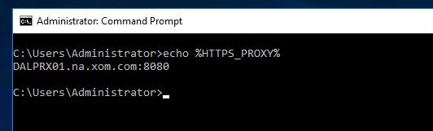

[ACCORDION-END]

[ACCORDION-BEGIN [Step 8: ](Connect the CLI to the cloud region)]

SAP Cloud Platform offers several Cloud Foundry server locations, or regions.

>  **Note:**  In the previous step, the trial was created in the *US East (VA)** region.  Each region has a unique URL.  The URL for this region is `https://api.cf.us10.hana.ondemand.com`

Next, open a command line prompt on your computer.  Click on the Windows icon, type `cmd`, then press Enter.  This will bring up a Command Prompt window.  

This Command Prompt will be used for all CloudFoundry CLI commands, so do not close it.

In the command prompt screen, type in the following:

    cf api https://api.cf.us10.hana.ondemand.com

[ACCORDION-END]

[ACCORDION-BEGIN [Step 9: ](Log in using the CLI)]

In the same command prompt type in the following command:

    cf login

When prompted, enter your username and password.  Once you are logged in, you should see your API endpoint, user, org, and space as shown in the screenshot.

> To find the email address on your account, open your browser and go to the [SAP Cloud Platform console](https://account.hanatrial.ondemand.com/cockpit).  In the upper right hand corner, click the person icon.  The *User Info* box should pop up, and display your email address.
>
> Do **not** use your S number, only use your email address.

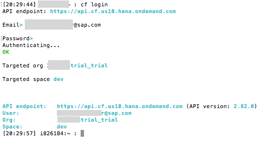

[ACCORDION-END]

---

## Next Steps
- [Tutorial #2 in the hands-on workshop](https://www-qa.sap.com/developer/tutorials/xom-cf-2.html)
