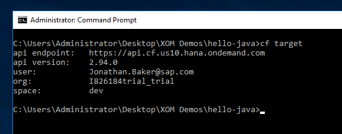
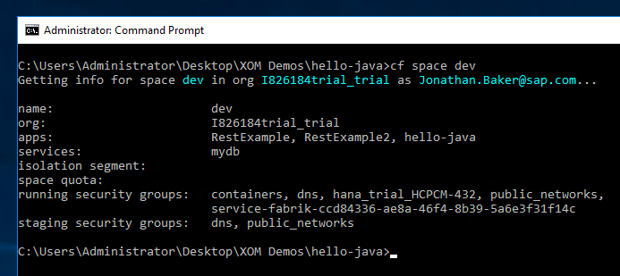
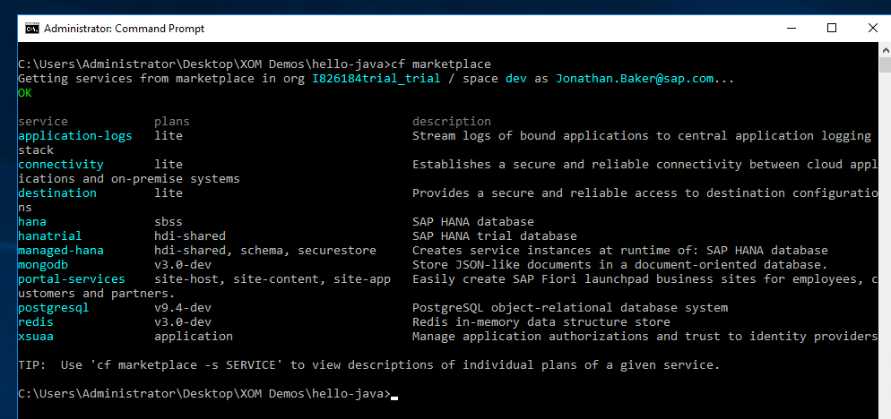
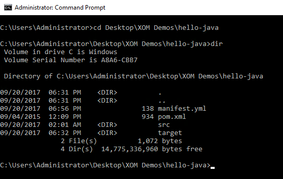
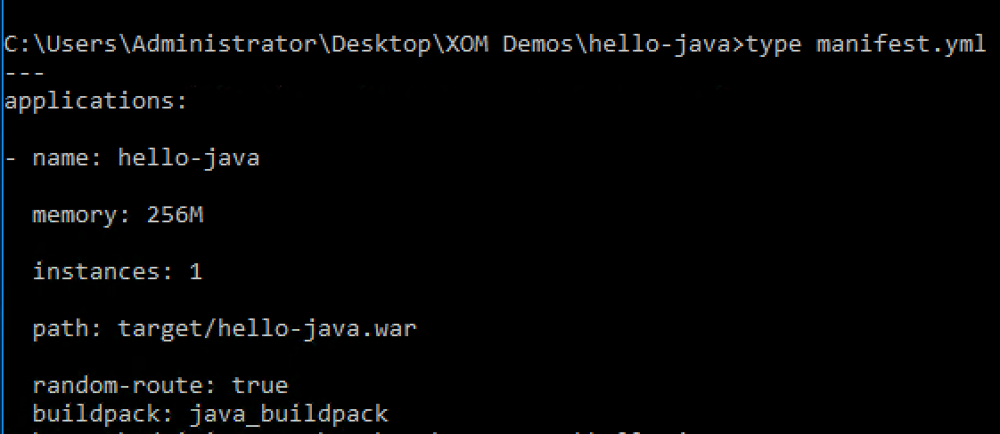
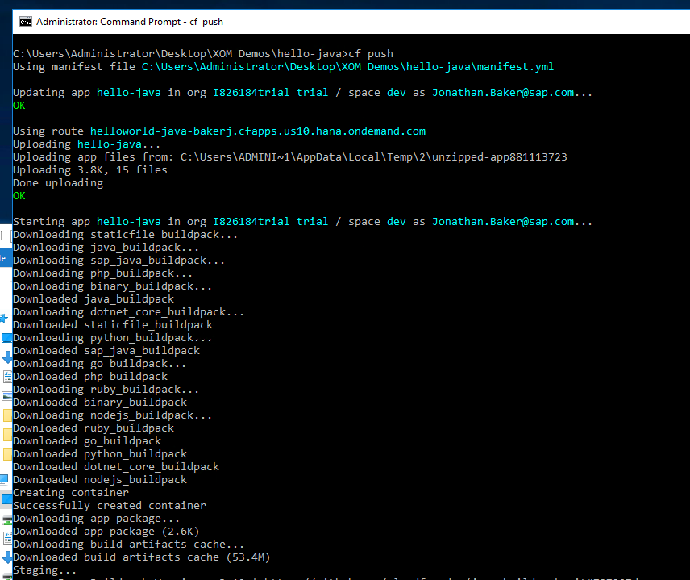
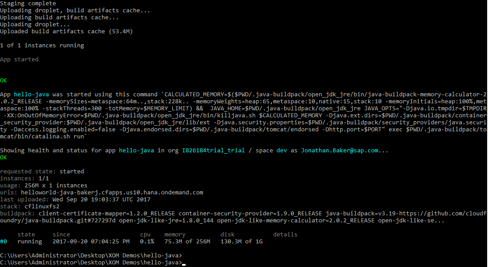
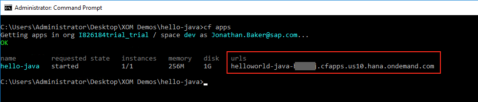
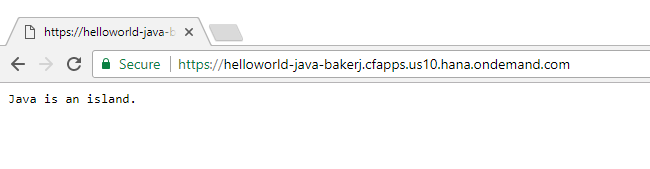

## Prerequisites  
 - **Proficiency:** Beginner

## Details
### You will learn  
In this section, we will cover:
- Getting information about the account, and listing different services
- Configure and deploying the first application

### Time to Complete
**15 Min**

---

[ACCORDION-BEGIN [Step 1: ](Get information about the current account)]

To see information about your current account, type in

    cf target

This will display information about your account, including the API connection, and details about your user, org, and space.

[ACCORDION-END]

[ACCORDION-BEGIN [Step 2: ](Information about the current space)]

To see a list of the applications and services in your current space, use this command:

    cf space dev

This will list the name of the space, it's organization, and the current applications in use.  It will also list the services that are attached to this space.

[ACCORDION-END]

[ACCORDION-BEGIN [Step 3: ](List services for the space)]

To see a list of the services that are available for your account, type in the command

    cf marketplace

This will list the sevices available to you.  

>  To get details on any specific service, type in `cf marketplace -s [SERVICE]` (where SERVICE is the name of the service).

[ACCORDION-END]

[ACCORDION-BEGIN [Step 4: ](Look at the manifest file)]

Each Cloud Foundry application uses a `manifest.yml` file to store all of the CloudFoundry settings.   Take a look at this file to see how it works.

Change to the correct working directory.  Type in

    cd Desktop\XOM Demos\hello-java
    dir

This will list the current directory, which should look like this:

List out your `mainfest.yml` file, by typing in the following command:

    type manifest.yml

This will display the settings.  The important settings are:
-  `name` - this is the name of the project
-  `memory` - the amount of RAM to allocate to the project
-  `instances` - how many copies will be started (for load balancing)
-  `path` - the path to the deployment file (in this case, a WAR file)
-  `buildpack` - the build pack we want to use.  If not included, the system will attempt to determine the build pack for you.
-  `random-route` - tells the server to create a random URL.  Used in the classroom, but normally turned to false.

[ACCORDION-END]

[ACCORDION-BEGIN [Step 5: ](Upload the application to Cloud Foundry)]

Next, send the compiled Java application to Cloud Foundry.  (The application is already compiled in your sample directory).  Use the `push` command to send the application:

    cf push

This will create a lot of output, but the end result should be the message `running`.

[ACCORDION-END]

[ACCORDION-BEGIN [Step 6: ](Test the new application using your browser)]

To test out the new application, first check the application status using Cloud Foundry.  Type in the following command:

    cf apps

In this listing, you will see a URL for the application.  Open the Chrome browser, and copy/paste this URL in to Chrome.  Hit `return` and the following window should appear:

[ACCORDION-END]

---

## Next Steps
- [Tutorial #3 in the hands-on workshop](https://www-qa.sap.com/developer/tutorials/xom-cf-3.html)
