## Prerequisites  
 - **Proficiency:** Beginner

## Details
### You will learn  
In this section, we will cover:
- Creating a new Java application
- Adding a REST micro-service to this application
- Deploying the application to Cloud Foundry, and test it

### Time to Complete
**20 Min**

---

[ACCORDION-BEGIN [Step 1: ](Open the empty project)]

Start by opening the `XOM Demos` folder in a windows file explorer.  Double-click on the folder `RestExample`.

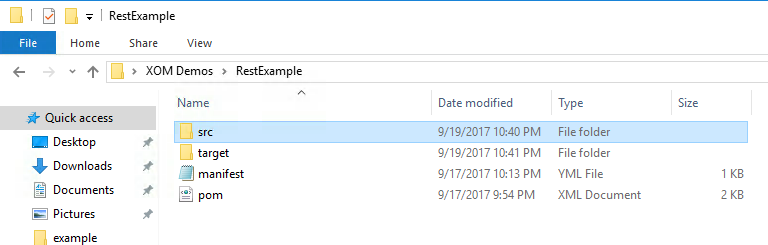


[ACCORDION-END]

[ACCORDION-BEGIN [Step 2: ](Open the empty Java file)]

Go back to the File Explorer, and open the folder `src`, then `main`, then `java`, then `org`, then `example`.

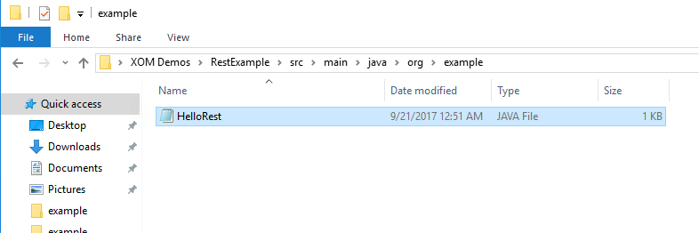

Double click on the file `HelloRest`.  Choose the program `Notepad` to open this file.

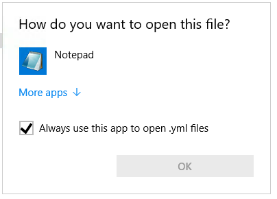

Inside you will see the empty Java code for the HelloRest class.

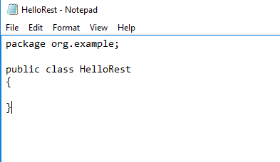

[ACCORDION-END]

[ACCORDION-BEGIN [Step 3: ](Add the first REST micro-service)]

Copy and paste the following code in to the Notepad.  **Replace all the existing code**.  Save and close Notepad when you are finished.

``` java
package org.example;

import javax.ws.rs.GET;
import javax.ws.rs.Path;
import javax.ws.rs.PathParam;
import javax.ws.rs.core.Response;

@Path("hello")
public class HelloRest  {

	@GET
	@Path("/repeat/{param}")
	public Response getMsg(@PathParam("param") String msg) {

		String output = "Jersey say : " + msg;

		return Response.status(200).entity(output).build();
	}

}
```

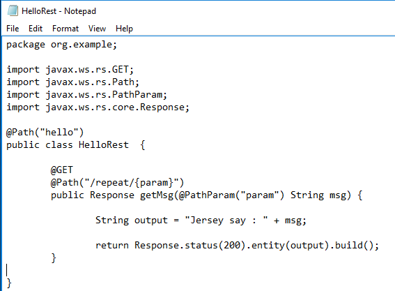

[ACCORDION-END]

[ACCORDION-BEGIN [Step 4: ](Compile your new code)]

Now, open up a Windows Command Prompt.  Change to the RestExample directory:

    cd Desktop\XOM Demos\RestExample

The directory should now be set on `RestExample` (not `hello-java`, which was the last exercise.)


Next, type in the maven package command:

   mvn package

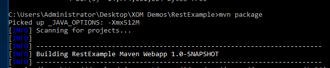

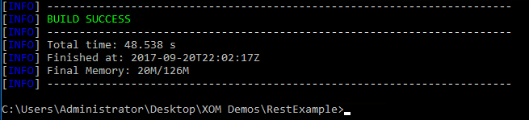

[ACCORDION-END]

[ACCORDION-BEGIN [Step 5: ](Deploy your new application to Cloud Foundry)]

Now that the package is complete, deploy it to Cloud Foundry.  This may take some time, but it will eventually come back with the message `success`.  Use the following command:

    cf push

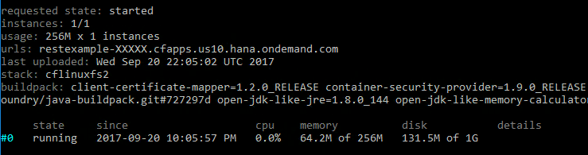

Now, take the URL in the success message, and copy it to your browser.  

> If you can't find the URL, use the command `cf apps` to get the URL

If you see the message `Hello World!` your application is running.  

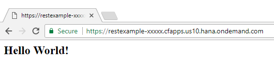

Next, we will try a REST url.  Add the following to the **end** of your existing URL:

    /rest/hello/repeat/say_hello_to_everyone

You should now see a different message:

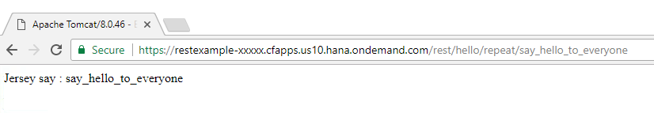

Feel free to change the last part of the URL (after the `/hello/` section).  The server will repeat back any text at the end of the URL.

[ACCORDION-END]


[ACCORDION-BEGIN [Step 6: ](Add a second REST method to the code)]

The first method is working, so now add a second method with a different URL.  This method will also respond to a GET request, but will look for an integer, and return the square of that integer (X ^ 2).

Return to the File Explorer window, and double-click on the `HelloRest` file.  


Now, add the following code to the file, between the last two curly-braces ( } ).  

```java
  @GET
  @Path("/square/{value}")
  public Response getSquare(@PathParam("value") Integer value ) {
  	if ( value == null ) value = 48;

  	double returnValue = Math.pow(value, 2);

  	return Response.status(200).entity("Square of " + value +
    " is : " + returnValue).build();
  }
```

> **Note** Don't worry if the formatting isn't perfect.  Java does not care about formatting.

Save and close the file.

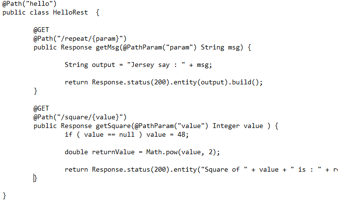

[ACCORDION-END]

[ACCORDION-BEGIN [Step 7: ](Deploy the new code)]

In your command prompt, type the following command:

    mvn package

The output should say `Compiling 1 source file`, which means it has detected the change.

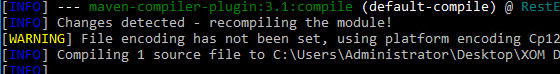

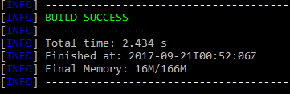

Now, push the code to Cloud Foundry.  Use this command:

    cf push

Wait for the cf command to return with a `OK` message, saying the application is running.

[ACCORDION-END]

[ACCORDION-BEGIN [Step 8: ](Test the new `square` method)]

Go back to the browser window.  Replace the URL section `/rest/hello/repeat/say_hello_to_everyone` with the following new URL section:

    /rest/hello/square/11

The browser should respond with `Square of 11 is: 121.0`.  Try different amounts as the last number, to see what different results can be obtained.

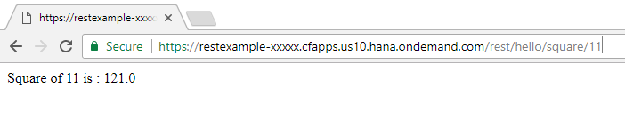

[ACCORDION-END]


---

## Next Steps
- [Tutorial #4 in the hands-on workshop](https://www.sap.com/developer/tutorials/xom-cf-4.html)
