## Prerequisites  
 - **Proficiency:** Beginner

## Details
### You will learn  
In this section, we will cover:
- Creating a new Java application
- Adding a REST micro-service to this application
- Deploying the application to Cloud Foundry, and test it

### Time to Complete
**20 Min**

---

[ACCORDION-BEGIN [Step 1: ](Open the empty project)]

Start by opening the `XOM Demos` folder in a windows file explorer.  Double-click on the folder `DatabaseExample`.

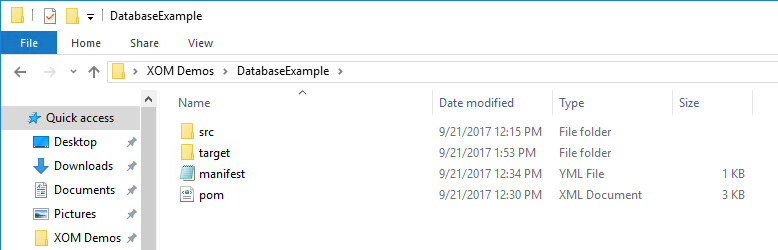

Next, go in to your Command Prompt.  Change back out of the RestExample directory, and then change in to the DatabaseExample directory, with these commands:

    cd ..
    cd DatabaseExample

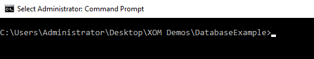


[ACCORDION-END]

[ACCORDION-BEGIN [Step 2: ](Compile and deploy the starting application)]

This tutorial starts off with the same code from the last tutorial.  That code is already in place in the `DatabaseExample` folder.  

To compile and package the code, use the `mvn` command:

    mvn package

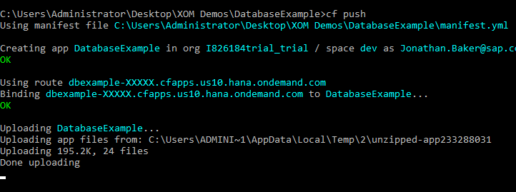

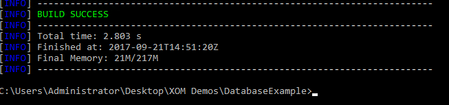

Next, create a new application in Cloud Foundry, using this new sample application.  Type the following command:

    cf push

This will push the new application to the server, creating a new space for it.

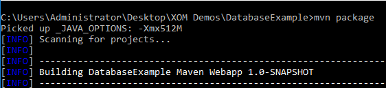

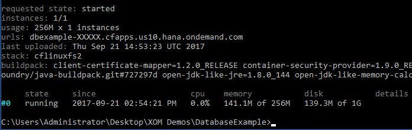

[ACCORDION-END]

[ACCORDION-BEGIN [Step 3: ](Verify the new application)]

To verify this new application, use this command

   cf apps

The `DatabaseExample` application should now be listed.

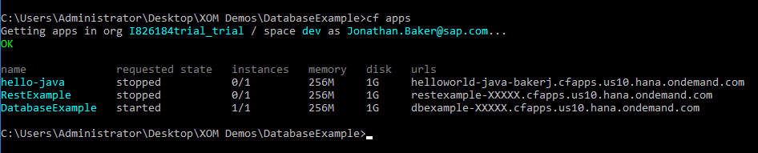

Copy the URL from the command prompt, and paste it in to your browser.  You should see this message:

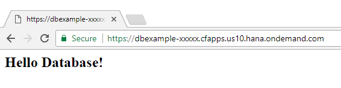

[ACCORDION-END]

[ACCORDION-BEGIN [Step 4: ](Start a Cloud Foundry log viewer)]

One valuable tool in Cloud Foundry is the log viewer.  The `cf logs` command will tail (or follow until stopped) the logs for any specific application.

In our next steps, the database tools will be writing to the log file.  To view this file, start a log viewer for the application in a new Command Prompt.

To open a second Command Prompt screen, right-click on the Command Prompt icon in the task bar, and choose `Command Prompt`.  A second command prompt window will open.

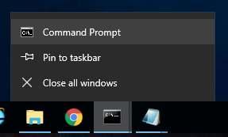

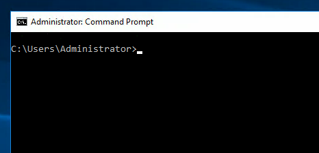

Now, type in the log command:

    cf logs DatabaseExample

The log screen will start.  Keep this window open for viewing during the next steps.

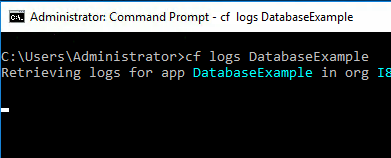

[ACCORDION-END]

[ACCORDION-BEGIN [Step 5: ](View the marketplace)]

The database is part of the Cloud Foundry **marketplace**.  The marketplace is a collection of services available to your applications.  Marketplace services can be provided by SAP, or by the company or department.  

To view the available marketplace services, go to the Command Prompt and type in this command:

    cf marketplace

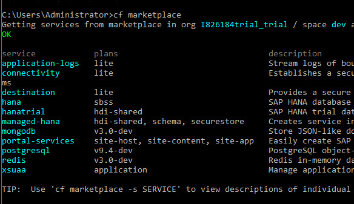

We will be using the `postgresql` service.  To get more information about this service, type in this command:

    cf marketplace -s postgresql

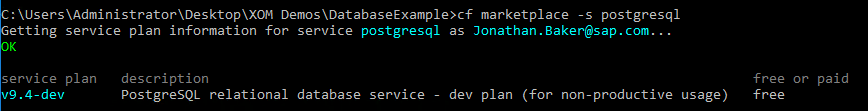


[ACCORDION-END]

[ACCORDION-BEGIN [Step 6: ](Add a database service to your account)]

In order to use the service, it must be added to your Cloud Foundry system.  

Go back to the first Command Prompt window (not the one viewing the logs).  

To add the database, type in this command:

    cf create-service postgresql v9.4-dev mydb

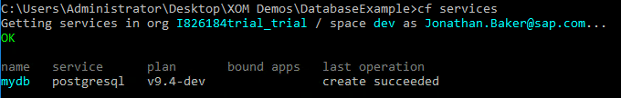

To verify the service is now created, use this command:

    cf services

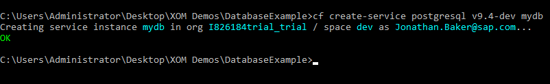

[ACCORDION-END]

[ACCORDION-BEGIN [Step 7: ](Attach the service to your application)]

After the service has been added to your account, it must be attached to the applications where it is used.  Your account should have 3 applications at this time.  To view them, type in this command:

    cf apps


Now, bind the database service to the application, using this command:

    cf bind-service DatabaseExample mydb

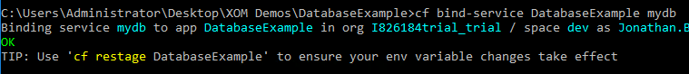

To verify the service has been bound correctly, use the `service` command:

    cf service mydb

In the listing, the line `Bound apps: DatabaseExample` should now appear.

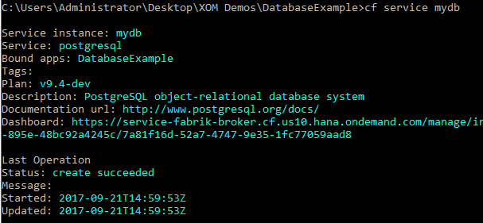

[ACCORDION-END]

[ACCORDION-BEGIN [Step 8: ](Initialize the database in the java code)]

Go to the file explorer, and open the directory `src > main > java > org > example`.


Double click on the file `HelloData` to open it in Notepad.

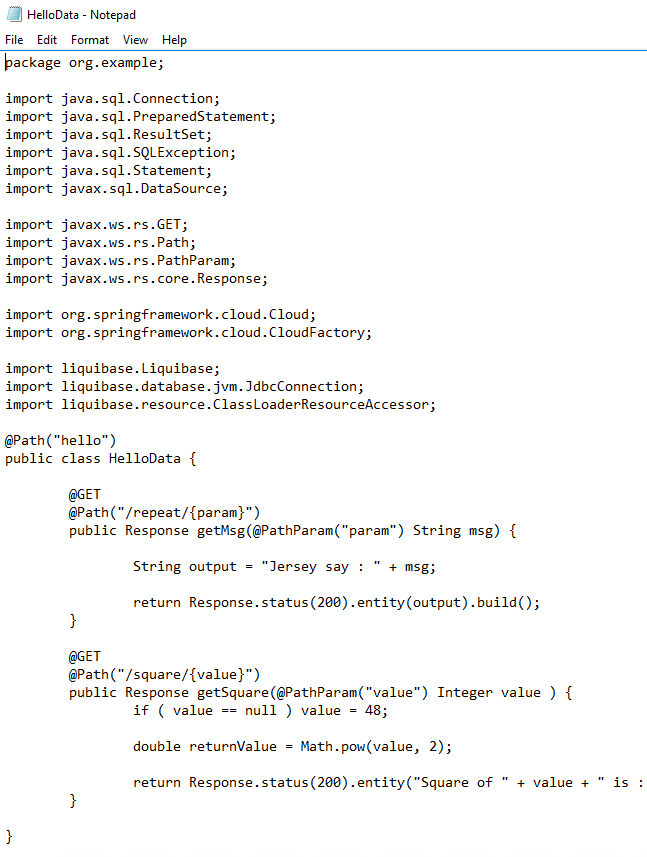

Add the following code to the top of the file, between the lines `public class HelloData {` and `@GET`:

```java
  private static final Cloud cloud = new CloudFactory().getCloud();

	/**
	 * Default initialization. This allows us to set up the database - once -
	 * using Liquibase
	 */
	static {
		try {
			DataSource dataSource = cloud.getServiceConnector("mydb",
        DataSource.class, null);
			Connection connection = dataSource.getConnection();
			JdbcConnection liquibaseConnection =
        new JdbcConnection(connection);
			Liquibase liquibase = new Liquibase("/db.changelog.xml",
        new ClassLoaderResourceAccessor(),
				liquibaseConnection);
			liquibase.update("");
		} catch ( Exception ex ) {
			throw new RuntimeException( ex );
		}
	}

```

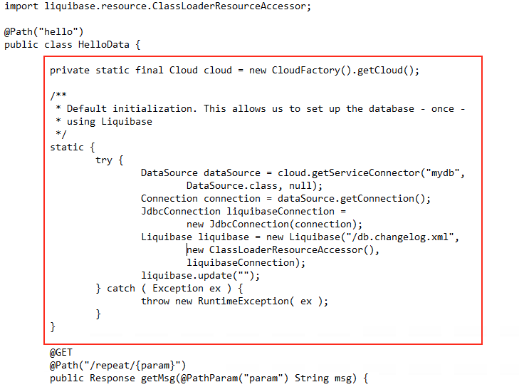

Save the file.  Do not close it.  More modifications are coming in the next few steps.

Go to the Command Prompt, and type in the following 2 commands:

    mvn package
    cf push

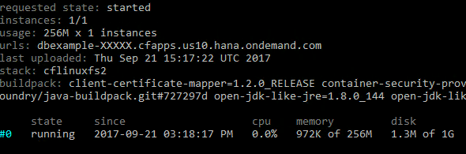

[ACCORDION-END]

[ACCORDION-BEGIN [Step 9: ](Use the log to view the database changes)]

The database initialization will occur when the application is run the first time.

To watch this happen, bring back your Command Prompt window with the log.  That window should show many lines of new output, as the application was deployed to the cloud.

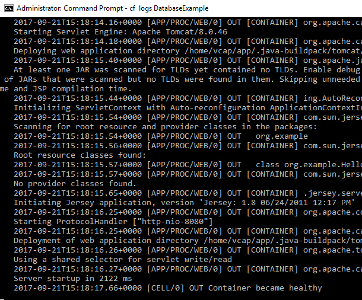

Start the application by going back to the browser window, and add the following to the **end** of the URL:

    /rest/hello/repeat/hello_database

The browser output should look like this:


The log file will also be updated.  It will show the database being set up.  Look for the following lines (they can be difficult to read, as they are in red):

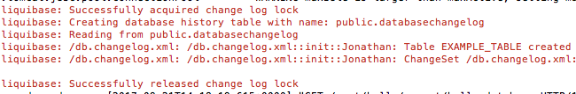

[ACCORDION-END]

[ACCORDION-BEGIN [Step 10: ](Add Java to use persistence)]

Now that the database has been configured, the next step is to add Java code to use it.  

Open your Notepad window with the Java code from `HelloData`.  Scroll down to the bottom, and add this code between the last two curly-braces (`}`):

```java
  @GET
  @Path("/dbread")
  public Response databaseRead() throws SQLException {
    return databaseRead(1);
  }

  @GET
  @Path("/dbread/{key}")
  public Response databaseRead(@PathParam("key") Integer key)
    throws SQLException {

      if (key == null) key = 1;

      DataSource ds = cloud.getServiceConnector("mydb", DataSource.class, null);

      Connection conn = ds.getConnection();
      try {
        PreparedStatement ps =
        conn.prepareStatement("select USECOUNT from EXAMPLE_TABLE where ID = ?");
        try {
          ps.setInt(1, key);
          ResultSet rs = ps.executeQuery();
          try {
            if (rs.next())
            return Response.status(200)
              .entity("Current example table data is (key " +
                key + "): " + rs.getInt(1)).build();
          } finally {
            rs.close();
          }
        } finally {
          ps.close();
        }
      } finally {
        conn.close();
      }

    return Response.status(200).entity("No row found").build();
  }

  @GET
  @Path("/dbwrite/{key}")
  public Response databaseWrite(@PathParam("key") Integer key)
    throws SQLException {

    if (key == null)
      key = 1;

    DataSource ds = cloud.getServiceConnector("mydb", DataSource.class, null);

    Connection conn = ds.getConnection();
    try {
      Statement stmt = conn.createStatement();
      try {
        int rows = conn.createStatement()
          .executeUpdate("update EXAMPLE_TABLE set USECOUNT = USECOUNT + 1 "
            + "where ID = " + key);
        if (rows != 1) {
          stmt.executeUpdate("insert into EXAMPLE_TABLE(ID, USECOUNT) "
            + "values ( " + key + " , 1 )");
        }

        return databaseRead(key);
      } finally {
        stmt.close();
      }
    } finally {
      conn.close();
    }

  }

  @GET
	@Path("/dbreset/{key}")
	public Response databaseReset(@PathParam("key") Integer key) throws SQLException {
		if (key == null)
			key = 1;

		DataSource ds = cloud.getServiceConnector("mydb", DataSource.class, null);

		Connection conn = ds.getConnection();
		try {
			Statement stmt = conn.createStatement();
			try {
				int rows = conn.createStatement()
						.executeUpdate("update EXAMPLE_TABLE set USECOUNT = 0 where ID = "
              + key);
				if (rows != 1) {
					stmt.executeUpdate("insert into EXAMPLE_TABLE(ID, USECOUNT) values ( "
            + key + " , 1 )");
				}

				return databaseRead(key);
			} finally {
				stmt.close();
			}
		} finally {
			conn.close();
		}
	}
```

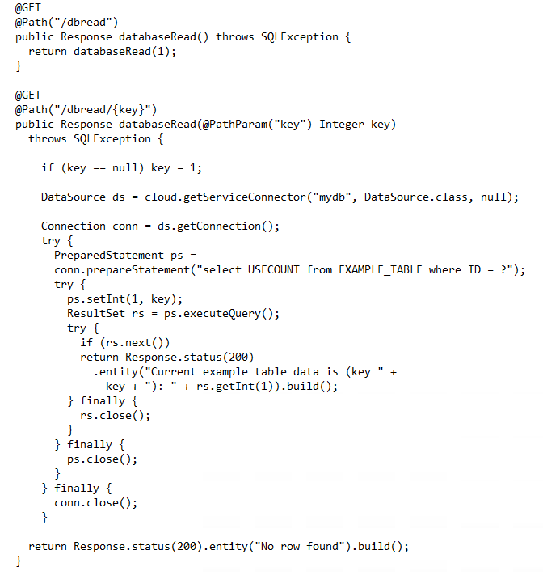

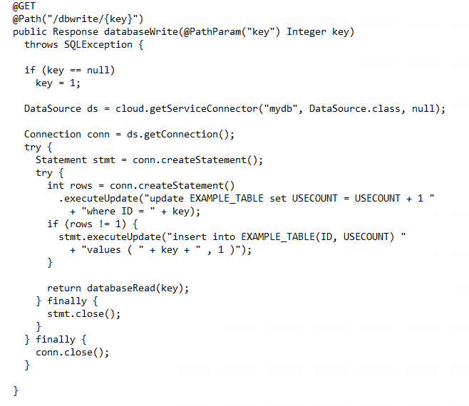

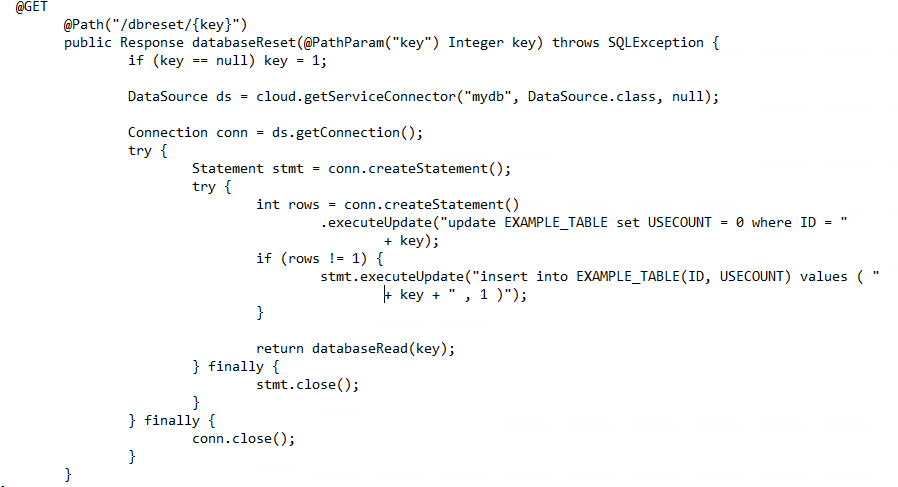


** Don't forget to save the file!**

[ACCORDION-END]

[ACCORDION-BEGIN [Step 11: ](Deploy the code and test in a browser)]

To deploy the new code, go to the Command Prompt and run the following commands:

     mvn package
     cf push

Look for a line that says `Compiling 1 source file`.  This means the file was changed correctly.

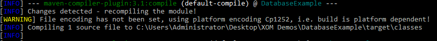

Now, switch to the browser.  Change the URL so the end path looks like this:

    /rest/hello/dbread/1

The output will say `No row found`.  That's correct, we haven't written anything yet!

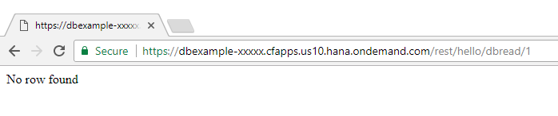

So, let's write something to the database.  Change the URL to end with this:

    /rest/hello/dbwrite/1

The output should now say `Current example table data (key 1): 1`

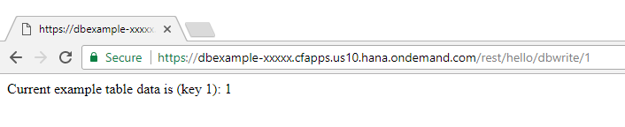

Try refreshing this URL several times.  It will increment the counter each time.  

You can also change the number at the end of the URL, and a new counter will be started.  Switching back to the number `1` will go back to the old counter, at it's old position.

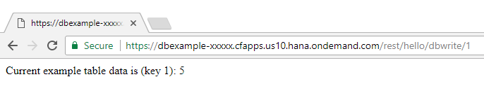

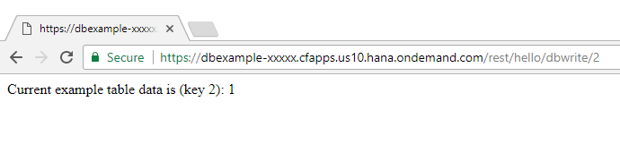

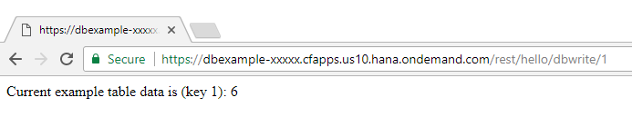

[ACCORDION-END]


---

## Next Steps
- [Tutorial #5 in the hands-on workshop](https://www.sap.com/developer/tutorials/xom-cf-5.html)
