## Prerequisites  
 - **Proficiency:** Beginner

## Details
### You will learn  
In this section, we will
- Configure and publish a JavaScript application to Cloud Foundry
- Update the database binding to include the JavaScript project
- Show how the JavaScript project is updated dynamically
- View the `postgresql` service dashboard

### Time to Complete
**10 Min**

---

[ACCORDION-BEGIN [Step 1: ](Open the JavaScript folder)]

Start by opening the `XOM Demos` folder in a windows file explorer.  Double-click on the folder `nodejs`.

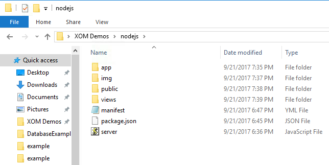

Next, go in to your Command Prompt.  Change back out of the RestExample directory, and then change in to the DatabaseExample directory, with these commands:

    cd ..
    cd nodejs

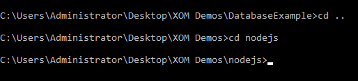

[ACCORDION-END]

[ACCORDION-BEGIN [Step 2: ](Deploy the starting application)]

This tutorial uses a sample JavaScript application, which is duplicated directly from the [CloudFoundry GitHub website](https://github.com/cloudfoundry-samples/cf-sample-app-nodejs).  
This application is ready to publish, and does not need to be modified to make it work.  

To publish this code in to a new application in Cloud Foundry, go to the Command Prompt and type the following command:

    cf push

This will push the new application to the server, creating a new space for it.

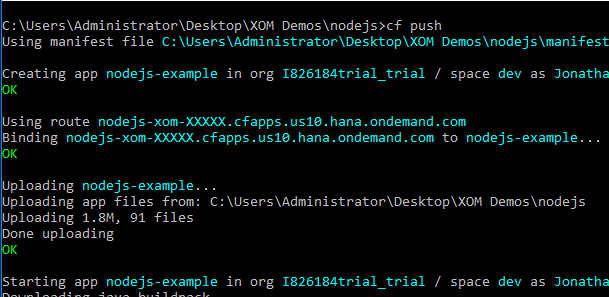

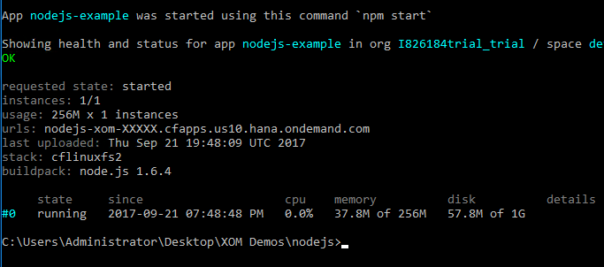

[ACCORDION-END]

[ACCORDION-BEGIN [Step 3: ](Verify the new application)]

To verify this new application, use this command

    cf app nodejs-example

The `nodejs-example` application details should now be listed.

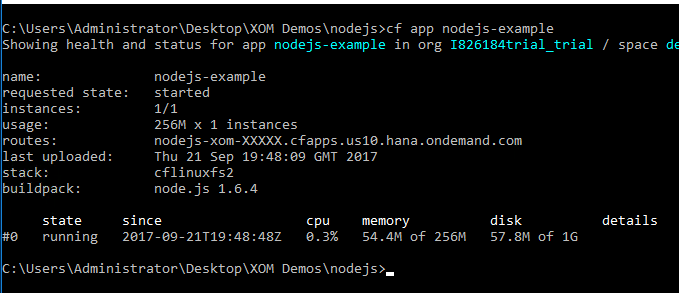

Copy the URL from the command prompt, and paste it in to your browser.  The following web page will appear, with details about this application.

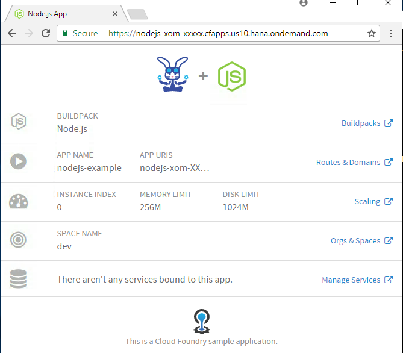

[ACCORDION-END]

[ACCORDION-BEGIN [Step 4: ](Attach a database to this new application)]

Now, attach the existing database service (that we used in the Java segment) to this account.  

First, list the existing services, by typing in this command:

    cf services

Check to make sure the `mydb` service is still listed.

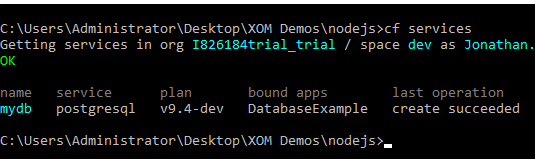

Now, bind the database service to the application, using this command:

    cf bind-service nodejs-example mydb

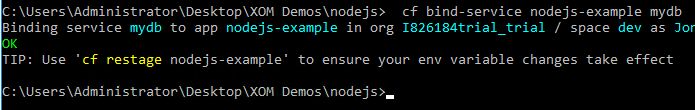

To verify the service has been bound correctly, use the `service` command:

    cf service mydb

In the listing, the line `Bound apps: nodejs-example, DatabaseExample` should now appear.

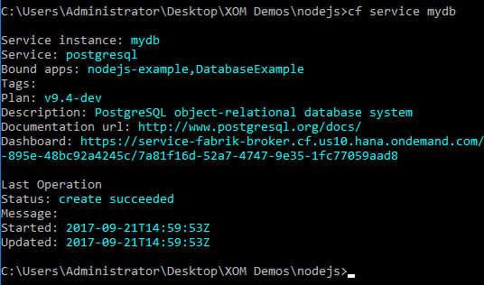

[ACCORDION-END]

[ACCORDION-BEGIN [Step 5: ](Refresh the application and test for database connectivity)]

In order to tell the existing application that new services have been attached, the application must be `restaged`.  

Type the following command in to the command prompt:

    cf restage nodejs-example

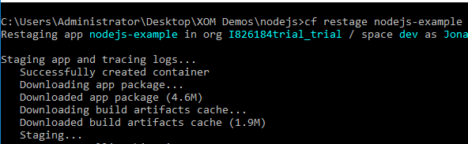

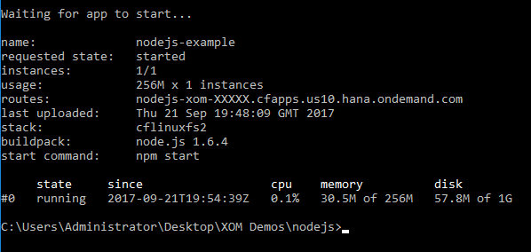

When the command has finished running, go back to the browser and refresh the page.  The page should now show a service attached to this application:

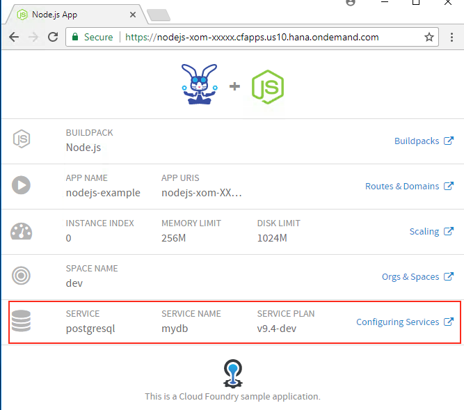

[ACCORDION-END]

[ACCORDION-BEGIN [Step 6: ](View the status of the database service)]

Finally, the database service also has a web page with it's own status information.  This is called the dashboard.

To find the dashboard for your service, go to the Command Prompt and type the following:

    cf service mydb

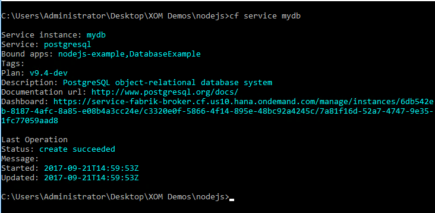

Note the highlighted URL.  Copy and paste this URL in to a new browser tab.

First, you will be asked to log in.  Use your account email address and password (the same one you used to login to the Cloud Foundry cli):

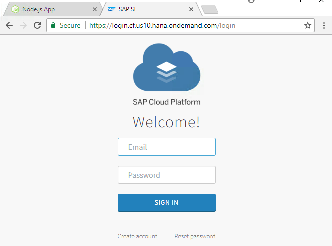

You should see the following screen appear:

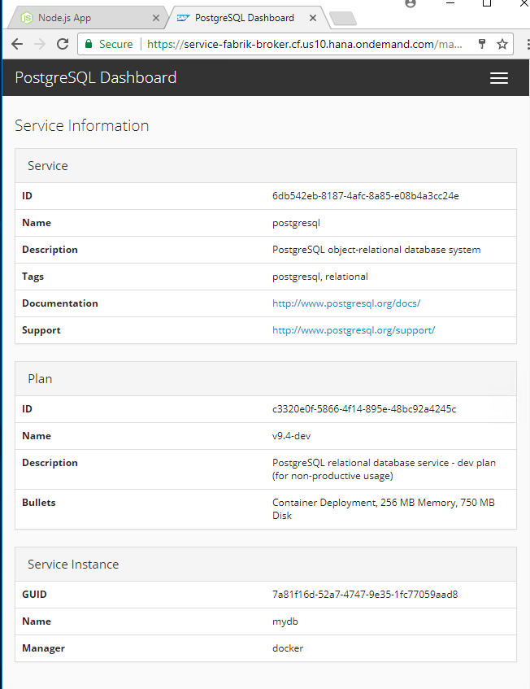

[ACCORDION-END]

---

## Next Steps
- [Tutorial #6 in the hands-on workshop](https://www-qa.sap.com/developer/tutorials/xom-cf-6.html)
