## Prerequisites  
 - **Proficiency:** Beginner

## Details
### You will learn  
In this section, we will
-  Explore the marketplace
-  Bind a service to your space and application
-  Work with the log service web front end
-  Create and consume logs from inside an application

### Time to Complete
**10 Min**

---

[ACCORDION-BEGIN [Step 1: ](List the service details)]

In a previous tutorial, the list of marketplace services was listed to show what was available.  List the services again, to find the log service.  Go to a command prompt, and type the following command:

    cf marketplace

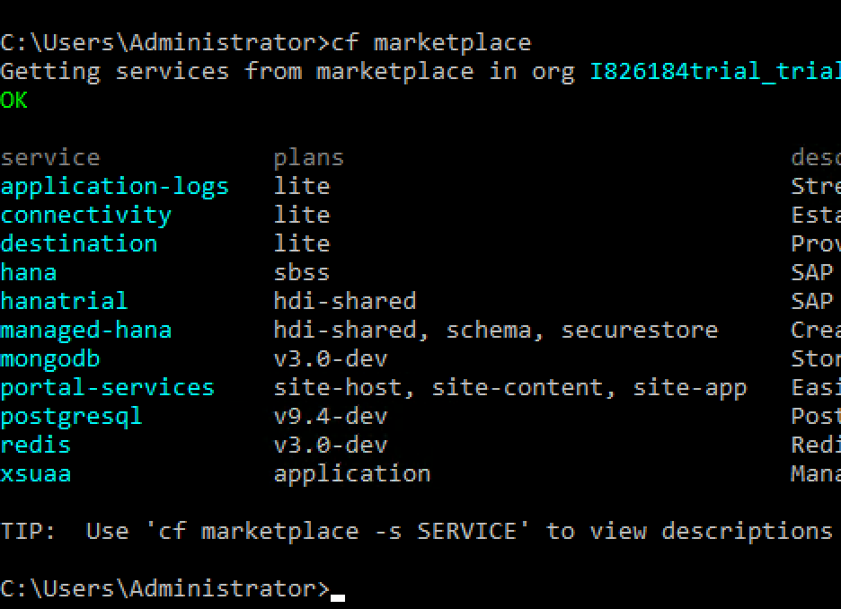

For this first step, the focus is on the application logging service.  Retrieve the details on the service by typing in this command:

    cf marketplace -s application-logs

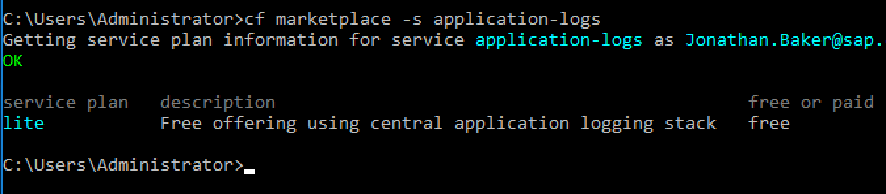

[ACCORDION-END]

[ACCORDION-BEGIN [Step 2: ](Set up and bind the service to the Database application)]

To use a service, first it must be *created* on your account.  This creates a local copy of the service for your account to use.  To bind the service, use the `create-service` command, and give the service a local name:

    cf create-service application-logs lite my-logs

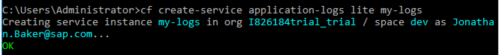

In order to use the log service with an application, the service must be *bound* to the application.  Binding attaches your local copy to a specific application.  To do this, use the `bind-service` command:

    cf bind-service DatabaseExample my-logs

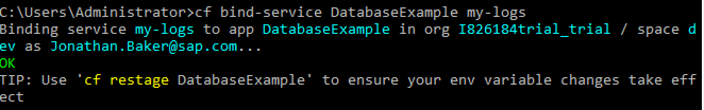

[ACCORDION-END]

[ACCORDION-BEGIN [Step 3: ](Restage the application)]

To test the logging service against the database application, first the application must be refreshed.  In Cloud Foundry parlance, this is called `restaging`.  This is a lot like rebooting the application, as it will lose all local memory.

    cf restage DatabaseExample

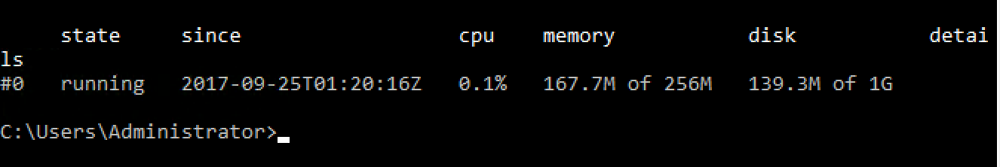

[ACCORDION-END]

[ACCORDION-BEGIN [Step 4: ](Log service web front end)]

Now, let's take a look at the web front end for the logging platform.   To access the log front end, use the same URL design that was used to access the Database web information screen.  The URL format is:  `logs.cf.[server endpoint]`.

Go to the browser, and use the following URL:

    https://logs.cf.us10.hana.ondemand.com/

The server will ask you to log in.

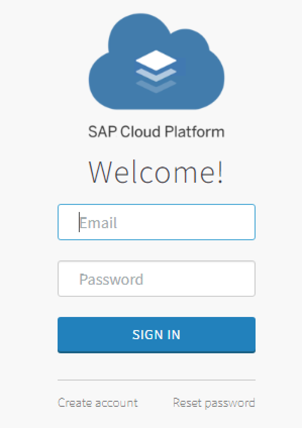

Then, the server will display the `Kibana` log analysis web page:

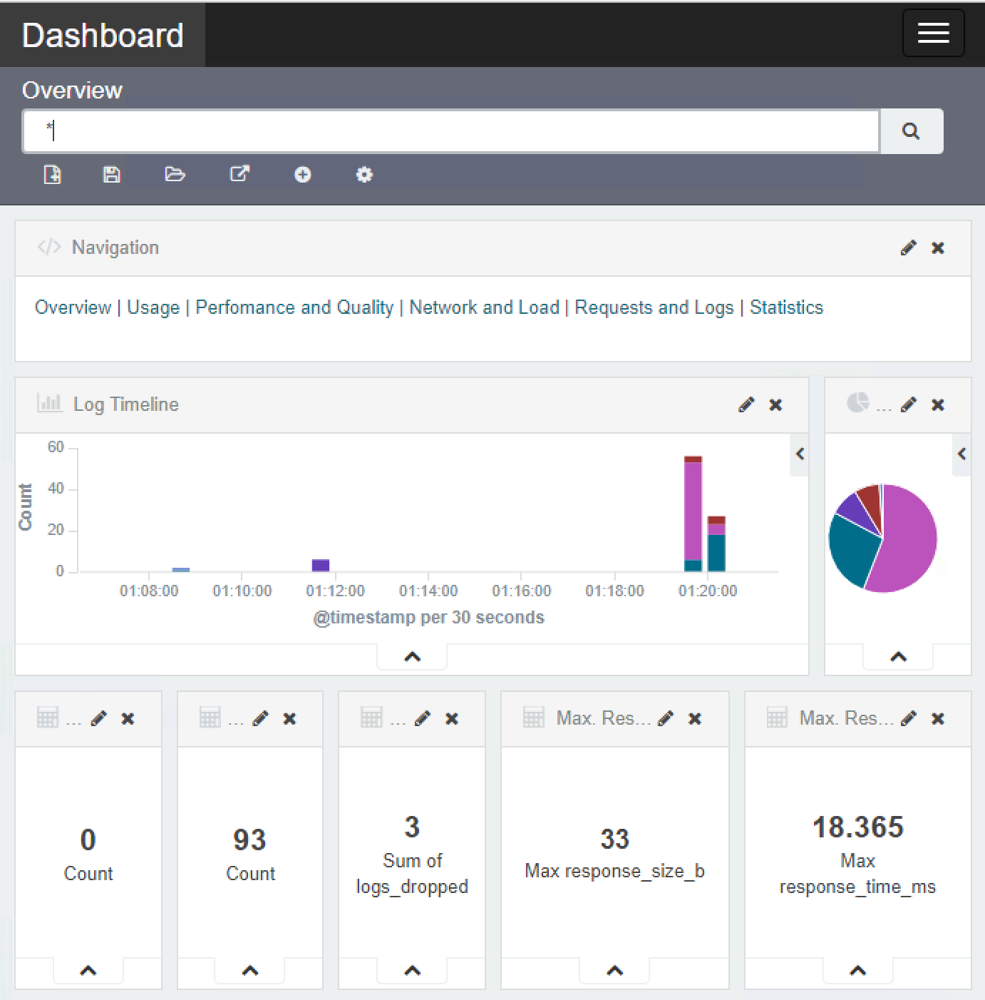

[ACCORDION-END]

[ACCORDION-BEGIN [Step 5: ](View and filter the logs)]

The dashboard (or overview) screen will display information about the Log Timeline, and other details about logging.  To view the details about logs, click on the **Discover** link on the top of the page.

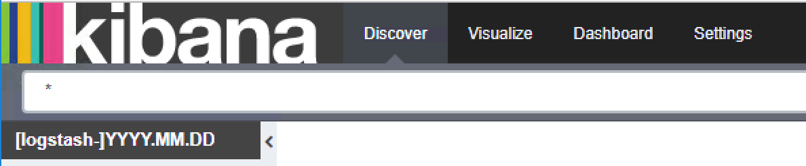

In the selected fields section, the log can be sorted and grouped according to a number of fields.  Scroll down and hover the mouse over the label `msg`, then click the **add** button.  The view will change to a timeline view, based on the log entry date:

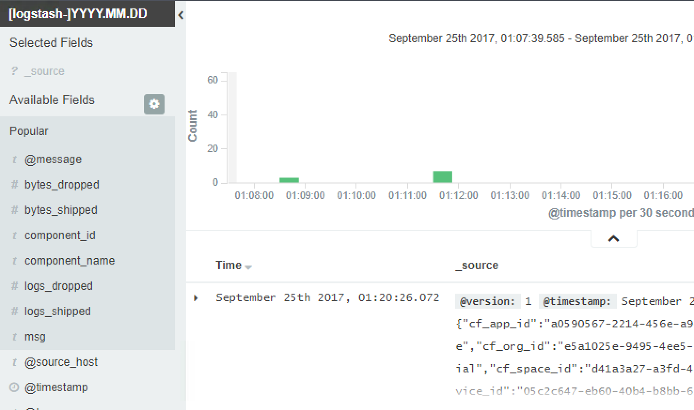

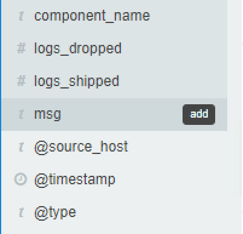

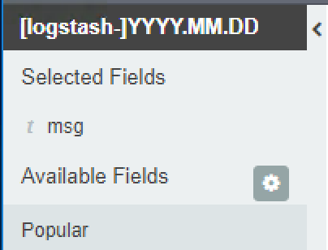

Click any entry to bring up details on that specific entry

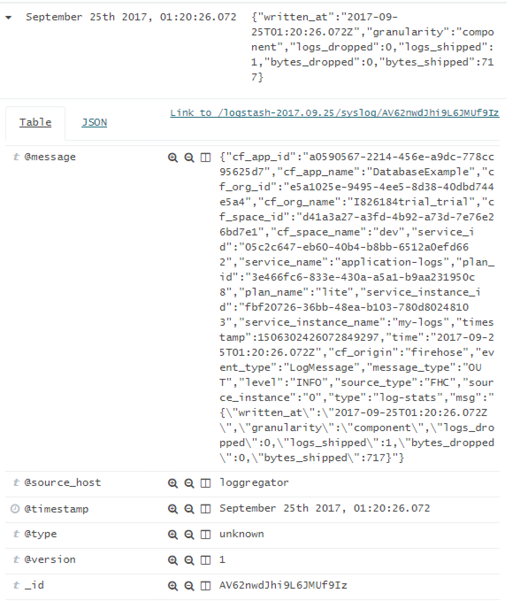

[ACCORDION-END]

[ACCORDION-BEGIN [Step 6: ](Deploy the LogExample sample application)]

Logging can be done by both the Cloud Foundry system, and by individual applications.  To test an example of a log message coming from an application, use the `LogExample` application that is provided.

Start by going to a command prompt, and changing in to the `LogExample` directory.

    cd ..
    cd LogExample

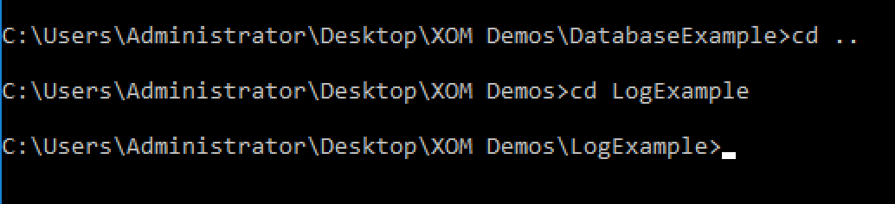

Package and push this code (it is already written, so there is no need to modify it) to the Cloud Foundry server:

    mvn package
    cf push

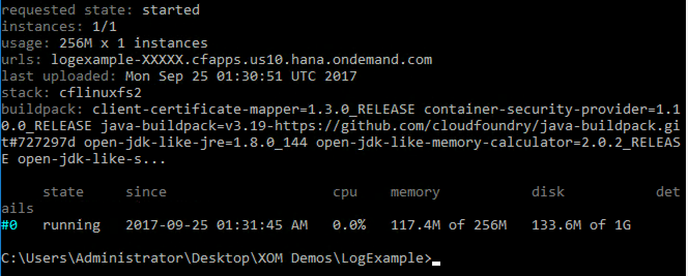

Finally, we need to bind the new code to the service.  Type in this command:

   cf bind-service

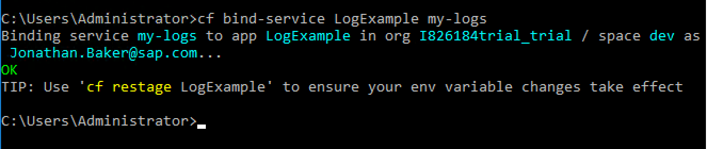

[ACCORDION-END]

[ACCORDION-BEGIN [Step 7: ](Test a message using the new example code)]

To test the new logging application, go to a browser, **open a new tab**, and put in this URL:

    logexample-xxxxx.cfapps.us10.hana.ondemand.com/rest/log/testing123

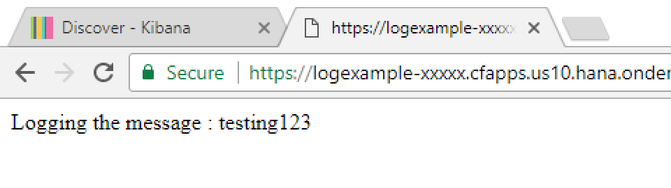

Now, go back to the existing `kibana` logging tab.  Refresh the page (still on the **Discover** tab).  You will see the message now as part of the overall log stream:

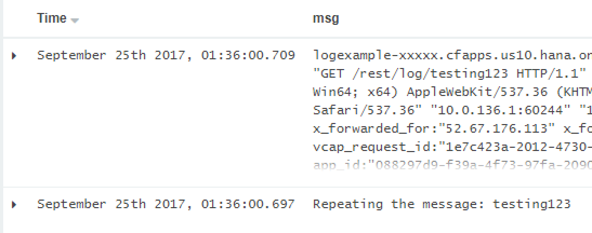

[ACCORDION-END]
