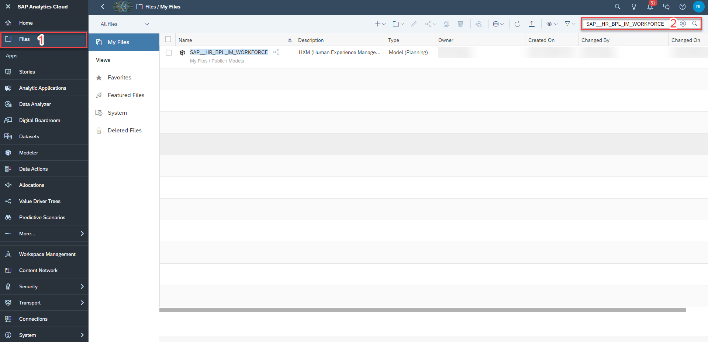
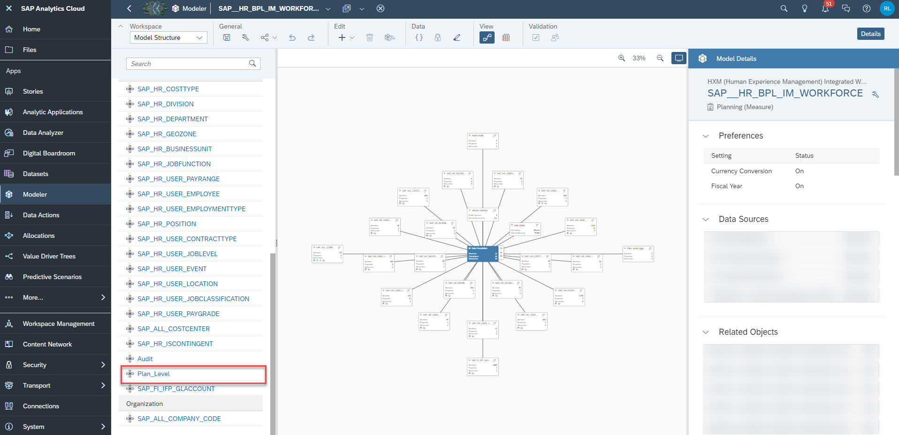
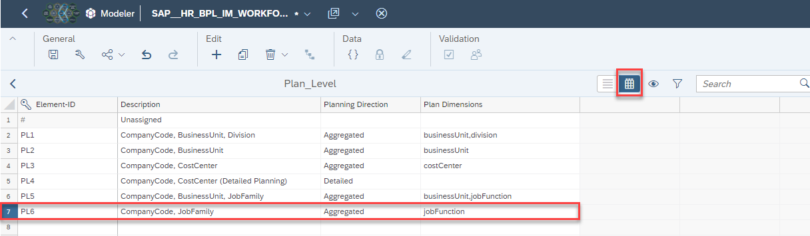
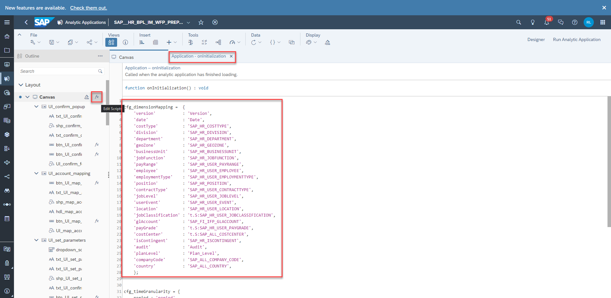
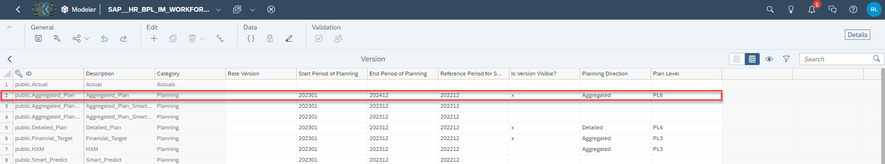
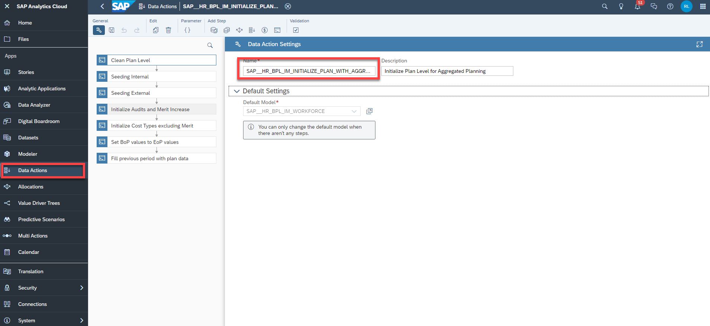
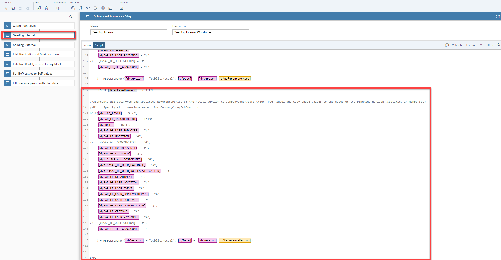
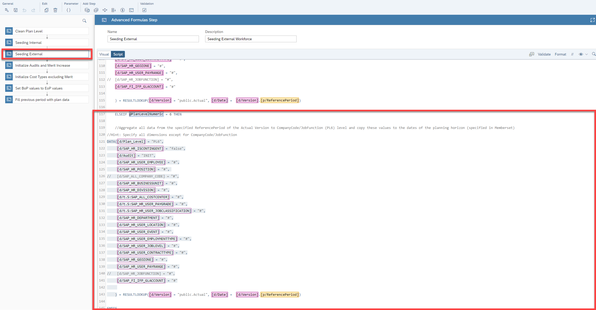

## Prerequisites
- You are familiar with the **SAP Human Experience Management (HXM) Workforce Planning content** from the xP&A Business Content Suite. Reference: [Getting Started tutorial](xpa-sac-hxm-workforceplanning-gettoknow)
- You have installed the **SAP Human Experience Management (HXM) Workforce Planning content** in an SAP Analytics Cloud tenant. Reference: [Business Content Installation Guide](https://help.sap.com/docs/SAP_ANALYTICS_CLOUD/00f68c2e08b941f081002fd3691d86a7/078868f57f3346a98c3233207bd211c7.html), [Content Package User Guide](https://help.sap.com/docs/SAP_ANALYTICS_CLOUD/42093f14b43c485fbe3adbbe81eff6c8/7032f23e00b34a7ab6d79af20a8792a7.html)  

## You will learn
- The meaning of the term **Plan Level** in the context of the HXM Operational Workforce Planning Content Package for SAP Analytics Cloud
- Which steps are required in order to add a new Plan Level  
- This includes...
  -modifying dimensions in the data model
  -adjusting all affected Data Actions
  -maintaining cost parameters for the new Plan Level

### Understanding the term Plan Level
In the scope of the [Human Resources - HXM Operational Workforce Planning Content Package for SAP Analytics Cloud](https://help.sap.com/docs/SAP_ANALYTICS_CLOUD/42093f14b43c485fbe3adbbe81eff6c8/7032f23e00b34a7ab6d79af20a8792a7.html), the term **Plan Level** describes the high level point of view which is used by the planner for the planning activities.

Per default, the content package comes with five pre-defined Plan Levels.

  - The pre-defined Plan Level **PL1** enables the planner to perform planning activities on a `Company Code + Business Unit` aggregation level for instance.
  - The pre-defined Plan Level **PL2** enables the planner to perform planning activities on a `Company Code + Business Unit + Division` aggregation level.
  - The pre-defined Plan Levels **PL3** and **PL4** enable the planner to perform planning activities on a `Company Code + Cost Center` aggregation level. While Plan Level **PL3** and Plan Level **PL4** provide the same point of view, **PL3** is used for the **aggregated planning** scenario while **PL4** is used for the **detailed planning** scenario.
  - The pre-defined Plan Level **PL5** enables the planner to perform planning activities on a `Company Code + Business Unit + Job Family` aggregation level.

If you wish to define a different point of view, you can do so by adding a new Plan Level member to the plan level dimension.

In this specific tutorial, you will learn how to create a new Plan Level which enables planners to perform planning activities on a `Company Code + Job Family` level.


### Add new Member to Plan Level Dimension
In the first step, it is necessary to add a new member to the `Plan_Level` dimension.

1. In the SAP Analytics Cloud Menu, navigate to the **Files** section.

2. Search for the `SAP__HR_BPL_IM_WORKFORCE` data model and open it.

    <!-- border; size:540px -->

3. Click on the dimension `Plan_Level`.

    <!-- border; size:540px -->

4. Add a new member to the Plan Level dimension.

    In this example, the Plan Level `PL6` representing a `Company Code + Job Family` aggregation level is added.

    - Make sure to active grid mode (you can find the button on the top right corner)
    - Add the according attributes to the new Element-ID as shown in the below table or screenshot

    |  Column             | Value                         | Comment                                                                                 |
    |  :----------------- | ----------------------------- | ----------------------------------------------------------------------------------------|
    |  Member ID          | `PL6`                         | Mandatory ID field
    |  Description        | `CompanyCode, JobFamily`      | Description of the new Plan Level member
    |  Planning Direction | `Aggregated`                  | Mandatory field. Shows whether this Plan Level is applied to the aggregated or detailed planning scenario¹
    |  Plan Dimensions    | `jobFunction`                 | Mandatory field. Ensure that the spelling of the dimension matches with the spelling maintained in the whitelist²

      <!-- border; size:540px -->

      ¹Allowed entries for the **Planning Direction** column are only the values `Aggregated` or `Detailed`. Other keywords will not be recognized by the planning applications.

      ²Allowed entries for the **Plan Dimensions** column are only values which are maintained in the dimension whitelist.

      - This whitelist can be found in every single planning application of this content package and also must be maintained in each application of this content package in case of changes.

      - In order to check the whitelist, open any planning application in **edit mode** and enter the `onInitialization` script.

        <!-- border; size:540px -->

      - The dictionary `cfg_dimensionMapping` contains a mapping between the technical name of all dimensions of the data model and its written name (maintained in camel case naming convention).

      - The column **Plan Dimensions** must be populated with one of these dimensions under consideration of the spelling (except for the `companyCode` dimension, as it is part of each Plan Level per default).

      - In case your Plan Level contains more than one additional dimension apart from the Company Code dimension, you may enter multiple dimensions. Make sure to separate them with a **comma** without any spaces as it is the case for Plan Level **PL1** or **PL5**.

5. Save your changes.


### Apply new Plan Level as default aggregation level
In the next step, you will set the new Plan Level `PL6` as the default aggregation level for the `Aggregated_Plan` version.

In order to do so, the properties of the `Version` dimension need to be modified.

By doing this, your planning applications will automatically initialize all planning grids according to the definition of your new Plan Level. That means that all planning grids will initialize with a structure which enable you to make your entries on a `Company Code + Job Family` level.

1. Navigate back to the **Model Structure** workspace by hitting the **back** button on the top left corner and click on the dimension `Version`.

2. Change the value of the attribute `Plan Level` for the `public.Aggregated_Plan` version to `PL6` in order for the planning applications to initialize accordingly.

    <!-- border; size:540px -->

3. Save your changes.


### Adjust Data Actions
In the next step, all affected Data Actions must be adjusted in order to make calculations for the new Plan Level `PL6`work.

1. Navigate to the **Data Action** menu and open the Data Action `SAP__HR_BPL_IM_INITIALIZE_PLAN_WITH_AGGREGATION`.

    <!-- border; size:540px -->

2. Click on the second Data Action step **Seeding Internal** and complement the code with the following statement by adding these lines at the very end of the Data Action step:

    ```
    ELSEIF @PlanLevelNumeric = 6 THEN

    //Aggregate all data from the specified ReferencePeriod of the Actual Version to CompanyCode/JobFunction (PL6) level and copy these values to the dates of the planning horizon (specified in Memberset)
    //Hint: Specify all dimensions except for CompanyCode/JobFunction
    DATA([d/Plan_Level] = "PL6",
    	 [d/SAP_HR_ISCONTINGENT] = "false",
    	 [d/Audit] = "INIT",
    	 [d/SAP_HR_USER_EMPLOYEE] = "#",
    	 [d/SAP_HR_POSITION] = "#",
    // [d/SAP_ALL_COMPANY_CODE] = "#",
       [d/SAP_HR_BUSINESSUNIT] = "#",
    	 [d/SAP_HR_DIVISION] = "#",
    	 [d/t.S:SAP_ALL_COSTCENTER] = "#",
       [d/t.S:SAP_HR_USER_PAYGRADE] = "#",
    	 [d/t.S:SAP_HR_USER_JOBCLASSIFICATION] = "#",
    	 [d/SAP_HR_DEPARTMENT] = "#",
    	 [d/SAP_HR_USER_LOCATION] = "#",
    	 [d/SAP_HR_USER_EVENT] = "#",
    	 [d/SAP_HR_USER_EMPLOYMENTTYPE] = "#",
    	 [d/SAP_HR_USER_JOBLEVEL] = "#",
    	 [d/SAP_HR_USER_CONTRACTTYPE] = "#",
    	 [d/SAP_HR_GEOZONE] = "#",
    	 [d/SAP_HR_USER_PAYRANGE] = "#",
    // [d/SAP_HR_JOBFUNCTION] = "#",
    	 [d/SAP_FI_IFP_GLACCOUNT] = "#"
    	 ) = RESULTLOOKUP([d/Version] = "public.Actual", [d/Date] =  [d/Version].[p/ReferencePeriod])

    ENDIF
    ```

    Your result should look like this:

    <!-- border; size:540px -->

    >EXPLANATION:
    >
    - In order to make cost calculations for Plan Level `PL6` work, add a new *ELSEIF* statement as shown in the image above.
    - For simplification reasons, you can copy one code block from any other Plan Level and paste it at the bottom of the Data Action step.
    - If you do this, make sure to change the commented header accordingly so the description matches to the new code.
    - Ensure that you adjust the *ELSEIF* condition as well and check for `PlanLevelNumeric` = `6`. The number `6` represents the Plan Level `PL6`. Accordingly, the number `1` would represent the Plan Level `PL1`, number `2` the Plan Level `PL2` etc.
    - In this example, the dimensions `[d/SAP_ALL_COMPANY_CODE]` and `[d/SAP_HR_JOBFUNCTION]` must be excluded from the code as they are part of the definition of Plan Level `PL6`. You can exclude dimensions by putting them into a comment as shown in the image.
    - In order for the calculation to work correctly, you must always exclude those dimensions (i.e by putting them into a comment) that are part of your Plan Level definition, which in the case of Plan Level `PL6` are `[d/SAP_ALL_COMPANY_CODE]` and `[d/SAP_HR_JOBFUNCTION]`.

3. Repeat the same activity for the third Data Action step **Seeding External**.

    ```
    ELSEIF @PlanLevelNumeric = 6 THEN

    //Aggregate all data from the specified ReferencePeriod of the Actual Version to CompanyCode/JobFunction (PL6) level and copy these values to the dates of the planning horizon (specified in Memberset)
    //Hint: Specify all dimensions except for CompanyCode/JobFunction
    DATA([d/Plan_Level] = "PL6",
      [d/SAP_HR_ISCONTINGENT] = "true",
      [d/Audit] = "INIT",
      [d/SAP_HR_USER_EMPLOYEE] = "#",
      [d/SAP_HR_POSITION] = "#",
    //[d/SAP_ALL_COMPANY_CODE] = "#",
      [d/SAP_HR_BUSINESSUNIT] = "#",
      [d/SAP_HR_DIVISION] = "#",
      [d/t.S:SAP_ALL_COSTCENTER] = "#",
      [d/t.S:SAP_HR_USER_PAYGRADE] = "#",
      [d/t.S:SAP_HR_USER_JOBCLASSIFICATION] = "#",
      [d/SAP_HR_DEPARTMENT] = "#",
    //[d/SAP_HR_USER_LOCATION] = "#",
      [d/SAP_HR_USER_EVENT] = "#",
      [d/SAP_HR_USER_EMPLOYMENTTYPE] = "#",
      [d/SAP_HR_USER_JOBLEVEL] = "#",
      [d/SAP_HR_USER_CONTRACTTYPE] = "#",
      [d/SAP_HR_GEOZONE] = "#",
      [d/SAP_HR_USER_PAYRANGE] = "#",
    //[d/SAP_HR_JOBFUNCTION] = "#",
      [d/SAP_FI_IFP_GLACCOUNT] = "#"
    ) = RESULTLOOKUP([d/Version] = "public.Actual", [d/Date] =  [d/Version].[p/ReferencePeriod])

    ENDIF
    ```

    <!-- border; size:540px -->

4. Save your Data Action.


### Maintain Central Assumptions for new Plan Level
Lastly you need to maintain Central Assumptions for the Plan Level `PL6`.

Here you can access the tutorial [xP&A HXM Workforce Planning - Create and Upload Central Assumptions](xpa-sac-hxm-maintain-central-assumptions) in order to learn how to upload and maintain Central Assumptions.

Congratulations! You have now added a new planning point of view to your workforce planning solution by extending the Plan Level dimension.

Interested in more xP&A topics and related business content packages? Visit our community page [Extended Planning & Analysis Business Content](https://community.sap.com/topics/cloud-analytics/planning/content?source=social-Global-SAP+Analytics-YOUTUBE-MarketingCampaign-Analytics-Analytics-spr-5330779922).


---
