## Prerequisites
- You are familiar with the **SAP Human Experience Management (HXM) Workforce Planning content** from the xP&A Business Content Suite. Reference: [Getting Started tutorial](xpa-sac-hxm-workforceplanning-gettoknow)
- You have installed the **SAP Human Experience Management (HXM) Workforce Planning content** in an SAP Analytics Cloud tenant. Reference: [Business Content Installation Guide](https://help.sap.com/docs/SAP_ANALYTICS_CLOUD/00f68c2e08b941f081002fd3691d86a7/078868f57f3346a98c3233207bd211c7.html), [Content Package User Guide](https://help.sap.com/docs/SAP_ANALYTICS_CLOUD/42093f14b43c485fbe3adbbe81eff6c8/7032f23e00b34a7ab6d79af20a8792a7.html)  

## You will learn
- The meaning of the term **Central Assumptions** and the use of Central Assumptions in the context of the HXM Operational Workforce Planning content package for SAP Analytics Cloud
- How to upload Central Assumptions manually using Microsoft (MS) Excel as a data source (works with any other data source as well)
- This includes...
  -creating the template for your data entry
  -entering values into the template correctly
  -creating an import job to get the data into your data model

### Understanding the term Central Assumptions
In the scope of the [Human Resources - HXM Operational Workforce Planning Content Package for SAP Analytics Cloud](https://help.sap.com/docs/SAP_ANALYTICS_CLOUD/42093f14b43c485fbe3adbbe81eff6c8/7032f23e00b34a7ab6d79af20a8792a7.html), the term **Central Assumptions** describes different headcount related cost parameters which are used for various cost calculations that are made throughout the whole planning process.

All of these cost parameters are centrally maintained on a high aggregation level and serve as a rough indicator for expected per headcount costs.

In the context of the [Human Resources - HXM Operational Workforce Planning Content Package for SAP Analytics Cloud](https://help.sap.com/docs/SAP_ANALYTICS_CLOUD/42093f14b43c485fbe3adbbe81eff6c8/7032f23e00b34a7ab6d79af20a8792a7.html), these aggregation levels are known as **Plan Levels**. Find out more about the meaning of the term **Plan Level** in **step 1** of the [xP&A HXM Workforce Planning - Add a new Plan Level](xpa-sac-hxm-add-plan-level) tutorial.

Maintaining Central Assumptions has the benefit to make precise estimations about cost positions which exceed ordinary headcount related costs such as the base salaries. Such cost positions can for instance be insurance costs, company car costs, IT hardware costs etc.

### Prepare Central Assumption Template
In the first step, it is necessary to create a Central Assumptions template with the help of MS Excel.

>INFORMATION:
>
- You can use any other data source than MS Excel as well
- The layout of the template and the general functionality of the import job remain the same, independent of which data source you choose to use

1. Open a blank `.xlsx` file.

2. Reflect all of your dimensions and relevant cost measures from your data model in the first row of the empty sheet while using one separate column per dimension/measure. For the delivered standard content, the following dimensions/measures must be maintained:

    |  Dimension/Measure Name (Data Model)     | Dimension/Measure Name (MS Excel) |                
    |  :-------------------------------------- | --------------------------------- |
    |  `Version`                               | `VersionVersion`                         
    |  `Audit`                                 | `Audit`      
    |  `Plan_Level`                            | `Plan_Level`                  
    |  `SAP_HR_ISCONTINGENT`                   | `ISCONTINGENT`
    |  `Date`                                  | `DateMonth`
    |  `SAP_ALL_COMPANY_CODE`                  | `Company_Code`
    |  `SAP_HR_BUSINESSUNIT`                   | `Business_UnitId`                     
    |  `SAP_HR_DIVISION`                       | `DivisionId`                                                
    |  `SAP_HR_USER_LOCATION`                  | `LocationId`                     
    |  `SAP_ALL_COSTCENTER`                    | `Cost_CenterId`                     
    |  `SAP_HR_JOBFUNCTION`                    | `JobFamily`                       
    |  `SAP_HR_COSTTYPE`                       | `Cost_Type`                     
    |  `AMOUNT`                                | `AMOUNT`                     
    |  `Rate_Percentage`                       | `Rate_Percentage`                     
    |  `Rate_Absolute`                         | `Rate_Absolute`                     
    |  `Change_Percentage`                     | `Change_Percentage`   
    |  `SAP_HR_DEPARTMENT`                     | `Department`                  
    |  `SAP_HR_GEOZONE`                        | `Geo_Zone`                     
    |  `SAP_HR_USER_PAYRANGE`                  | `Pay_Range`                     
    |  `SAP_HR_USER_EMPLOYMENTTYPE`            | `Employment_Type`                     
    |  `SAP_HR_USER_EMPLOYEE`                  | `Employee`              
    |  `SAP_HR_POSITION`                       | `Position`              
    |  `SAP_HR_USER_CONTRACTTYPE`              | `Contract_Type`                  
    |  `SAP_HR_USER_JOBLEVEL`                  | `Job_Level`                
    |  `SAP_HR_USER_EVENT`                     | `Event`              
    |  `SAP_HR_USER_JOBCLASSIFICATION`         | `Job_Classification`              
    |  `SAP_FI_IFP_GLACCOUNT`                  | `GL_Account`              
    |  `SAP_HR_USER_PAYGRADE`                  | `PayGrade`              

    >INFORMATION:
    >
    - It is not critical if you do now follow the wording as suggested in the above table. You can also choose your own wording for the different dimensions and measures in your MS Excel template
    - It simply helps to automate the mapping process in the upcoming import job
    - Dimensions not mapped automatically can later be mapped to the dimensions of the data model manually as well

    Your final result should look as indicated in the following snapshot:

    <!-- border; size:540px -->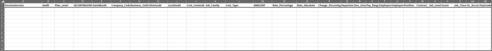

### Enter Values into Template
Now that you have created your template, you need to enter values for your desired **Version** and **Plan Level** into the file.

The following example describes how to maintain Central Assumption values for the version `Aggregated_Plan` and the Plan Level `PL2` for **internal workforce**.

Per default definition, Plan Level `PL2`represents a `CompanyCode + Business Unit` point of view.

1. For the `VersionVersion` column, please enter `public.Aggregated_Plan` as value.

    >INFORMATION:
    >
    - This is required as in this example, Central Assumptions are maintained for the `Aggregated_Plan` version
    - If you wanted to maintain Central Assumptions for the `Detailed_Plan` version, you would need to enter `public.Detailed_Plan`
    - Independent of the version you want to maintain your Central Assumptions for, always make sure to enter the version name with the `public.` prefix

2. For the `Audit` column, please enter `INIT` as value.

    >INFORMATION:
    >
    - The audit member `INIT` serves as a sort of backup version in the context of the content package and always remains untouched (read only), while the audit member `MANUAL` represents the working version, where the planner is able to manipulate values
    - In the first step, you want to upload your Central Assumptions to the `INIT` member of the audit dimension
    - After uploading your Central Assumptions (which will be covered in a later step), you will copy the Central Assumptions to the `MANUAL` member
    - By uploading your Central Assumptions to the `INIT` member of the audit dimension first, you profit from the possibility to reset the Central Assumptions back to the initial state in case you want to revert your manual changes

3. For the `ISCONTINGENT` column, please enter `false` as value.

    >INFORMATION:
    >
    - This is required because in this example, Central Assumptions are maintained for internal workforce
    - Data maintenance for external workforce will be covered in the following step of this tutorial.

4. For the `DateMonth` column, please enter any date in a `YYYYMM` format (e.g.: `202212`)

    >INFORMATION:
    >
    - Please note that this record will only be valid for the provided date, which in this example is period 12 of the year 2022
    - If you wish to populate your Central Assumptions for the whole year, you can either create a Data Action which copies the values from `202212` to other periods, or repeat this exercise in your Excel template for each month.
    - In **step 6** of this tutorial, you can learn how to create such a Data Action.

5. Next, please provide a valid combination of members for the dimensions/columns `Company_Code` and `Business_UnitId` as these two dimensions represent the Plan Level `PL2`, for which the Central Assumptions are maintained in this example.

    >INFORMATION:
    >
    - The member values you enter in this template must already be maintained in the dimensions of your data model on your SAP Analytics Cloud tenant
    - If this is not the case, your record cannot be uploaded afterwards

    For instance, this could look as follows:

    - `Company_Code`: `1010`
    - `Business_UnitId`: `CORP`

6. In the next step, you want to maintain the cost parameters for the provided combination of dimensions per each Cost Type.

    >INFORMATION:
    >
    - Please note that you can only maintain one value for one measure per row in your file. For each Cost Type you want to enter values for, you need to create a new line. At the end of this tutorial step, you can find a screenshot which shows an example of what it should look like
    - If you are unfamiliar with the term **Cost Type** and its meaning in the context of this content package, please check out **step 1** of the tutorial [xP&A HXM Workforce Planning - Add a new Cost Type](xpa-sac-hxm-add-cost-type)   

    - In order to maintain a midpoint salary, please enter `MIDPOINTSALARY` into the `Cost_Type` column and enter a monthly salary value into the column `Rate_Absolute` (e.g. 5000)

    >INFORMATION:
    >
    - The `Rate_Absolute` measure always represents an absolute value

    - In order to upload travel costs, IT related costs or car costs, please enter into the `Cost_Type` column either `TRAVEL_COSTS`, `IT_COSTS` or `CAR_COSTS` and maintain a value in column `Rate_Absolute` (e.g. 200)

    >INFORMATION:
    >
    - As the `Rate_Absolute` measure always represents an absolute value, this rate is added on top of the `Midpointsalary` or the ordinary salary, in case you work with actual data.
    - If for instance your `Midpointsalary` or salary equals 1000 and you plan a car cost rate of 200, your total personnel cost rate will result in a value of 1200 (1000 + 200)

    - In order to upload a bonus rate, health insurance rate, commission rate, life insurance rate, pension rate, retirement fund rate or social insurance rate, please enter into the `Cost_Type` column either `BONUS`, `HEALTH_INSURANCE`, `COMISSION`, `LIFE_INSURANCE`, `PENSION`, `RETIREMENT_FUND` or `SOC_INSURANCE` and maintain a decimal value in column `Rate_Percentage` (e.g. 0.15 for a 15 % rate)

    >INFORMATION:
    >
    - Please note that the `Rate_Percentage` measure always represents a percentage value
    - This rate is applied onto the `Midpointsalary` or the ordinary salary, in case you work with actual data.
    - If for instance your `Midpointsalary` or salary equals 1000 and you plan a 15 % bonus rate, your bonus value will result in 150 (1000 x 0.15)

    - In order to maintain merit increase, please enter into the `Cost_Type` column the value `MERIT` and maintain a decimal value in the column `Change_Percentage` (e.g. 0.02 for a 2 % merit increase)

    >INFORMATION:
    >
    - The `Change_Percentage` measure always represents a percentage value
    - This rate is applied onto the `Midpointsalary` or the ordinary salary, in case you work with actual data.
    - Different from the `Rate_Percentage` measure, the `Change_Percentage` value must only be entered once (or rather in one period) as the Data Actions carry forward the merit increase as of its effective date.
    - If for instance you plan to increase salaries by 5 % as of March 2023, you only need to enter the value of `0.05` once into the `Change_Percentage` column using the `MERIT` Cost Type with the date value `202303`. Your salaries for the following periods will be automatically increased by 5 % until the end of your planning period.  

7. For the `Plan_Level` column, please enter `PL2` as value.

    >INFORMATION:
    >
    - This is required as in this example Central Assumptions are maintained for the Plan Level `PL2`

8. Lastly, set all the remaining dimensions except the measure columns to the unassigned member `# #` as they are not relevant for the specific Plan Level.

Your final picture should look as follows:

<!-- border; size:540px -->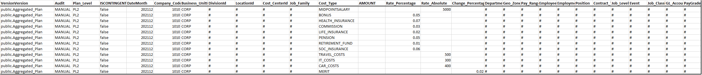

>Populating other Plan Levels:
>
- If you wish to populate Central Assumptions for other Plan Levels than Plan Level **PL2**, you may repeat these sub-steps accordingly with slight modifications
- For Plan Level **PL1**, please make sure to provide a valid combination for the dimensions/columns `Company_CodeId` , `Business_UnitID` and `DivisionId` and enter the value `PL1` into the `Plan_Level` column.
- For Plan Level **PL3** and **PL4**, please make sure to provide a valid combination for the dimensions/columns `Company_CodeId` and `Cost_CenterId` and enter the value `PL3` or `PL4` into the `Plan_Level` column.
- For Plan Level **PL5**, please make sure to provide a valid combination for the dimensions/columns `Company_CodeId` , `Business_UnitID` and `Job_Family` and enter the value `PL5` into the `Plan_Level` column.

### Enter Values into Template for External Workforce
In the previous step you learned how to prepare your Central Assumptions file for **internal workforce**.

If you wish to prepare Central Assumptions for **external workforce** as well, please proceed with this step. Otherwise you can skip this step and continue with **step 5** of this tutorial.

Generally, you can repeat the activities of the sub-steps **1** to **5** of the previous step **Enter Values into Template** under consideration of the following changes:

1. For the `ISCONTINGENT` column, please enter `true` as value. This is required because in this example, Central Assumptions are maintained for external workforce.

2. In addition to what is described in the fifth sub-step, please also provide a valid value for the dimension/column `LocationID` as this is an additional mandatory field for contingent workers.

    For instance, this could look as follows:

    - `Company_Code`: 1010
    - `Business_UnitId`: CORP
    - `LocationID`: 1010-0001

    >INFORMATION:
    >
    - Independent of the Plan Level you are maintaining your values for, you always need to provide a valid value for the `LocationID` dimension
    - This is because for contingent workforce, `LocationID` is a mandatory field

3. In order to maintain a monthly rate for external workers, please enter `MONTH_RATE` into the `Cost_Type` column and enter a monthly absolute rate into column `Rate_Absolute` (e.g. : 5000)

    >Populating other Plan Levels:
    >
    - If you wish to populate Central Assumptions for other Plan Levels than Plan Level **PL2**, you may repeat these sub-steps accordingly with slight modifications
    - For Plan Level **PL1**, please make sure to provide a valid combination for the dimensions/columns `Company_CodeId` , `Business_UnitID`,  `DivisionId` and `LocationId` and enter the value `PL1` into the `Plan_Level` column.
    - For Plan Level **PL3** and **PL4**, please make sure to provide a valid combination for the dimensions/columns `Company_CodeId`, `Cost_CenterId` and `LocationId` and enter the value `PL3` or `PL4` into the `Plan_Level` column.
    - For Plan Level **PL5**, please make sure to provide a valid combination for the dimensions/columns `Company_CodeId` , `Business_UnitID`, `Job_Family` and `LocationId` and enter the value `PL5` into the `Plan_Level` column.

Your final picture should look as follows:

<!-- border; size:540px -->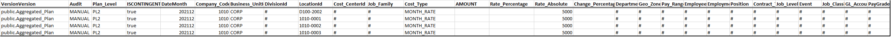

### Import External File
Now that you have created and populated the Central Assumption file, it is necessary to upload the data into the SAC data model via an import job.

1. Open the SAC menu, navigate to the **Modeler** section and open the `SAP__HR_BPL_IM_WORKFORCE` data model.

2. Change the **workspace** via the dropdown window and select **Data Management**.

3. Click on the import button and select the option **File** to create an import job for your Excel file.

    <!-- border; size:540px -->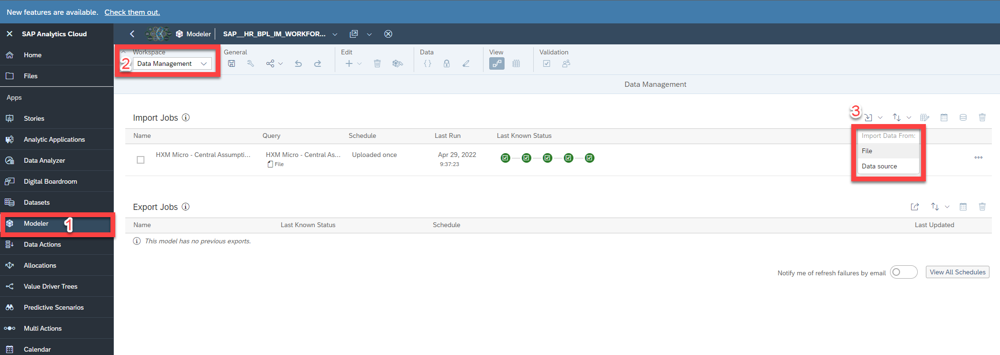

4. In the popup window, click on **Select Source File**, navigate to the path of your Excel file and select the Central Assumptions file. Make sure to enable the **Use first row as column headers** option. Click on **Import** when done with the settings.

    <!-- border; size:300px -->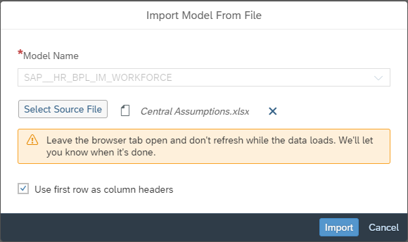

5. Click on **Set up Import** in the next step.

    <!-- border; size:540px -->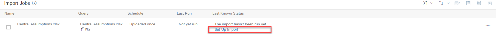

6. Perform the following changes in the data preparation section:
    - Change data type of `Company_CodeId` to **String**
    - Change data type of `Amount` to **Number**
    - Change data type of `Rate_Absolute` to **Number**

    Your final picture should look as shown in the snapshot below:

    <!-- border; size:200px -->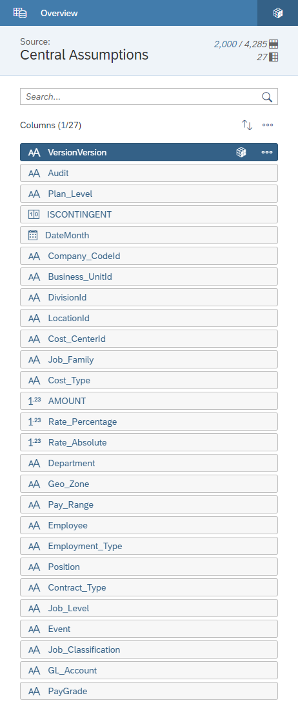

7. Proceed to next step and perform the following activities:
    - In case not all columns have been automatically mapped to the dimensions of the data model, perform the mapping by drag and dropping the columns onto the fitting data model dimensions
    - Delete the default value of the `Version` dimension and re-map the `Version` dimension manually

    Your final result should look like this:

    <!-- border; size:540px -->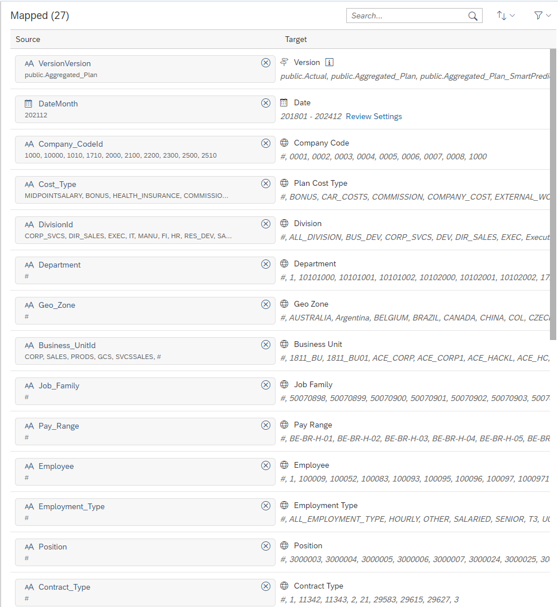

8. Start the upload process

### Copy Central Assumptions to whole Year
In case you have maintained your Central Assumptions for one period only, you may create a Data Action in order to populate the whole planning year.

Let us assume that you entered your Central Assumptions for December 2021 only.

Now you want to use this period as a reference for your planning year 2021 and copy over all these values over to the periods to January 2021 until December 2021 in order to avoid doing this in your Excel file.

1. Create a new Data Action via the Data Action menu and open a new copy step.

2. Set the filter for the dimension `Plan_Level` to the member `PL2` (or any other respective member), representing the Plan Level you entered your values for.

3. Set the filter for the dimension `Cost_Type` to all the Cost Types you want to copy.

    - In this example, all Cost Types except for Cost Type `MERIT` are selected as otherwise, the value will be copied to every single month and the salary will increase exponentially with each month

4. Set the filter for the dimension `Measure` to the measures `Rate_Absolute`, `Change_Percentage` and `Rate_Percentage`

    >INFORMATION:
    >
    - This is required because Central Assumptions can only be separated from the actual values / planned values by the measures.
    - This means that Central Assumptions are always maintained on the three measures `Rate_Absolute`, `Change_Percentage` and `Rate_Percentage`

5. Define a copy rule for the date dimension
    - In the **Measure/Dimension** section, select the **Date** dimension
    - In the **From** section, select your reference period `12.2021`, where all Central Assumptions are maintained in your template
    - In the **To** section, select all members starting from `01.2021` until `12.2021`

6. Define a second Copy Rule for the audit dimension
    - In the **Measure/Dimension** section, select the **Audit** dimension
    - In the **From** section, select the `INIT` member, where all Central Assumptions are maintained in your template
    - In the **To** section, select both the `INIT` member and the `MANUAL` member

    Your Data Action should now look as follows:

    <!-- border; size:540px -->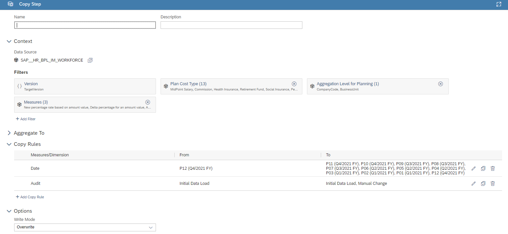

7. Create a blank story in order to execute the Data Action and publish the version.
    - In the SAP Analytics Cloud Menu, navigate to the **Stories** section
    - Select **Canvas** in order to create a new canvas story

      <!-- border; size:540px -->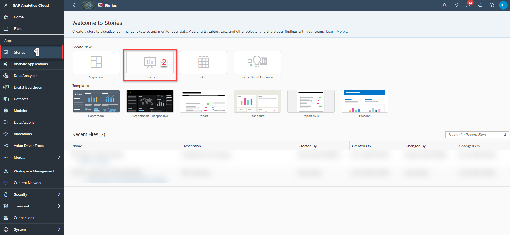

    - Click on the **Text** icon or any other icon in order to create a blank story

      <!-- border; size:540px -->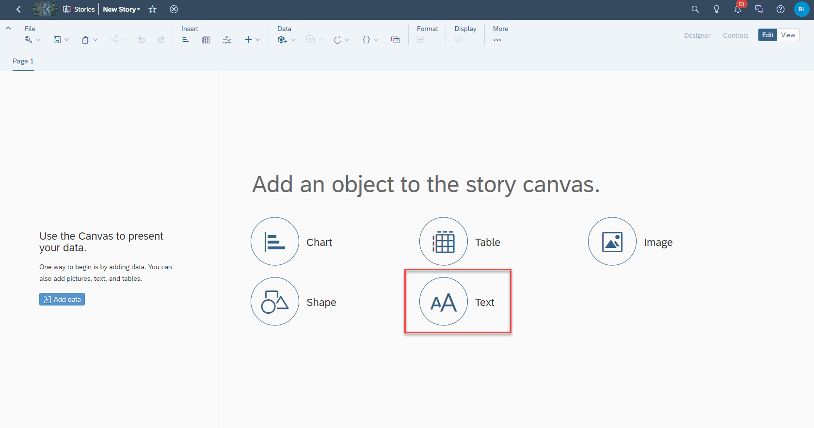

    - Add a planning trigger to the story. Choose **Data Action Trigger** from the selection

      <!-- border; size:250px -->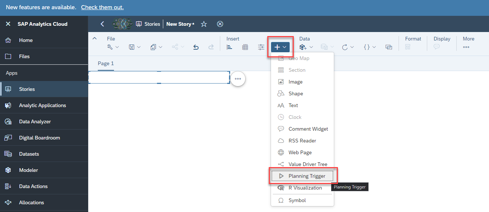

      <!-- border; size:250px -->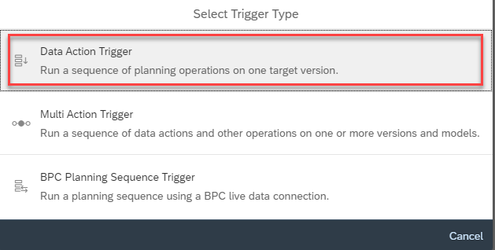

    - In the menu on the right-hand side of the screen, choose your newly created data action to embed it into the trigger and specify the target version you want the results to be written on. As in this example, Central Assumptions are maintained on the version `public.Aggregated_Plan`, this version must be specified

      <!-- border; size:250px -->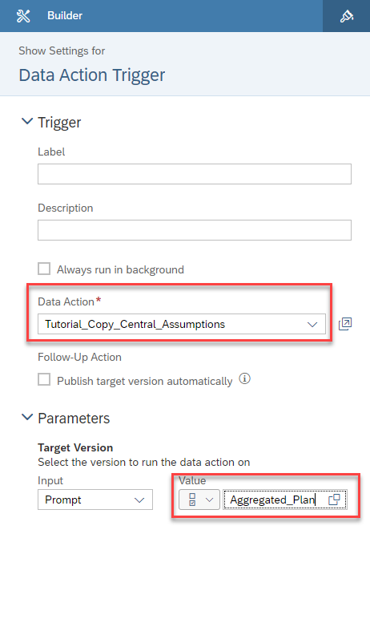

    - Execute the Data Action by pressing the trigger in your story

    - You may close the story after the Data Action has run through. There is no need to save it.

>INFORMATION:
>
- Alternatively, you can also use a pre-defined Data Action which is delivered with the content package ( `SAP__HR_BPL_IM_INITIALIZE_CENTRAL_ASSUMPTIONS`)
- In contrast to the Data Action which is described above, both the plan horizon (where the values are written to) and the reference period (where the values are copied from) are read from the properties of the version dimension rather than from manually defined parameters
- In the Data Modeler, under the version dimension, you can find the properties `Start Period of Planning` and `End Period of Planning`. This is the equivalent to what you have defined in **sub-step 5** in the **To** section of the copy step
- In the Data Modeler, under the version dimension, you can also find the property `Reference Period for Seeding`. This is the equivalent to what you have defined in **sub-step 5** in the **From** section of the copy step
>
<!-- border; size:540px -->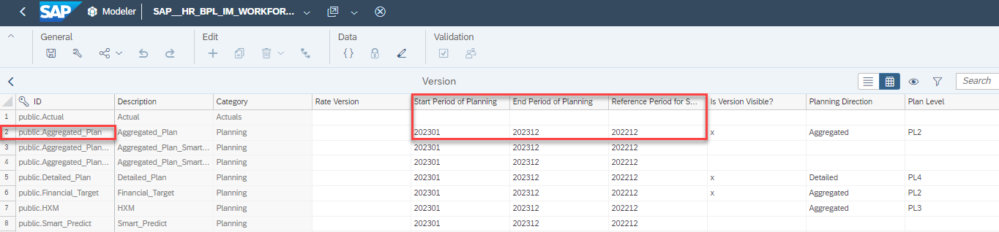
>
- Using this Data Action implies that you adjust your Version property `Reference Period for Seeding` to match the data value you have entered in the `DATEMONTH` of your MS Excel template.

Congratulations! You have now imported your Central Assumptions from an MS Excel template into the relevant planning periods for your desired Version(s) and Plan Level(s).

Interested in more xP&A topics and related business content packages? Visit our community page [Extended Planning & Analysis Business Content](https://community.sap.com/topics/cloud-analytics/planning/content?source=social-Global-SAP+Analytics-YOUTUBE-MarketingCampaign-Analytics-Analytics-spr-5330779922).
