## You will learn

- how to set up end-to-end connectivity and authentication between SAP Analytics Cloud, SAP Cloud Integration and SAP SuccessFactors
- how to customize the position object in SAP SuccessFactors
- how to customize and trigger the position write back in SAP Cloud Integration

## Prerequisites
* Have an SAP Analytics Cloud tenant available with Planning enabled and a user with admin rights for it
* Have the content imported as described in [xP&A HXM Workforce Planning - Get to know the Operational Workforce Planning Content part of the xP&A Business Content Suite](xpa-sac-hxm-workforceplanning-gettoknow)
* Data model set up / Central Assumptions in place as described in [xP&A HXM Workforce Planning - Create and Upload Central Assumptions](xpa-sac-hxm-maintain-central-assumptions)
* You have an account with SAP Business Technology Platform as described in [Get a Free Account on SAP BTP Trial](hcp-create-trial-account).
* You have enabled Cloud Integration, capability of SAP Integration Suite, as described in [Set Up Integration Suite Trial](cp-starter-isuite-onboard-subscribe).
* Have access to a SAP SuccessFactors instance

## Intro
As part of the HXM workforce planning content you are surely interested how these newly planned positions get back into Position Management of SAP SuccessFactors. To achieve this, you can leverage the SAP Cloud Integration Flow provided in the SAP Community.

You will first focus on the connection between SAP Cloud Integration to SAP Analytics Cloud, then from SAP Cloud Integration to SAP SuccessFactors and in the end have a look how to customize and trigger the write back.

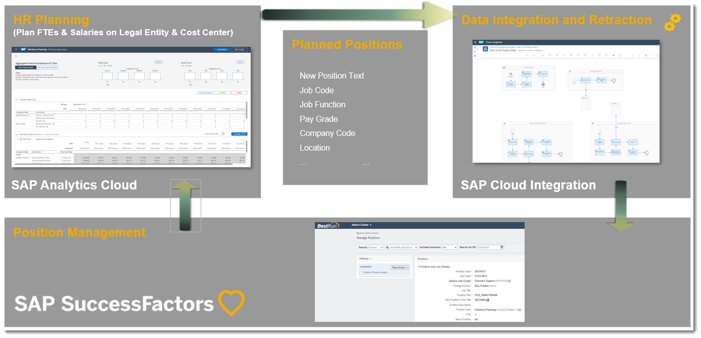

### Get OAuth Token URL for your SAP Analytics Cloud Tenant

[comment]: # (Step 1)

Log on to your SAP Analytics Cloud tenant and navigate to
 System -> Administration -> App Integration.

In section **OAuth Clients**, take a note of the Token URL.
 It should be `https://<your-sac-tenant>/oauth/token`

> Take a note of the **Token URL** as you will need it later.

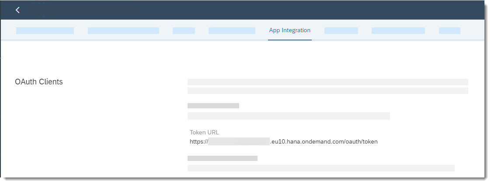

### Enable Export Service on SAP Analytics Cloud

[comment]: # (Step 2)
In this step you will need to enable the Data Export Service and create the OAuth client credentials to be able to connect against this service of SAP Analytics Cloud. In section **Configured Clients** click on the **+ Add a New OAuth Client** link.

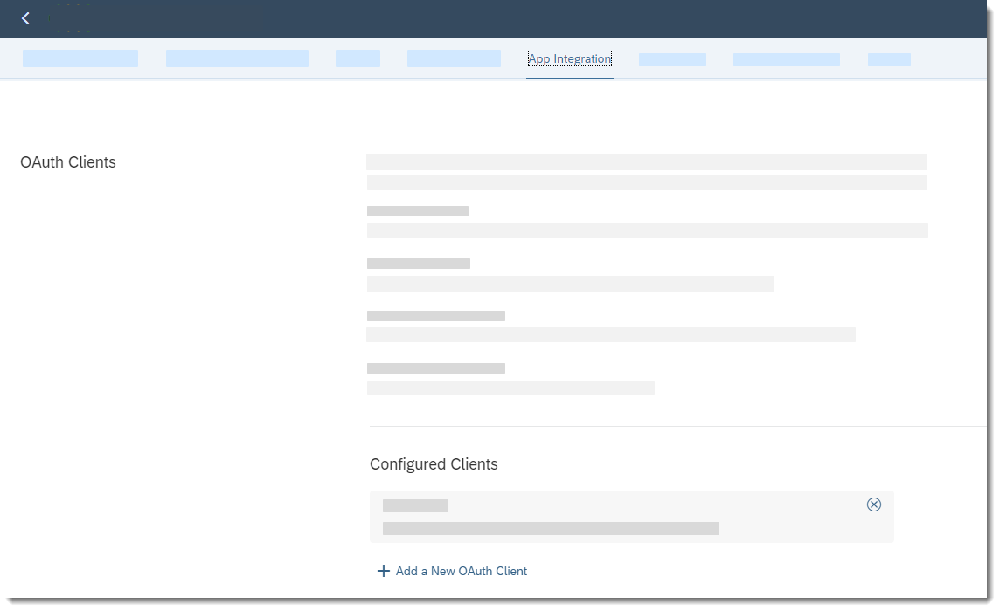

- Provide a name for your client, e.g. **`SACExportClient`**
-  in dropdown **Purpose** select option **`Interactive Usage and API Access`**
-  in dropdown **Access**  check option **`Data Export Service`**

Finish the creation of the OAuth Client credentials by hitting the **Add** button at the bottom of the popup.

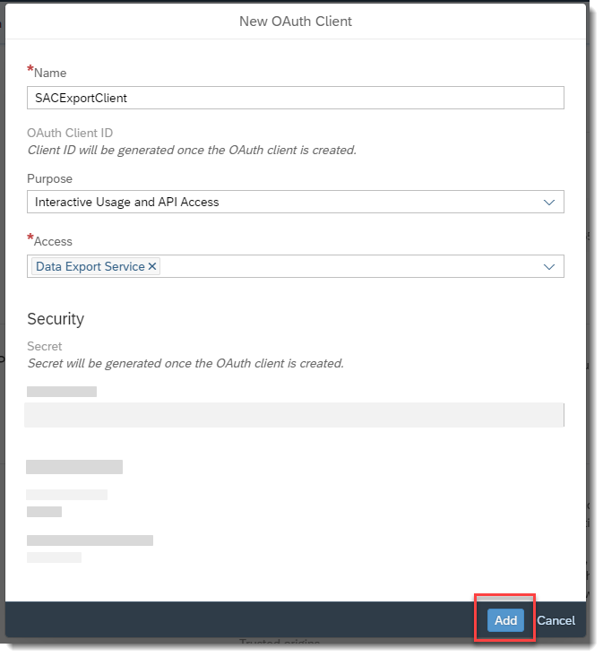

Once the client credentials have been created, take a note of the

- **OAuth Client ID**
- **the Secret** (click on **Show secret** to display it)

as you will need it in the next step.

You can click on button **Done** now to close the popup and move over to the next step.

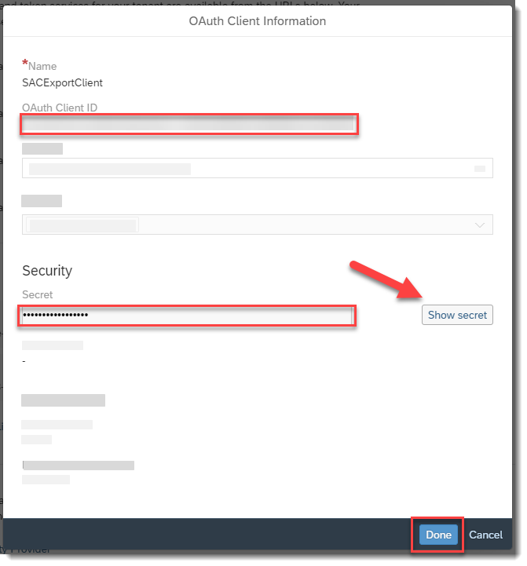

### Set up authentication for SAP Analytics Cloud

[comment]: # (Step 3)
For authentication from SAP Cloud Integration to SAP Analytics Cloud you will need to setup a *user credential artifact* in SAP Cloud Integration.  
 The artifact will then be used in the write back integration flow.

Let's head over and logon to SAP Cloud Integration.

In SAP Cloud Integration click on the **Eye** icon to get to the overview page and then scroll down to **Manage Security** and click on the **Security Material** tile.

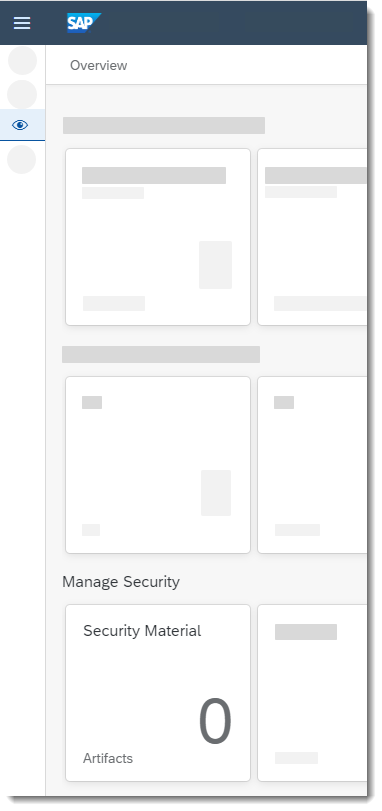

Click on button **Create** on top of the Security Material list and choose **User Credentials**.

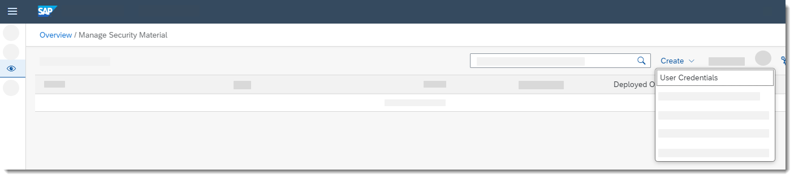

- Provide a name for this security material; default name referenced in the integration flow is **`SAC_OAUTH_TOKEN_CREDS`**.
- Provide a description (optional).
- Leave the **Type** as **`User Credentials`**
- In field **User** enter the *OAuth Client ID* that has been created in the previous step.
- In field **Password**/ **Repeat Password** enter the *Secret* that has been created in the previous step.

Click on **Deploy** to save the user credential artifact.

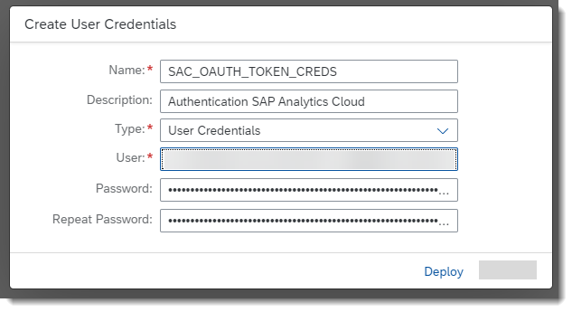

You can now see the created item in your list of security materials

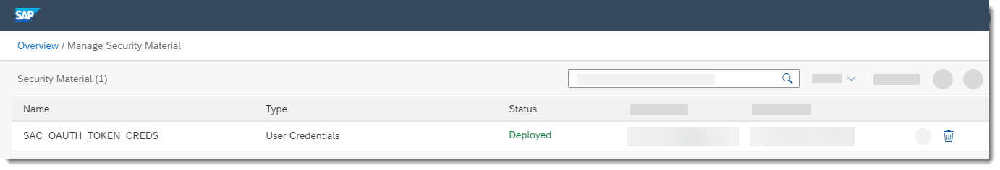

### Set up authentication for SAP SuccessFactors

[comment]: # (Step 4)

For setting up connectivity between SAP Cloud Integration and SAP SuccessFactors, you first need to create a custom key pair in the keystore that can be used in the SuccessFactors connection security artifact.
 For this head back to the Overview page, click **Eye** icon, scroll down to section **Manage Security** and click on the **Keystore** tile.

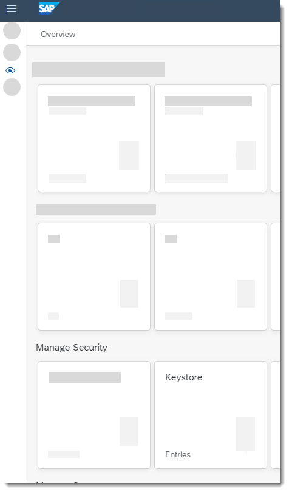

Click on the **Create Button** on top of the keystore list and choose **Key Pair**.

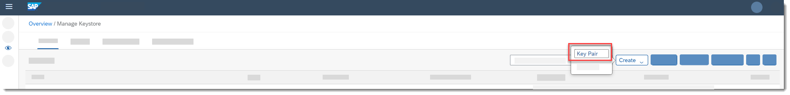

Please provide your input for the following fields:

|  Field Name     | Value
|  :------------- | :-------------
|  Alias           | Name of the Artifact of your choosing (e.g. **`hxm_writeback_keypair`**)
|  Common Name (CN) | the user name of the SAP SuccessFactors user with authorization to call the SuccessFactors Employee Central APIs (e.g. **`sfadmin`**)
| County/Region (C) | pick a country/region code of your choosing (e.g. **`DE`**)

All other fields are optional.
>Take a note of the **Alias** name, as you will need it in a later step.

Hit the **Create** button to have your key pair created. You will now see it in entity list.

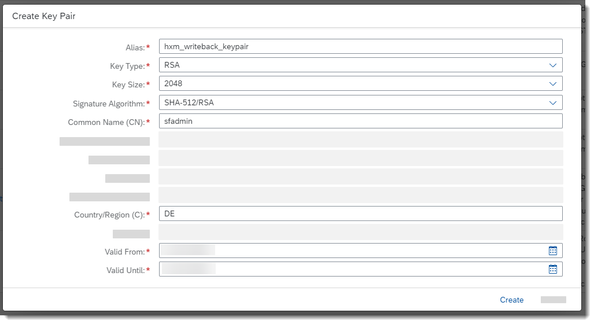

As a next step, download the certificate as you need the certificate key for the SAP SuccessFactors OAuth Client Application entry.

To download the certificate, click on the **Actions** Icon next to your key store entry and choose the option **Download Certificate**.

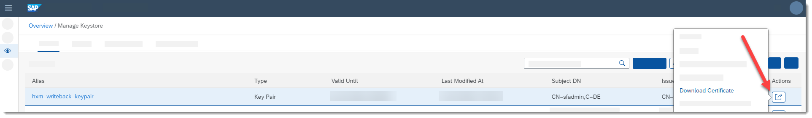

Save the certificate to your local disk and open it with your preferred text editor. You will need the key value (everything between the **-----BEGIN CERTIFICATE-----** and **-----END CERTIFICATE-----** tag) in the upcoming step, so keep the file open.

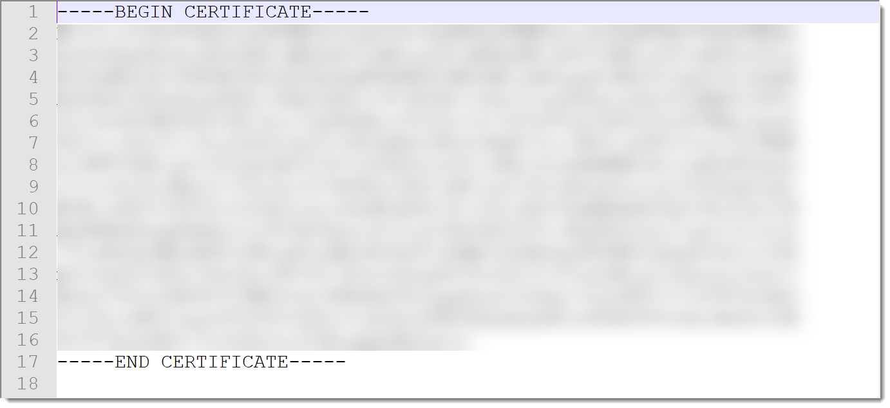

### Register OAuth2 Client Application in SAP SuccessFactors

[comment]: # (Step 5)
Now it is time to log on to the SAP SuccessFactors tenant with an **Admin** user for your company for setting up the SAP SuccessFactors OAuth Client Application entry.

Once logged in, start searching for *Manage OAuth* in the search field and click on the proposed result **Manage OAuth2 Client Applications**.

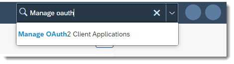

In this application you can register client applications for SAP SuccessFactors API usage authenticating via OAuth.

Hit the **Register Client Application** button to create a new entry for the integration flow.

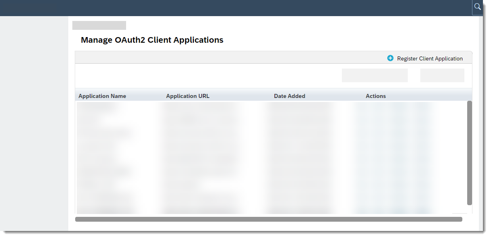

The field **Company** will be filled automatically based on your company login.

>Take a note of your **Company Id** as you will need it in the next step.

Please provide the following inputs:

|  Field Name     | Value
|  :------------- | :-------------
|  Application Name  | provide a meaningful name for your application (e.g. **`HXM Position Writeback`**)
|  Description       | you can provide a longer description of the application here
|  Application URL   | provide the host name of your SAP Cloud Integration tenant
|  X.509 Certificate | paste the key value of your downloaded certificate from the previous step

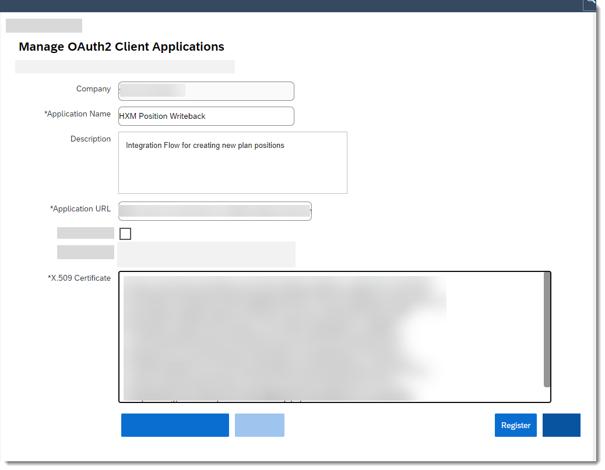

Hit the **Register** Button. As a result you can see your client application entry in the table. Now click on the **View** button for your entry, so you can find out the API Key for registering your client application.

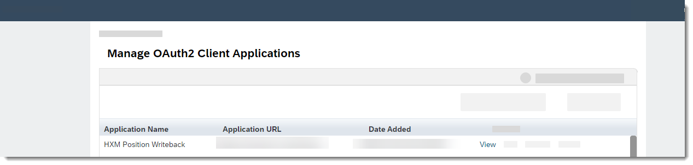

>Take a note of your **API Key** as you will need it in the next step.

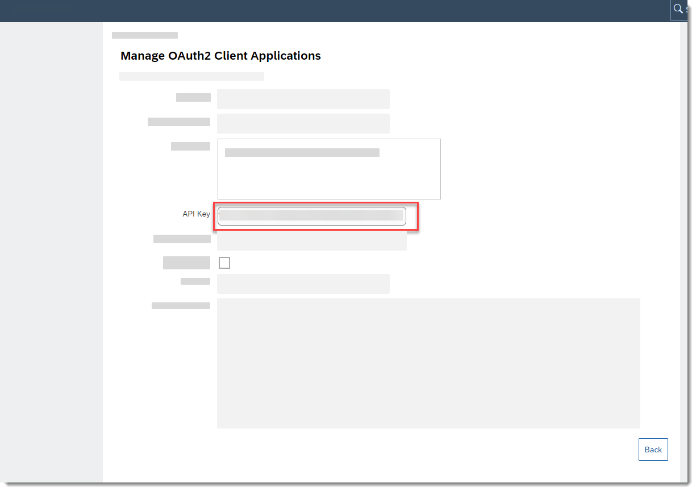

Now that you have a client application entry registered and you have an API Key for it, head back into your SAP Cloud Integration tenant for making use of it.

### Create credential artifact for SAP SuccessFactors

[comment]: # (Step 6)

Being back in SAP Cloud Integration again, click on the **Eye** icon to get to the Overview page and scroll down to section **Manage Security** and click on the **Security Material** tile. You will now create the credential artifact, being used in the integration flow to authenticate against SAP SuccessFactors.

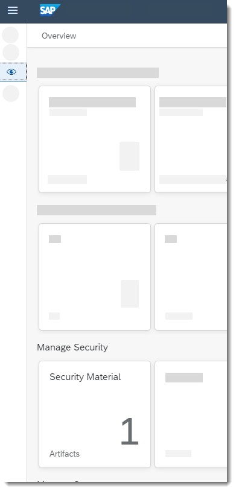

On the top right click on **Create** and choose entry **OAuth2 SAML Bearer Assertion**

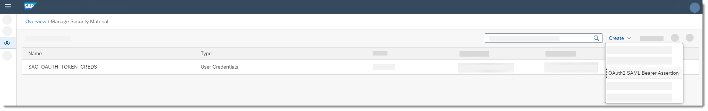

Please provide the following inputs:

|  Field Name     | Value
|  :------------- | :-------------
|  Name  | provide a name for the credential artifact (default used in integration flow **`SFPositionWriteBack`**)
|  Audience  | **`www.successfactors.com`**
|  Client Key  | enter the SF API key created in the previous step
|  Token Service URL  | enter the Token Service URL for the [API Server of you SAP SuccessFactors instance](https://help.sap.com/docs/SAP_SUCCESSFACTORS_PLATFORM/28bc3c8e3f214ab487ec51b1b8709adc/af2b8d5437494b12be88fe374eba75b6.html) (pattern: **`https://<your api host name>/oauth/token`**)
|  Company ID  | enter your SAP SuccessFactors company Id
|  User ID  | choose option **Key Pair Common Name (CN)**
|  Key Pair Alias  | provide the alias name of the key pair you have created in step **4** (e.g. **`hxm_writeback_keypair`**)

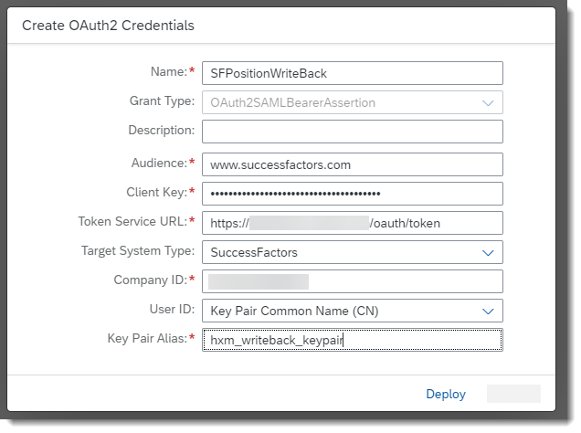

Hit the **Deploy** Button to save your credential artifact and to return to the list of security materials.

You can now see your two credential artifacts,

- **`SAC_OAUTH_TOKEN_CREDS`** to connect to SAP Analytics Cloud for fetching newly planned positions
- **`SFPositionWriteBack`** to connect to SAP SuccessFactors to push these newly planned positions  

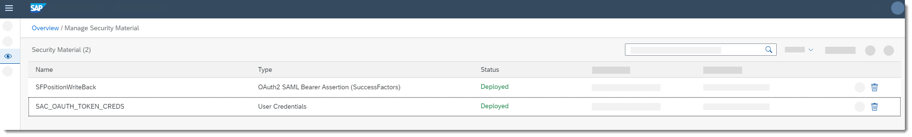

### Get the Integration Flow ready

[comment]: # (Step 7)
Now that you have taken care of the connection/authentication artifacts, let's get the integration flow ready.

To copy the integration flow into your *Design* area in SAP Cloud Integration tenant, click on the **Discover** Icon in the left upper corner. In the search field search for *SuccessFactors* and click on the entry called **SAP Analytics Cloud Integration with SAP SuccessFactors Position Write Back Outbound Flow** leading you to the overview of said integration flow.
 Click on the **Copy** link in the upper right corner of the screen to copy the integration flow into your *Design* area.

[comment]: # (Add Screenshot for copying from Discovery to Design, once it is available)

You will now need to configure the integration flow with the security materials created. Once it is available in the *Design* area, click on the **Artifacts** tab of the integration flow and click on the **Actions** link for it and choose option **Configure**

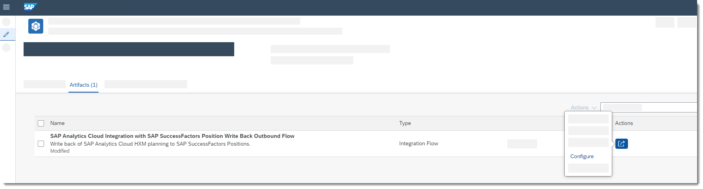

On tab **Timer** leave the option **Run Once**, as we will manually trigger the run.

Move on to tab **Receiver** in which you configure the three receivers of the flow:

- **`SAC_Export`** will retrieve the newly planned position data from SAP Analytics cloud
- **`SAC_OAuth_Token`** will take care of the authentication against SAP Analytics Cloud
- **`Insert_SF_Position`** will insert the newly planned positions to SAP SuccessFactors

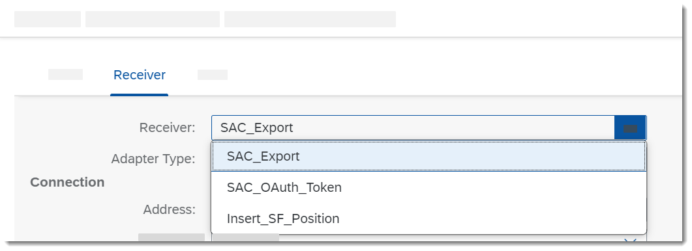

Let's start with receiver **`SAC_Export`**

For field **Address**, maintain the export path to the fact data of your workforce planning model as described in the [SAP Analytics Cloud Documentation](https://help.sap.com/docs/SAP_ANALYTICS_CLOUD/00f68c2e08b941f081002fd3691d86a7/f7feb7c0792948e89cf89bcdb60db5d2.html).

When using the default model of the HXM Workforce Planning content, the path will be:

**`https://<your SAC tenant>/api/v1/dataexport/providers/sac/Caovcf79lrt4lemzdv5643rzls/FactData`**

You can leave all other parameters as they are. Press the **Save** button

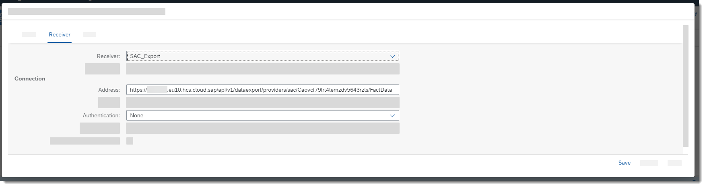

**Authentication** is set to **None** as this will be taken care by the **`SAC_OAuth_Token`**, you need to configure next. In the Receiver dropdown, select entry **`SAC_OAuth_Token`**.

- in field **Address** put the *SAP Analytics Cloud Token URL* from Step 1.
- in field **Credential Name** put the credential artifact name you had created in step 3 (default name **`SAC_OAUTH_TOKEN_CREDS`**)

Leave all other field entries as they are and hit the **Save** button.

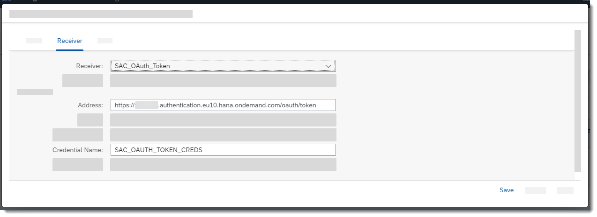

One receiver to go... the **`Insert_SF_Position`** receiver. In the Receiver dropdown, select entry **`Insert_SF_Position`**.

- in field **`SF_API_BASE_URL`** enter the [API Server of you SAP SuccessFactors instance](https://help.sap.com/docs/SAP_SUCCESSFACTORS_PLATFORM/28bc3c8e3f214ab487ec51b1b8709adc/af2b8d5437494b12be88fe374eba75b6.html)
- in field **Credential Name** enter the credential artifact name you had created in step 6
 (default name used **`SFPositionWriteBack`**)

Hit the **Save** Button.

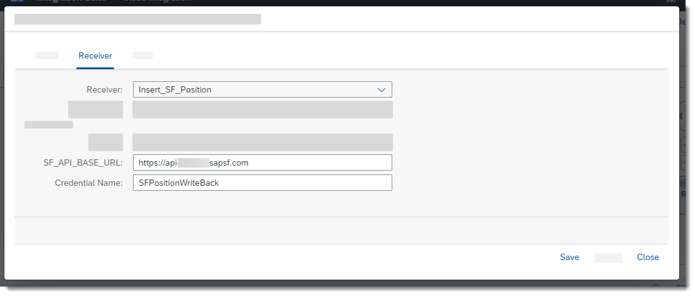

On the **More** tab you can do some more customizing of the integration flow. For example restrict the scope of execution using the filter fields for company code, position and job classification.

|  Field Name     | Value
|  :------------- | :-------------
|  `COMPANY_CODE`  | a company code id value
|  `HR_POSITION`  | a particular plan position (format **`POS_<guid>`**)
|  `JOB_CLASSIFICATION`  | a job classification id

You can set the **`MPI_Log_Switch`** to **ON** for detailed analysis of the integration flow execution.

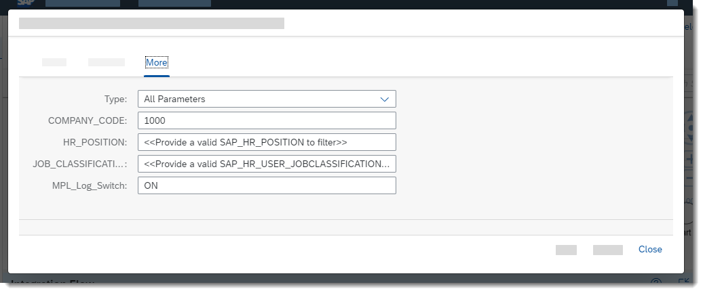

Once you are done, press the **Close** Button. Congratulations, now the integration flow is set up! However before you can run it, you will need to do some customizing in SAP SuccessFactors.

### Customize Position Type and Position in SAP SuccessFactors

[comment]: # (Step 8)
You will now create a custom position type called **Workforce Planning** (technical **`C1`**), so you will be able to differentiate between regular positions in SAP SuccessFactors and planned positions coming from SAP Analytics Cloud. Based on a potential approval work flow, the position type of a planned position could be edited into **Regular Position** (technical **`R`**), once the position has been approved.

Secondly you will make sure the **`creationSource`** of a position is editable, so it can be set to **Workforce Plan** to identify all plan positions.

But let's start with the customer position type. Log on to your SAP SuccessFactors tenant and search for **Manage Data** in the search field and click on the **Manage Data** result to start the application.

In the Manage Data application search for **Position Type** in the **Create New** search field on the right hand side and click on the resulting entry.

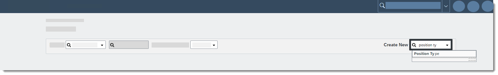

For field **Code** choose the value **Custom Position 1** from the drop down values.

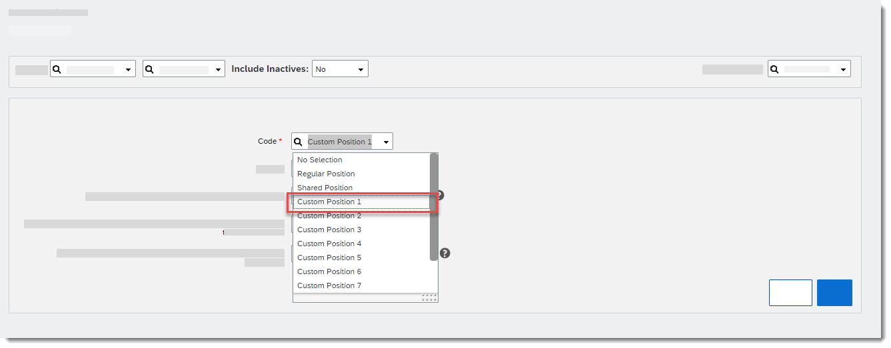

Please maintain the other fields as listed in the table below and press **Save** to save your newly created position type.

|  Field Name     | Value
|  :------------- | :-------------
|  name           | `Workforce Planning`
|  Adapt Reporting Line if Position Hierarchy is changed          | `No, incumbents of the position should report to their existing managers`
|  Execute workflow on job information if position changes are synchronized to incumbents?           | `No`
|  To whom shall the direct reports report if the manager leaves the position?           | `To no Manager`

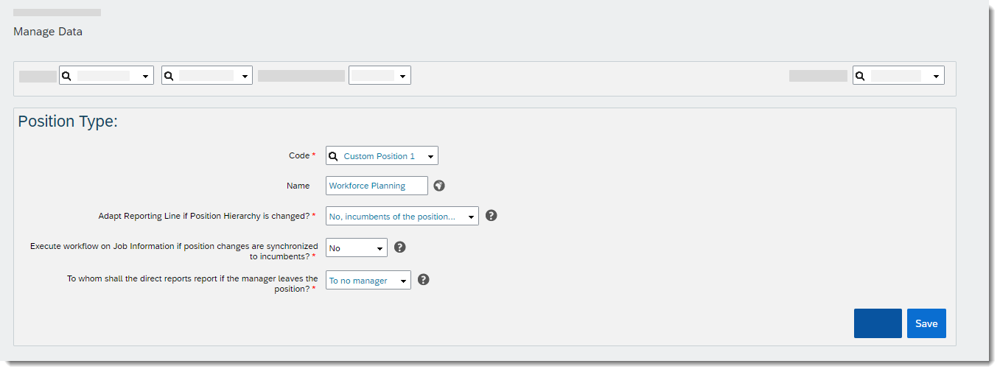

Once you have saved, you will see a green **Successfully Saved** confirm message.

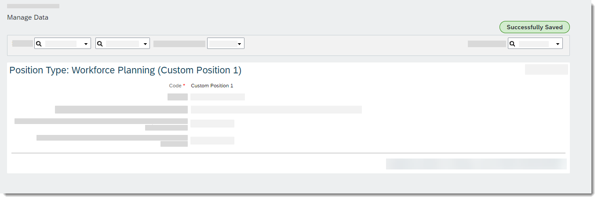

Now let's take care of the **`creationSource`** field of the **Position** object itself.

In the search field enter **Manage Configuration UI** and pick the result entry

Enter **Position** in the search dialogue and choose result **Position UI3 (PositionUI3)** from the result list.

> Depending on the configuration of your tenant, you might be using a different UI for displaying positions, but for this example we stick to **Position UI3 (PositionUI3)**.

Click on the **Edit** Icon next to field **Source of Creation**

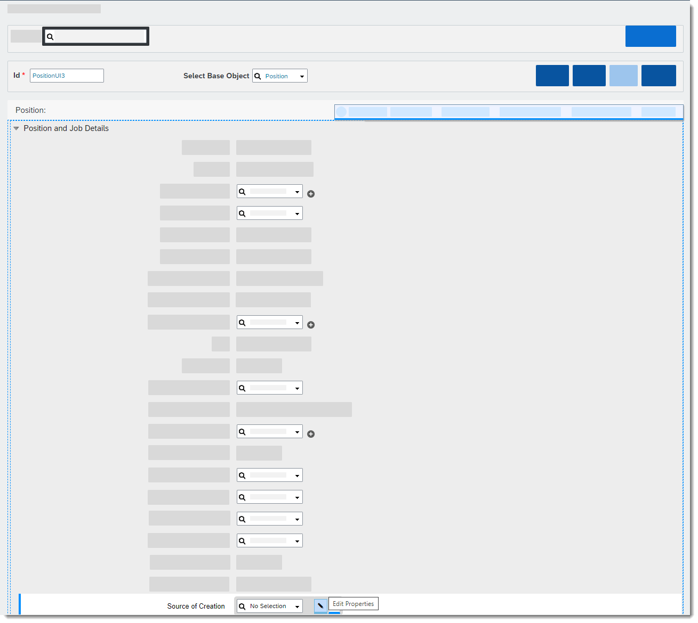

In the properties list for data object Source of Creation make sure

- property **Editable** is set to **Yes**
- property **visible** is set to **Yes**

Then click on the **OK** button to close the property window.

> Depending on the configuration of your tenant, these settings might already be in place. In this case, you don't need to change them.

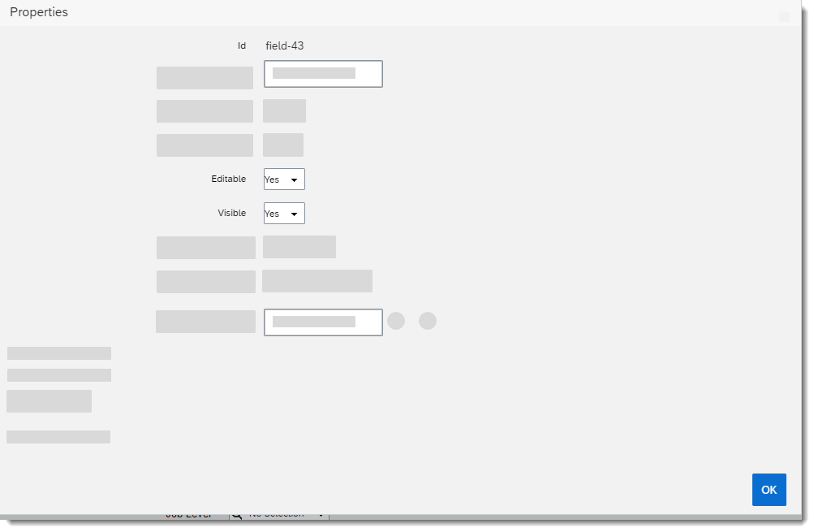

In case you had to change the property settings of field **Source of Creation**, make sure to click the **Save** button to save your changes now to the **Position UI3**.

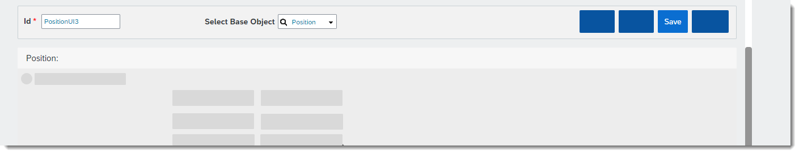

Congratulations, now you are done with all customizing and can get started to do some planning!

### Plan a new Position

[comment]: # (Step 9)
Let's get ready to plan a new position in the HXM Workforce Planning. Logon to your SAC tenant and head over to the HXM Overview Page. Click on the link for the **Detailed Internal FTE Plan**

When the plan application has finished loading, click on the **New Hires** button, so you will be able to plan for a new position.

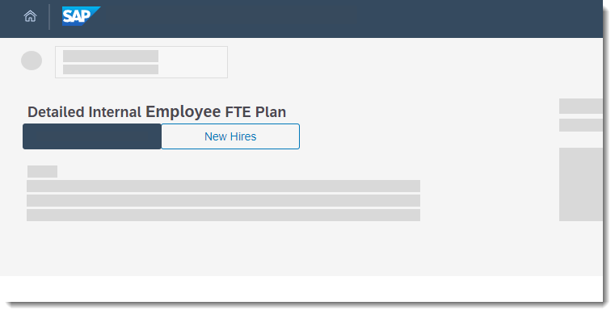

Click on the **Create Position** button.

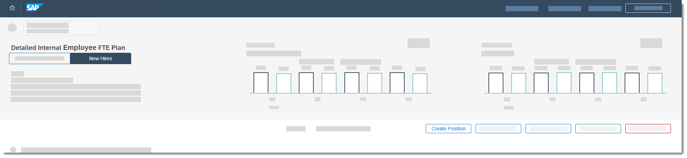

In the opening dialogue, switch on the template function and pick an existing position to serve as a template for you new plan position. Change any of the attribute fields if you like and click on the **Create** button and your new plan position will be created in the SAP Analytics Cloud data model.

After your plan position has been created, you will see it in the FTE table. Make sure to click on the **Confirm** button now to publish you plan version, otherwise your plan position will not be visible in the Data Export API.

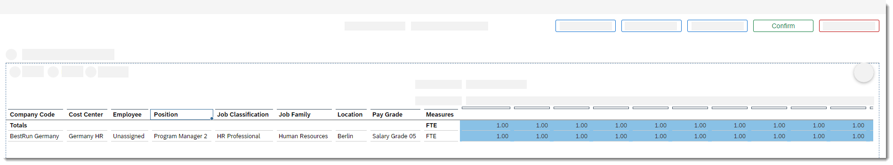
Now your new plan position is ready to be transferred to SAP SuccessFactors.

### Trigger Integration Flow for position write back

[comment]: # (Step 10)
Let's head back to the integration flow in SAP Cloud Integration.

Open the integration flow again and press the **Deploy** button to run it.

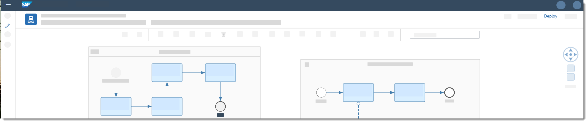
Confirm the Deployment.

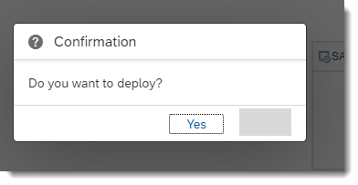

You will get a message that the integration flow is deployed. Let's head over to the logs to find out the newly created position Id.

 Click on the **Eye** Icon to return to the Overview page again and in section **Manage Message Processing** click on the **All Integration Flows Past Hour** tile to enter the Monitor view.

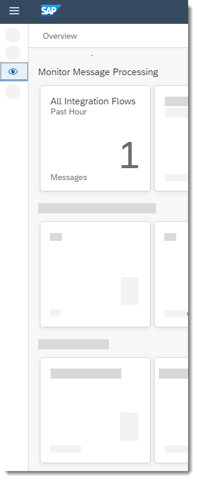

On the left hand side, click on monitor entry for your flow execution. On the right hand side you will see two logs:

- **SAC OData Main Query Filter** for fetching the position data from planning
- **SF Position Insert Response** for inserting the planned positions into SuccessFactors position management

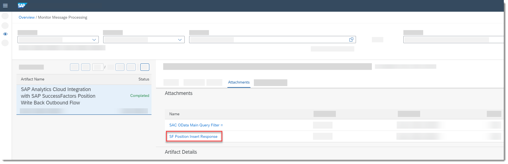

Click on **SF Position Insert Response** to open the log file.
 If your position has been created successfully it will look like this:

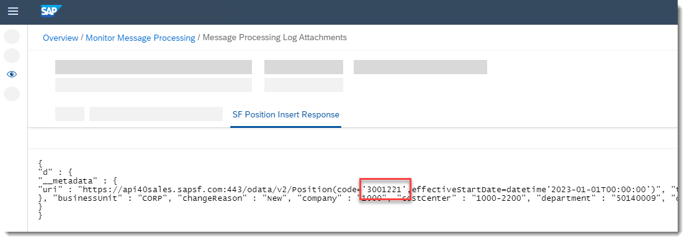

> Take a note of the position Id ( Code ), this is the position Id generated in SAP SuccessFactors

### Verify new position in SAP SuccessFactors

[comment]: # (Step 11)
Now let's verify your newly created position in SAP SuccessFactors. Log on to your SAP SuccessFactors tenant again and go to the **Manage Positions** application by typing **Manage Posit...** into the search field.

In the **Manage Positions** application, select the **Position** option in the **Search** dropdown.

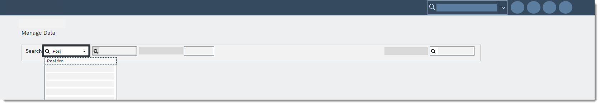

To be able to find your position, you will need to pick an effective as-of-date equals or later than the start period of your plan position (in the example case this was equal to 1st of January 2023).

Now you can search for the position Id that you have noted down in the previous step, select the position found and hit Enter.

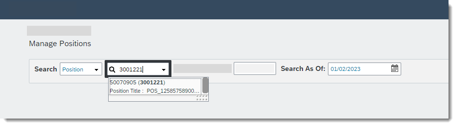

Congratulations, your plan position has successfully been transferred to SAP SuccessFactors. Note the custom position type **Workforce Planning**. You can check through the various attributes that have been transferred with the position.

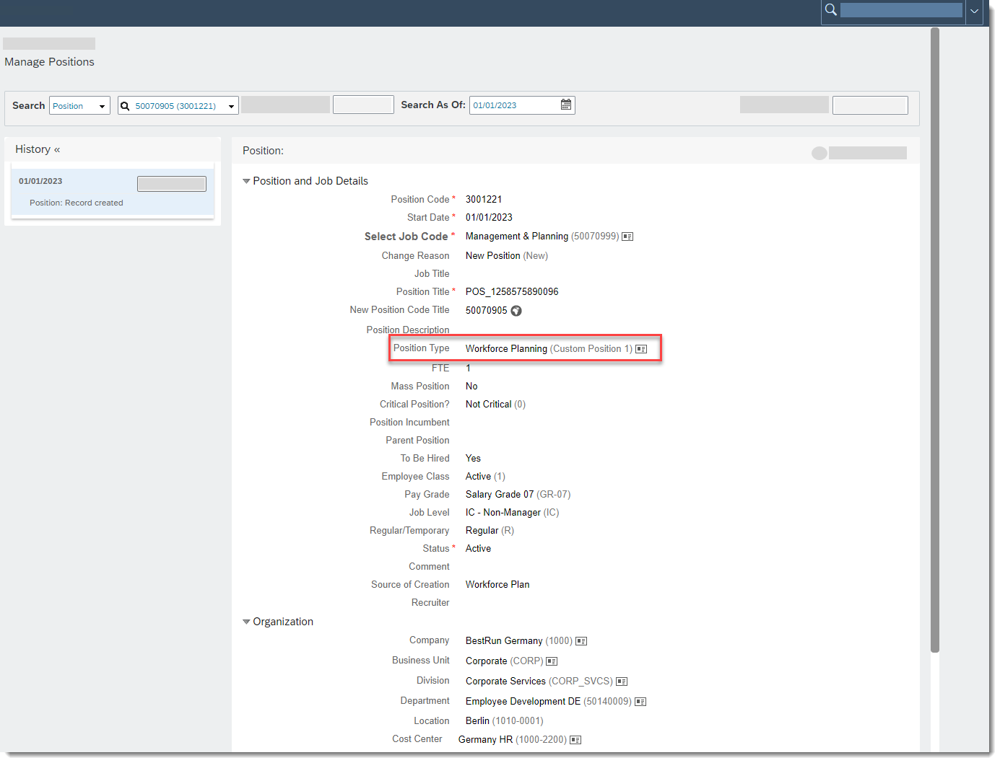

This has just been a basic example on how to do the transfer for one position, but it should get you going to take this to the next level. You can embed this into a seamless end-to-end planning process adding

- orchestration of your planning in SAP Analytics Cloud using the calendar
- exposing the Cloud Integration Flow for external API calls
- using scheduling features for the transfer
- creating notifications in SAP SuccessFactors for finalizing the created position with all needed attributes

Interested in more xP&A topics and related business content packages? Visit our community page [Extended Planning & Analysis Business Content](https://community.sap.com/topics/cloud-analytics/planning/content?source=social-Global-SAP+Analytics-YOUTUBE-MarketingCampaign-Analytics-Analytics-spr-5330779922).

---
