## Prerequisites
 - This tutorial is designed for SAP HANA on premise and SAP HANA, express edition. It is not designed for SAP HANA Cloud.
 - You have [created a user interface](xsa-cap-create-ui).
 - You have administration access to the XS Advanced cockpit in SAP HANA (e.g., like user `XSA_ADMIN` in SAP HANA, express edition).

## Details
### You will learn
  - How to create an instance of the User Authentication and Authorization service
  - How to incorporate security into the routing endpoint of your application

This tutorial can be completed in SAP HANA, express edition SPS04 or higher.

---

[ACCORDION-BEGIN [Step 1: ](Define the security model for your application)]

You will first define the different roles a user could have when using your application. As the developer of the application, you will define the roles. Then, an administrator would create the roles and assign them to the different users. In this tutorial, it is assumed you are the administrator of your instance so you will be performing this task, too.

Create a file called `xs-security.json` in the root folder of your application.

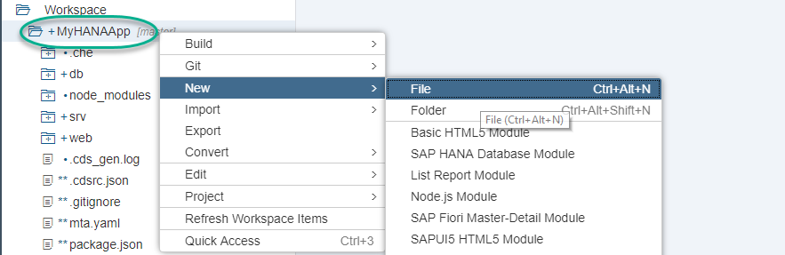

Paste the following content into the file and save it

```JSON
{
	"xsappname": "myHanaApp",
  "tenant-mode": "dedicated",
	"scopes": [{
		"name": "$XSAPPNAME.Display",
		"description": "display"
	}, {
		"name": "$XSAPPNAME.Create",
		"description": "create"
	}, {
		"name": "$XSAPPNAME.Edit",
		"description": "edit"
	}, {
		"name": "$XSAPPNAME.Delete",
		"description": "delete"
	}, {
		"name": "xs_authorization.read",
		"description": "Read authorization information from UAA"
	}, {
		"name": "xs_authorization.write",
		"description": "Write authorization information to UAA"
	}],
	"attributes": [{
		"name": "country",
		"description": "country",
		"valueType": "s"
	}],
	"role-templates": [{
      "name": "Token_Exchange",
      "description": "UAA",
      "scope-references": [
        "uaa.user"
      ]
    },{
		"name": "Viewer",
		"description": "View all records",
		"scope-references": [
			"$XSAPPNAME.Display"
		],
		"attribute-references": [
			"country"
		]
	}, {
		"name": "Editor",
		"description": "Edit and Delete records",
		"scope-references": [
			"$XSAPPNAME.Create",
			"$XSAPPNAME.Edit",
			"$XSAPPNAME.Delete",
			"$XSAPPNAME.Display"
		]
	}]
}
```

**Save** the file.

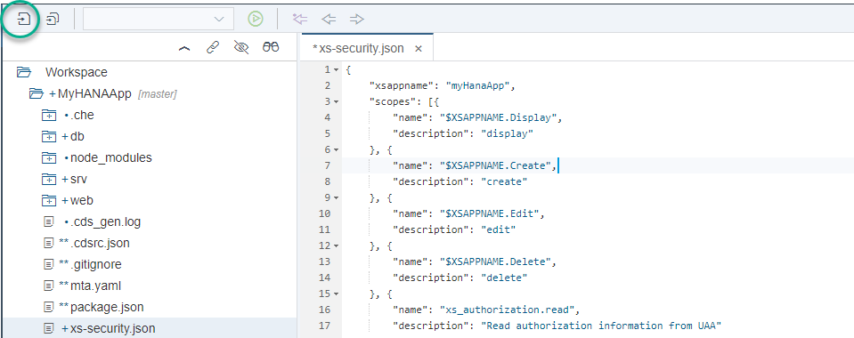

[DONE]
[ACCORDION-END]

[ACCORDION-BEGIN [Step 2: ](Create an instance of the UAA service)]


The User Authentication and Authorization service is a backing service. You will create an instance of it and attach it to your application so that a user needs to authenticate before accessing it through your web module.

Navigate to the Resource Manager in the Web IDE and delete the resource instance for the `uaa_MyHANAApp`.  This will cause the UAA instance to be recreated with the new xs-security.json settings upon next run of your modules.

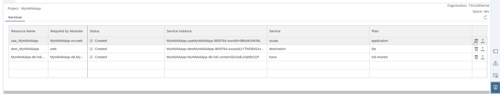

> ### What is going on?
>
> You are creating an instance of the UAA service so that users authenticate and have different access restricted depending on the roles that are assigned to them.
>&nbsp;
>

[DONE]
[ACCORDION-END]


[ACCORDION-BEGIN [Step 3: ](Add UAA as a resource)]

You now need to declare the instance of the UAA service as a dependency in the deployment descriptor. During the deployment process, this will tell the platform that the instance is needed for some of the micro-services to run. It will also bind the service to the application.

Open the MTA editor in graphical mode and click **Resources**. Use the **+** button to create a new resource.

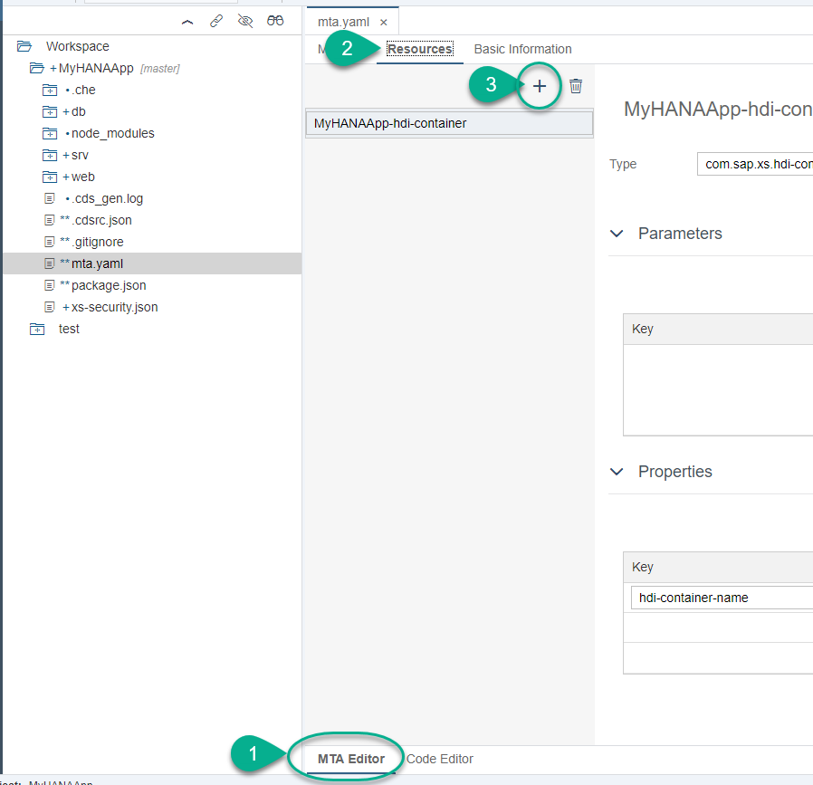

Call the resource `app-uaa` and choose type `com.sap.xs.uaa-space`.

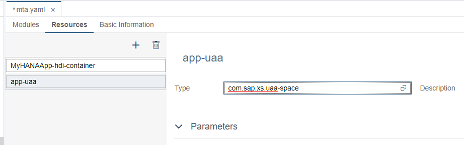

Under **Parameters**, use the following key-value pair:

- **Key:** `path`
- **Value:** `xs-security.json`

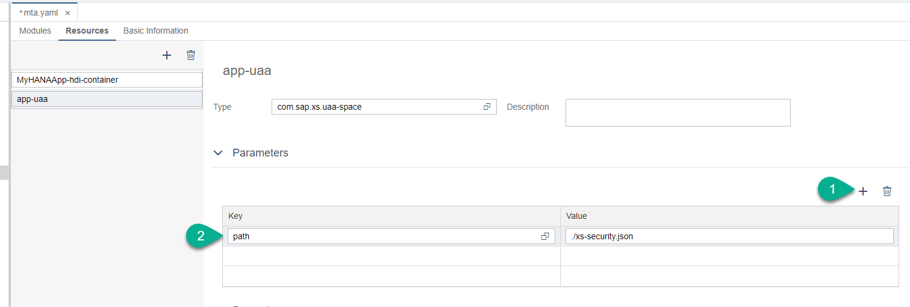

**Save** the changes.

Add the service instance as a dependency to the web application.

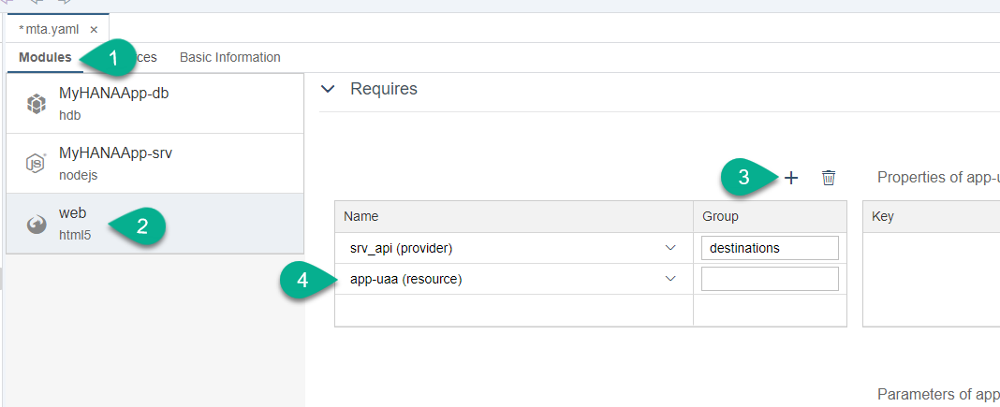

Add the dependency to the `srv` application, too.

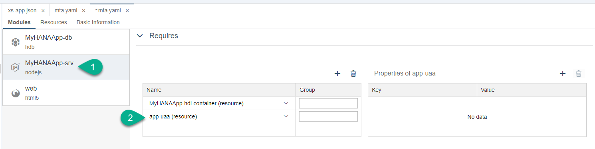

Remember to **Save**.

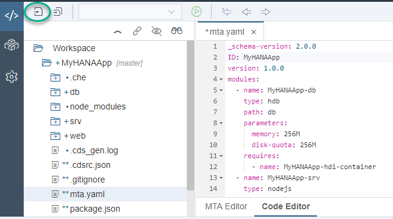

> For further reference, here is an example of what the `MTA.yaml` file looks lie:
> ```YAML
> _schema-version: 2.0.0
> ID: MyHANAApp
> version: 1.0.0
> modules:
>   - name: MyHANAApp-db
>     type: hdb
>     path: db
>     parameters:
>       memory: 256M
>       disk-quota: 256M
>     requires:
>       - name: MyHANAApp-hdi-container
>   - name: MyHANAApp-srv
>     type: nodejs
>     path: srv
>     parameters:
>       memory: 512M
>       disk-quota: 256M
>     provides:
>       - name: srv_api
>         properties:
>           url: '${default-url}'
>     requires:
>       - name: MyHANAApp-hdi-container
>       - name: app-uaa
>   - name: web
>     type: html5
>     path: web
>     requires:
>       - name: srv_api
>         group: destinations
>         properties:
>           name: srv_api
>           url: '~{url}'
>           forwardAuthToken: true
>       - name: app-uaa
> resources:
>   - name: MyHANAApp-hdi-container
>     type: com.sap.xs.hdi-container
>     properties:
>       hdi-container-name: '${service-name}'
>   - name: app-uaa
>     type: com.sap.xs.uaa-space
>     parameters:
>       path: xs-security.json
> ```

[DONE]
[ACCORDION-END]

[ACCORDION-BEGIN [Step 4: ](Modify routing)]

The web module will be the entry endpoint to the service modules, which in turn expose access to the database.

If you expand the web module, in `package.json`, you will see the start command calls a library from the SAP repository called `approuter`. This module will receive the requests and evaluate to which backend application they need to be routed. This module will also call the authentication service if the route is defined as needing authentication.

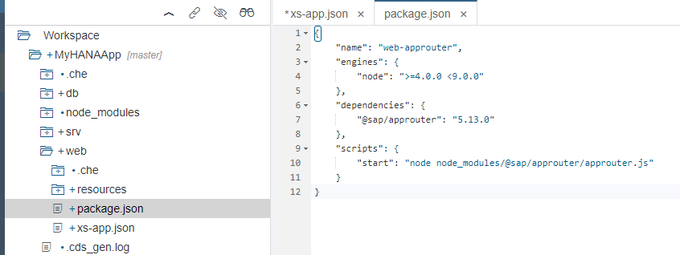

You will now modify the routing to add authentication. Open the file `xs-app.json` and change the `authenticationMethod` to **route**.

Add a comma after the last key-value pair and add the following within the route:

```JSON
"authenticationType": "xsuaa"
```

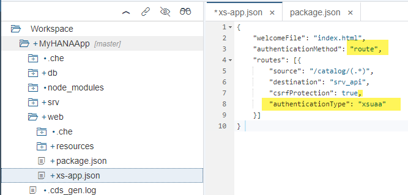

If you are working in the SAP Web IDE Full-stack please add this entry to both routes.

**Save** the changes.

This will tell the `approuter` module that each route will define its own authentication method and that the Node.js module, referred to as the `srv_api` destination, needs authentication. This means that an authentication token will be needed before the request can be routed to and responded by the `srv_api` destination.

As a reminder of what you modified in the [previous tutorial](xsa-cap-create-ui), the `mta.yaml` file is declaring the destination and allowing the authentication token to be forwarded.

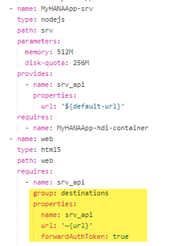


> Some more information about how routing works can be found in [this blog post](https://blogs.sap.com/2018/02/16/xs-advanced-for-not-so-dummies-routing/).


[DONE]
[ACCORDION-END]

[ACCORDION-BEGIN [Step 5: ](Test the application)]

Before adding authentication, when you [created the CDS services and user interface](xsa-cap-create-ui), you could access the web module without authentication. Run the web module again and use the URL in a different browsing mode (e.g., incognito) or a different browser in which you are not logged in.

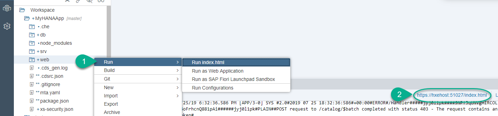

[DONE]
[ACCORDION-END]

---
