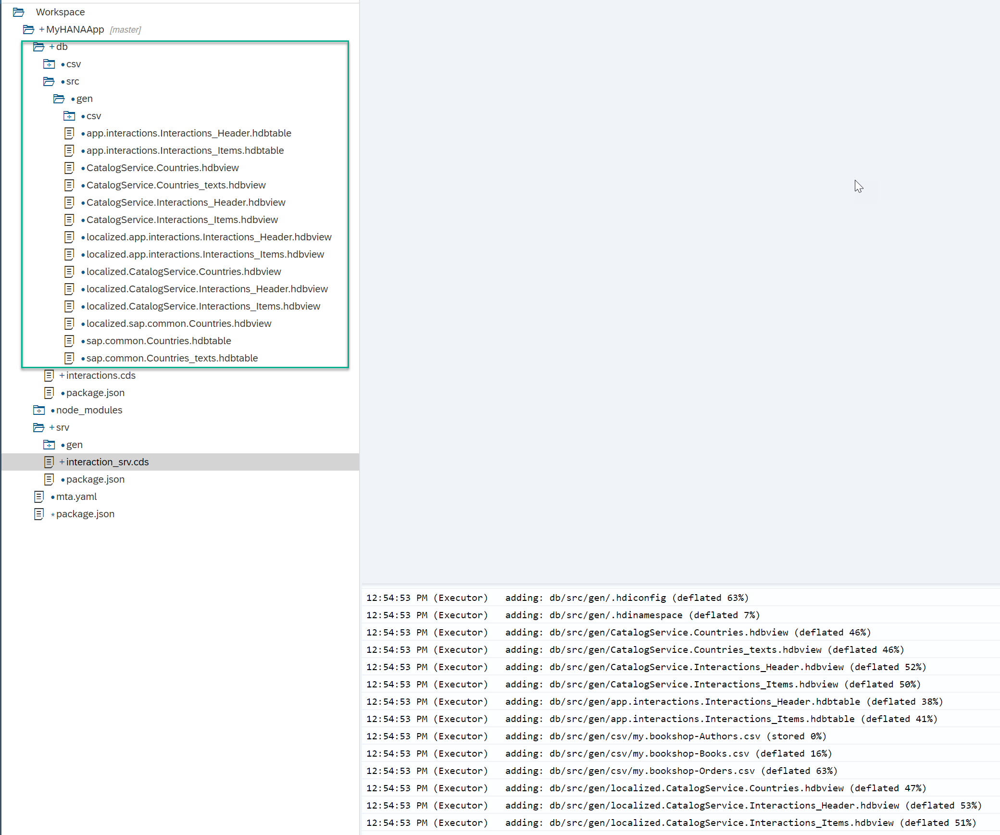
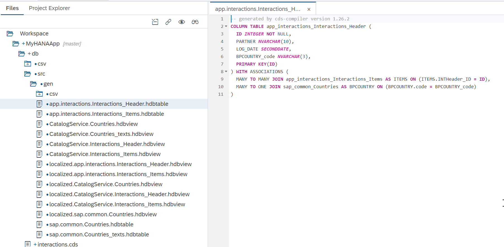
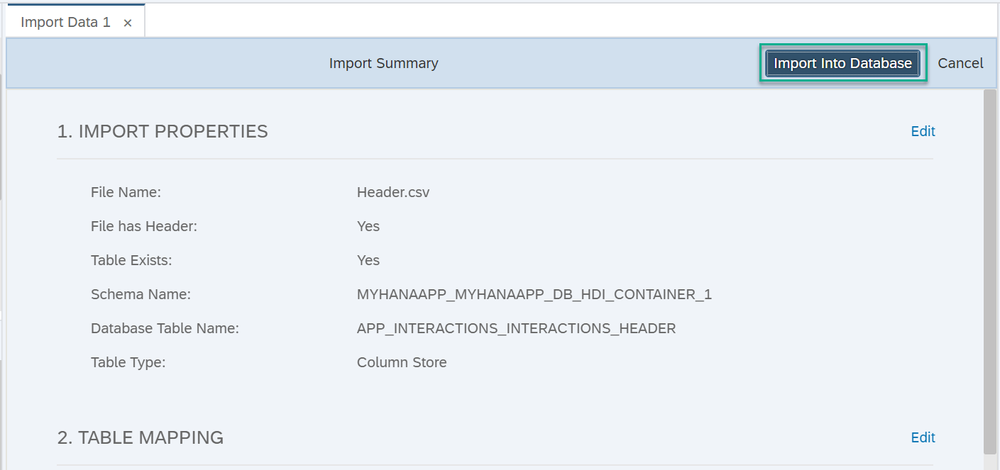

## Prerequisites
 - This tutorial is designed for SAP HANA on premise and SAP HANA, express edition. It is not designed for SAP HANA Cloud.
 - You have created an application using the [Business Application wizard](xsa-cap-create-project).

## Details
### You will learn
  - How to use core data services to create simple database entities
  - How to define database-agnostic artifacts in the persistence module

The Cloud Application Programming model utilizes core data services to define artifacts in the database module. Because this model is meant to be database-agnostic -- i.e., work with any database -- it does not allow you to leverage features that are specific to SAP HANA. For this reason, you will create two tables that do not require any advanced data types.

---

[ACCORDION-BEGIN [Step 1: ](Create database entities)]

In the `db` module, you will find a file called `data-model.cds`. Right-click on it and choose **Rename**.


Use the following name:

```Name
interactions.cds
```

**Double-click** on the file to open it.


Replace the default contents with the following:

```CDS
namespace app.interactions;

using { Country } from '@sap/cds/common';
type BusinessKey : String(10);
type SDate : DateTime;
type LText : String(1024);


entity Interactions_Header {
  key ID : Integer;
  ITEMS  : association to many Interactions_Items on ITEMS.INTHeader = $self;
  PARTNER  : BusinessKey;
  LOG_DATE  : SDate;
  BPCOUNTRY	: Country;

};
entity Interactions_Items {

	key INTHeader : association to Interactions_Header;
	key TEXT_ID : BusinessKey;
		LANGU	: String(2);
		LOGTEXT	: LText;
};

```


> ### What is going on?
>
> You are declaring two entities with an association to each other. The design-time artifacts declared in this file will be converted to run-time, physical artifacts in the database. In this example, the entities will become tables.


[DONE]
[ACCORDION-END]

[ACCORDION-BEGIN [Step 2: ](Adapt service call)]

Locate the other `cds` file (this file may be called `cat-service.cds` or `my-service.cds`, depending on the IDE) in the `srv` folder and rename it.


Use the following name:

```Name
interaction_srv.cds
```

Double-click to open it and replace the existing content with the following:

```CDS

using app.interactions from '../db/interactions';
service CatalogService {

 entity Interactions_Header
	@readonly
	as projection on interactions.Interactions_Header;

 entity Interactions_Items
	@readonly
	as projection on  interactions.Interactions_Items;

}

```

Click **Save all**.


> ### What is going on?
>
> You are declaring services to expose the database entities you declared in the previous step.

Open the package.json file in the root of your project.  Add a section to the `cds` configuration to include the following

```JSON
"hana": {
   "deploy-format": "hdbtable"
}
```


Right-click on the CDS declaration of the services and choose **Build > Build CDS**.


Look into the console to see the progress. You can scroll up and see what has been built


[DONE]
[ACCORDION-END]


[ACCORDION-BEGIN [Step 3: ](Explore the generated design-time artifacts)]

If you pay attention to the build log in the console, you will see the `CDS` artifacts were converted to `hdbtable` and `hdbview` artifacts. You will find those artifacts in a new folder under `src` called `gen`.



You will now convert those CDS files specific to SAP HANA into runtime objects (tables). Right-click on the database module and choose **Build**.


Note: If you get an error during the build process, this could be caused by an older version of the XSA Runtime in HANA, express edition.  If your XSA version still contains Node.js version 8.x; this can lead to errors when building because this version of Node.js is no longer supported at the OS level.  Newer versions of the XSA runtime only contain Node.js version 10.x and 12.x.  If you do receive an error at this point, we would suggest editing the `/db/package.json` like the following to force the usage of the newer version of the Node.js runtime.

```json
{
	"name": "deploy",
	"dependencies": {
		"@sap/hdi-deploy": "^3"
	},
	"scripts": {
		"postinstall": "node .build.js",
		"start": "node node_modules/@sap/hdi-deploy/deploy.js"
	},
	"engines": {
		"node": "^10 || ^12"
	}
}
```

Scroll up to in the console to see what the build process has done.

> ### What is going on?
>
> CDS stands for Core Data Services. This is an infrastructure that allows you to create persistency and services using a declarative language. Notice how you are using the same syntax to define both the persistency and the services.
>&nbsp;
> You can find more information on CDS [in the help](https://help.sap.com/viewer/65de2977205c403bbc107264b8eccf4b/Cloud/en-US/855e00bd559742a3b8276fbed4af1008.html)
>
>You defined a CDS artifact, this is an abstraction, a design-time declaration of the entities to be represented in a database and the services to expose them.
>&nbsp;
> 
>
>The original `.cds` file was translated into `hdbtable`, which is the SQLDDL syntax specific to SAP HANA when you saved all of the files.
>&nbsp;
> 
>
>These `hdbtable` files were then translated into runtime objects such as tables in the HANA database.
>
> 
>
> If you checked the services in your space, you would see the service for your [HDI container](https://help.sap.com/viewer/4505d0bdaf4948449b7f7379d24d0f0d/2.0.03/en-US/e28abca91a004683845805efc2bf967c.html).
>
> 
>
> or for the HANA Cloud trial:
>
> 
>
> You can also check the resources in your space using the resource manager in SAP Web IDE:
>
> 
>
> You can find a similar example and further context on Core Data and Services in [this explanatory video](https://www.youtube.com/watch?v=O0qSsbnx3u8&list=PLoc6uc3ML1JR38-V46qhmGIKG07nXwO6X&index=6)

[DONE]
[ACCORDION-END]

[ACCORDION-BEGIN [Step 4: ](Check the Database Explorer)]

You can now check the generated tables and views in the database explorer. Right-click on the database module and select **Open HDI Container**.


Once open, navigate to the `Tables` section and double-click on the `Header` table.


Note the name of the table matches the generated `hdbtable` artifacts. You will also see the physical schema managed by the HDI container.

> Unless a name is specified during deployment, HDI containers are automatically created with names relative to the project and user generating them. This allows developers to work on different versions of the same HDI container at the same time.
> 

[DONE]
[ACCORDION-END]

[ACCORDION-BEGIN [Step 5: ](Load data into your tables)]

Download the [header file](https://github.com/SAPDocuments/Tutorials/raw/master/tutorials/xsa-cap-create-database-cds/Header.csv) and the [items file](https://github.com/SAPDocuments/Tutorials/raw/master/tutorials/xsa-cap-create-database-cds/Items.csv) into your local file system.

Right-click again on the header table and choose **Import Data**.


Browse for the `Header` file and click **Step 2**.


Keep the default table mapping and click **Step 3**.


Click **Show Import Summary**.


And then **Import into Database**.



You will see confirmation that 3 records have imported successfully.


Repeat the process with the `Items.csv` file into the `Items` table.


[DONE]
[ACCORDION-END]

[ACCORDION-BEGIN [Step 6: ](Check data loaded into the tables)]

You can now check the data loaded into the tables. Right-click on the `Items` table and click **Generate Select Statement**.


Add the following WHERE clause to the SELECT statement and execute it to complete the validation below.

```SQL
where "LOGTEXT"  like '%happy%';
```

[VALIDATE_1]
[ACCORDION-END]


---
