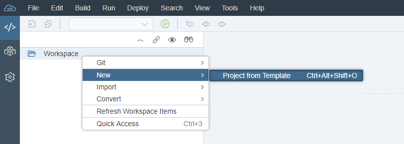
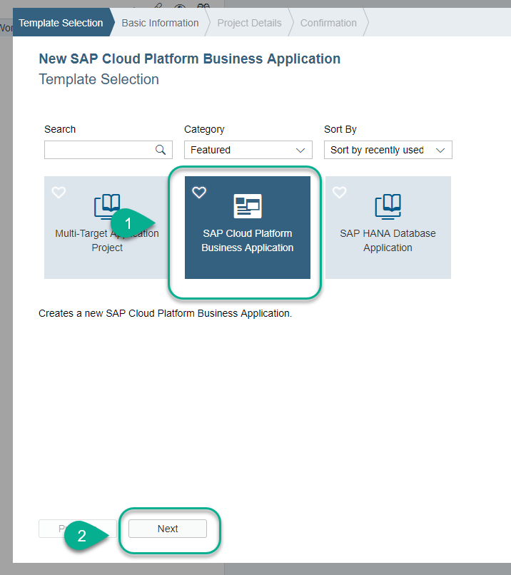
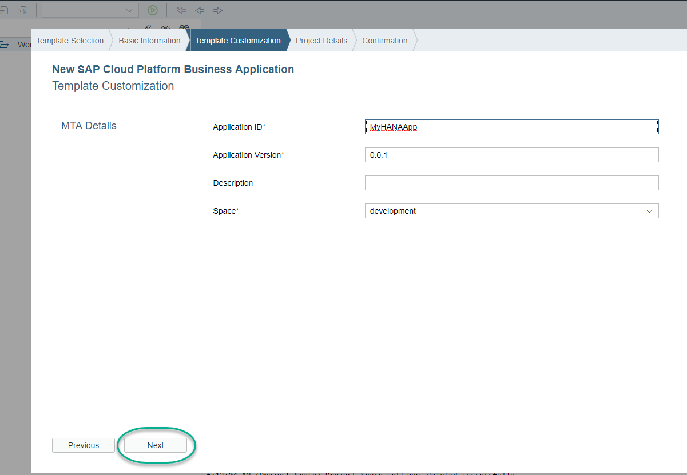
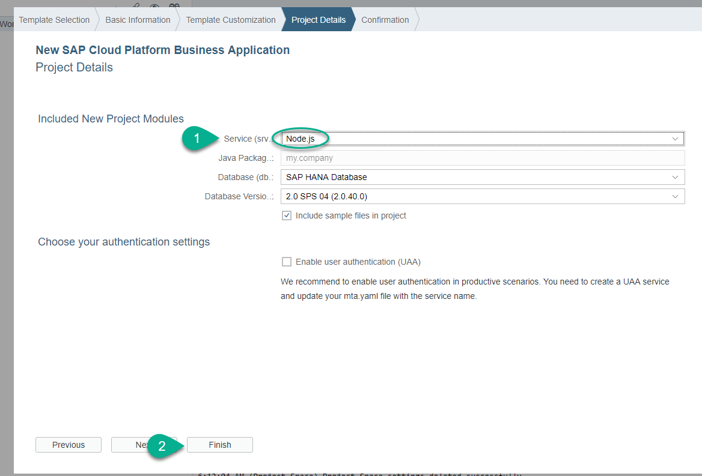
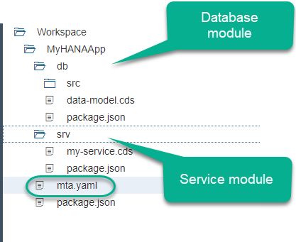
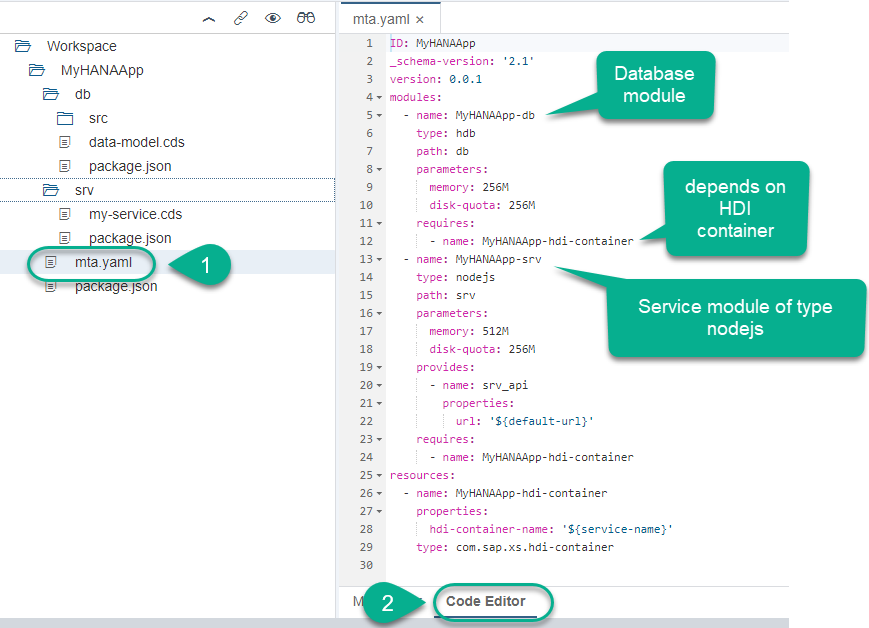
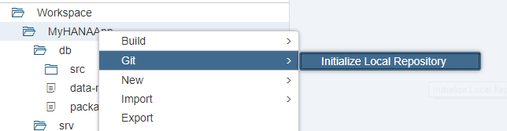
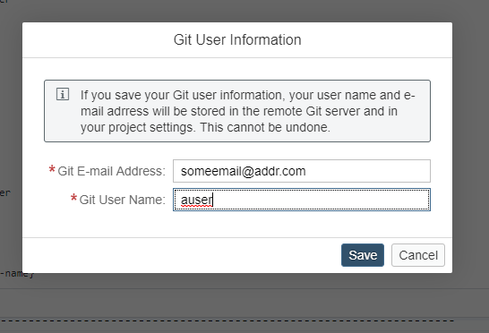
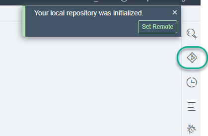
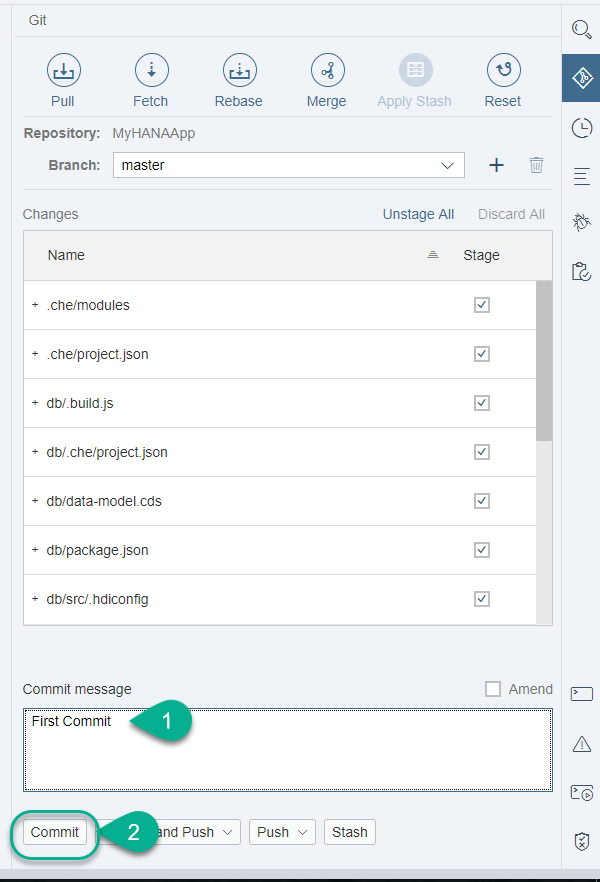

## Prerequisites
 - **This tutorial works in SAP HANA, express edition**.
 - You have logged in to SAP Web IDE for SAP HANA. To find out more about SAP Web IDE and other tools in you SAP HANA, express edition instance, [refer to this tutorial](https://developers.sap.com/tutorials/xsa-explore-basics.html)
 - If you are planning on continuing the series in XS Advanced, it is recommended to [map the development space to the tenant database](https://developers.sap.com/tutorials/xsa-tenant-db-space.html) **before starting development**.


## Details
### You will learn
  - How to create an application with the wizard for the Cloud Application Programming model
  - How to use the local Git repository for development/testing purposes.

The images in this tutorial are based on SAP HANA, express edition SPS04. SAP Web IDE Full Stack may have some minor differences.

---

[ACCORDION-BEGIN [Step 1: ](Create a new Project)]

Log in to SAP Web IDE.

> The default URL for SAP Web IDE in SAP HANA, express edition is `https://hxehost:53075`. The default user is `XSA_DEV`

**Right-click** on `Workspace` and select `New-> Project from Template`



Choose the `SAP Cloud Platform Business Application` and click **Next**.



Use the following name for your project and click **Next**

```text
MyHANAApp
```
> **This name will be used in different steps**. It is recommended that you do not change it unless you remember to replace it in future tasks.



Choose `Node.js` as the service module and click **Finish**



[DONE]
[ACCORDION-END]

[ACCORDION-BEGIN [Step 2: ](Explore the generated artifacts)]

The wizard has generated a Multi-target Application with two modules: a database module and a service module. Expand them to familiarize yourself with the basic folder structure.



The wizard has also populated the `mta.yaml` configuration file with the necessary dependencies and parameters for each module. Open it in `Code Mode` to explore it.



This file is the deployment descriptor and it is the glue that keeps all the micro-services together as a single application throughout its lifecycle. It declares the modules (applications or micro-services) and their dependencies with other micro-services or backing services. You can also use this file to inject variables into the environment variable `VCAP_SERVICES` of your application.

> This file is very sensitive to indentation and does not allow for tabs.


[DONE]
[ACCORDION-END]


[ACCORDION-BEGIN [Step 3: ](Initialize local Git repository)]

You will use the local Git repository for basic version management.

**Right-click** on the project and choose `Git -> Initialize Local Repository`.



You will be asked for an email address and user ID for a remote GitHub server. You can enter bogus values if you do not have an account in a remote GitHub repository.



After a few seconds, you will see a success message in the top right corner. Use the Git icon next to it to open the Git pane.



[DONE]
[ACCORDION-END]

[ACCORDION-BEGIN [Step 4: ](Perform your first commit)]

Each time you commit to the local or remote repository, you create a version. This will allow you to revert and compare any changes.
**It is recommended that you perform commits at the end of each tutorial.**


Add a commit message and **click Commit**:



> It is recommended to set a remote repository in, for example, GitHub. This will allow you to have a copy of your code outside your SAP HANA instance.

Click the `console` icon and look at the messages to complete the validation below:

[VALIDATE_1]
[ACCORDION-END]

---
