## Prerequisites
 - This tutorial is designed for SAP HANA on premise and SAP HANA, express edition. It is not designed for SAP HANA Cloud.
 - You have created a Multi-Target Application using the Cloud Application Programming Model.
 - You have created database artifacts and loaded data as explained in [this tutorial](xsa-cap-create-database-cds).

## Details
### You will learn
  - How to create an HTML5 web interface
  - How to configure the `approuter`

---

[ACCORDION-BEGIN [Step 1: ](Build the services)]

Return to the code editor and right-click on the `srv` folder. In the file `interaction_srv.cds` you created the definition for two read-only services that expose the header and items entities in your database module.

Choose **Run > Run as Node.js Application**.

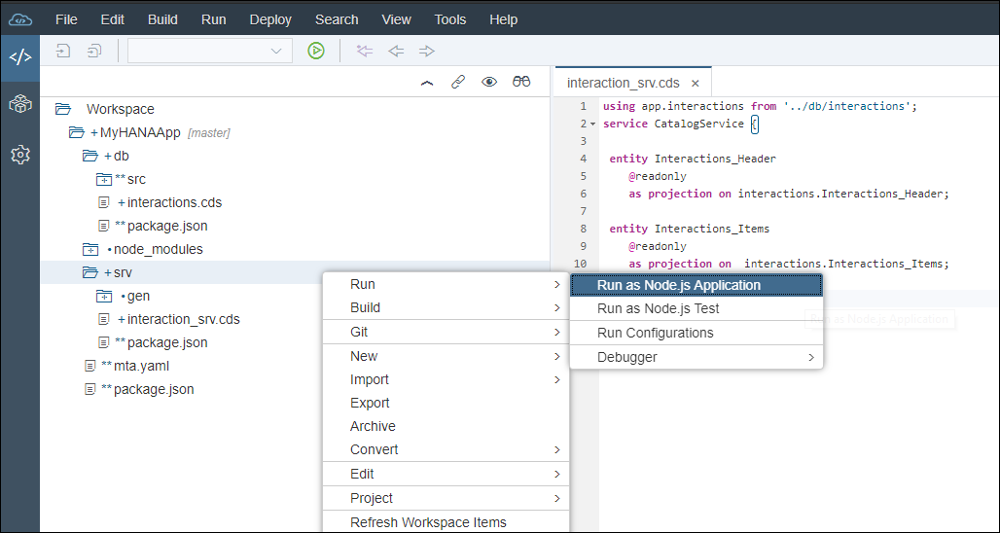

You will see the run console shows the progress. Once the application is running, click the URL to open the service.

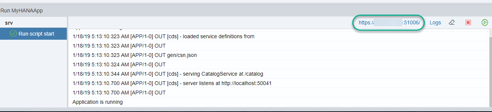

You should see the list of entities you exposed.

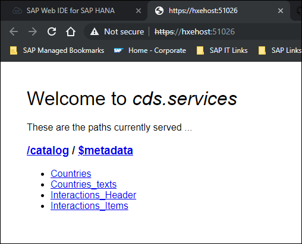

You can click on the entities to see the values in a JSON format.

[DONE]
[ACCORDION-END]

[ACCORDION-BEGIN [Step 2: ](Test the services)]

Add `$metadata` to the service and you can see a technical description of the service (for example, `https://hxehost:51026/catalog/$metadata` ).

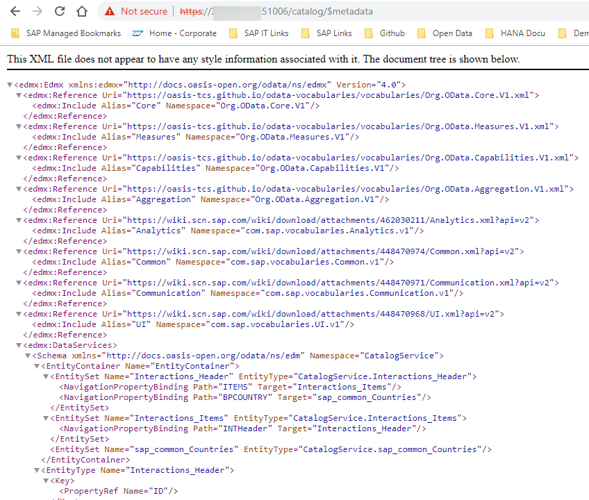

You can use different methods in the OData v4 services you have created. Go back to the welcome page for the service and click `Interactions_Items`. Add the following to the URL:

```URL
?$search=DE
```
For example, `https://hxehost:51026/catalog/Interactions_Items?$search=DE`:

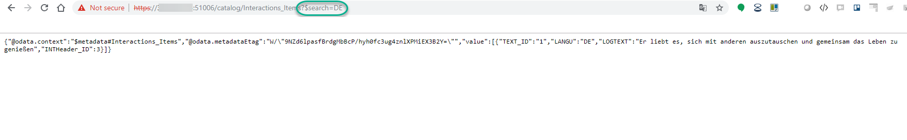

You can find out more about OData V4 at the [OData organization](https://www.odata.org/documentation/) and the [documentation for SAPUI5](https://help.sap.com/viewer/b4b7cba328bc480d9b373c7da9335537/2.05/en-US/7f29fb3ce5964d8090038a9d3cdf5060.html).

[DONE]
[ACCORDION-END]


[ACCORDION-BEGIN [Step 3: ](Configure routing)]

You will now create a basic web module. This module is very important as it will become the entry point for your application. Every request coming to this module will be routed into the different backend services.

Right-click on the project folder and choose **New > Basic HTML5 Module**  (or just **New > HTML5 Module** if using the SAP Web IDE Full-stack).


If using the SAP Web IDE Full-stack there will be a question here asking for template selection. Please choose **SAPUI5 Application**.

Call it `web` and click **Finish**.

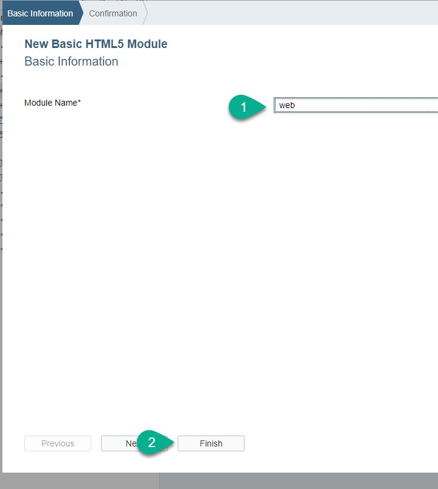

Since the web module will be receiving the requests and routing them into the proper processing backend services, such as the OData service you have just defined, it will also be responsible for enforcing authentication.

These routing logics are done by an application called `approuter`. You can see the Node.js module being called as the starting script for the web module as defined in the file `package.json`.

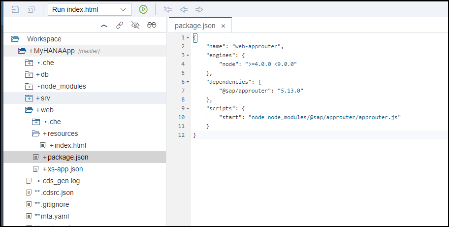

The `approuter` will scan the file `xs-app.json` to route patterns in the request to the right destinations.

Replace the content of `xs-app.json` with the following content if you are using SAP Web IDE for SAP HANA:

```JSON

{
	"welcomeFile": "index.html",
	"authenticationMethod": "none",
	"routes": [{
		"source": "/catalog/(.*)",
		"destination": "srv_api",
		"csrfProtection": true
	}]
}
```

If you are using the SAP Web IDE Full-stack, use this code instead:

```JSON
{
	"welcomeFile": "index.html",
	"authenticationMethod": "none",
	"routes": [{
		"source": "/catalog/(.*)",
		"destination": "srv_api",
		"csrfProtection": true
	},
	{
		"source": "^/web/(.*)$",
		"target": "$1",
		"localDir": "webapp"
	}]
}
```

**Save** the changes.

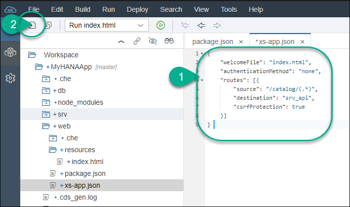

Among other information, this configuration is declaring that requests containing the pattern `/catalog/(.*)` are routed to a destination called `srv_api`.

This destination can be defined in the `mta.yaml` file.


[DONE]
[ACCORDION-END]

[ACCORDION-BEGIN [Step 4: ](Edit the deployment descriptor)]

When an application is deployed, the `mta.yaml` file is used to establish the dependencies between the modules and resources. During this binding process, environment variables such as the name of the destinations are set.

Open the `mta.yaml` file and you will notice the `srv` module provides a variable called `url`. This variable is taking the value of the default URL provided at runtime.

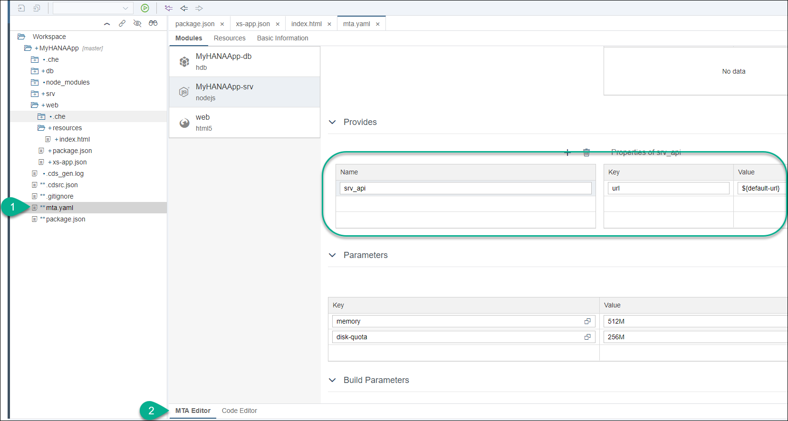

Click on the web module. You will establish its dependency with the `srv` module and declare the destination. The name of the destination here needs to match the name you used in `xs-app.json` in the previous step.

1. Add a new **Requires** entry for the web module.

2. Choose `srv_api` under **Requires** in the dropdown.

3. Enter **`destinations`** under **Group**.

4. Fill in the properties with the following key-value pairs ...

    | **Key**       | **Value**           
    | ------------- |:-------------:|
    | name      | `srv_api`
    | `url`      | `~{url} `     
    | `forwardAuthToken` | true      |

    ... as follows:

    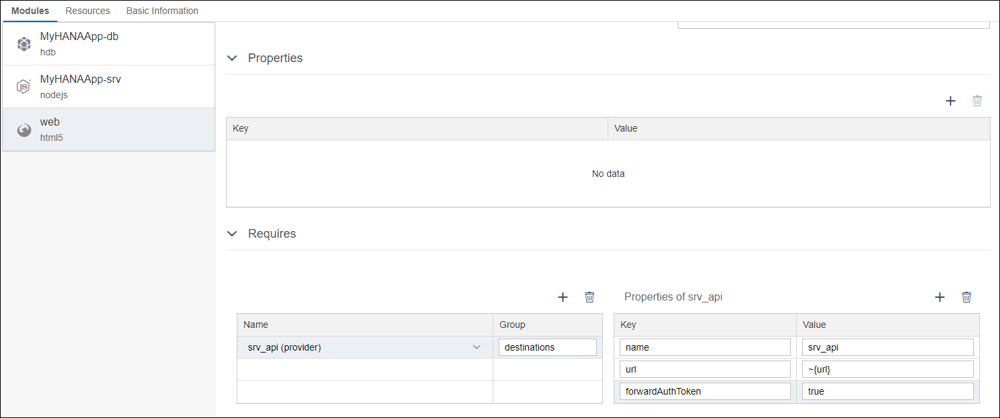

4. **Save** the changes in the deployment descriptor file.

Here is what the file looks like in the code editor:

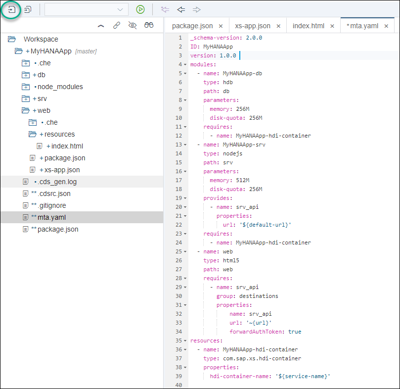


> For more information and examples about the `approuter`, refer to this [section in the help](https://help.sap.com/viewer/4505d0bdaf4948449b7f7379d24d0f0d/2.0.04/en-US/6ba89596e3a64a5480c3977d4ea7fdba.html).

[DONE]
[ACCORDION-END]

[ACCORDION-BEGIN [Step 5: ](Create a quick and dirty web interface)]

Open the index.html file generated by the wizard in your web module.

Replace the entire contents with the following code:

```HTML
<!DOCTYPE html>
<html>
	<head>
		<meta charset="utf-8">
	    <meta name="viewport" content="width=device-width, initial-scale=1.0">
		<title>web</title>
<!-- 1.) Load SAPUI5 (from a remote server), select theme and control library -->
<script src="https://sapui5.hana.ondemand.com/resources/sap-ui-core.js"
	id="sap-ui-bootstrap" data-sap-ui-libs="sap.m, sap.ui.table"
	data-sap-ui-theme="sap_fiori_3">
		</script>

	<script>

	var oModel = new sap.ui.model.odata.v4.ODataModel({  synchronizationMode : "None", serviceUrl : "/catalog/" });
	var oTable = new sap.ui.table.Table({ title: "My first table" });
	oTable.addColumn(new sap.ui.table.Column({ label: "Text", template: "LOGTEXT" }));
	oTable.setModel(oModel);
	oTable.bindRows("/Interactions_Items");
	oTable.placeAt("uiArea");

	</script>
	</head>
	<body class="sapUiBody">
		<div id="uiArea"></div>
	</body>
</html>
```

**Save** the changes.

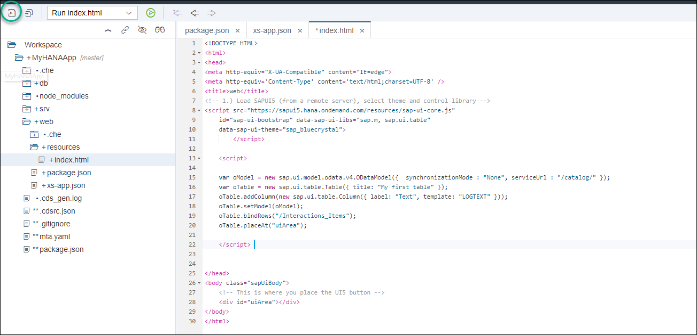

This very simple code is creating a model from the OData V4 service and using it in a table. This is only test code to show the consumption of the model, but there is a lot to improve here.

**Run** the `srv` module again.

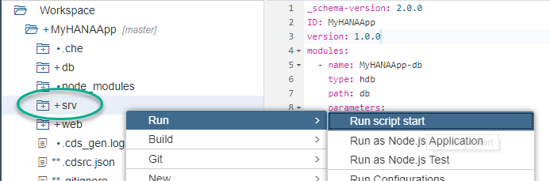

Once the `srv` module is running, run the web module if you are using the SAP Web IDE for SAP HANA.

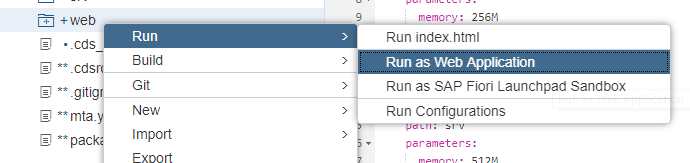

If you are instead using the SAP Web IDE Full-stack, please choose Run Configurations for the web module.  Then select Run on Cloud Foundry and press the Save and Run button.

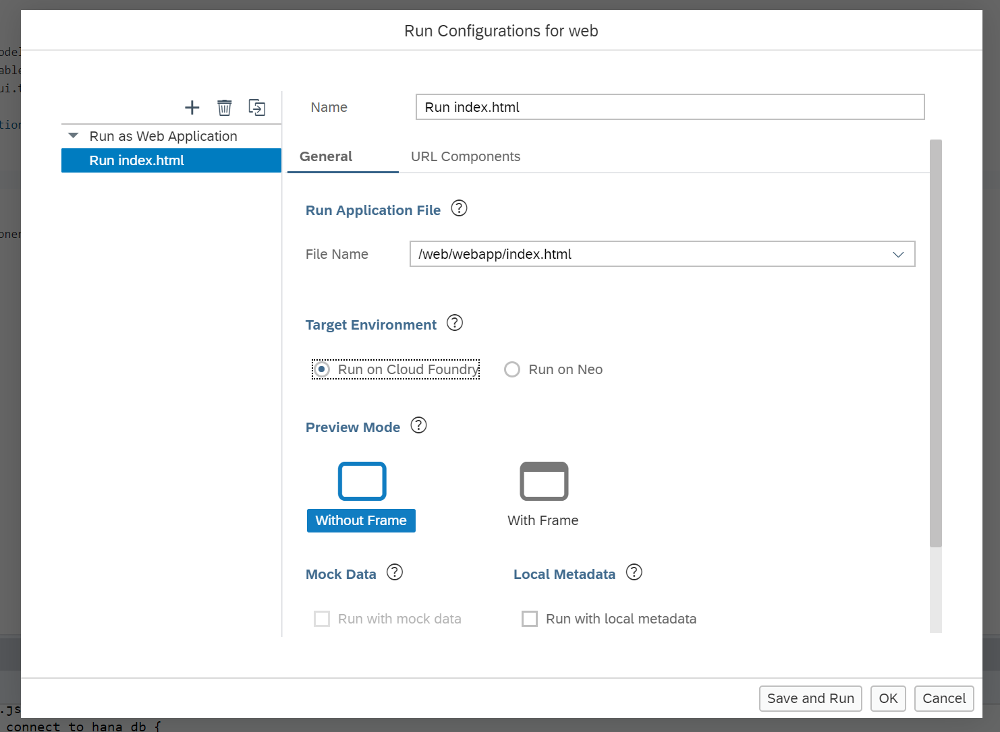

Congratulations! You have created your first application.

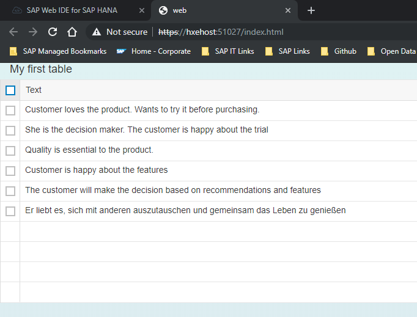

Now it is a good time to commit your application into the local or remote Git.

[DONE]
[ACCORDION-END]

---
