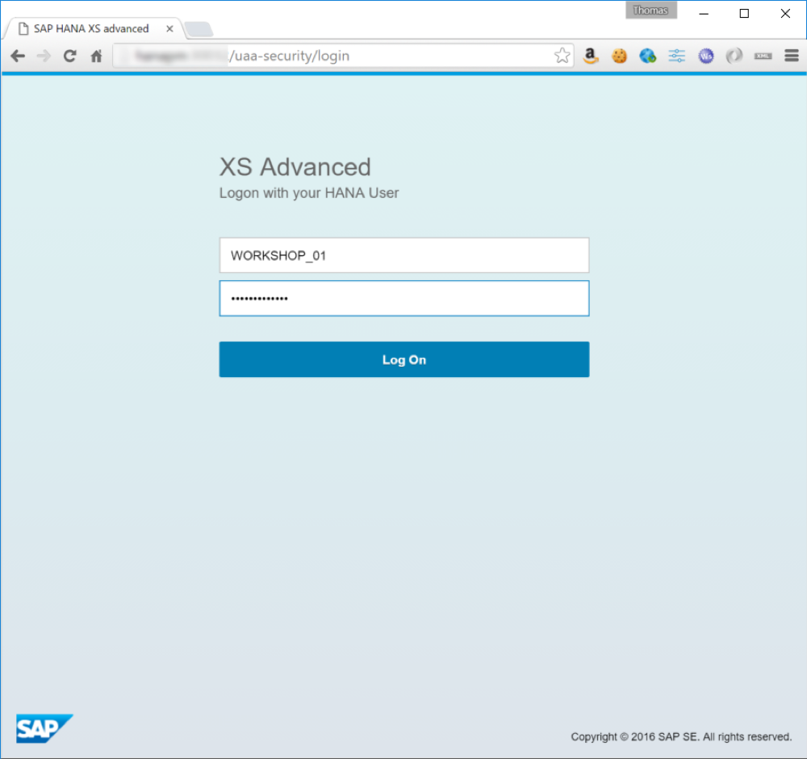
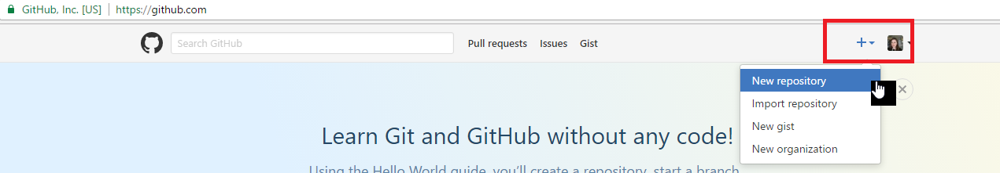
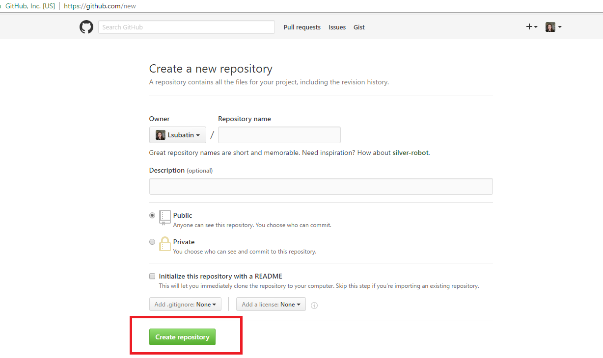
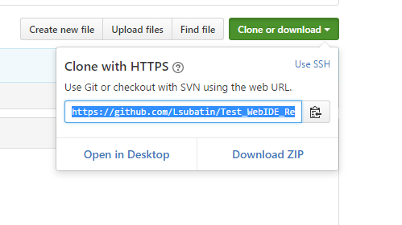
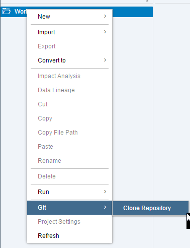
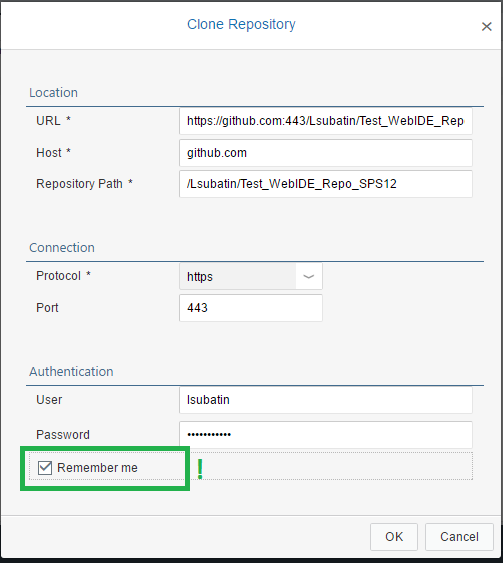
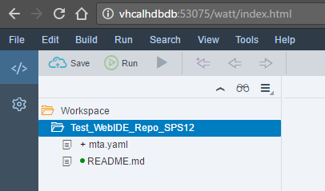
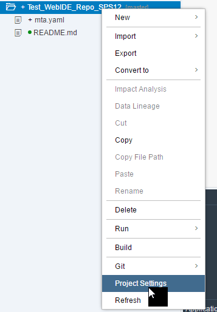
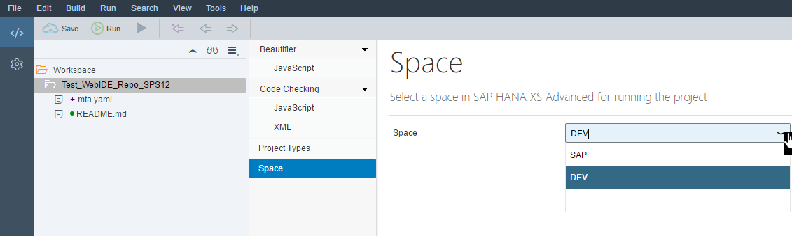

## Prerequisites  
 - This tutorial is designed for SAP HANA on premise and SAP HANA, express edition. It is not designed for SAP HANA Cloud.
 - [Get your own instance of SAP HANA, express edition with XS Advanced](https://developers.sap.com/topics/sap-hana-express.html)

## Details
SAP HANA XS Advanced is the new development paradigm from SAP based around the Cloud Foundry concepts and architectures. To begin with you will need see how to connect to the SAP Web IDE for SAP HANA and clone a Git Repository.

As of SPS12, all design-time artifacts are stored in Git instead of the HANA database. you need to setup the repository so development can be collaborative.

### Time to Complete
**20 Min**

---

[ACCORDION-BEGIN [Step 1: ](Launch SAP Web IDE for SAP HANA)]

By default, on SAP HANA, express edition, the hostname is `hxehost`.

Launch the SAP Web IDE for SAP HANA at the following URL in your web browser. The `hostname` of course is the hostname of the SAP HANA Developer Edition that you created in the previous tutorial. Remember for XSA you will need to use the hostname and not the IP address of the server, instructions are found on the server landing page itself.

`http://<hostname>:53075/`

User: `XSA_DEV`
Password: The password provided when you set up HANA Express

[ACCORDION-END]

[ACCORDION-BEGIN [Step 2: ](Sign in to your Git account)]

From a separate tab in the web browser, log into [GitHub](https://GitHub.com). If you do not have an account, proceed to create one by following the instructions to create and activate your account in the **sign up** button.

[ACCORDION-END]

[ACCORDION-BEGIN [Step 3: ](Create a GitHub repository)]

Whether you have just activated a newly-created account or have been using GitHub disconnected from a HANA workspace, you may wish to create a new repository for this tutorial. If you already have a  GitHub repository you would like to use, continue to Step 3.

Follow the instructions in the **New Repository** option from the **+** menu in the upper right corner on `GitHub.com`

Complete the form, adding a name and description and click on **Create Repository**.

[ACCORDION-END]

[ACCORDION-BEGIN [Step 4: ](Clone the Repository into the Workspace)]

Form the GitHub page, copy the URL of the repository from the **Clone or Download** menu

Return to the SAP Web IDE for SAP HANA. Right click on the Workspace and choose **Clone Repository** from the Git menu.

SAP Web IDE for SAP HANA will request all the necessary information to access the Git repository:

URL: Paste the URL you copied from the GitHub page

Host and Repository Path will populate automatically by breaking down the URL.

Connection:
- Protocol: https
- Port: 443

Authentication:
- User: <Your GitHub user id>
- Password:  <You've guessed: Your GitHub password!>

Tick the **Remember me** box.

If successful, you will see the repository folder in your workspace, which is now connected to the git repository.

[ACCORDION-END]

[ACCORDION-BEGIN [Step 5: ](Configure the Space for the repository)]

Last, you need to configure the space for the repository you have just linked.

>Introduced in SPS12, spaces enable applications to access shared resources that can be used to develop, deploy, and maintain applications.

Right-click on the folder for the repository and select **Project Settings**

Select DEV from the list of available spaces, or use the space setup by the System Administrator:

Click **Save**.

[ACCORDION-END]
