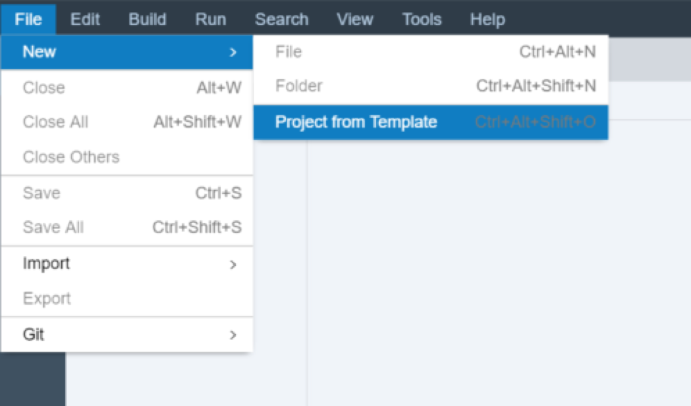
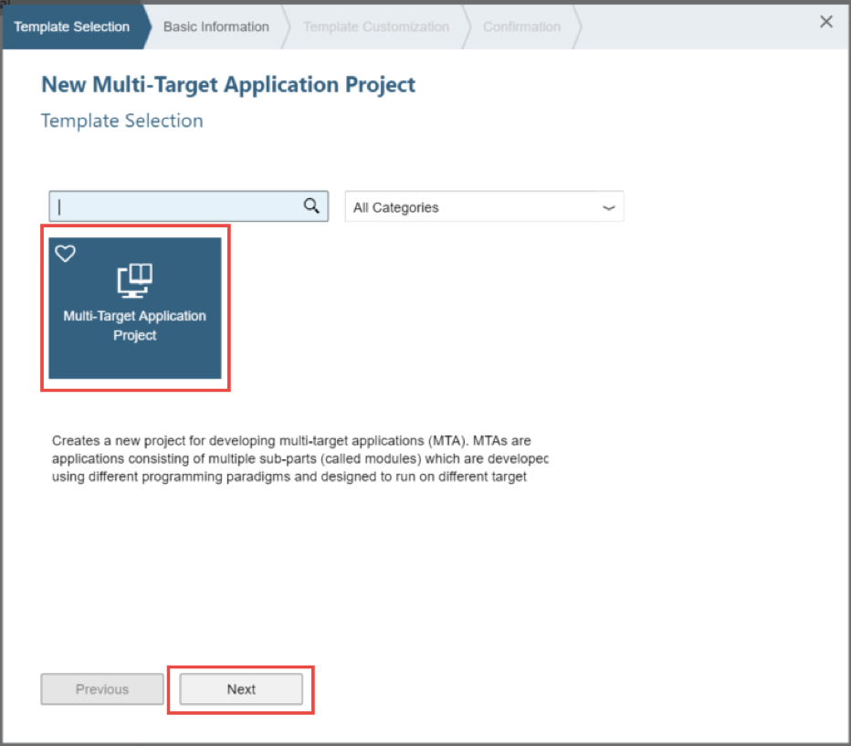
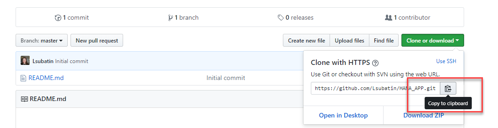
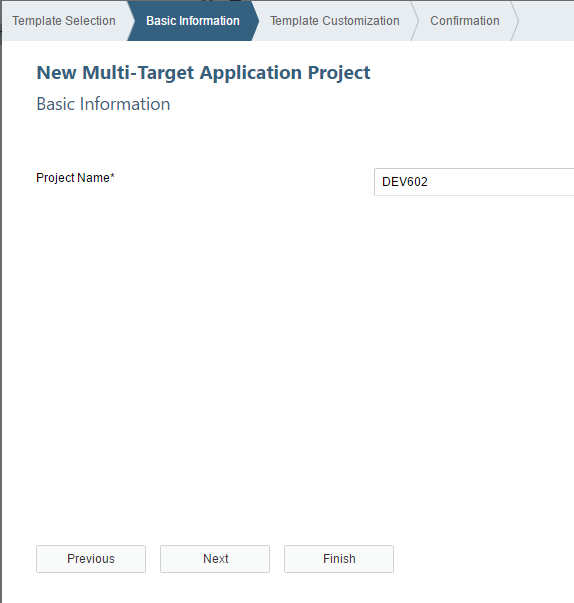
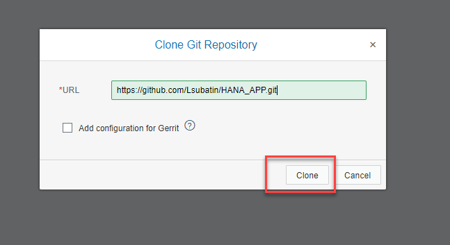
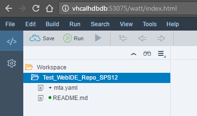
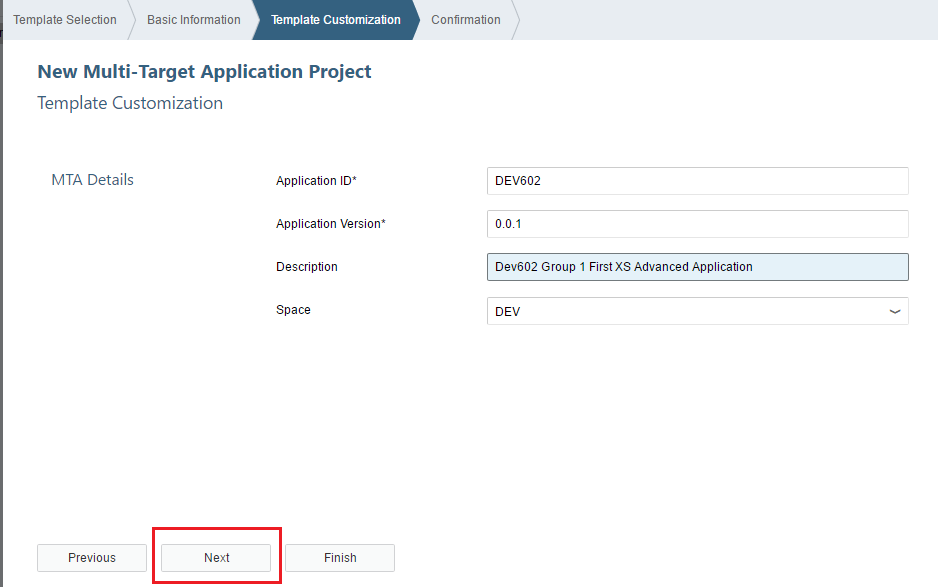
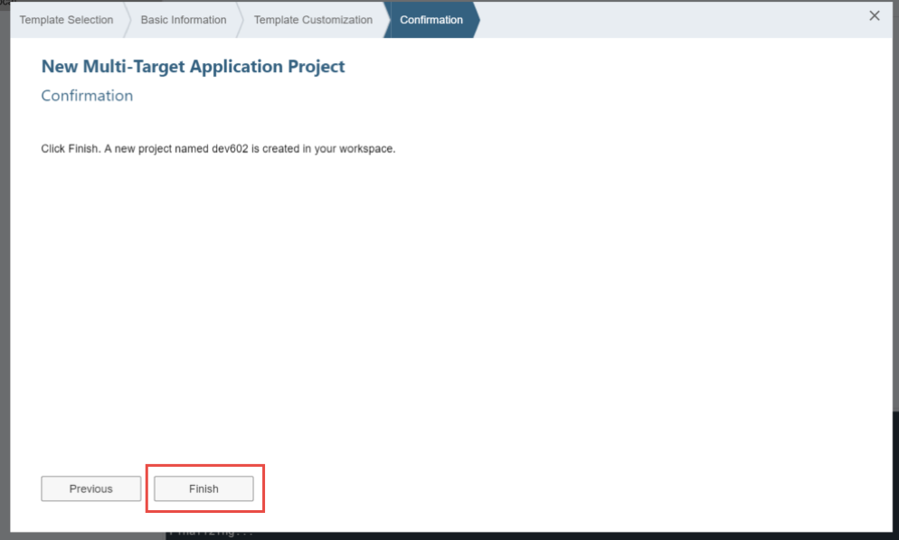

## Prerequisites  
 - [How to create an SAP HANA Developer Edition in the Cloud](http://www.sap.com/developer/tutorials/hana-setup-cloud.html)

## Details
SAP HANA XS Advanced is the new development paradigm from SAP based around the Cloud Foundry concepts and architectures. To begin with you will need see how to connect to the SAP Web IDE for SAP HANA and clone a Git Repository.

As of SPS12, all design-time artifacts are stored in Git instead of the HANA database. We need to setup the repository so development can be collaborative.

### Time to Complete
**20 Min**

---

[ACCORDION-BEGIN [Step 1: ](Launch SAP Web IDE for SAP HANA)]

Launch the SAP Web IDE for SAP HANA at the following URL in your web browser. The `hostname` of course is the hostname of the SAP HANA Developer Edition that you created in the previous tutorial. Remember for XSA you will need to use the hostname and not the IP address of the server, instructions are found on the server landing page itself.

`https://<hostname>:53075/`

User: `XSA_DEV`
Password: The password provided when you set up HANA Express

or you can use

User: `WORKSHOP_01`
Password: `HanaRocks2017` or what you changed it to

[DONE]
[ACCORDION-END]

[ACCORDION-BEGIN [Step 2: ](Sign in to your Git account)]

From a separate tab in the web browser, log into [GitHub](https://GitHub.com). If you do not have an account, proceed to create one by following the instructions to create and activate your account in the **sign up** button.

> If you are setting up the repository for use beyond this tutorial, you may want to create an organization and invite other users to join your repository. Further information on GitHub can be found [on GitHub](https://help.github.com/articles/creating-a-new-repository/)

[DONE]
[ACCORDION-END]

[ACCORDION-BEGIN [Step 3: ](Create a GitHub repository)]

Whether you have just activated a newly-created account or have been using GitHub disconnected from a HANA workspace, you may wish to create a new repository for this tutorial. If you already have a  GitHub repository you would like to use, continue to Step 3.

Follow the instructions in the **New Repository** option from the **+** menu in the upper right corner on `GitHub.com`

Complete the form, adding a name and description and click on **Create Repository**.

[DONE]
[ACCORDION-END]

[ACCORDION-BEGIN [Step 4: ](Clone the Repository into the Workspace)]

Form the GitHub page, copy the URL of the repository from the **Clone or Download** menu

Return to the SAP Web IDE for SAP HANA. Right click on the Workspace and choose **Clone Repository** from the Git menu.

SAP Web IDE for SAP HANA will request the Git URL to access the repository, which you have copied from GitHub:

Enter authentication details:
- User:  `<Your GitHub User ID>`
- Password:  `<You've guessed: Your GitHub password!>`

Tick the **Remember me** box so it will not ask again for the remainder of the session.

If successful, you will see the repository folder in your workspace, which is now connected to the git repository.

[DONE]
[ACCORDION-END]

[ACCORDION-BEGIN [Step 5: ](Configure the Space for the repository)]

Last, you need to configure the space for the repository you have just linked.

>Introduced in SPS12, spaces enable applications to access shared resources that can be used to develop, deploy, and maintain applications.

Right-click on the folder for the repository and select **Project Settings**

Select the proper space (probably, development) from the list of available spaces, or use the space setup by the System Administrator:

>If you cannot find an appropriate Space, you may need to enable it or configure your user by going to the `Organization and Space Management` in `https://your host:51015/index.html` (or asking your System Administrator).

Click **Save**.

[DONE]
[ACCORDION-END]

## Next Steps
 - [SAP HANA XS Advanced Creating an HTML5 Module](http://www.sap.com/developer/tutorials/xsa-html5-module.html)
