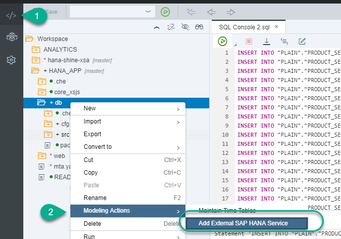
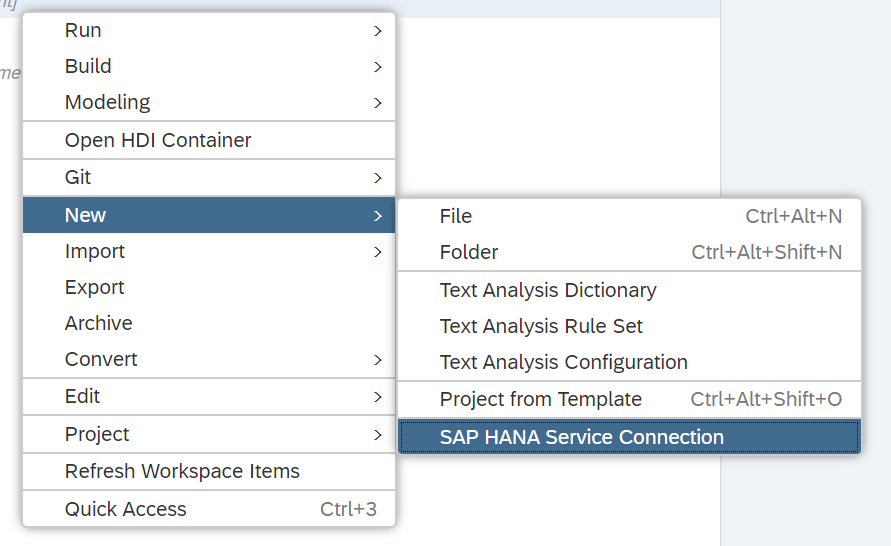
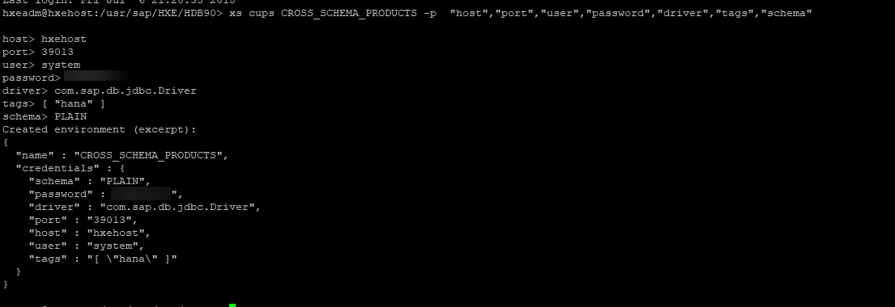
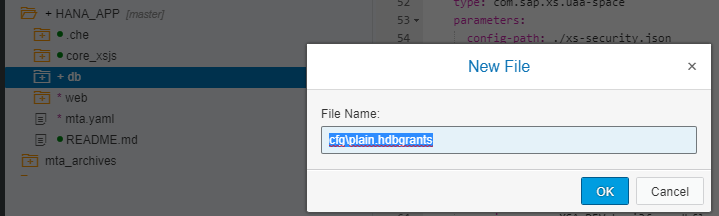
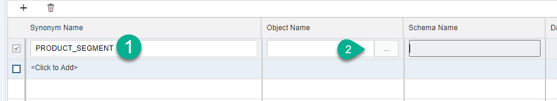
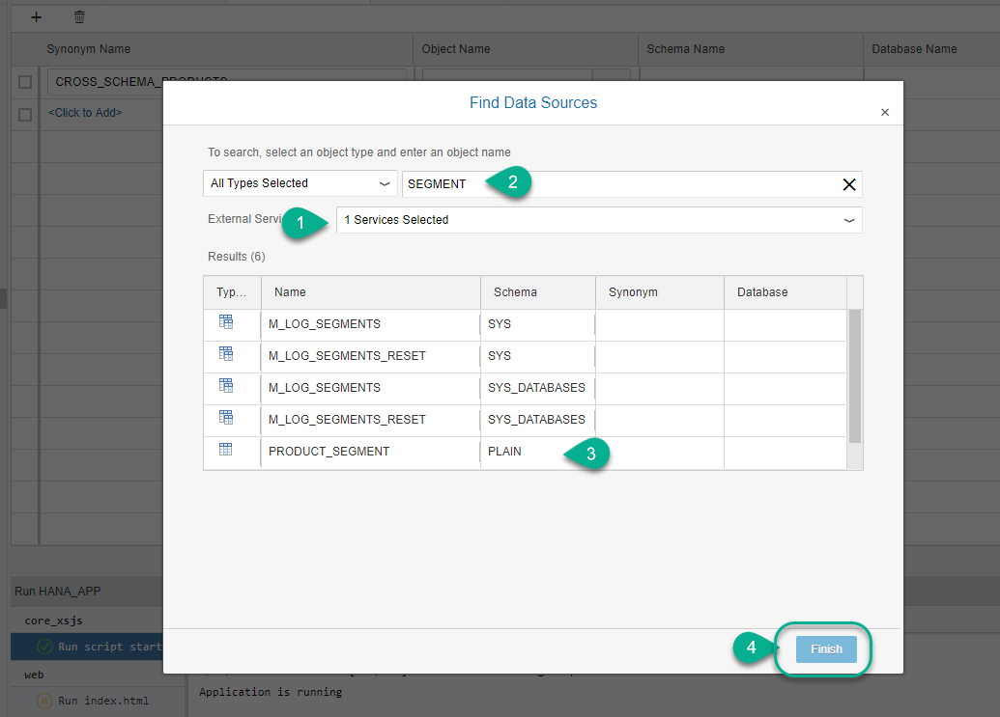

## Prerequisites
 - This tutorial is designed for SAP HANA on premise and SAP HANA, express edition. It is not designed for SAP HANA Cloud.   
 - **Proficiency:** Beginner

## Details
### You will learn  
This tutorial will walk you through the integration of a non `HDI-managed` database, such as a replicated or ABAP database, into an HDI container and how to access it using a SQL anonymous connection.

### Time to Complete
**15 Min**

---

[ACCORDION-BEGIN [Step 1: ](Load data into a database schema in SystemDB)]

This tutorial needs a replicated database or a schema that is not managed by an HDI container. An example of such schema is an ABAP or ERP database, which you may need to integrate to your XS Advanced development. You will simulate this by creating a schema and importing data into it.

>Note: This tutorial will use the default System database in an SAP HANA, express edition instance, which is not the recommended approach for productive development. The space for the project we will be accessing from is also mapped to the system database. Use the same tenant database if your project is in a space mapped to a tenant database.

</br>

Begin by connecting to your SAP HANA `SystemDB` using the **+** sign in the Database Explorer and choose **SAP HANA Database (Multitenant)**:


Set the connection parameters to your System database, or the database of your choice. Make sure the selected user has access to the database schema.


> Note: Use an appropriate user with the right security restrictions in a productive environment.

You can now see the catalog in your database and open the SQL console:


[DONE]

[ACCORDION-END]

[ACCORDION-BEGIN [Step 2: ](Create a Schema and table and Import data)]

Paste the following code into a SQL console to create a custom schema and a table in it:

```sql
create schema "PLAIN";
set schema "PLAIN";
create row table "PRODUCT_SEGMENT"(
	PRODUCT NVARCHAR(10) primary key,
	SEGMENT NVARCHAR(2)
)

```

**Execute** using `F8` or the green `Run` icon on the top of the console and check the results:


Insert data into the newly-created table with the following commands in the SQL console. You can overwrite the previous SQL statement.

```sql
INSERT INTO "PLAIN"."PRODUCT_SEGMENT" VALUES ('HT-1001','A');
INSERT INTO "PLAIN"."PRODUCT_SEGMENT" VALUES ('HT-1102','A');
INSERT INTO "PLAIN"."PRODUCT_SEGMENT" VALUES ('HT-1092','A');
INSERT INTO "PLAIN"."PRODUCT_SEGMENT" VALUES ('HT-1007','A');
INSERT INTO "PLAIN"."PRODUCT_SEGMENT" VALUES ('HT-1101','B');
INSERT INTO "PLAIN"."PRODUCT_SEGMENT" VALUES ('HT-2028','AB');
INSERT INTO "PLAIN"."PRODUCT_SEGMENT" VALUES ('HT-2026','AB');
INSERT INTO "PLAIN"."PRODUCT_SEGMENT" VALUES ('HT-1091','B');
INSERT INTO "PLAIN"."PRODUCT_SEGMENT" VALUES ('HT-6101','B');
INSERT INTO "PLAIN"."PRODUCT_SEGMENT" VALUES ('HT-6102','B');
INSERT INTO "PLAIN"."PRODUCT_SEGMENT" VALUES ('HT-1100','C');
INSERT INTO "PLAIN"."PRODUCT_SEGMENT" VALUES ('HT-1003','C');
INSERT INTO "PLAIN"."PRODUCT_SEGMENT" VALUES ('HT-1090','C');
INSERT INTO "PLAIN"."PRODUCT_SEGMENT" VALUES ('HT-1103','BC');
INSERT INTO "PLAIN"."PRODUCT_SEGMENT" VALUES ('HT-1000','C');
INSERT INTO "PLAIN"."PRODUCT_SEGMENT" VALUES ('HT-1002','B');
INSERT INTO "PLAIN"."PRODUCT_SEGMENT" VALUES ('HT-2027','C');
INSERT INTO "PLAIN"."PRODUCT_SEGMENT" VALUES ('HT-6100','AB');
INSERT INTO "PLAIN"."PRODUCT_SEGMENT" VALUES ('HT-1004','A');

```

[DONE]
[ACCORDION-END]


[ACCORDION-BEGIN [Step 3: ](SPS03 - Create a User-Provided service using a wizard)]

If you are using SAP HANA, express edition SPS03, the process has been simplified and you can now execute a wizard that will complete many of the steps required to access a plain schema from your database module.

Right-click on the database module and choose `Modeling actions -> Add external SAP HANA Service` Note: In newer versions of the Web IDE, this menu option has changed to `New -> SAP HANA Service Connection`


or



Use the following values to complete the wizard
- Service name: `CROSS_SCHEMA_PRODUCTS`
- Host: `hxehost` (or your hostname)
- Port: 39013 (default port for SYSTEMDB in SAP HANA, express edition 2.0, use 39015 if your space is mapped to the first tenant database)
- User and Password: SYSTEM (or a user with access to the non-container PLAIN schema) and its credentials

Click **Finish**.


[DONE]
[ACCORDION-END]


[ACCORDION-BEGIN [Step 4: ](SPS02 or lower - Create a User-Provided service using the XS CLI)]

Open a command line to execute a command with the XS client. You will now create a user-provided service called `CROSS_SCHEMA_PRODUCTS` to allow other modules to access the new schema.

Replace the hostname, instance number and port (ending in 13 or 15), user and password in the below command:

```ssh
xs cups CROSS_SCHEMA_PRODUCTS -p  "host","port","user","password","driver","tags","schema"
```
You will be prompted for each of the values you have listed:
- user: SYSTEM
- port: 3XX13 or 3XX15 - where XX stands for the instance number. You can confirm the port by running `netstat | grep 3xx13` in the command line in your HXE instance.
- password : The administration password for SYSTEM
- driver: `com.sap.db.jdbc.Driver`
- tags: `[ "hana" ]`
- schema: PLAIN

> Note: You can also run the command with its parameters as follows
> ```
> xs cups CROSS_SCHEMA_PRODUCTS`-p "{\"host\":\"<hostname>\",\"port\":\"3<Instance Number><15|13>\",\"user\":\"<user>\",\"password\":\"<Password>\",\"driver\":\"com.sap.db.jdbc.Driver\",\"tags\":[\"hana\"] , \"schema\" : \"PLAIN\" }"
> ```



</br>

And execute it in a console:


> Note: You should now be able to add the user provided service as if it were an HDI container in the Database Explorer and see the `PRODUCT_SEGMENTS` table with data.
> If you get errors at this point, you should verify the user you set in the User-provided service can connect with the same credentials, that the database is enabled for XSA if you are using a tenant (by default, in `https://hxehost:51039/cockpit#/xsa/logicalDatabases`) and the host and port are correct.

[DONE]

[ACCORDION-END]

[ACCORDION-BEGIN [Step 5: ](Check or modify the MTA.yaml file)]

If you are using SPS03, the entry should have been automatically added into the `MTA.yaml` file, you will only need to adjust the name of the service.

Add or look for a resource called `CROSS_SCHEMA_PRODUCTS`, type `org.cloudfoundry.existing-service`.
Use `products-service-name` and `${service-name}` as a key-value pair under properties in **Properties** (**adjust the name if you are using SPS03**).


Now add or check the new resource as a requirement for the `db` module. Add `CROSS_SCHEMA_PRODUCTS` and `SERVICE_REPLACEMENTS` under group.  Add or check the following key-value pairs:

- key : `ServiceName_1`
- service : ~{products-service-name}


These are the relevant pieces of the `MTA.yaml` file. You can see the database module and its dependency to the user provided service.

> ##Other modules and dependencies have been intentionally left out.

```
modules:
- name: db
  type: hdb
  path: db
  requires:
    - name: hdi_db
      properties:
        TARGET_CONTAINER: '~{hdi-container-name}'
    - name: CROSS_SCHEMA_PRODUCTS
      group: SERVICE_REPLACEMENTS
      properties:
        key: ServiceName_1
        service: ~{products-service-name}


resources:
- name: CROSS_SCHEMA_PRODUCTS
  properties:
     products-service-name: ${service-name}
  type: org.cloudfoundry.existing-service
```

**Save** and **Build** the `db` module.

[DONE]

[ACCORDION-END]

[ACCORDION-BEGIN [Step 6: ](Grant privileges to the schema)]

Create a file called `cfg/plain.hdbgrants` in the `db` module. This will create both the folder if it does not exist and the file.



> Note: In previous versions of SAP Web IDE for SAP HANA, you may need to create a folder called `cfg` and then the file in it.
Add the following code:

```json
{
  "ServiceName_1": {
    "object_owner" : {
      "schema_privileges":[
        {
          "reference":"PLAIN",
          "privileges_with_grant_option":["SELECT", "SELECT METADATA"]
        }
      ]
    },
    "application_user" : {
      "schema_privileges":[
        {
          "reference":"PLAIN",
          "privileges_with_grant_option":["SELECT", "SELECT METADATA"]
        }
      ]
    }
  }
}

```
**Save** the file.

> ##What is this?
> The user-provided service (through the SYSTEM user. or whatever user you used) is granting permissions to the PLAIN schema, using a `GRANT` SQL statement. When an HDI container is created, two technical users are created with it.  These users will be logging into the HDI container and have permissions to manage the schema. Here you will provide access to the technical user and the application user.
> You can find the complete syntax and more examples for the `hdbgrants` file [in the SAP Help](https://help.sap.com/viewer/4505d0bdaf4948449b7f7379d24d0f0d/2.0.03/en-US/f49c1f5c72ee453788bf79f113d83bf9.html) portal.


[DONE]

[ACCORDION-END]

[ACCORDION-BEGIN [Step 7: ](Add a synonym)]

In the `src` folder, add a file called `synonyms/plain.hdbsynonym`. Add an entry called `PRODUCT_SEGMENT` and use the search button to add the PLAIN schema form the user-provided service.



Check the user-provided service and look for `PRODUCT_SEGMENTS`. Double-click on the table to add it.



**Save** the file.


[DONE]

[ACCORDION-END]

[ACCORDION-BEGIN [Step 8: ](Create a CDS file)]

Create a new HDB CDS artifact called `segments.hdbcds` under `db/src/data`. Use the code editor to paste the following code:

```sql
using PRODUCT_SEGMENT as P_SEGMENT;
using "PurchaseOrder.Item" as Item;


context segments {

    define view SegmentsView as
        select from P_SEGMENT as S
    		join Item as I on S.PRODUCT = I.PRODUCT
    		{
    		 "S"."SEGMENT",
    		 "I"."PRODUCT"
    		};
};

```

**Save** and **Build**. Go into the database explorer and use the option to open data on the view you have just created


Use the results from the data preview to complete the validation below. What is the first product that appears in the results?

[VALIDATE_2]

[ACCORDION-END]
