## Prerequisites  
 - This tutorial is designed for SAP HANA on premise and SAP HANA, express edition. It is not designed for SAP HANA Cloud.
 - [Create a multi-target application](xsa-connecting-webide)
 - [Create a database module](xsa-hdi-module)

## Details
### You will learn  
- How to set up the roles, synonyms and deployment configuration to access objects in a HANA Deployment Infrastructure (HDI) container from another HDI container


---

[ACCORDION-BEGIN [Step 1: ](Create the target container as a resource)]

This tutorial uses the SAP HANA `INteractive` Education model as an example of a target HDI container. Create this
target container by following the XSA-specific instructions found in the [SHINE source code repository](https://github.com/SAP/hana-shine-xsa/blob/master/SHINE-XSA.md). In this tutorial, we will refer to this container as the **target** container.

Your current database module will use two containers, the `hdi-container` created with the database module and the target container from the SHINE application.

- If you are using SAP HANA 2.0 SPS04 or later, right-click on the `db` module and choose **New > SAP HANA Service Connection**

    !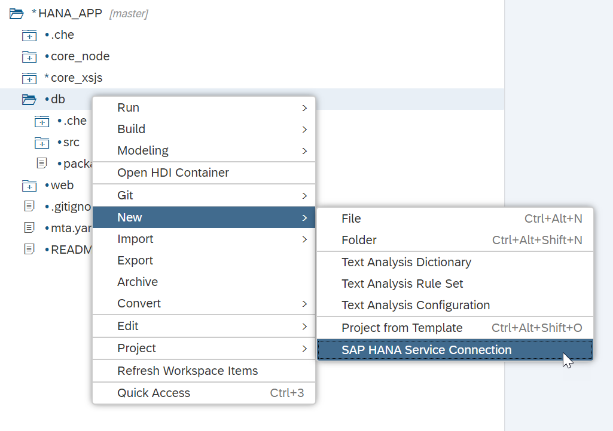

    Choose the service from within the list and click **Finish**.

    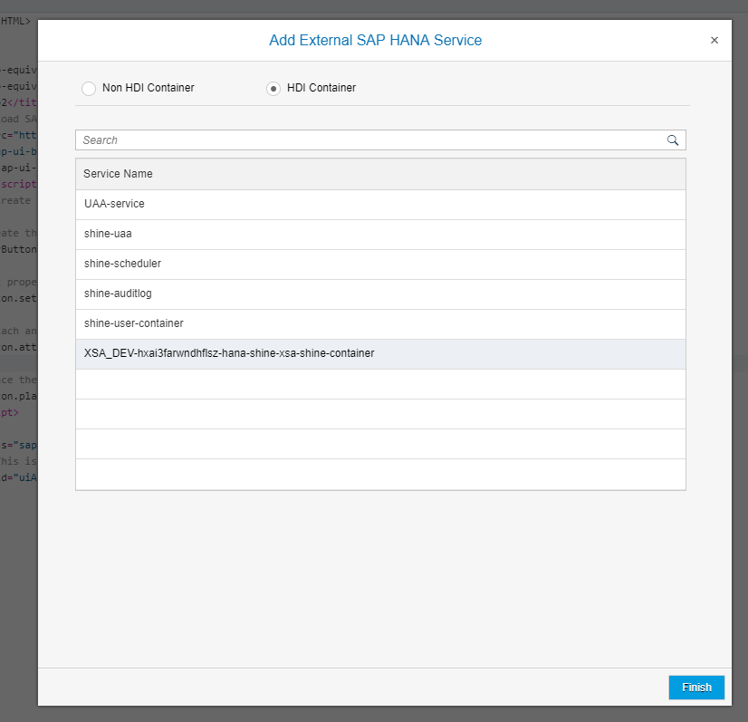

    Continue with step 2.

- If you are using SAP HANA 2.0 SPS03, right-click on the `db` module and choose **Modeling Actions->Add External SAP HANA service**

    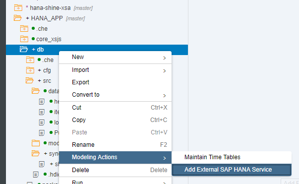

    Choose the service from within the list and click **Finish**

    

    Continue with step 2.

-  If you are using  SAP HANA 2.0 SPS02 or lower:

    Find out the name of the target container using command `xs s` from the command line interface (CLI):

    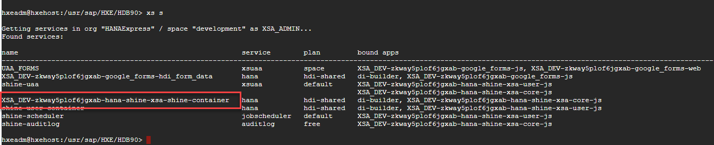

    >The CLI client can be executed from a HANA express command line as user `hxeadm` or downloaded to your computer using the download manager available after you [register to download SAP HANA, express edition](https://www.sap.com/products/hana/express-trial.html)
      Open the `mta.yaml` file in your consuming application and go to the **Resources** tab. Create a new resource of type `org.cloudfoundry.existing-service`.

      Call it `consumed-core-container` and a new parameter with `service-name` as a key and the name of the service from command `xs s`

      !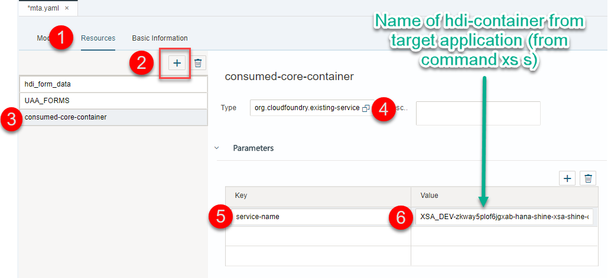

      Add a property with key `consumed-service-name` and value `${service-name}`

      !

      Save the `mta.yaml` file.  Open the consuming `hdi-container` resource definition and take note of the name of the variable that has the service name assigned to its value:

      !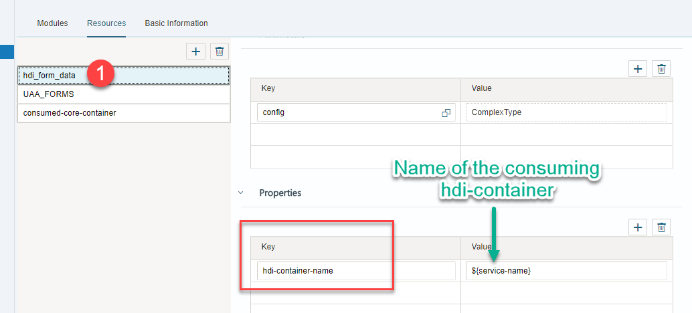

      Select the consuming database module  and add a property with key `TARGET_CONTAINER` and refer to the variable set with the name of the consuming `hdi-container`:

      !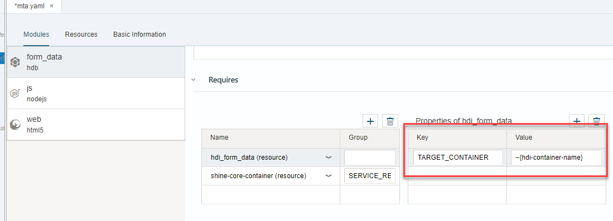

      Add group `SERVICE_REPLACEMENTS` with key `consumed-db` and the value of the variable used to hold the value of the service name in the consuming `hdi-container` (`consumed-service-name` in this example).

      !

      >Except for the name of the `hdi-container` from the external application and the environment variable `service-name`, the names of the variables can be adjusted to fit your needs.


As a reference, the relevant parts of the `mta.yaml` file in this example look like this:

```YAML
modules:
  - name: form_data
    type: hdb
    path: form_data
    requires:
      - name: hdi_form_data
        properties:
          TARGET_CONTAINER: '~{hdi-container-name}'
      - name: consumed-core-container
        group: SERVICE_REPLACEMENTS
        properties:
          key: consumed-db
          service: '~{consumed-service-name}'
resources:
  - name: hdi_form_data
    parameters:
      config:
        schema: FORMS
    properties:
      hdi-container-name: '${service-name}'
    type: com.sap.xs.hdi-container
  - name: consumed-core-container
    type: org.cloudfoundry.existing-service
    parameters:
      service-name: 'XSA_DEV-zkway5plof6jgxab-hana-shine-xsa-shine-container'
    properties:
      consumed-service-name: '${service-name}'
```

[DONE]

[ACCORDION-END]

[ACCORDION-BEGIN [Step 2: ](Check or create roles in the target container)]

The technical users created for the consuming `hdi-container` will need to be granted permissions in the target or consumed container. The permissions can be roles in the target container.

In the SHINE application, the available roles are `admin.hdbrole` and `core-db`. You will use the admin role in this tutorial but if you are using a different container or would like to restrict access further, you can create a new one:

!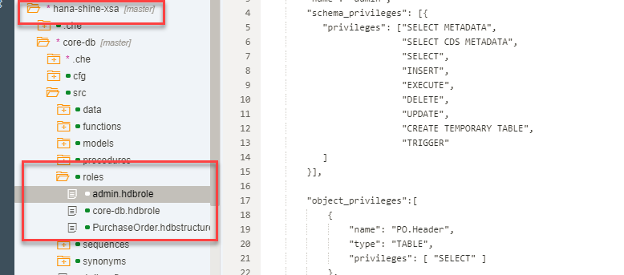


>The `#` (pound) sign at the end of the name of a role means it contains privileges with grant option and will be assigned to the schema owner technical user.

[DONE]

[ACCORDION-END]


[ACCORDION-BEGIN [Step 3: ](Create a grants file)]

Create a file with extension `.hdbgrants` in a folder called `cfg` in your module.

> You can use the option `New->File` to create both a folder and a file in the latest version of SAP Web IDE for SAP HANA

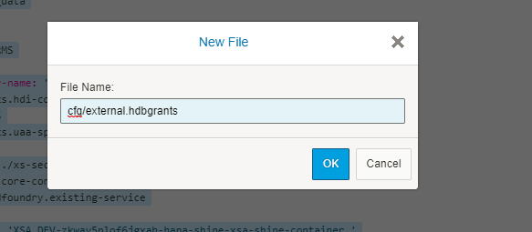

Here is a sample file to grant permissions to both an administration and application user. The names of the roles match the roles created in the target container as noted in the first step:

```JSON
{
  "consumed-db": {
    "object_owner" : {
      "container_roles":[ "admin"]
    },
    "application_user" : {
      "container_roles":["admin"]
    }
  }
}

```

> ### Important

>Further restrictions and different roles between the owner and application user should be applied in productive applications.

> See the current documentation about [creating design-time roles](https://help.sap.com/viewer/4505d0bdaf4948449b7f7379d24d0f0d/latest/en-US/625d7733c30b4666b4a522d7fa68a550.html) or about [`.hdbgrants`](https://help.sap.com/viewer/4505d0bdaf4948449b7f7379d24d0f0d/latest/en-US/f49c1f5c72ee453788bf79f113d83bf9.html)

[DONE]
[ACCORDION-END]

[ACCORDION-BEGIN [Step 4: ](Create synonyms)]

Create a file with extension `.hdbsynonym` in a folder called `synonyms` under `src`. You can use the **+**  sign to add synonyms from the target container:

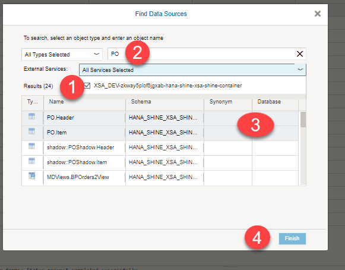

For example:

!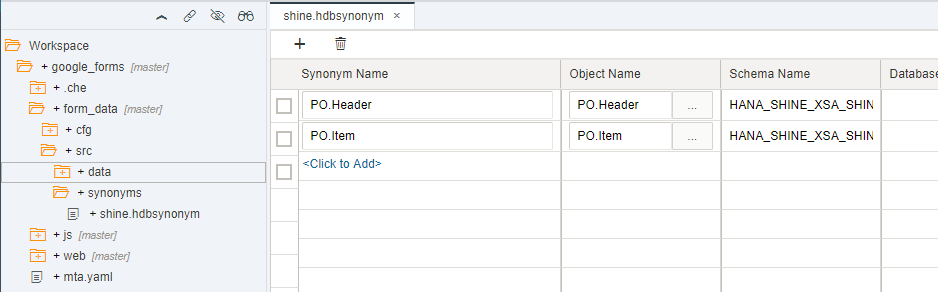

Build the consuming database module.

> ### **Check the optional synonym configuration files**
> You can move the configuration to a `.hdbsynonymconfig` file. This will allow you to reference the target schema dynamically, without indicating the name explicitly, among other options. Check the [documentation for your version on the Help](https://help.sap.com/viewer/4505d0bdaf4948449b7f7379d24d0f0d/latest/en-US/4adba34bd86544a880db8f9f1e32efb7.html).

[DONE]

[ACCORDION-END]

[ACCORDION-BEGIN [Step 5: ](Use the synonyms in a view)]

Here is a sample view using the synonyms for the target `hdi-container`. You can create one in a new or existing `.hdbcds` artifact

```CDS
using "PO.Header" as HEADER;

context quality{

define view PO_QA  
	as select from HEADER {
            "HEADER"."PURCHASEORDERID" as "PURCHASEORDERID",
            "HEADER"."APPROVALSTATUS" as "APPROVALSTATUS",
            "HEADER"."GROSSAMOUNT" as "GROSSAMOUNT",
            "HEADER"."CURRENCY" as "CURRENCY"
    };

}

```

Save and build the artifacts.

You can see the results in the database explorer

!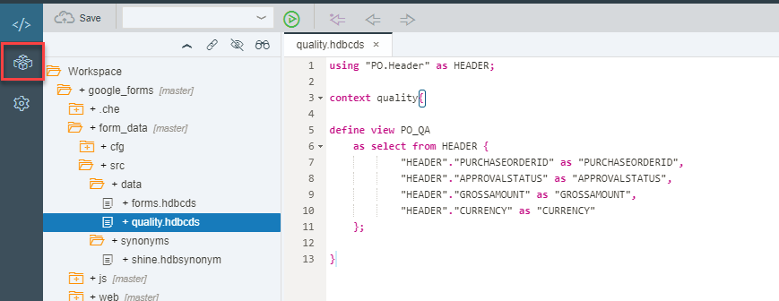

You can check the synonyms first

!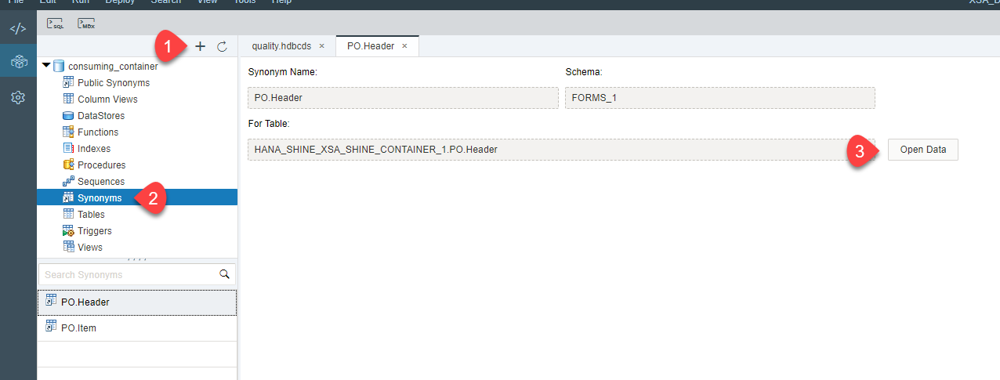

Or the view you have created

!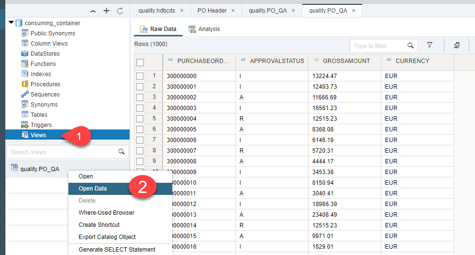

[DONE]

[ACCORDION-END]
