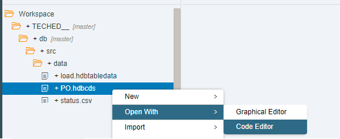
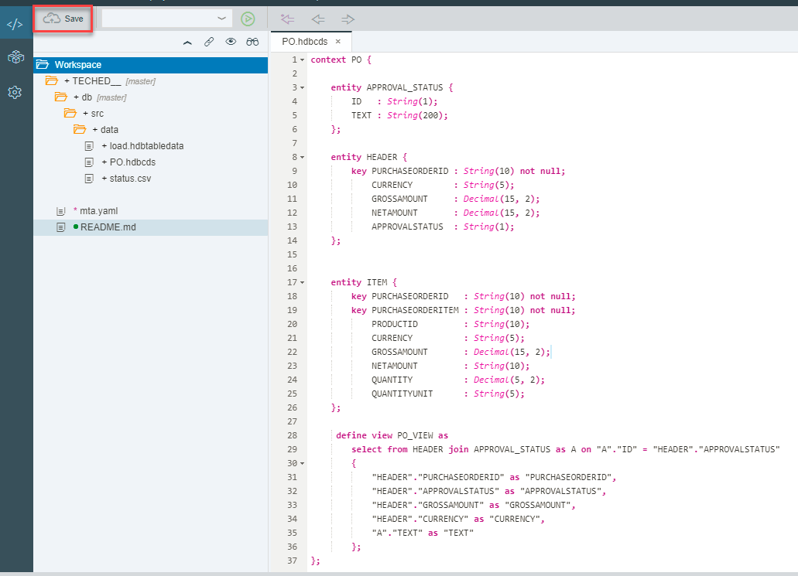
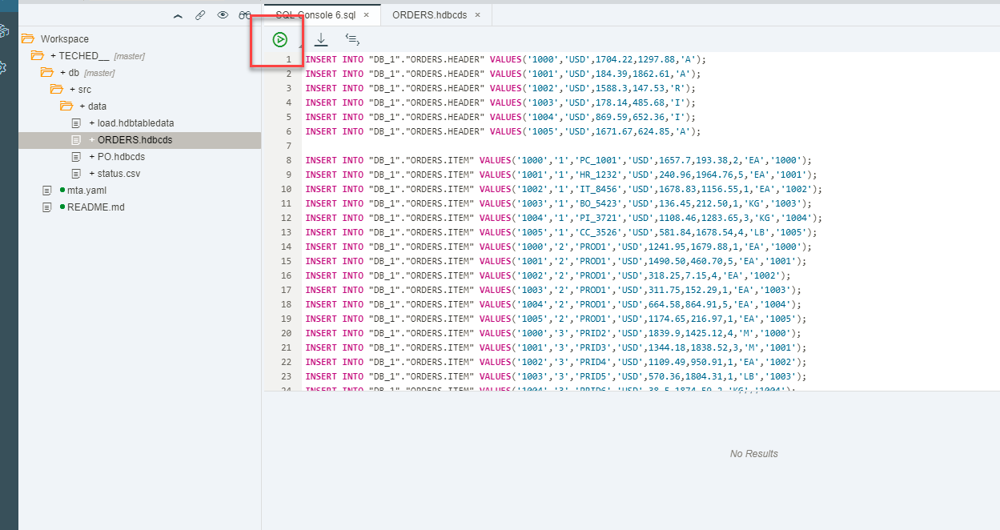

## Prerequisites  
 - This tutorial is designed for SAP HANA on premise and SAP HANA, express edition. It is not designed for SAP HANA Cloud.
 - **Proficiency:** Beginner

## Details
### You will learn  
You will create two additional entities and a view to expose the data through a Node.js module

### Time to Complete
**15 Min**

---

[ACCORDION-BEGIN [Step 1: ](Create a new CDS artifact)]

Back in the development perspective, open the existing Core Data Services file in Code Editor mode:



You will reuse the existing file to add two more tables and a view.

[DONE]
[ACCORDION-END]

[ACCORDION-BEGIN [Step 2: ](Create two additional entities)]

Replace the existing code with following code into the editor to create two additional entities:

```sql

context PO {

    entity APPROVAL_STATUS {
        ID   : String(1);
        TEXT : String(200);
    };

    entity HEADER {
        key PURCHASEORDERID : String(10) not null;
            CURRENCY        : String(5);
            GROSSAMOUNT     : Decimal(15, 2);
            NETAMOUNT       : Decimal(15, 2);
            APPROVALSTATUS  : String(1);
    };


    entity ITEM {
        key PURCHASEORDERID   : String(10) not null;
        key PURCHASEORDERITEM : String(10) not null;
            PRODUCTID         : String(10);
            CURRENCY          : String(5);
            GROSSAMOUNT       : Decimal(15, 2);
            NETAMOUNT         : String(10);
            QUANTITY          : Decimal(5, 2);
            QUANTITYUNIT      : String(5);
    };

     define view PO_VIEW as
        select from HEADER join APPROVAL_STATUS as A on "A"."ID" = "HEADER"."APPROVALSTATUS"
        {
            "HEADER"."PURCHASEORDERID" as "PURCHASEORDERID",
            "HEADER"."APPROVALSTATUS" as "APPROVALSTATUS",
            "HEADER"."GROSSAMOUNT" as "GROSSAMOUNT",
            "HEADER"."CURRENCY" as "CURRENCY",
            "A"."TEXT" as "TEXT"
        };
};
```

As follows:



**Save** and **Build** the database module.


[DONE]
[ACCORDION-END]


[ACCORDION-BEGIN [Step 3: ](Load data into the entities)]

You will now use plain SQL to load data into your newly created entities. Copy the following code in the SQL console you left open from the database explorer:

```sql
INSERT INTO "DB_1"."PO.HEADER" VALUES('1000','USD',1704.22,1297.88,'A');
INSERT INTO "DB_1"."PO.HEADER" VALUES('1001','USD',184.39,1862.61,'A');
INSERT INTO "DB_1"."PO.HEADER" VALUES('1002','USD',1588.3,147.53,'R');
INSERT INTO "DB_1"."PO.HEADER" VALUES('1003','USD',178.14,485.68,'I');
INSERT INTO "DB_1"."PO.HEADER" VALUES('1004','USD',869.59,652.36,'I');
INSERT INTO "DB_1"."PO.HEADER" VALUES('1005','USD',1671.67,624.85,'A');

INSERT INTO "DB_1"."PO.ITEM" VALUES('1000','1','PC_1001','USD',1657.7,193.38,2,'EA');
INSERT INTO "DB_1"."PO.ITEM" VALUES('1001','1','HR_1232','USD',240.96,1964.76,5,'EA');
INSERT INTO "DB_1"."PO.ITEM" VALUES('1002','1','IT_8456','USD',1678.83,1156.55,1,'EA');
INSERT INTO "DB_1"."PO.ITEM" VALUES('1003','1','BO_5423','USD',136.45,212.50,1,'KG');
INSERT INTO "DB_1"."PO.ITEM" VALUES('1004','1','PI_3721','USD',1108.46,1283.65,3,'KG');
INSERT INTO "DB_1"."PO.ITEM" VALUES('1005','1','CC_3526','USD',581.84,1678.54,4,'LB');
INSERT INTO "DB_1"."PO.ITEM" VALUES('1000','2','PROD1','USD',1241.95,1679.88,1,'EA');
INSERT INTO "DB_1"."PO.ITEM" VALUES('1001','2','PROD1','USD',1490.50,460.70,5,'EA');
INSERT INTO "DB_1"."PO.ITEM" VALUES('1002','2','PROD1','USD',318.25,7.15,4,'EA');
INSERT INTO "DB_1"."PO.ITEM" VALUES('1003','2','PROD1','USD',311.75,152.29,1,'EA');
INSERT INTO "DB_1"."PO.ITEM" VALUES('1004','2','PROD1','USD',664.58,864.91,5,'EA');
INSERT INTO "DB_1"."PO.ITEM" VALUES('1005','2','PROD1','USD',1174.65,216.97,1,'EA');
INSERT INTO "DB_1"."PO.ITEM" VALUES('1000','3','PRID2','USD',1839.9,1425.12,4,'M');
INSERT INTO "DB_1"."PO.ITEM" VALUES('1001','3','PRID3','USD',1344.18,1838.52,3,'M');
INSERT INTO "DB_1"."PO.ITEM" VALUES('1002','3','PRID4','USD',1109.49,950.91,1,'EA');
INSERT INTO "DB_1"."PO.ITEM" VALUES('1003','3','PRID5','USD',570.36,1804.31,1,'LB');
INSERT INTO "DB_1"."PO.ITEM" VALUES('1004','3','PRID6','USD',38.5,1874.59,2,'KG');
INSERT INTO "DB_1"."PO.ITEM" VALUES('1005','3','PRID7','USD',1145.66,126.50,2,'G');
```

Click on the **Run** button:



[VALIDATE_1]
[ACCORDION-END]


---
