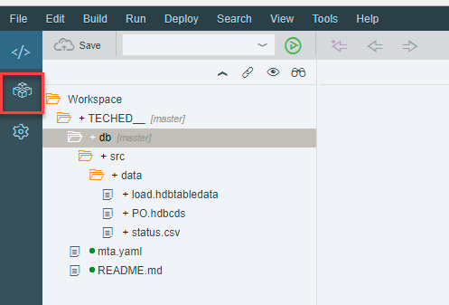
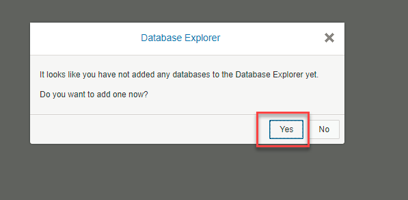
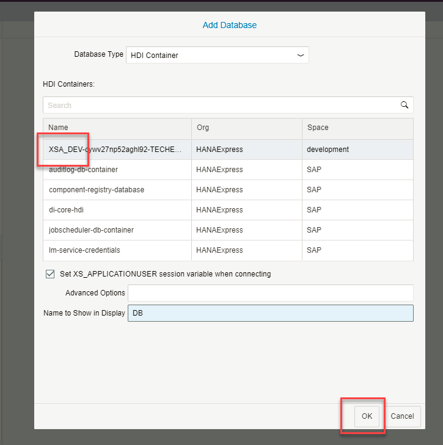
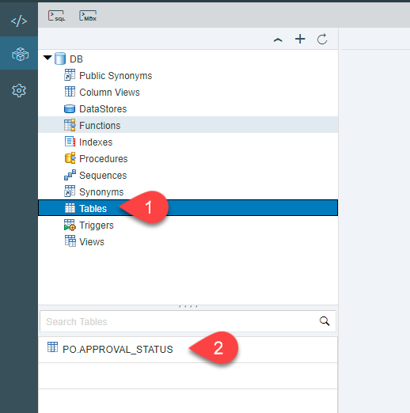
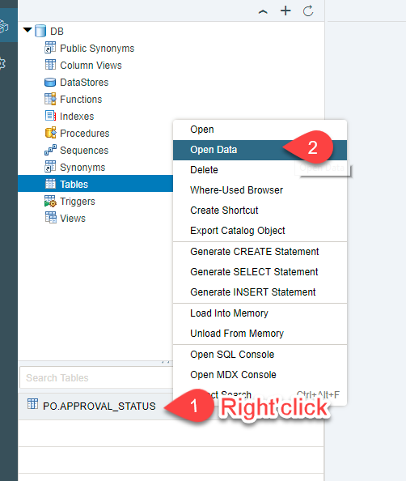
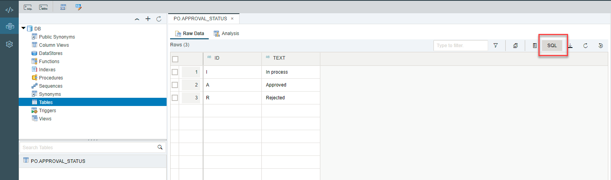
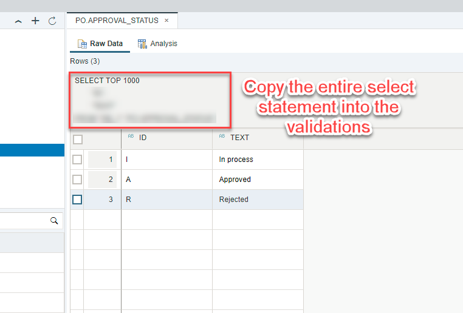
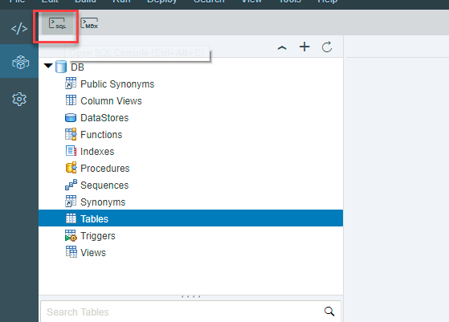
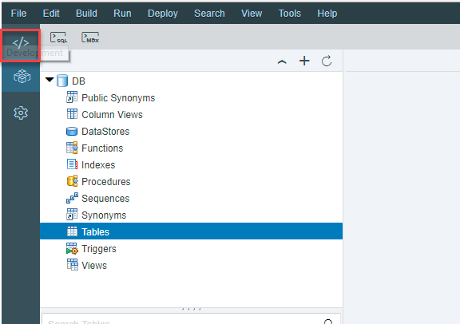

## Prerequisites  
 - This tutorial is designed for SAP HANA on premise and SAP HANA, express edition. It is not designed for SAP HANA Cloud.
 - **Proficiency:** Beginner

## Details
### You will learn  
Describe what the user will learn from your tutorial and what the outcome will be.

### Time to Complete
**15 Min**

---

[ACCORDION-BEGIN [Step 1: ](Check the database explorer)]

Go into the database explorer using the button in the middle of the left side bar:

You will be asked if you want to add a Database. Click on **Yes**

Choose your container. You will know because it will have your username (`XSA_DEV`) and the name of our project (in this case,  `TECHED`).

[DONE]
[ACCORDION-END]

[ACCORDION-BEGIN [Step 2: ](Check your data)]

Once your database container appears, click on the **Tables**. You will see your entity converted into a run time object.

Right-click on the table and choose Open Data:

You will see the data from the CSV file is now loaded:

[DONE]
[ACCORDION-END]

[ACCORDION-BEGIN [Step 3: ](Check the Select Statement)]

Click on the **SQL** button on the top of the data preview

Copy the full SELECT statement into the validation below

And click on **Validate**

[VALIDATE_1]

[ACCORDION-END]

[ACCORDION-BEGIN [Step 4: ](Go back into the Development view)]

Open a SQL console and leave it open. You will use it in the next step:

Use the code symbol to go back to the development view:

[DONE]
[ACCORDION-END]
---
