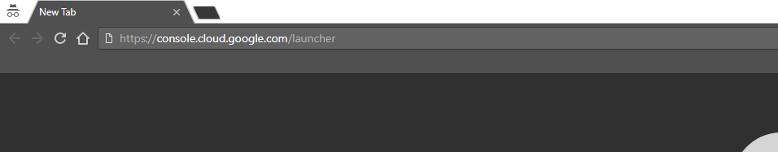
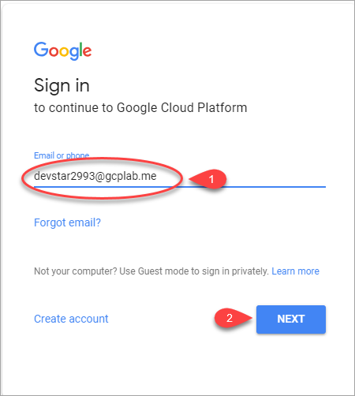
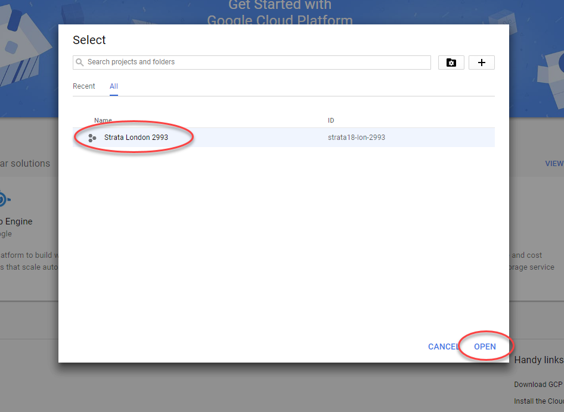
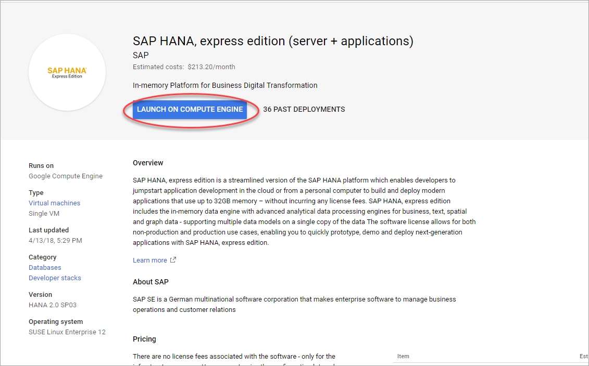
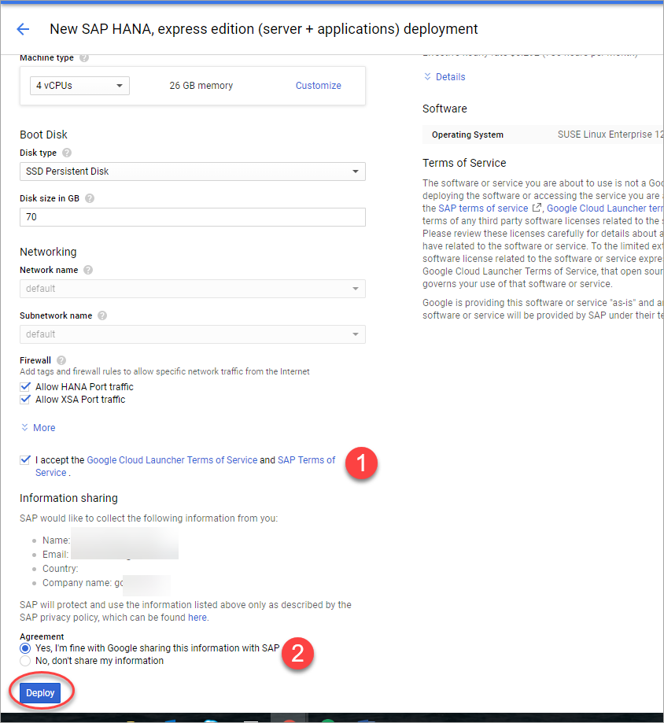
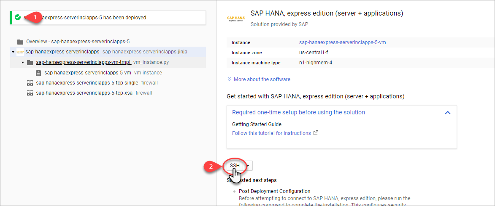
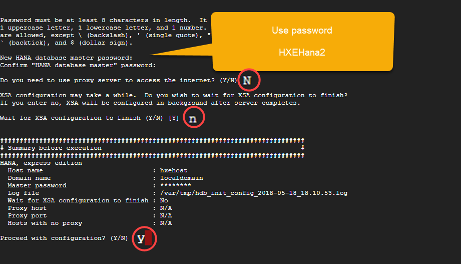
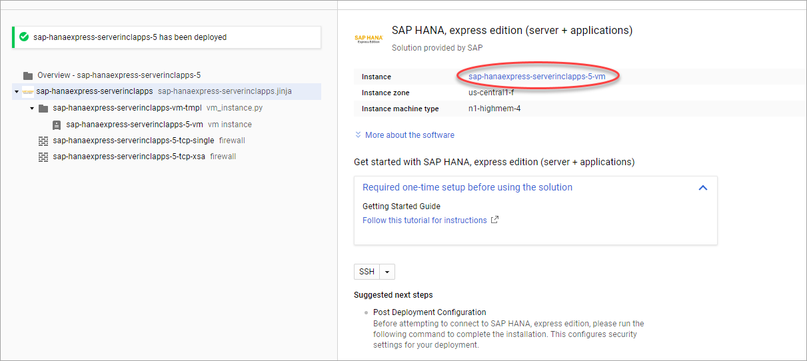
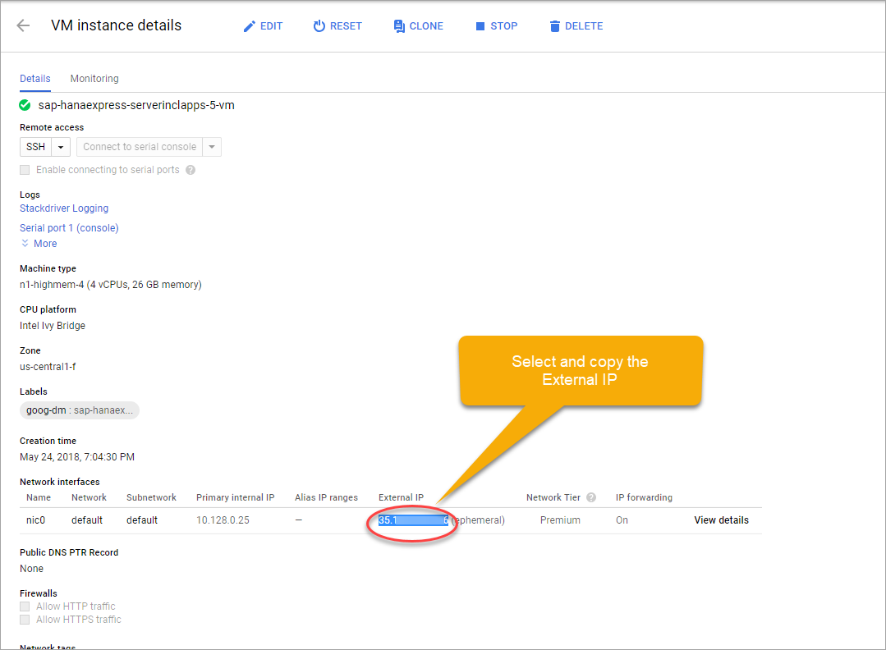
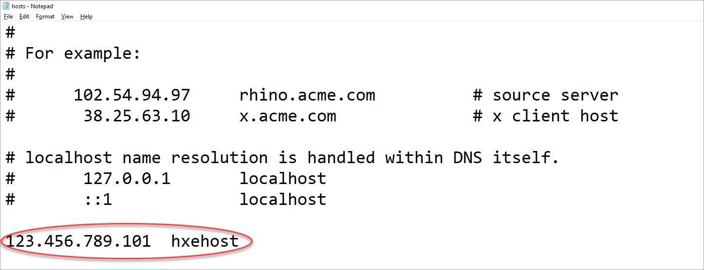

## Prerequisites  
 - **Proficiency:** Beginner

## Details
### You will learn  

To complete this tutorial, you will be using a Virtual Machine powered and sponsored by [Google Cloud](https://cloud.google.com/).


### Time to Complete
**20 Min**

---

[ACCORDION-BEGIN [Step 1: ](Log in to your test account)]

The experts at the Developer garage at SAPPHIRE NOW will provide you with access details. Open a new **incognito window** using Google Chrome.


And navigate to the Google Cloud launcher: `https://console.cloud.google.com/launcher`



Click **SIGN IN**.


And use the user name provided to you by the experts ...



... and the password as provided to you by the experts.


You will be presented with the terms and policies applied to the test account.


Click **CONSOLE**.


Agree to the terms applicable to the test account.


Click **Select a project**.


You will find a pre-created project. Select it.




[ACCORDION-END]

[ACCORDION-BEGIN [Step 2: ](Deploy SAP HANA, express on Google Cloud Platform)]

Look for the full image of SAP HANA, express edition on the Google Cloud Platform using the search bar on the top. Click on the result that includes **server + applications**.


Click **LAUNCH ON COMPUTE ENGINE**.



Scroll down to accept the terms of service and agree on sharing information (remember, this applies to the test account) and click **Deploy**.



Wait until the instance is deployed and click  **SSH**.



Copy and paste the following command into the console:

```txt
sudo su - hxeadm
```

And press **Enter**.


You will be asked for some parameters to configure your SAP HANA, express edition instance.



Configuration will take just a couple of minutes. In the meantime, continue with the next step.

[ACCORDION-END]


[ACCORDION-BEGIN [Step 3: ](Configure access to your Virtual Machine)]

Go back to the Google Chrome window and click the name of the instance.



Select and copy (`CTRL+C`) the external IP address.



Click the **Notepad** icon on the task bar and replace any existing IP address with the one you have copied.



The IP address should be followed by a space and `hxehost`.

Save the file.

Read the following text to question below.

> ### **SAP HANA and tutorials for free**
> SAP HANA, express edition is a streamlined version of SAP HANA. The license is provided for free, even for productive use, up to 32 GB of RAM.
>&nbsp;
>In other words, you could SAP HANA, express edition for advanced analytics, as a development platform to later deploy on SAP Cloud Platform, for training or trying the latest SAP HANA features for free.
>&nbsp;
>You can run SAP HANA, express edition on any hardware, like a laptop or on Google Cloud. You may also be eligible for free initial credits that will allow you to use the infrastructure also free of charge.
>&nbsp;
>Find out more about how to deploy SAP HANA, express edition and access hundreds of free, step-by-step tutorials for developers at `developers.sap.com`


[ACCORDION-END]

[ACCORDION-BEGIN [Step 4: ](Connect to SAP Web IDE for SAP HANA)]

You will now connect to SAP Web IDE for SAP HANA. This is the editor in which you can create cloud-native, data-driven applications based on micro-services architecture.

Open a new **incognito Google Chrome window**.


Enter the following URL:

```text
https://hxehost:39030
```

> ### **Congratulations!**
>You have successfully deployed and configured an SAP HANA, express edition virtual machine on Google Cloud.
>&nbsp;
>Let one of the experts at the booth know, and feel free to ask them any questions.

You can continue with the next tutorial using your newly-created instance.


[ACCORDION-END]
