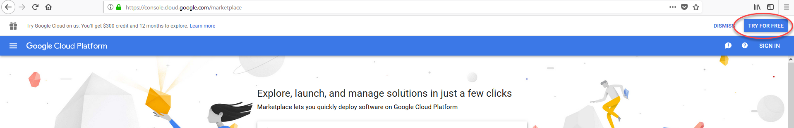
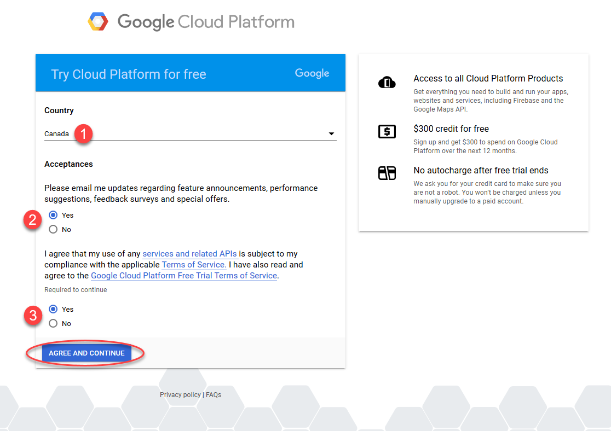
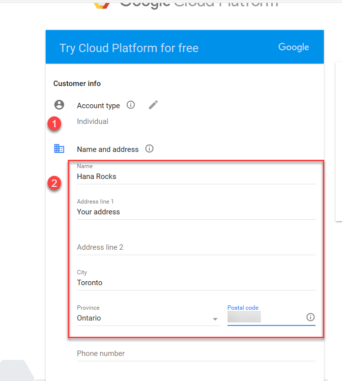
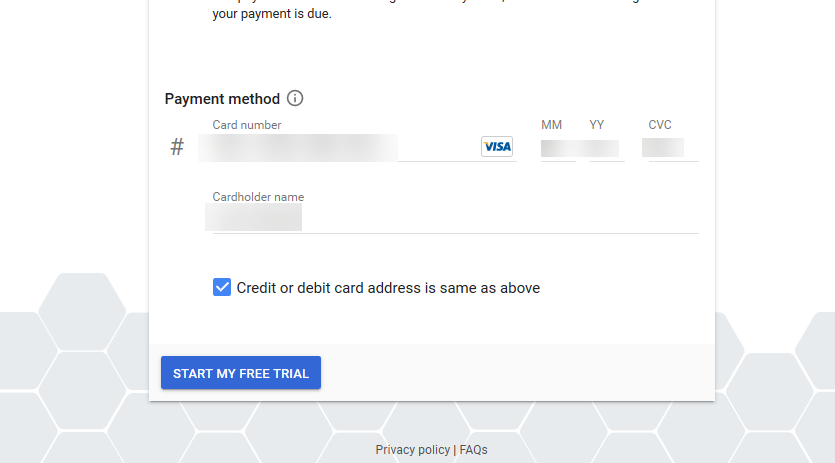
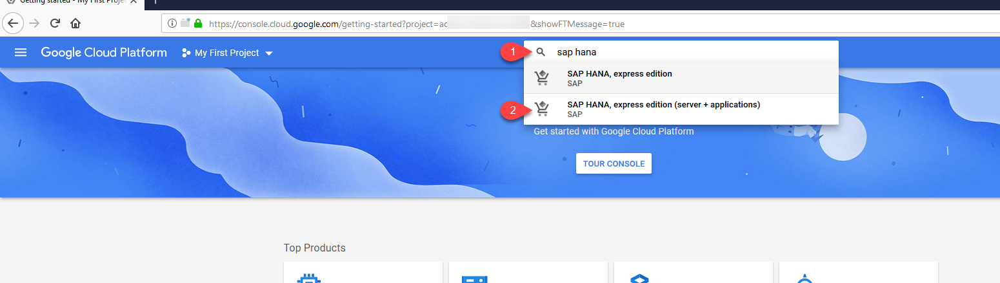
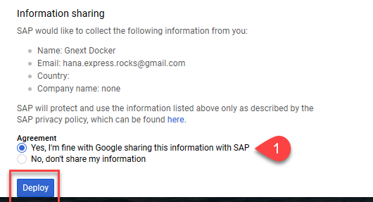

## Prerequisites  
 - **Proficiency:** Beginner

## Details
### You will learn  

To complete this tutorial, you will be using a Virtual Machine powered by [Google Cloud](https://cloud.google.com/).


### Time to Complete
**20 Min**

---

[ACCORDION-BEGIN [Step 1: ](Log in to your test account)]

Open a new window using Google Chrome and navigate to the Google Cloud marketplace: `https://console.cloud.google.com/marketplace`. Click **Try for free**.



Enter your Google email and click **Next**. Follow the steps


Enter your password.


You will be presented with the terms for the trial. Read them and accept to continue.



Fill in the details for your credit card.

> Why is it asking for your credit card?
> Check the top right square on the site. It should say there is not auto charge after the trial expires.



Once the credit card details are in, click **Start your free trial**.




[ACCORDION-END]

[ACCORDION-BEGIN [Step 2: ](Deploy SAP HANA, express on Google Cloud Platform)]

Look for `sap hana` on the Google Cloud Platform using the search bar on the top. Click on the result that includes **server + applications**.



Click **LAUNCH ON COMPUTE ENGINE**.


> If prompted, follow the steps to **enable billing** on your new project to start your trial.

Read and accept the terms and conditions


Scroll down, choose an option in information sharing, and click **deploy**



Wait until the instance is deployed and click  **SSH**.


Copy and paste the following command into the console:

```txt
sudo su - hxeadm
```

And press **Enter**.


You will be asked for some parameters to configure your SAP HANA, express edition instance.


Configuration will take just a couple of minutes. In the meantime, continue with the next step.

[ACCORDION-END]


[ACCORDION-BEGIN [Step 3: ](Configure access to your Virtual Machine)]

Go back to the Google Chrome window and click the name of the instance.


Select and copy (`CTRL+C`) the external IP address.


Use your IP address to map it to the hosts file in your computer. You need administration permissions on your computer to do this.

- For Windows Computers:
  If your user is not an administrator but has administrator rights, right-click on Notepad and choose `Run as Administrator`. If you are an administrator user, proceed to the next point.

    

    Open the file or navigate with Windows explorer. You need to edit the file called `hosts` in the directory `C:\Windows\System32\drivers\etc`

    


- For Mac:
  Open a terminal (`Finder -> Applications -> Terminal`) and type `sudo nano /etc/hosts`

    


Add the IP address followed by the name of the host, which will be `hxehost`:


**Save** and close the editor.

> If you do not have permissions to alter the file or you are using a different platform, you can check this [blog post](https://blogs.sap.com/2018/06/20/hana-express-and-xs-advanced-when-you-cannot-modify-the-hosts-file.../) to solve it.

[ACCORDION-END]

[ACCORDION-BEGIN [Step 4: ](Connect to SAP Web IDE for SAP HANA)]

You will now connect to SAP Web IDE for SAP HANA. This is the editor in which you can create cloud-native, data-driven applications based on micro-services architecture.

Open a new **incognito Google Chrome window**.


Enter the following URL:

```text
https://hxehost:39030
```

> ### **Congratulations!**
>You have successfully deployed and configured an SAP HANA, express edition virtual machine on Google Cloud.
>&nbsp;


> ## Ready to shut down your instance?
> Use command `HDB stop` as `hxeadm` in an console before turning your instance off.
> 

[ACCORDION-END]
