## Prerequisites  
 - **Proficiency:** Beginner

## Details
### You will learn  
You will learn how to create a cloud-native applications involving SAP HANA, Node.js and the Fiori master-detail template using SAP Web IDE.

**This tutorial can only be completed at SAPPHIRE**

### Time to Complete
**20 Min**

---

[ACCORDION-BEGIN [Step 1: ](Connect to SAP Web IDE for SAP HANA)]

Have you just created your own Virtual Machine on Google Cloud Platform?

If **yes**, go to this URL `https://hxehost:53075`

If **not**, click on the **SAP HANA** button in the favorite bar in Google Chrome. 

If a warning about the certificate appears, choose **Advanced > Continue to `hxehost`** to continue to the site.


Log in with user `XSA_DEV` and `HXEHana2`

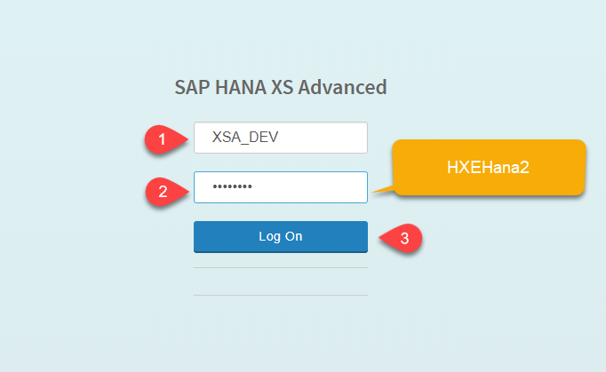

> You are now logged in to SAP Web IDE for SAP HANA, a tool to develop applications. You will be building a multi-target application. This is a collection of micro-services combined in the same development lifecycle to create a business application.

[ACCORDION-END]


[ACCORDION-BEGIN [Step 2: ](Create a project)]

This is the SAP Web IDE for SAP HANA. It is the development tool for native SAP HANA development.
If you see any existing folders, use the right-click menu to delete them.


**Right-click** on Workspace and choose **New > Project from template**.


Click **Next**.


Call your project `APP` and click **Next**.


Click **Finish** to create your project.

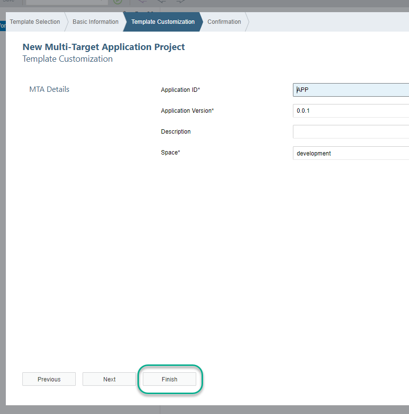

[ACCORDION-END]

[ACCORDION-BEGIN [Step 3: ](Create a database module)]

**Right-click** `APP` and choose **New > SAP HANA Database Module**.

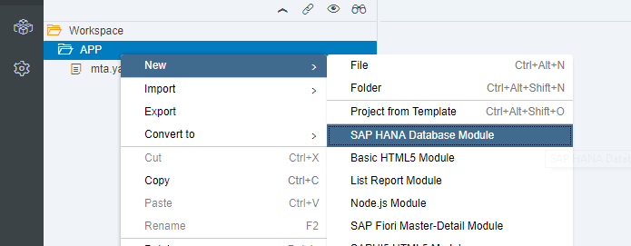

Call the module `db` and click **Next**.

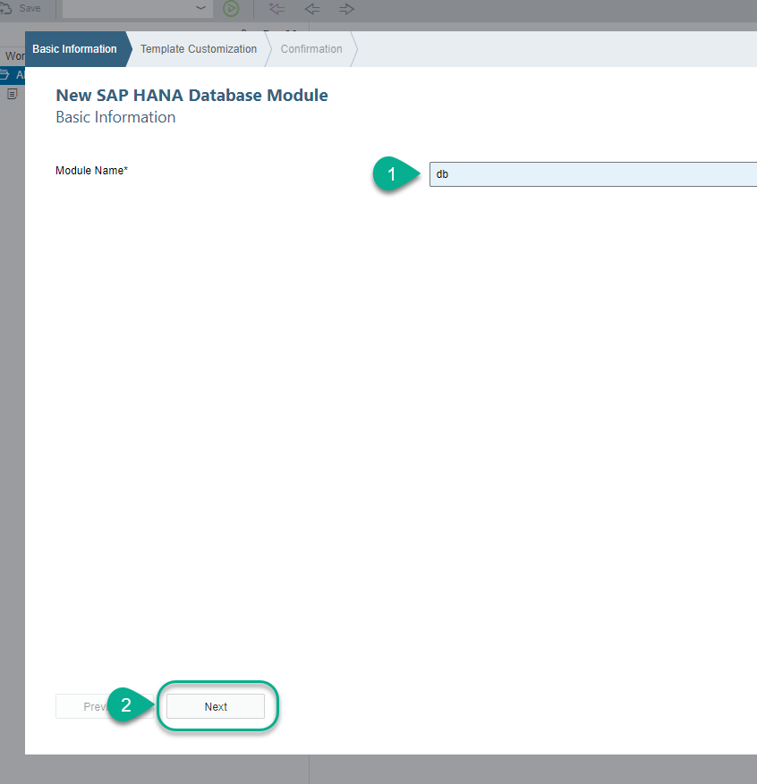

Click the checkbox to **Build module after creation**

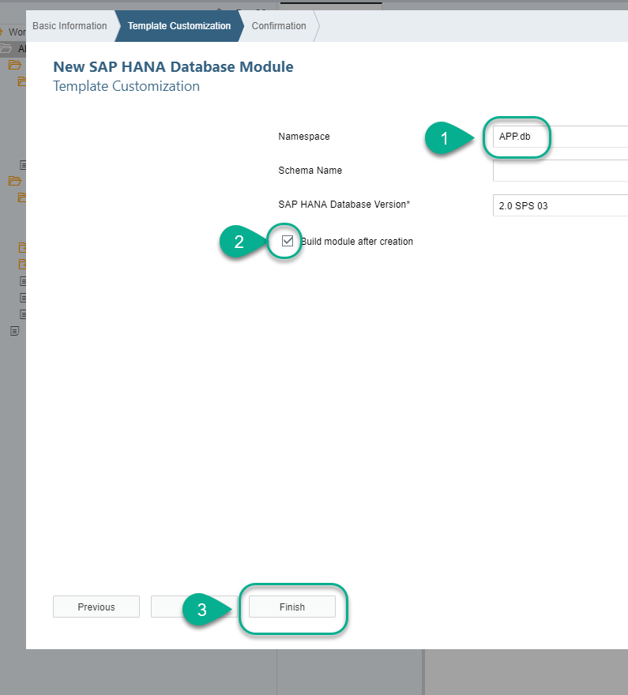

Right-click `src` and click **Import > File or Project**.


User **browse** to navigate to the folder `Desktop/1- HANA Data Import` and choose the file `src (native).zip`.

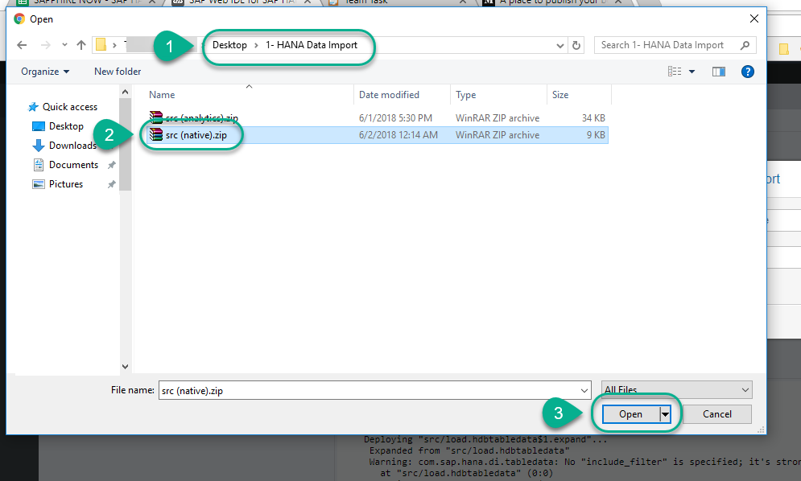

Delete the name of the file and click **OK**. When prompted, **confirm** the import.

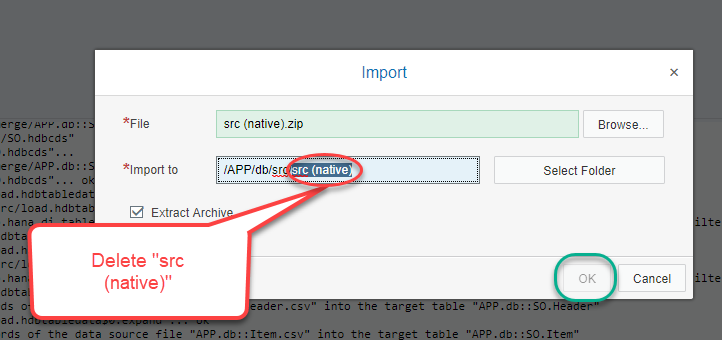

**Build** the database module.

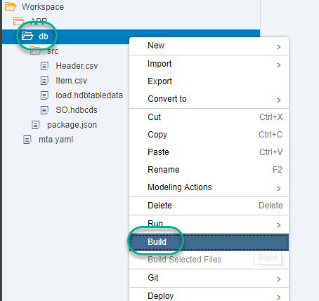

Congratulations! You have just created two tables and loaded data into them.

[ACCORDION-END]

[ACCORDION-BEGIN [Step 4: ](Expose data for consumption)]

You will now create a Node.js module to expose the data in the tables using an OData service.
**Right-click** `APP` and select **New > Node.js Module**.

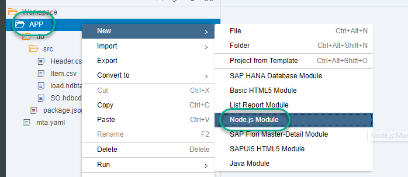

Call it `js ` and click **Next**.

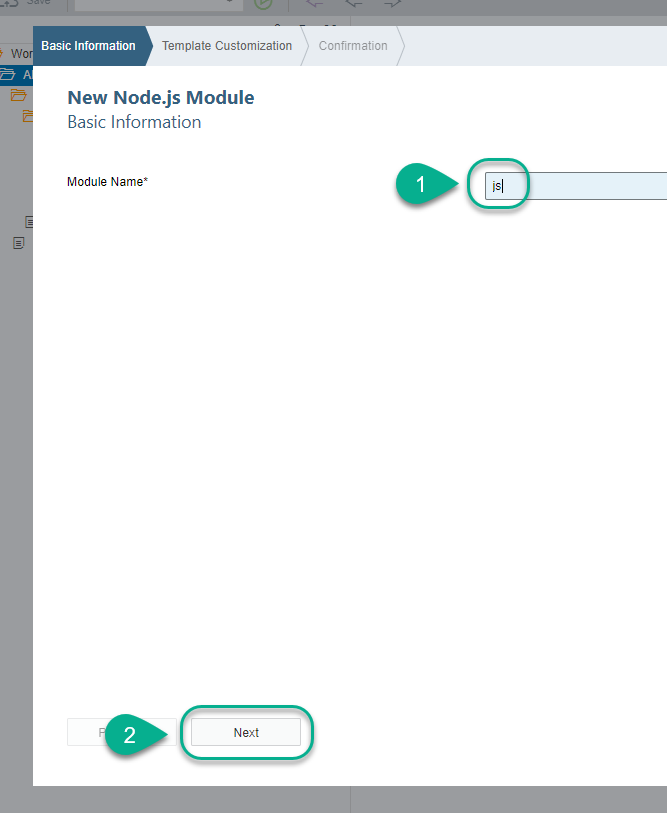

Tick the box next to `Enable XSJS support`, and click **Finish**


Expand the `js` folder and **right-click** the `lib` folder. Create a new file.

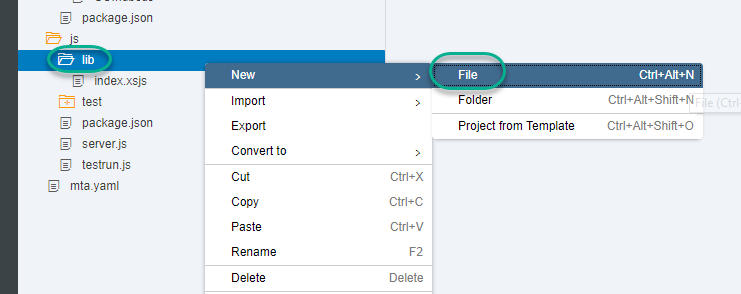

Call it `service.xsodata`

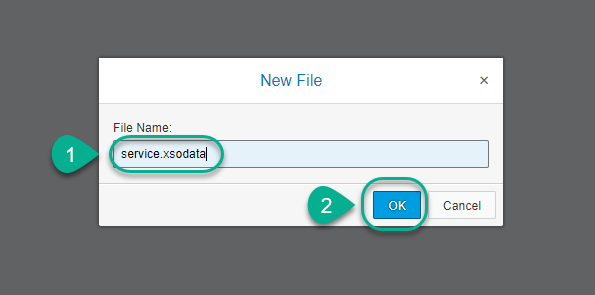

**Paste** the following contents into the file

```javascript

service {
	"APP.db::SO.Header" as "Header"
	navigates ("Items" as "Item");

	"APP.db::SO.Item" as "Item";
	association "Items" principal "Header"("SALESORDERID")
	multiplicity "1" dependent  "Item"("SALESORDERID") multiplicity "*";

}
```
**Save**  the file.

Open the `mta.yaml` file, click on the `js` module and use the **`+`** sign to add the `hdi_db` and `db` dependencies under **Requires**.

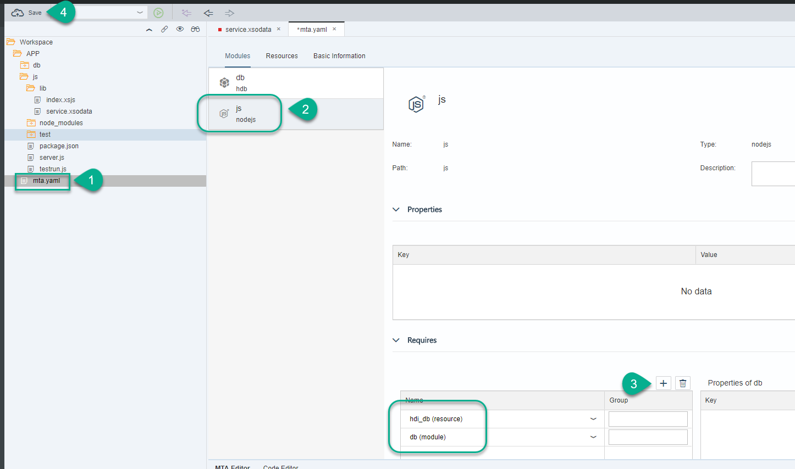

**Save** the `mta.yaml` file.

**Save** and **Run** the `js` module.

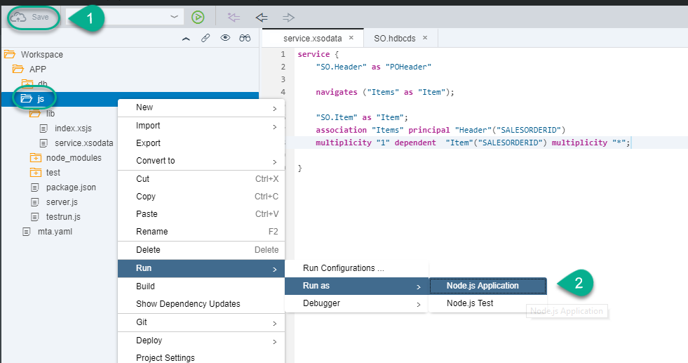

This will build and redeploy the entire application because the `mta.yaml` file has been modified. This file describes the dependencies between the different modules (micro-services) and the order in which they are deployed.

Once the application is **Running**, you can proceed to the last step.

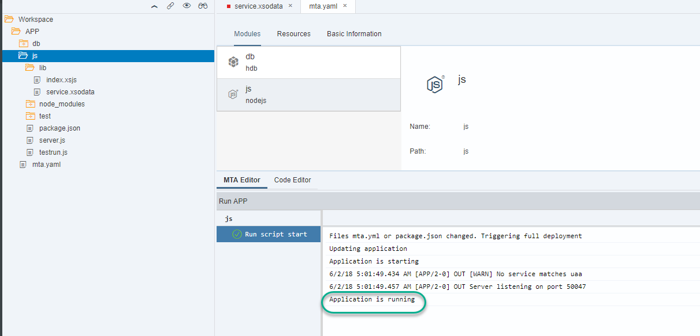

[ACCORDION-END]

[ACCORDION-BEGIN [Step 5: ](Use the Fiori master-detail wizard to visualize your app)]

You will now create the web module using the SAP Fiori master-detail wizard.

Right-click `APP` and choose **New > SAP Fiori Master-Detail Module**.

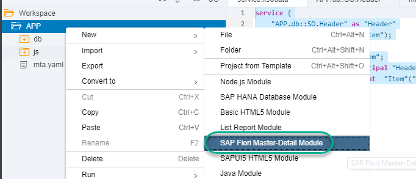

Call it `web`, and click **Next**.


Choose the available service and click **Next**.


Map the fields for the header of the sales order in the wizard.

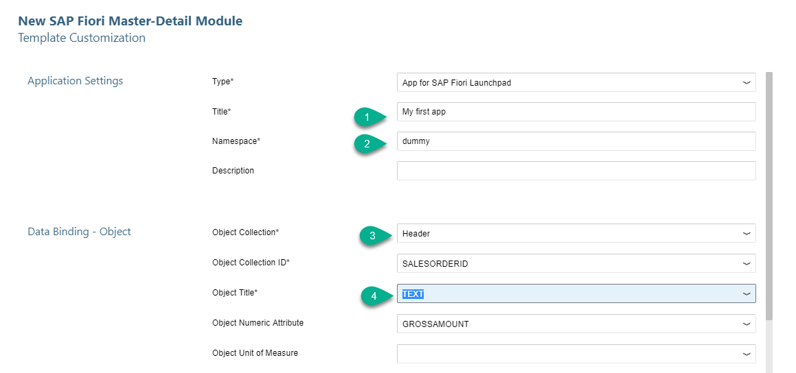

**Scroll down** to map the fields for the items in the sales orders.


**Right-click** on the web module, and select **Run as > Web Application**.

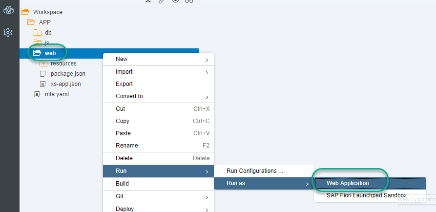

**Scroll down to select** the file `index.html`.

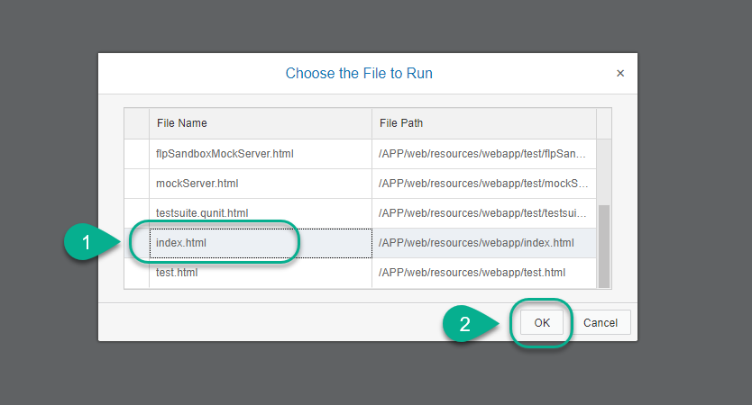


> ### **Congratulations!**
>You have created an instance of an SAP HANA service, a Node.js and a web micro-services and glued them together to produce a multi-target application. This can run both on premise or in the cloud.
>&nbsp;


[ACCORDION-END]

---
