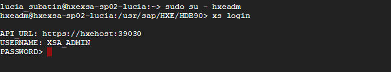
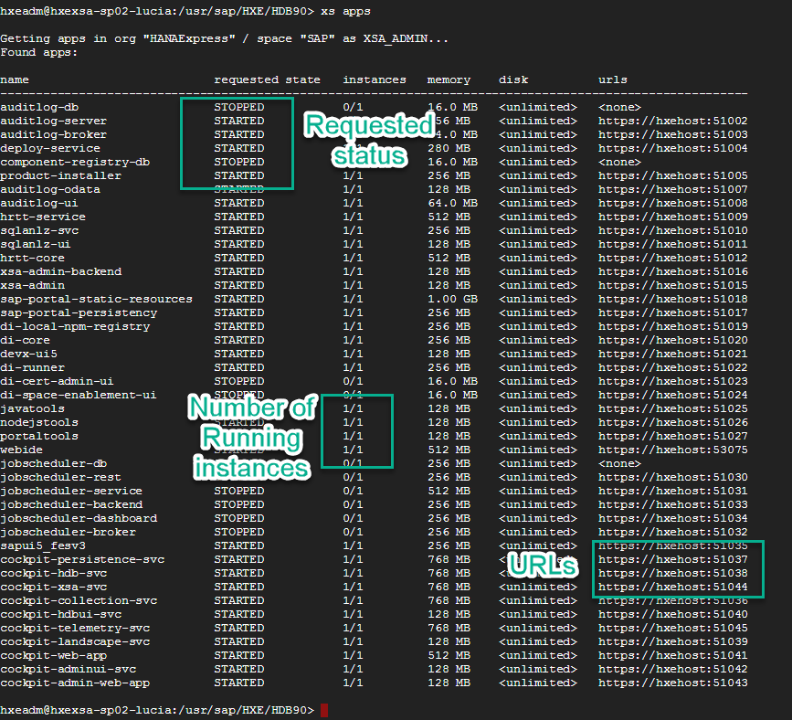
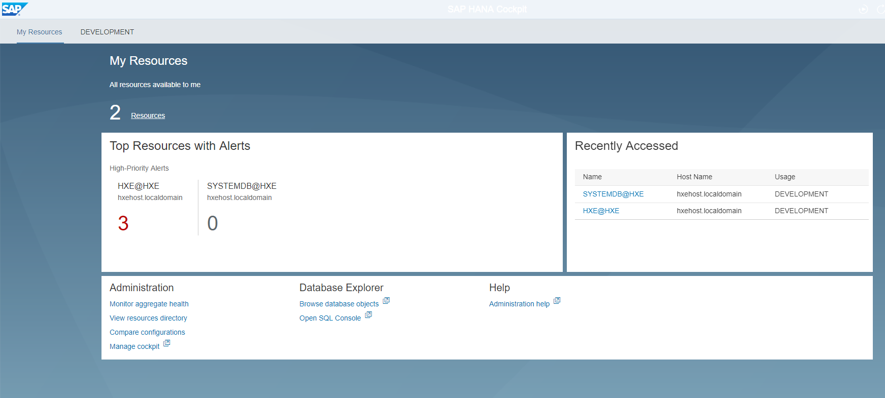
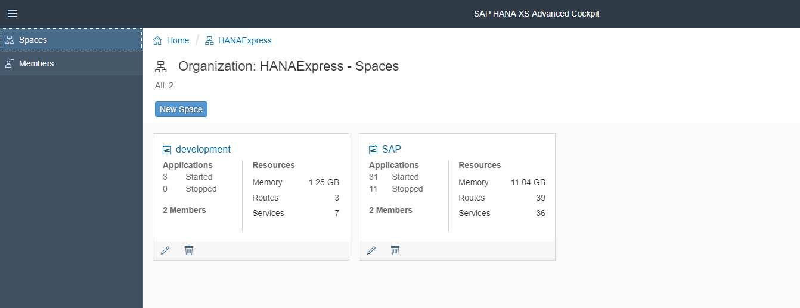
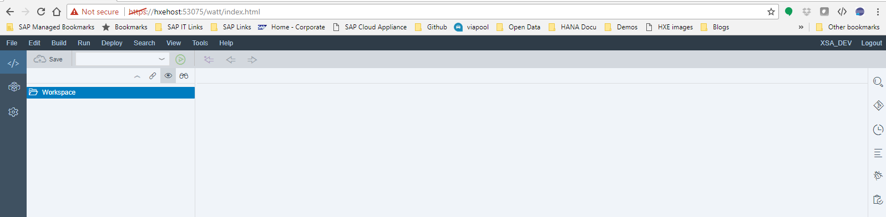
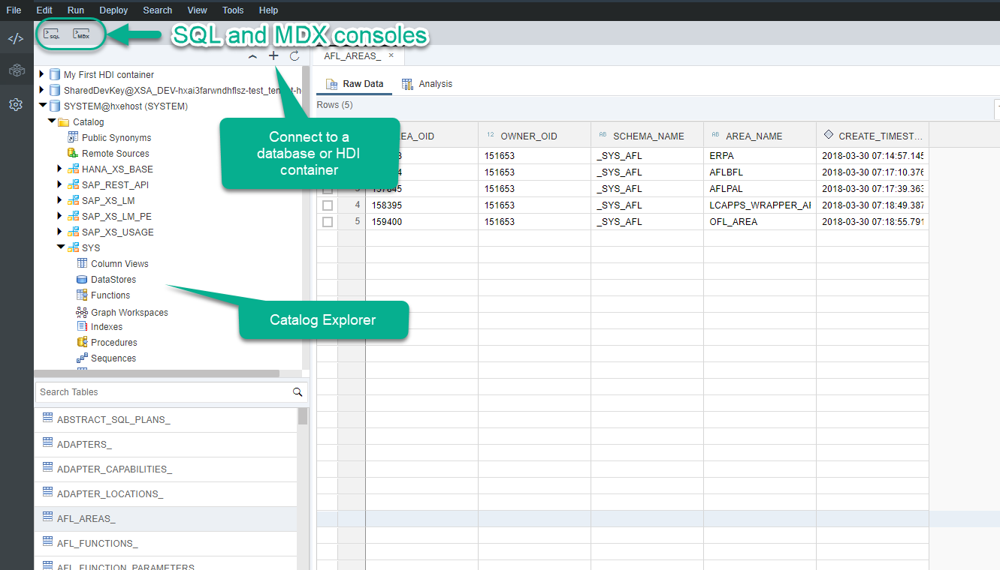
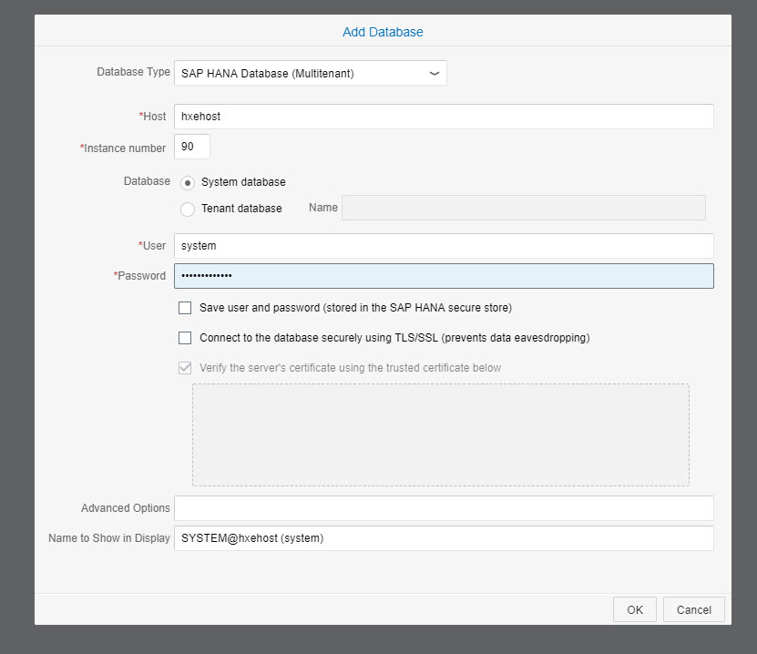

## Prerequisites  
 - This tutorial is designed for SAP HANA on premise and SAP HANA, express edition. It is not designed for SAP HANA Cloud.
 - **Proficiency:** Beginner | Intermediate | Advanced
 - **Tutorials:** [Get an SAP HANA, express edition, instance with XS Advanced applications](https://developers.sap.com/topics/hana.html)


## Next Steps
 - [Get started with SAP HANA, XS Advanced development](group.hana-xsa-get-started)


## Details
### You will learn  
- How to connect to the XS Advanced platform using the Command Line Interface
- How to connect to SAP Web IDE for SAP HANA and the Database Explorer
- How to connect to administration tools such as the SAP HANA Database Cockpit or the XS Advanced Cockpit

---

[ACCORDION-BEGIN [Step 1: ](Log in to the XS Command Line Interface from the server)]

The XS CLI is also available by default in the SAP HANA server with XS Advanced applications. In the case of SAP HANA, express edition, you can access it from the same SSH console you used to start and configure your platform.

The XS CLI enables you to maintain not only the applications that are deployed to the XS advanced run-time environment, but also the run-time environment itself, and the users who access and use it.
> Note: You can get it from the [download manager for SAP HANA, express edition](https://www.sap.com/products/hana/express-trial.html) or from the [SAP Service Marketplace](https://launchpad.support.sap.com/#/softwarecenter). Make sure you have the latest version in order to avoid issues.

**This tutorial assumes you are using the CLI from the operating system in your SAP HANA, express edition instance.**

From a console connected to the operating system, switch to user `hxeadm` and log in as follows:

```bash
sudo su - hxeadm
xs login
```



>Note: `hxeadm` is the default administration user in the operating system in SAP HANA, express edition.


Enter the master password to log in with `XSA_ADMIN`. You are now logged in to the default organization and space. You can later log in to a different organization or space by adding `-s` for space or `-o` for organization.

>Note: If you get an `SSL error` because you are using the default self-signed certificate from SAP HANA, express edition, add `--skip-ssl-validation` to your login command.

Alternatively, only from the CLI available in the SAP HANA, express edition instance, you can use the following command to log in as `XSA_ADMIN` specifying only the password

```bash
xs-admin-login
```

The XS CLI allows you to perform most of the administration tasks available in the XS Advanced Cockpit. The available commands can be found in the [SAP Help Portal](https://help.sap.com/viewer/4505d0bdaf4948449b7f7379d24d0f0d/2.0.00/en-US/addd59069e6f444ca6ccc064d131feec.html)

Use command `xs target -s SAP` to switch to the SAP space, where XS Advanced applications such as the Administration Cockpit and the SAP Web IDE for SAP HANA can be found.

You can check on the status of the running applications with command `xs apps`. This will also tell you the URL for the important applications you will need for administration and the SAP Web IDE for SAP HANA.



You can also see a list of running services with command `xs services`. You can find more details about [service types and the service marketplace in the SAP Help](https://help.sap.com/viewer/4505d0bdaf4948449b7f7379d24d0f0d/2.0.02/en-US/33e3c5926feb4098a32edcaa7290c3d1.html) portal.

[DONE]
[ACCORDION-END]

[ACCORDION-BEGIN [Step 2: ](Access the SAP HANA Cockpit or the XS Advanced Cockpit)]

You will find some applications with the word `Cockpit` in their names are running by default.
> Note that the running instances need to show `1/1`. If you see `0/1` and `STARTED` is the requested status, the application is probably still starting.

The SAP HANA Cockpit and the XS Advanced Cockpit can be used to perform administration tasks on the system.

The SAP HANA Cockpit is the application called `cockpit-web-app`. The cockpit manager is `cockpit-admin-web-app`. You can use the URLs displayed by the `xs a` command to access the cockpit as `XSA_ADMIN`.



The name for the SAP HANA XS Advanced Cockpit is `xsa-cockpit`



You can find out more about the administration tools for SAP HANA 1.0 SPS12 and SAP HANA 2.0 SPS00 and higher in the [dedicated SAP Help](https://help.sap.com/viewer/6b94445c94ae495c83a19646e7c3fd56/2.0.03/en-US/577f8d3ffebd4265b73e2c673d934412.html) portal.

[DONE]
[ACCORDION-END]


[ACCORDION-BEGIN [Step 3: ](Explore the SAP Web IDE for SAP HANA)]

Open a new browser window and copy the URL for the SAP Web IDE for SAP HANA.

> Important: If you have logged in as `XSA_ADMIN`, alternate between normal and incognito mode to log in as `XSA_DEV`.

 By default, in SAP HANA, express edition, the URL for SAP Web IDE for SAP HANA is `https://hxehost:53075`. Use the user `XSA_DEV` and its password. For SAP HANA, express edition, this is the same password as the master password.



On the left side panel, you will find access to the development perspective, which is loaded by default and where you can create your Multi Target Applications.


You can also find the Database Explorer where you can connect to the physical SYSTEMDB and tenant databases, explore the schemas and tables and execute SQL commands.



The third icon takes you to the settings, where you can configure different aspects of the code and modelling editors, shortcuts and plugins enabled for SAP Web IDE for SAP HANA. For example, if you wanted to use the Fiori Launchpad plugin for development, you would need to access the settings.


On the left side panel, you will find additional tools that will be explored incrementally along with the XS Advanced application development tutorials.

[DONE]
[ACCORDION-END]
[ACCORDION-BEGIN [Step 4: ](Connect to your system database)]

Go back into the database explorer, click **+** to add a database and use the options below to connect to the SYSTEM database.

> SAP HANA supports multiple databases, isolated form each other, in the same environment. This concept is known as multi-tenancy. There is one database, the system database, that has limited SQL capabilities and is used to perform administration tasks over the contained databases, called tenants. Tenant databases have all of the SQL capabilities enabled. SAP HANA, express edition, brings one default first tenant called `HXE`.

For SAP HANA, express edition, these are the defaults:

  -   Host: `hxehost` or `localhost`
  -   Instance number: 90
  -   If you wanted to connect to the tenant database, the name is `HXE`. Make sure you choose the radio button for `tenant database` in that case.



Use the `SQL` button and enter the following query.

```sql
select * from dummy;
```

Use `F8` or the green **run** icon to execute the query. Enter the result of the query in the box below to complete the validation.

[VALIDATE_1]
[ACCORDION-END]
