## Prerequisites  
- This tutorial is designed for SAP HANA on premise and SAP HANA, express edition. It is not designed for SAP HANA Cloud.
- **Tutorials:** [Create a calculation view of data type Dimension](https://developers.sap.com/tutorials/xsa-graphical-view.html)

## Details
### You will learn  
- How to create a calculation view with a Cube data type
- Use a star join to combine data from a dimension calculation view and a table
- Perform currency conversion

---

[ACCORDION-BEGIN [Step 1: ](Create a new Calculation view of type Cube)]

Create a new calculation view in your models folder.

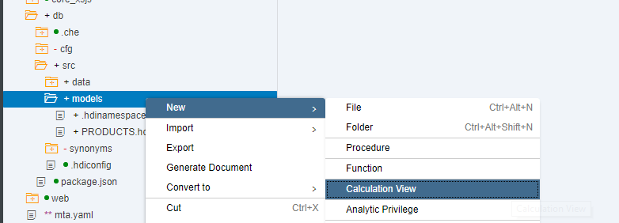

Call it `PURCHASE_ORDERS`, choose `CUBE` as a data category and mark the flag for `With Star Join`

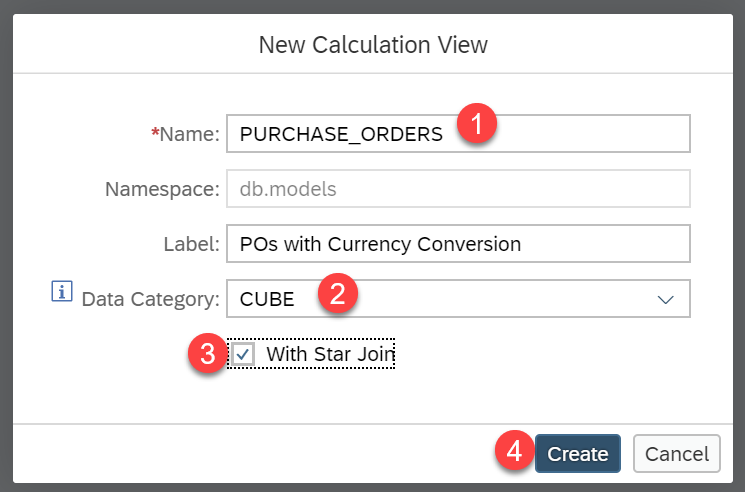

[DONE]



[ACCORDION-END]

[ACCORDION-BEGIN [Step 2: ](Join header and items)]

Drag and drop a join node and add click on the **+** sign to add the data sources

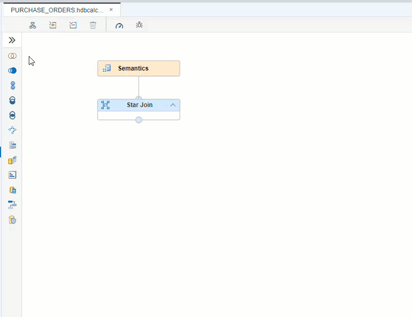

Type `PO` and choose both `PO.Header` and `PO.Item` and click **Finish**.

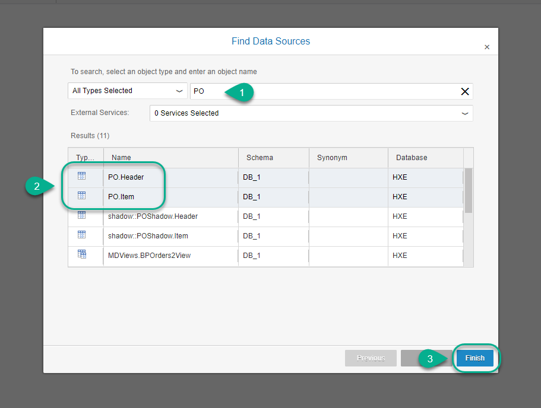

Create a inner join using `PURCHASEORDERID` and set the cardinality as `1..n`

In the mapping tab, add the following columns to the output: `PURCHASEORDERID`, `HISTORY.CHANGEDAT`, `PRODUCT.PRODUCTID`, `CURRENCY` and `GROSSAMOUNT`.

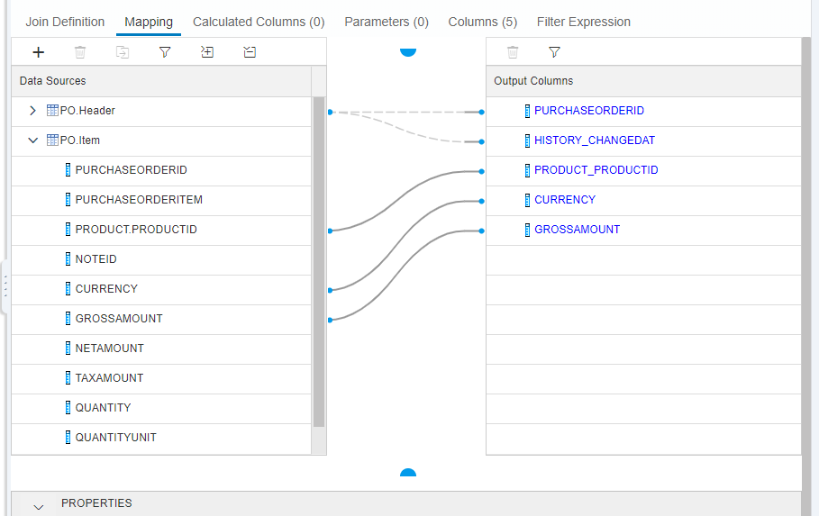

Finally, rename the node to `PO`.

[DONE]

[ACCORDION-END]

[ACCORDION-BEGIN [Step 3: ](Join Purchase Orders with products dimension)]

Connect the output of the join to the `Star Join`. Use the **+** sign to search and select `PRODUCTS`.

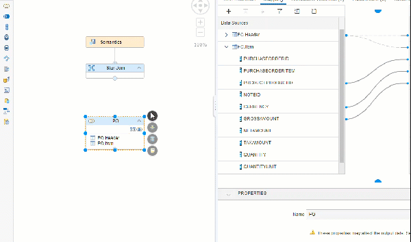

Join the `PRODUCTID` and `PRODUCT.PRODUCTID` as an inner join.

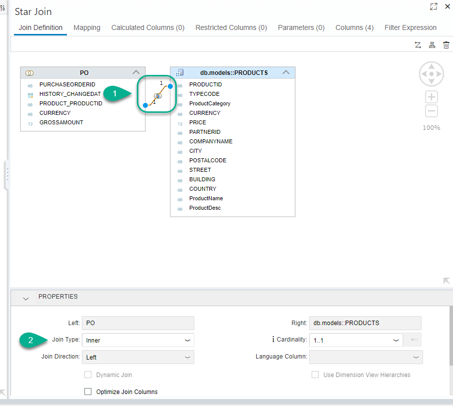

[DONE]

[ACCORDION-END]

[ACCORDION-BEGIN [Step 4: ](Create an input parameter)]

In the Parameters tab of the Star Join Node, create an input parameter named `IP_O_TARGET_CURRENCY`.

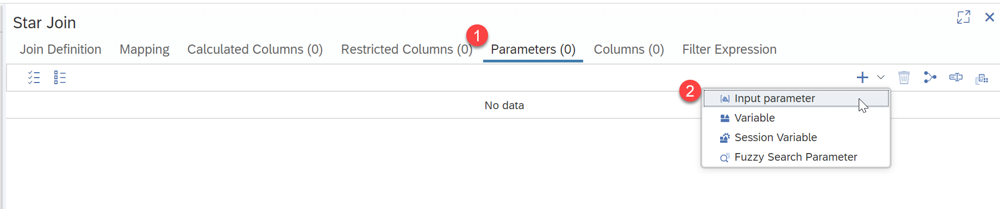

Configure it as `NVARCHAR`, length 3 with a Semantic type of Currency.
Flag it as mandatory and set a default value of `USD`.

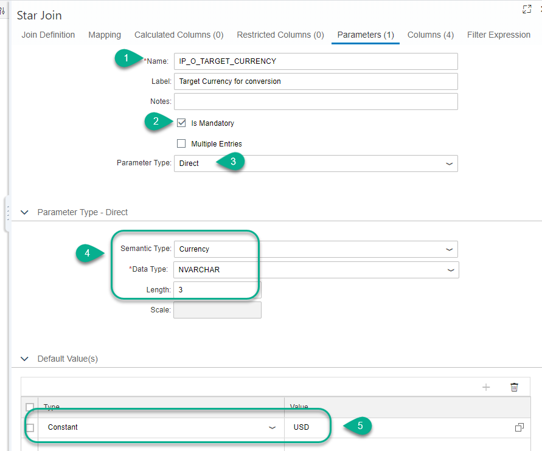

[DONE]

[ACCORDION-END]

[ACCORDION-BEGIN [Step 5: ](Configure semantics for currency conversion)]

Go into the mapping tab and double click on the `PO` parent node to add all of the fields to the output. Add the `GROSSAMOUNT` a second time.

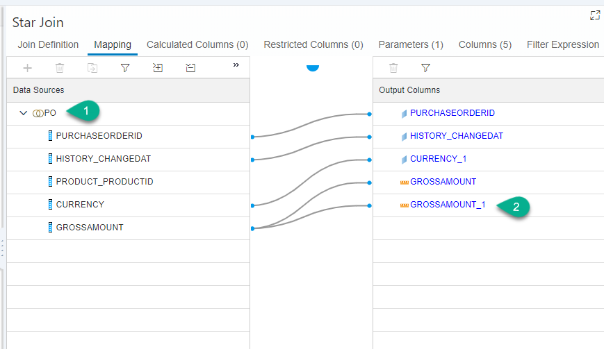

Change the name of the duplicate column to `OriginalGrossAmount`.

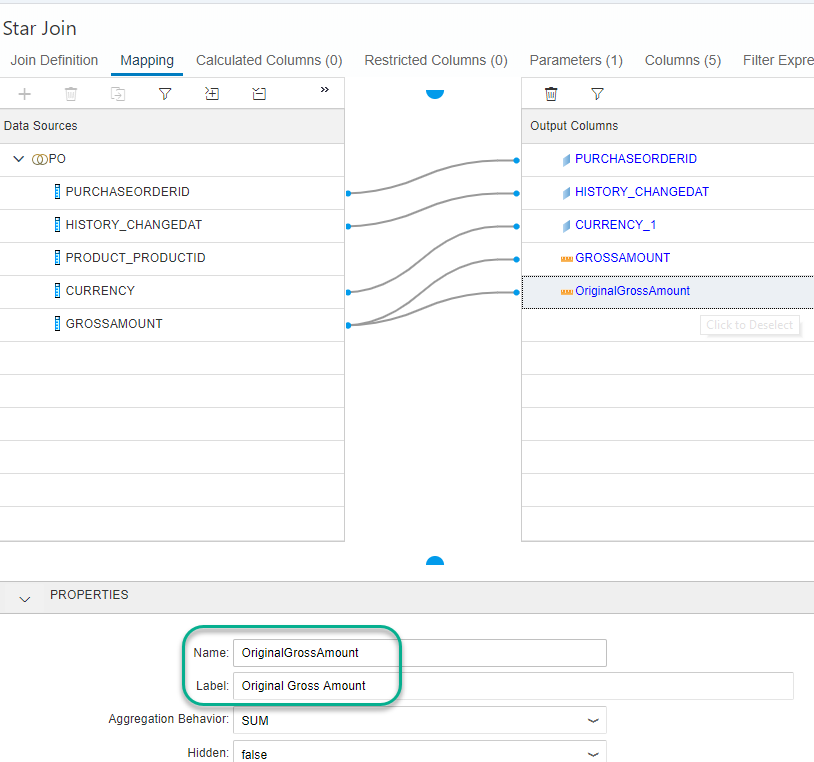

Click the semantics node.  Change the Type of the `PURCHASEORDERID` to be an Attribute.

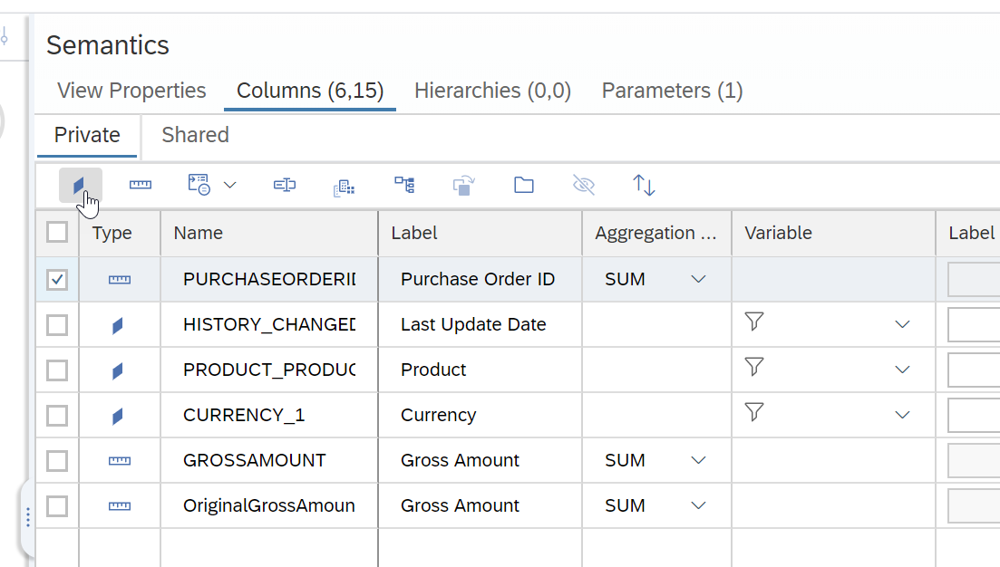

Assign semantics for `GROSSAMOUNT`.

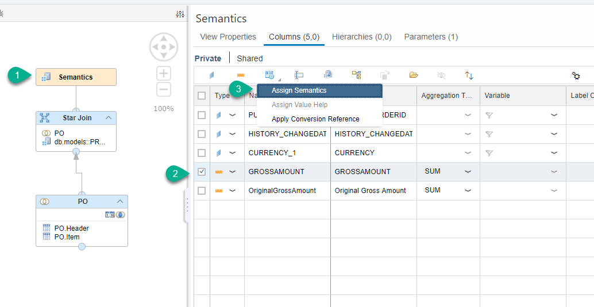

Choose **Amount with Currency Code** and configure as follows:

- Display Currency: column, choose `GROSSAMOUNT_CURRENCY`
- Check the `Conversion` and `Decimal shift` boxes

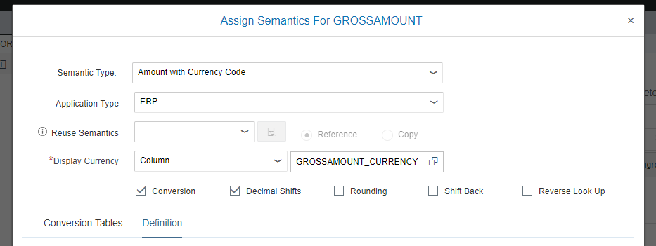

Click on the `definition` tab and use the following configuration

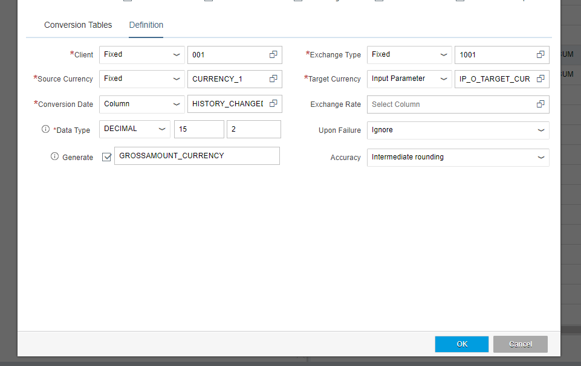

**Save** the view.

[DONE]

[ACCORDION-END]

[ACCORDION-BEGIN [Step 6: ](Build and preview)]

Build the `db` module and return to the database explorer

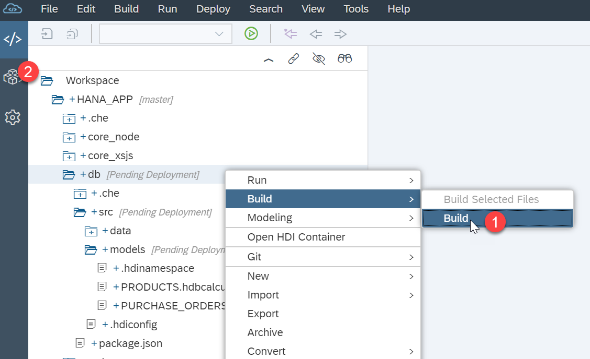

Navigate to the column view, right-click on it and select **Open Data**.

[VALIDATE_1]

[ACCORDION-END]

---
