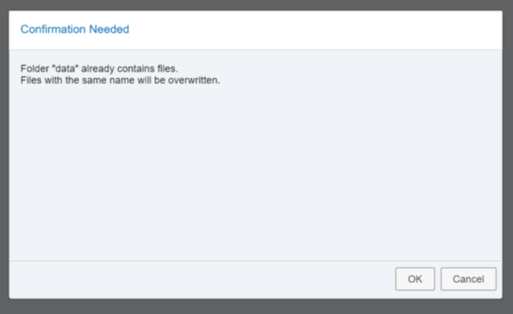
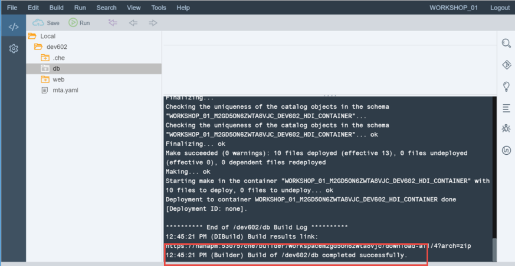

## Prerequisites  
 - **Proficiency:** Intermediate
 - **Tutorials:** [Creating an HDI Module](http://www.sap.com/developer/tutorials/xsa-hdi-module.html)

## Next Steps
 - [Creating a Calculation View with a Cube data type and Star Join](http://www.sap.com/developer/tutorials/xsa-sqlscript-cube.html)

## Details
### You will learn  
You will learn about creating a graphical calculation views with dimension data.

### Time to Complete
**15 Min**.

---

1. Before you start creating Calculation views, you will want to import a larger database module than you care to create by hand. Right mouse click on the `db/src/data` folder and choose Import -> From File System. 

    
    
2. Choose the file `data.zip` from the Download folder of your local client machine. Keep all other parameters the same. Press OK. Confirm that it is OK to overwrite the existing files. If the file is not available please check our [GIT repository](https://github.com/I809764/DEV602).
    
     
    
3. Now that you have your database development objects, you are ready to build the module which will create them in the HANA database. This process technically executes a Node.js application which will call over to HANA and deploy these database artifacts into their container. Right mouse click on the db folder and choose *Build*.
     

4. Similar to the run activity of the web module earlier; the status of the build will be displayed in a window in the lower right side of the IDE. 

    If everything worked correctly, you should see that the build completed successfully.
    

5. There is a new database tool called the HANA Runtime Tools (or HRTT) that can be used to view and interact with HDI created content. Open a new browser tab and navigate to `https://<hostname>:51006` to access this tool, for `SAP HANA, express edition` you will need to navigate to `http://<hostname>:51018`
    

6. You can explore some of the new tables and their content that have been imported. This is the SHINE (SAP HANA Interactive Education) content. 
    
    
7. Now you are ready to create our calculation views. From the `db/src` folder, right click and choose "New", then "Folder".  
    
8. Enter the name of the folder as "models" and click "OK".  
    
9. In the models sub-folder of your project, create a new calculation view based upon the expanded information for the products. This will require joining the products, texts, `businessPartner`, and address tables.

    Right mouse click on the models package, choose New -> Calculation View
    
10. Enter the name as PRODUCTS and a Label of Products View. 
Choose DIMENSION as the data category.  A DIMENSON Calculation View will be very similar to the older Attribute View – A basic join with no aggregation.

    Click "Create".
    
11. You want to join several tables from our project.  Ultimately you will join `MD.Products`, `MD.BusinessPartner`, `MD.Addresses` and `Util.Texts` (twice).

    In order to do so we have to create a join node for each join criteria. 

    Start by creating a Join Node pressing the Create Join button.
    

12. As we have several joins to add drag this new join node down near the bottom of the design window.
    
    
    
13. Click on the node and rename it to `Product_BP`.

    
    
14. Press the Plus button next to the node to add `tables/views` to the join node.

    
    
15. Add `MD.Products` to the node.

    
    
16. Repeat the process and add `MD.BusinessPartner` to the node.

    
    
17. We now want to create a join between the two tables on the `SUPPLIER.PARTNERID` to the `PARTNERID` column. Drag and drop to connect the two columns in the Join Definition.

    
    
18. Switch to the Mapping tab. We can then select which columns we want from this part of the join. 

	```
    Select PRODUCTID, TYPECODE, CATEGORY, CURRENCY, PRICE, NAMEID, DESCID, PARTNERID, COMPANYNAME,and ADDRESES.ADDRESSID and then choose Add To Output.
    ```
    

14. Optionally, you can change the name of a column as it becomes part of the view.  For example you might change CATEGORY to `ProductCategory`.
    
    
    
15. Repeat the process of adding a Join Node. Name this new Join Node Address and connect the output `Product_BP` to this new join node.

    
    

16. Add the `MD.Addresses` table to this join node.
    
    

17. Create a join between the `ADDRESSES_ADDRESSID` of the previous join node output and the `ADDRESSID` column of the `MD.Addresses` table.

    

18. Repeat the process of adding columns to the output. Select all columns from the `Product_BP` node except `ADDRESSES_ADDRESSID`. From The `MD.Addresses` table select  CITY, POSTALCODE, STREET, BUILDING, COUNTRY, and REGION.

    
    
19. Repeat the process of adding a Join Node. Name this new Join Node `Product_Name` and connect the output Address to this new join node.

    
    
20. Add the `Util.Texts` table to this join node.

    
    
21. Create a join between the `NAMEID` of the previous join node output and the `TEXTID` column of the `Util.Texts` table.

    
    
22. In the Join Properties window, change the Join Type to Text Join and the Language Column to LANGUAGE. 

    
    
23. Repeat the process of adding columns to the output via the mapping tab. Select all columns from the Address node except `NAMEID`. From the `Util.Texts` table select TEXT but change the name of the TEXT column in the output to `ProductName`.

    
    
24. Repeat the process of adding a Join Node. Name this new Join Node `Product_Desc` and connect the output `Product_Name` to this new join node.

    
    
25. Add the `Util.Texts` table to this join node.

    
    
26. Create a join between the `DESCID` of the previous join node output and the `TEXTID` column of the `Util.Texts` table.

    
    
27. In the Join Properties window, change the Join Type to Text Join and the Language Column to LANGUAGE.

    
     
28. Repeat the process of adding columns to the output via the mapping tab. Select all columns from the `Product_Name` node except `DESCID`. From the `Util.Texts` table select TEXT but change the name of the TEXT column in the output to `ProductDesc` .

    
    
29. Connect the output of the `Product_Desc` node to the Projection node at the top of the design window.

    
    
30. In the Projection node and Mapping tab, press the Auto Map by Name button.

    
    
31. Select the Semantics node and choose the Columns tab.  Select the Key column for PRODUCTID. 

    
     
32. In the View Properties tab, change the Apply Privileges to the blank value. 

    
    
33. Save your model

    
    
34. Build the `hdb` module and then return to the HRTT tool. Your container will now have an entry in the Column Views folder for this new Calculation View. 

    
     
35. For an initial test make sure your output looks similar to the following:

    

## Next Steps
 - [Creating a Calculation View with a Cube data type and Star Join](http://www.sap.com/developer/tutorials/xsa-sqlscript-cube.html)
