## Prerequisites  
- This tutorial is designed for SAP HANA on premise and SAP HANA, express edition. It is not designed for SAP HANA Cloud.
- **Tutorials:** [Import SHINE tables and data](https://developers.sap.com/tutorials/xsa-import-shine-data.html)

## Details
### You will learn  
- How to create a calculation view with a Dimension data type
- How to perform the basic modelling operations, such as projections and joins
- This tutorial is also available [as a video](https://www.youtube.com/watch?v=HEiyR7clkrQ)

---

[ACCORDION-BEGIN [Step 1: ](Create a new folder with a namespace)]

Create a new file called `models/.hdinamespace` under `/db/src`.

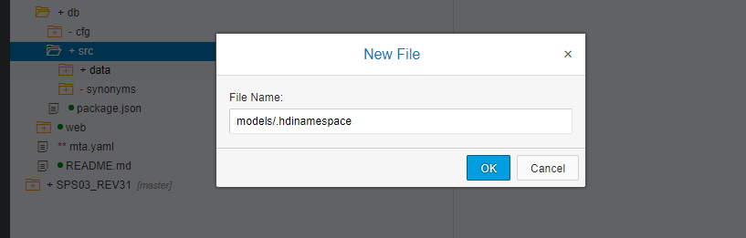

> Although there is no need to use namespaces in general, calculation views are consumed from external reporting tools best with namespaces

Use the following code in the file

```JSON
{
    "name":    "db.models",
    "subfolder": "ignore"
}

```

**Save** and close the file.

If you do not see the file, go to `View-> Show hidden files`.

[DONE]



[ACCORDION-END]

[ACCORDION-BEGIN [Step 2: ](Create a calculation view)]

Right-click on the models folder and create a new calculation view

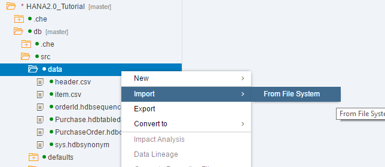

Call it `PRODUCTS` and choose type `DIMENSION` and click **Create**

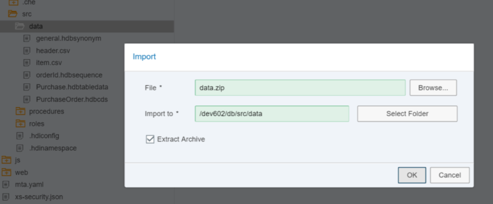

[DONE]

[ACCORDION-END]

[ACCORDION-BEGIN [Step 3: ](Join Products and Business Partners)]

Click the `Create join` button and drop the node at the bottom of the design window

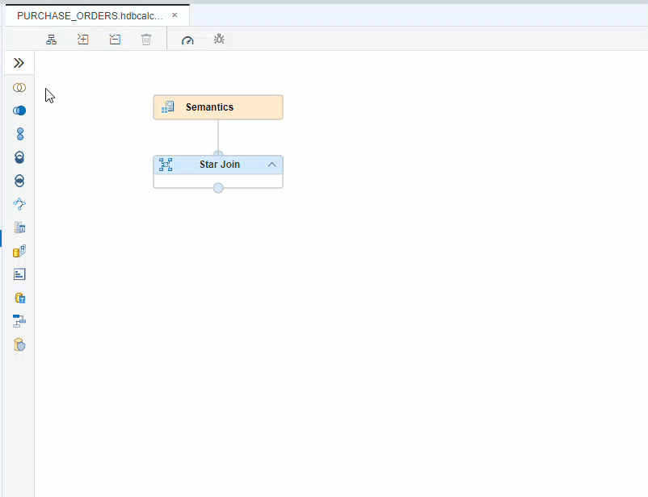

Right-click on the node and call it `Product_BP`


Press **enter** and select the node again, choose the **+** sign to add data sources

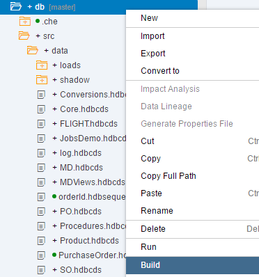

Add `MD.Products` and `MD.BusinessPartners` to the node. Use the **+** sign to search for the entities.

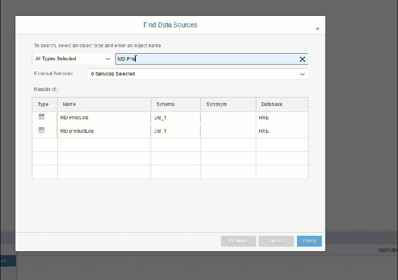

Double-click on the name of the node to open the join definition. Drag and drop `SUPPLIER.PARTNERID` to `PARTNERID` to connect the two tables.

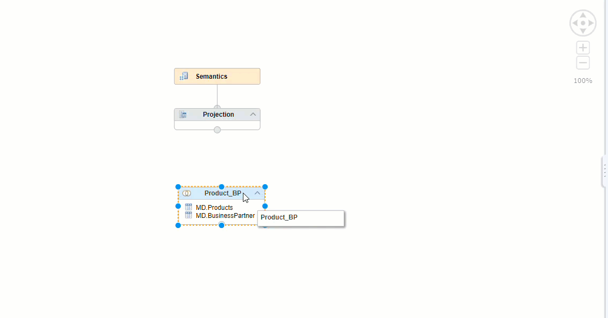

Click on the mapping tab and select `PRODUCTID`, `TYPECODE`, `CATEGORY`, `NAMEID`, `CURRENCY`, `PRICE`,  `DESCID`, `PARTNERID`, `COMPANYNAME` and `ADDRESES.ADDRESSID` and then choose Add To Output.

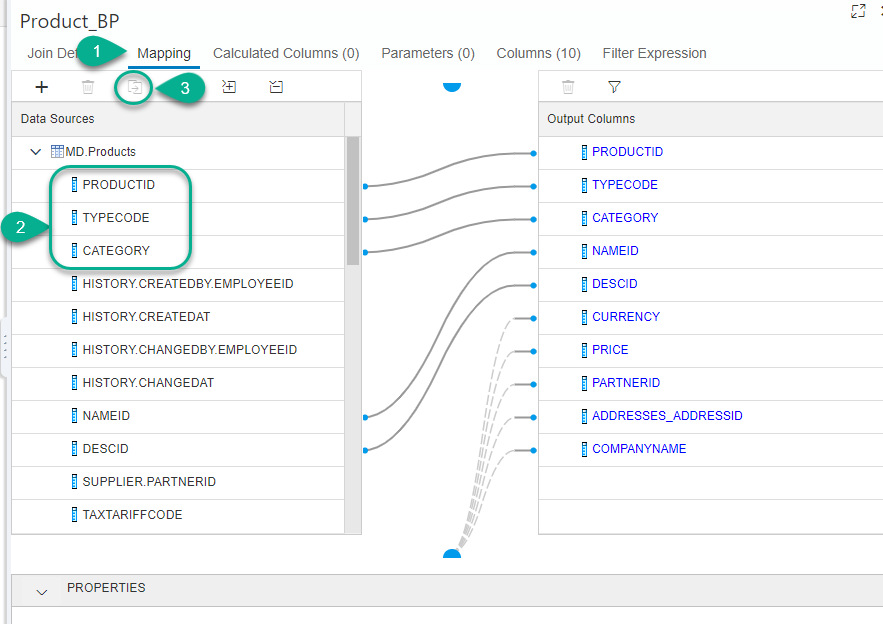

Change the name of the column `Category` to `ProductCategory`

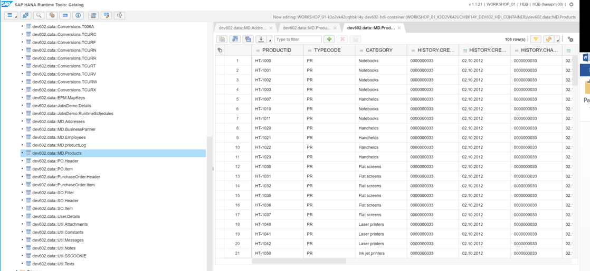

[DONE]

[ACCORDION-END]

[ACCORDION-BEGIN [Step 4: ](Join products, business partners and addresses)]

Create a new join node, and drag the existing node as input

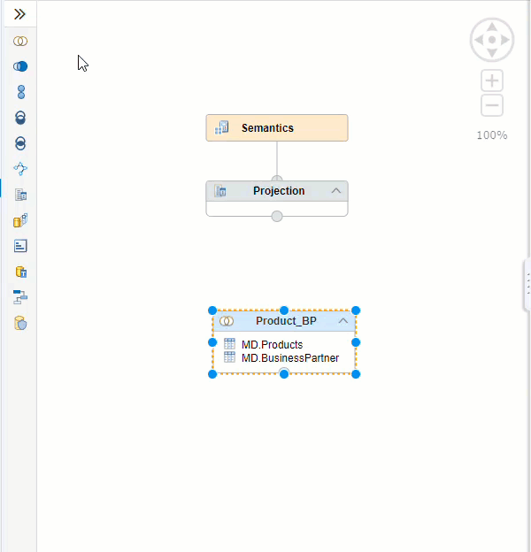

Use the **+** sign to add `MD.Addresses` to this join node.

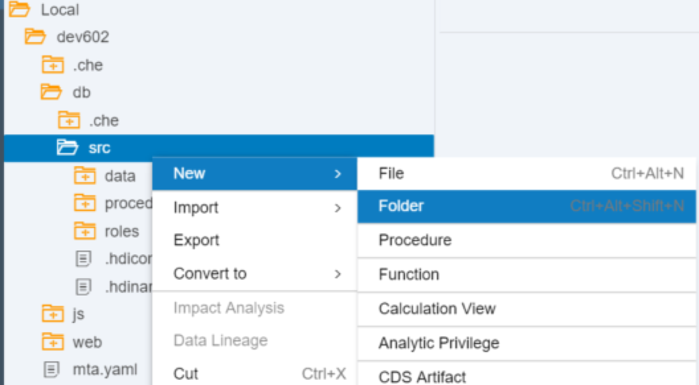

Join the two tables by `ADDRESSES_ADDRESSID` and `ADDRESSID`.

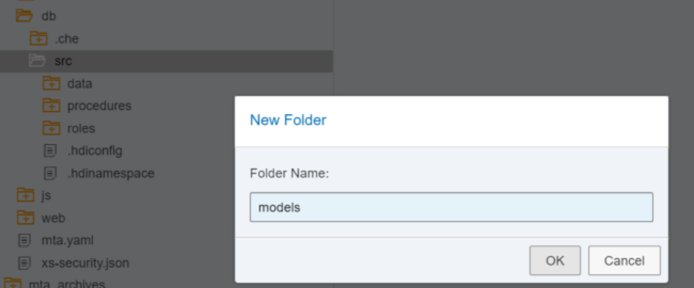

Go to the mapping tab to add columns to the output. Select all columns from the `Product_BP` node except `ADDRESSES_ADDRESSID`. From `MD.Addresses` table select  `CITY`, `POSTALCODE`, `STREET`, `BUILDING`, `COUNTRY` and `REGION`.

> You can double-click on `Product_BP` to add all of the columns to the output and then right-click on `ADDRESSES_ADDRESSID` to remove that output column

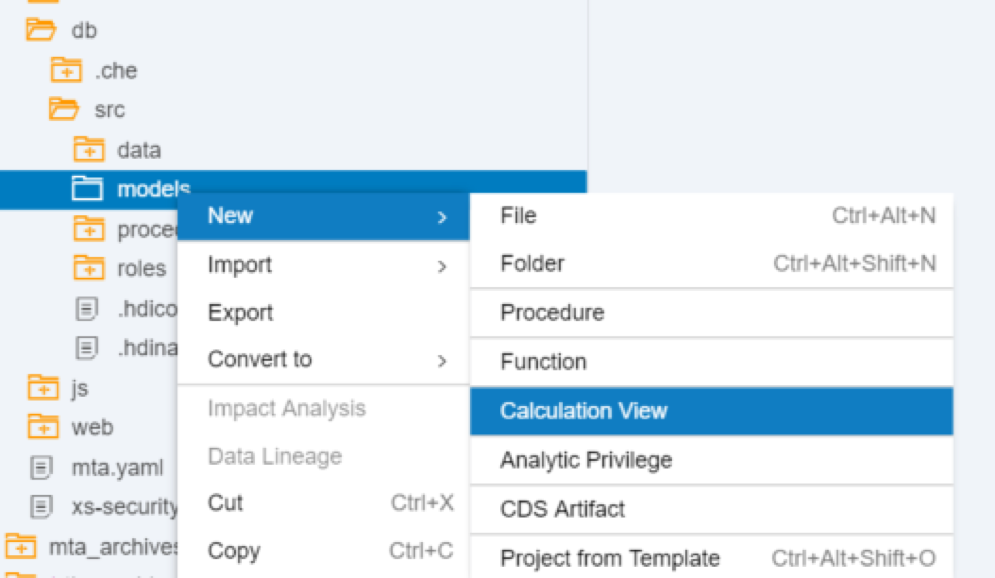

Rename the current join node to `Address`

[DONE]

[ACCORDION-END]


[ACCORDION-BEGIN [Step 5: ](Join products with texts)]

Add a new join node and use the `Address` node as input. Add `Util.Texts` as a data source.

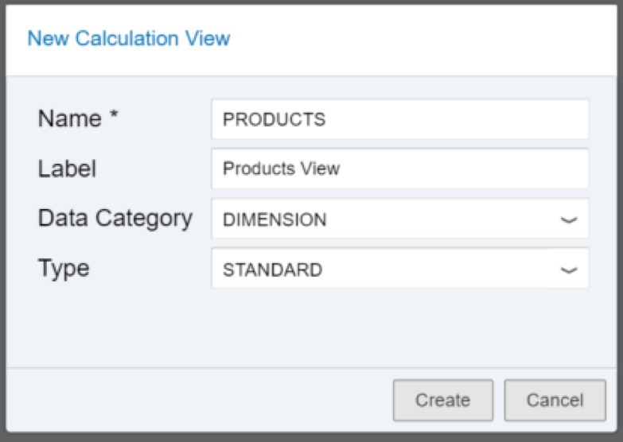

Join `NAMEID` to `TEXTID`. Set the join to `Text join`  and the language column to `LANGUAGE`.

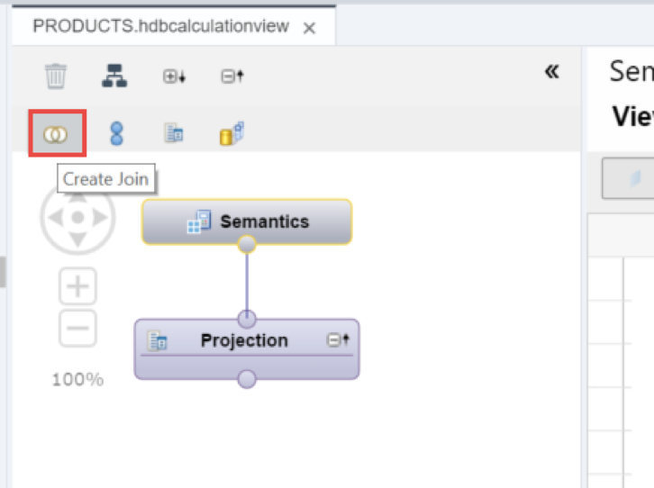

In the mapping tab, select all columns from the Address node except `NAMEID` and add them to the output. From the `Util.Texts` table select `TEXT`.
Change the name of the `TEXT` column in the output to `ProductName`.

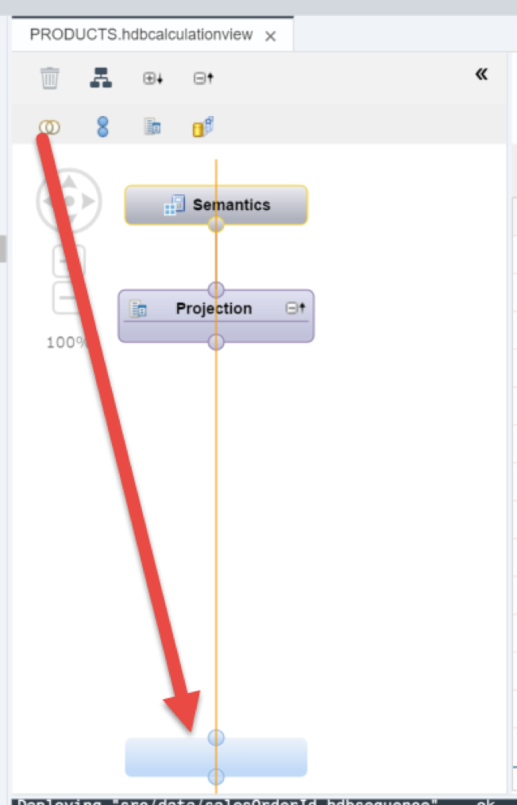

Rename the join node to `ProductName`.

[DONE]

[ACCORDION-END]


[ACCORDION-BEGIN [Step 6: ](Join products, business partners and addresses)]

Add a new join node and use `ProductName` as an input. Add `Util.Texts` again as a source.


Use a text join between `DESCID` and `TEXTID`.

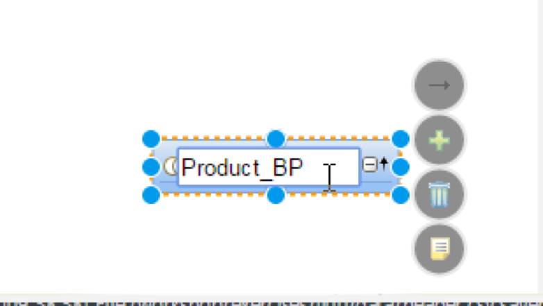

Repeat the process of adding columns to the output via the mapping tab. Select all columns from the `ProductName` node except `DESCID`. From the `Util.Texts` table select `TEXT` but change the name of  to `ProductDesc`.

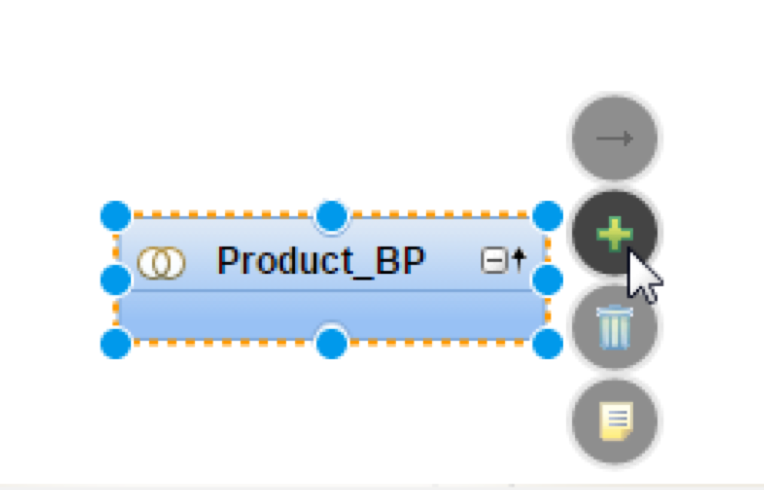

Rename the join node to `ProductDesc`.

[DONE]

[ACCORDION-END]

[ACCORDION-BEGIN [Step 7: ](Finalize the projection)]

Connect the node `ProductDesc` to the projection node. Use the `AutoLayout` feature to align the nodes and the `Auto Map by name` button to create the output.  Save the Calculation View.

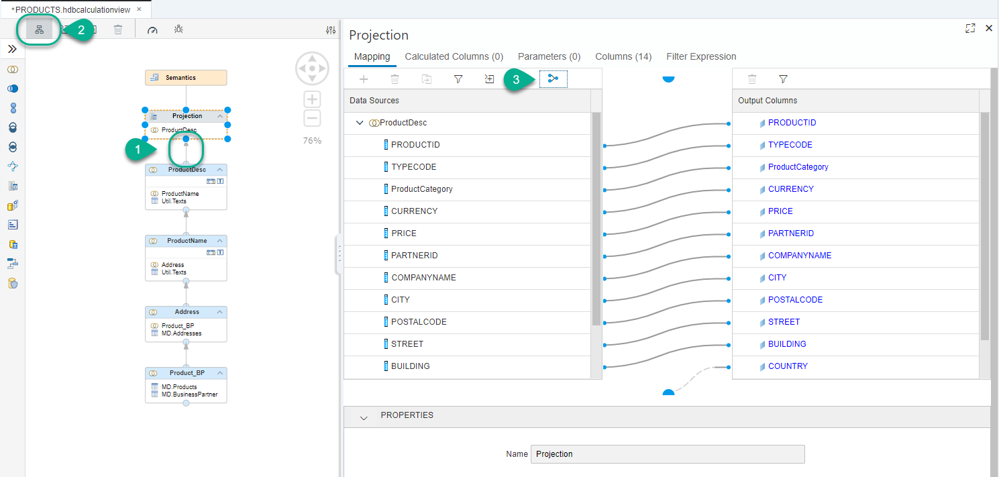

**Build** the view then right-click on it and choose `Data Preview`.

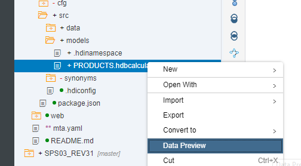

The output should be similar to the following. Copy the SQL statement produced by the `SQL` button into the validation below to complete it

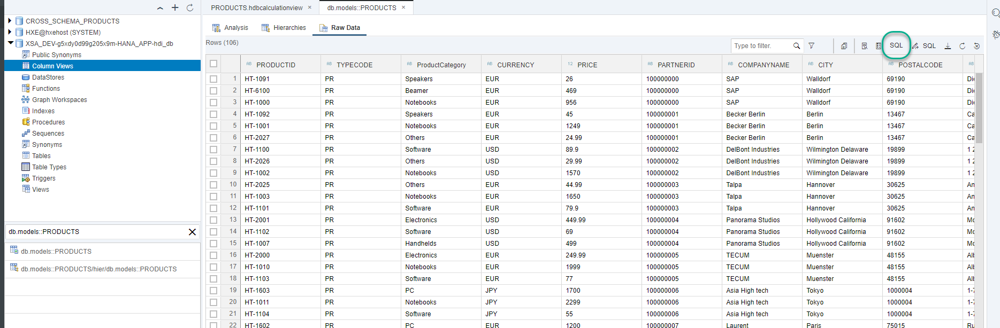

[VALIDATE_1]

[ACCORDION-END]


---
