## Prerequisites  
- **Proficiency:** Intermediate
- **Tutorials:** [Import SHINE tables and data](http://www.sap.com/developer/tutorials/xsa-import-shine-data.html)

## Next Steps
- [Creating a Calculation View with a Cube data type and Star Join](http://www.sap.com/developer/tutorials/xsa-sqlscript-cube.html)

## Details
### You will learn  
You will learn about creating a graphical calculation views with dimension data.

### Time to Complete
**15 Min**.

---

[ACCORDION-BEGIN [Step 1: ](Create new folder)]

Now you are ready to create our calculation views. From the `db/src` folder, right click and choose **New**, then **Folder**.  


Enter the name of the folder as "models" and click **OK**.  


[DONE]
[ACCORDION-END]

[ACCORDION-BEGIN [Step 2: ](Create a new calculation view)]

In the models sub-folder of your project, create a new calculation view based upon the expanded information for the products. This will require joining the products, texts, `businessPartner`, and address tables.

Right mouse click on the models package, choose New -> Calculation View


Enter the name as PRODUCTS and a Label of Products View.
Choose DIMENSION as the data category.  A DIMENSON Calculation View will be very similar to the older Attribute View – A basic join with no aggregation.

Click **Create**.


[DONE]
[ACCORDION-END]

[ACCORDION-BEGIN [Step 10: ](Create a join node)]

You want to join several tables from our project.  Ultimately you will join `MD.Products`, `MD.BusinessPartner`, `MD.Addresses` and `Util.Texts` (twice).

In order to do so we have to create a join node for each join criteria.

Start by creating a Join Node pressing the **Create Join** button.



As we have several joins to add drag this new join node down near the bottom of the design window.


Click on the node and rename it to `Product_BP`.


Press the Plus button next to the node to add `tables/views` to the join node.


Add `MD.Products` to the node.

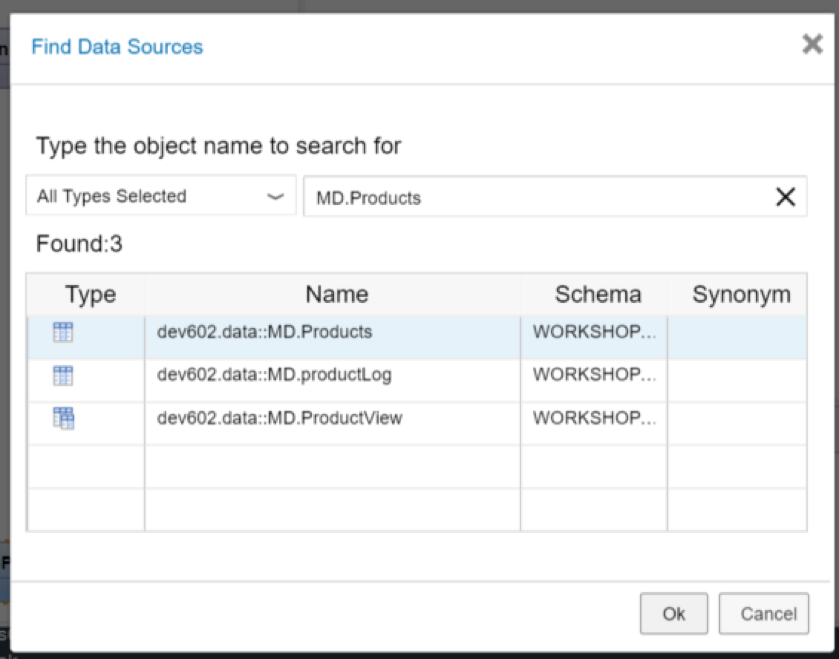


Repeat the process and add `MD.BusinessPartner` to the node.


[DONE]
[ACCORDION-END]

[ACCORDION-BEGIN [Step 13: ](Join two tables)]

We now want to create a join between the two tables on the `SUPPLIER.PARTNERID` to the `PARTNERID` column. Drag and drop to connect the two columns in the Join Definition.


Switch to the Mapping tab. We can then select which columns we want from this part of the join.

```
Select PRODUCTID, TYPECODE, CATEGORY, CURRENCY, PRICE, NAMEID, DESCID, PARTNERID, COMPANYNAME,and ADDRESES.ADDRESSID and then choose Add To Output.
```

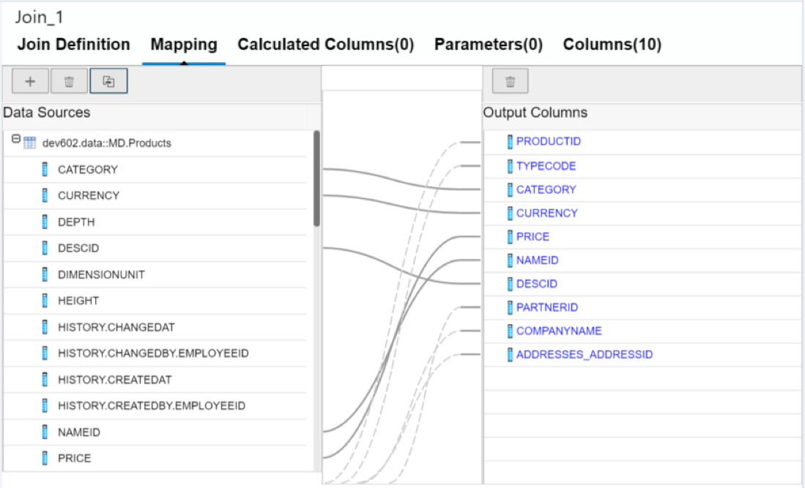


Optionally, you can change the name of a column as it becomes part of the view.  For example you might change CATEGORY to `ProductCategory`.

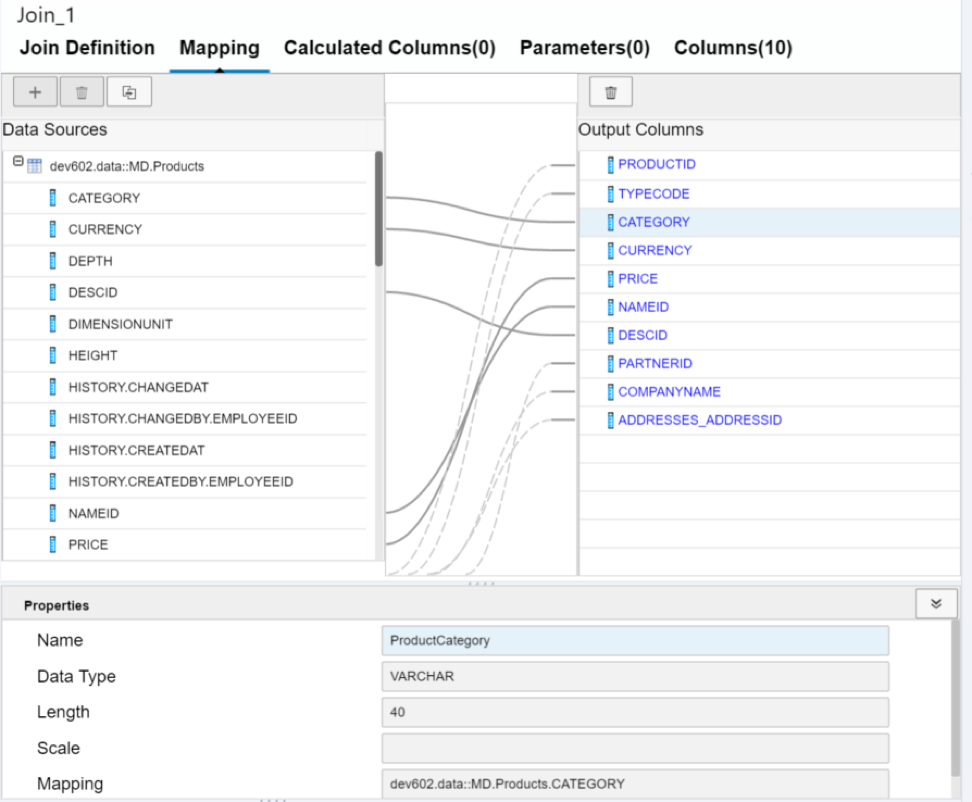

[DONE]
[ACCORDION-END]

[ACCORDION-BEGIN [Step 16: ](Add another join node)]

Repeat the process of adding a Join Node. Name this new Join Node Address and connect the output `Product_BP` to this new join node.

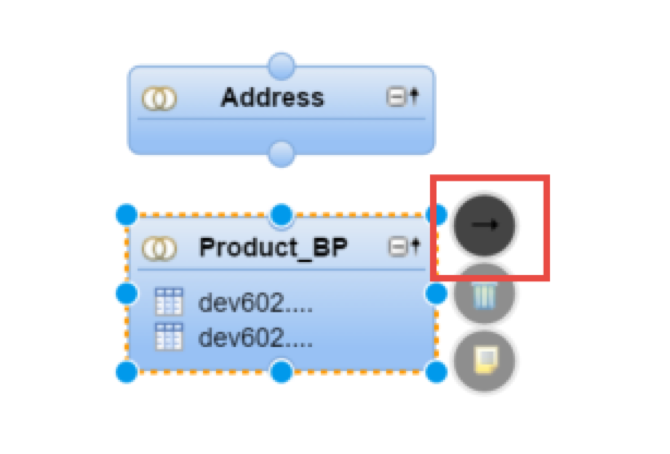
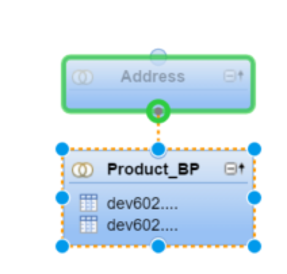

[DONE]
[ACCORDION-END]

[ACCORDION-BEGIN [Step 17: ](Add table to join node)]

Add the `MD.Addresses` table to this join node.


[DONE]
[ACCORDION-END]

[ACCORDION-BEGIN [Step 18: ](Create another join)]

Create a join between the `ADDRESSES_ADDRESSID` of the previous join node output and the `ADDRESSID` column of the `MD.Addresses` table.


[DONE]
[ACCORDION-END]

[ACCORDION-BEGIN [Step 19: ](Add columns)]

Repeat the process of adding columns to the output. Select all columns from the `Product_BP` node except `ADDRESSES_ADDRESSID`. From The `MD.Addresses` table select  CITY, POSTALCODE, STREET, BUILDING, COUNTRY, and REGION.

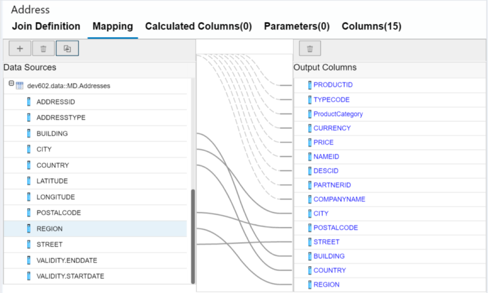

[DONE]
[ACCORDION-END]

[ACCORDION-BEGIN [Step 20: ](Create another join node)]

Repeat the process of adding a Join Node. Name this new Join Node `Product_Name` and connect the output Address to this new join node.


[DONE]
[ACCORDION-END]

[ACCORDION-BEGIN [Step 21: ](Add table to join)]

Add the `Util.Texts` table to this join node.


[DONE]
[ACCORDION-END]

[ACCORDION-BEGIN [Step 22: ](Create another join)]

Create a join between the `NAMEID` of the previous join node output and the `TEXTID` column of the `Util.Texts` table.

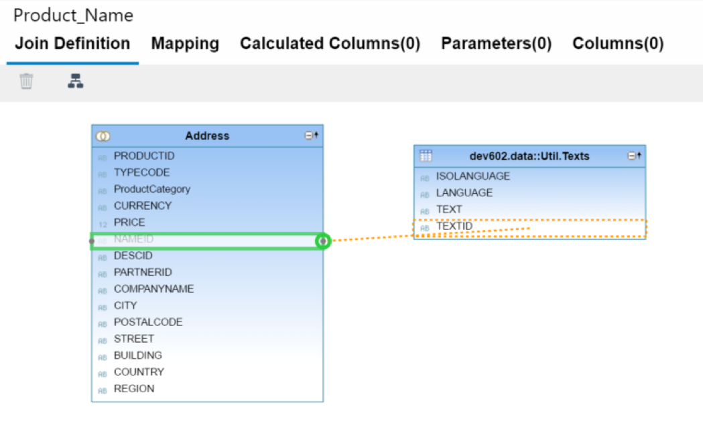

[DONE]
[ACCORDION-END]

[ACCORDION-BEGIN [Step 23: ](Change join properties)]

In the Join Properties window, change the Join Type to Text Join and the Language Column to LANGUAGE.

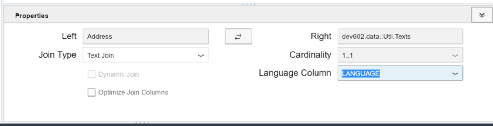

[DONE]
[ACCORDION-END]

[ACCORDION-BEGIN [Step 24: ](Add columns)]

Repeat the process of adding columns to the output via the mapping tab. Select all columns from the Address node except `NAMEID`. From the `Util.Texts` table select TEXT but change the name of the TEXT column in the output to `ProductName`.

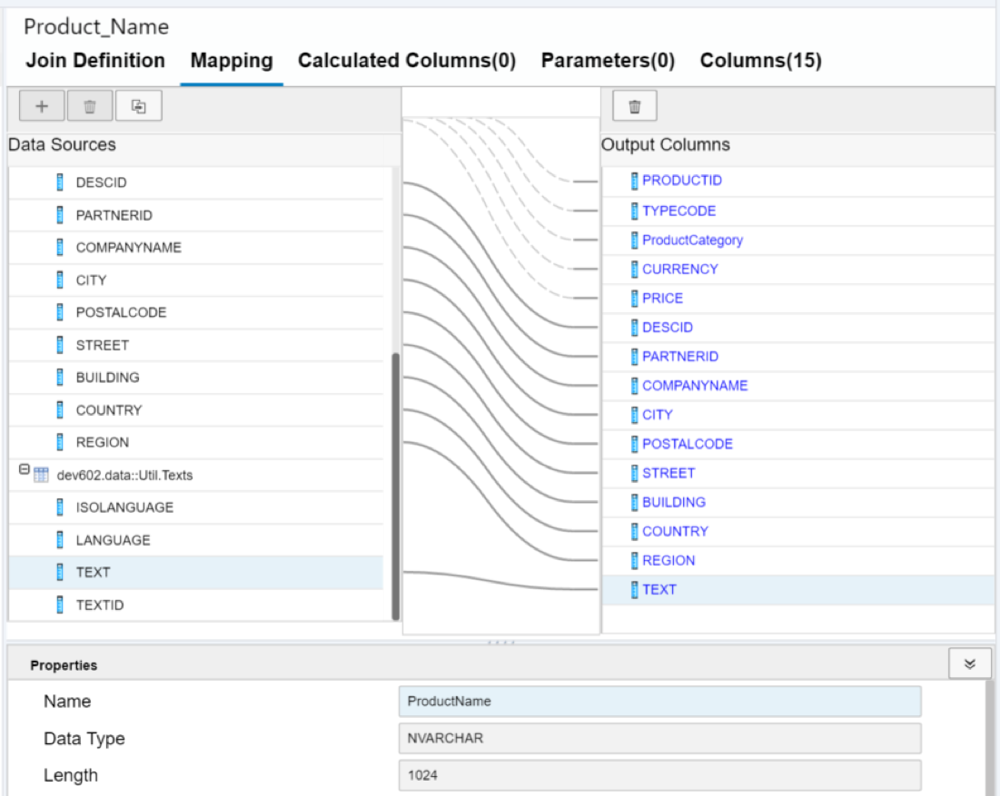

[DONE]
[ACCORDION-END]

[ACCORDION-BEGIN [Step 25: ](Add join node)]

Repeat the process of adding a Join Node. Name this new Join Node `Product_Desc` and connect the output `Product_Name` to this new join node.


[DONE]
[ACCORDION-END]

[ACCORDION-BEGIN [Step 26: ](Add table to join node)]

Add the `Util.Texts` table to this join node.

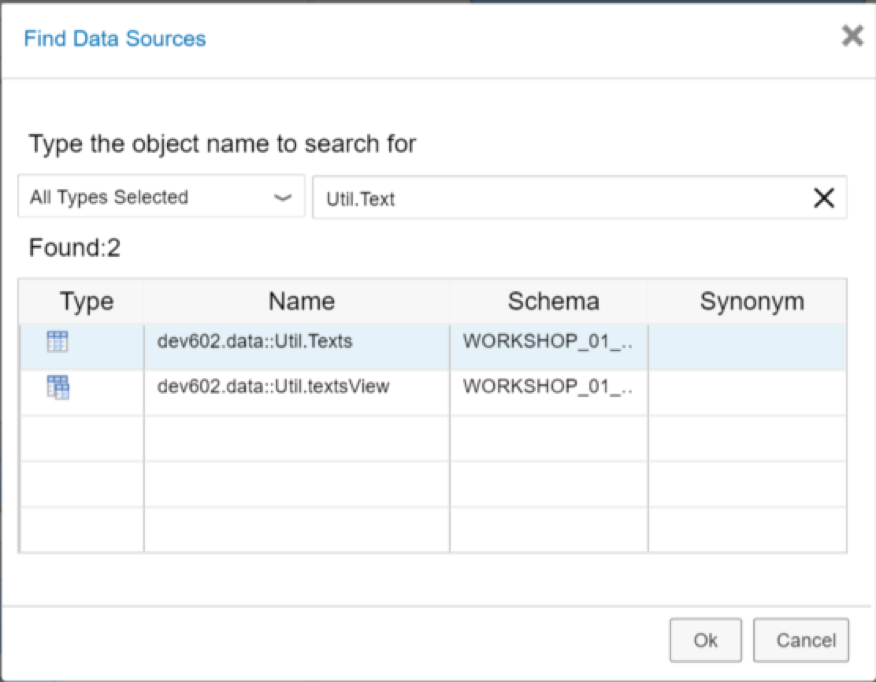

[DONE]
[ACCORDION-END]

[ACCORDION-BEGIN [Step 27: ](Create another join)]

Create a join between the `DESCID` of the previous join node output and the `TEXTID` column of the `Util.Texts` table.

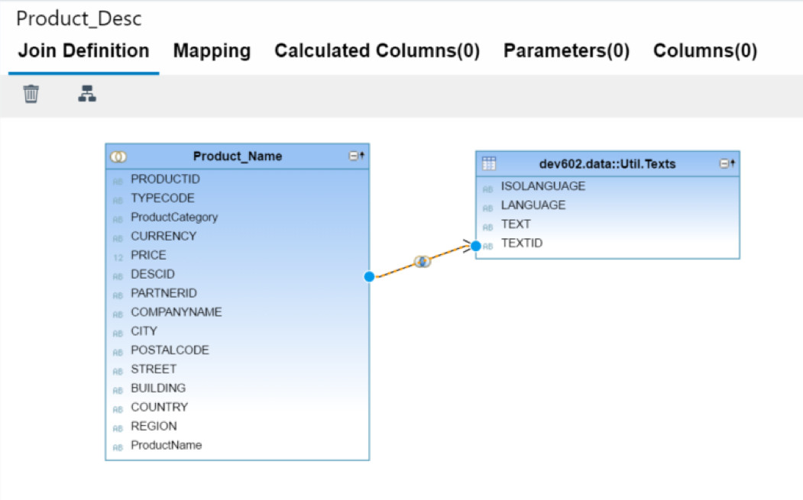

[DONE]
[ACCORDION-END]

[ACCORDION-BEGIN [Step 28: ](Chain join properties)]

In the Join Properties window, change the Join Type to Text Join and the Language Column to LANGUAGE.


Repeat the process of adding columns to the output via the mapping tab. Select all columns from the `Product_Name` node except `DESCID`. From the `Util.Texts` table select TEXT but change the name of the TEXT column in the output to `ProductDesc` .

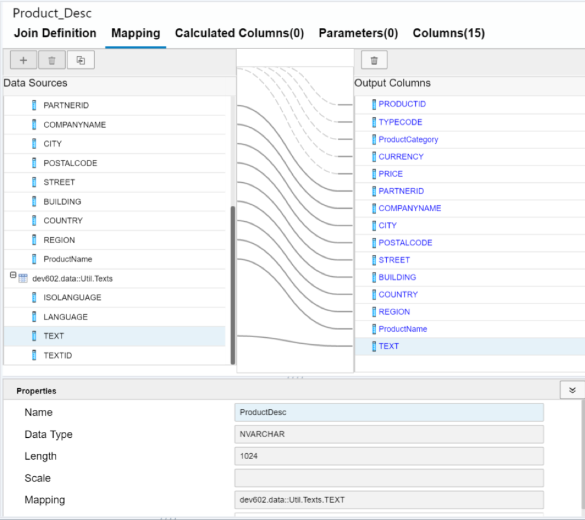

[DONE]
[ACCORDION-END]

[ACCORDION-BEGIN [Step 29: ](Connect the output of the Product_Desc node)]

Connect the output of the `Product_Desc` node to the Projection node at the top of the design window.


[DONE]
[ACCORDION-END]

[ACCORDION-BEGIN [Step 30: ](Auto Map by Name)]

In the Projection node and Mapping tab, press the **Auto Map by Name** button.


[DONE]
[ACCORDION-END]

[ACCORDION-BEGIN [Step 31: ](Select the Key column for PRODUCTID)]

Select the Semantics node and choose the Columns tab. Select the Key column for PRODUCTID.

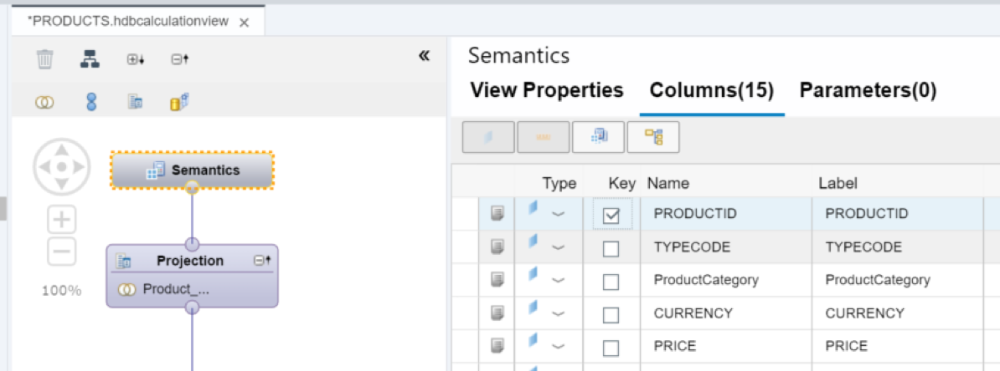

[DONE]
[ACCORDION-END]

[ACCORDION-BEGIN [Step 32: ](Change the Apply Privileges value)]

In the View Properties tab, change the Apply Privileges to the blank value.

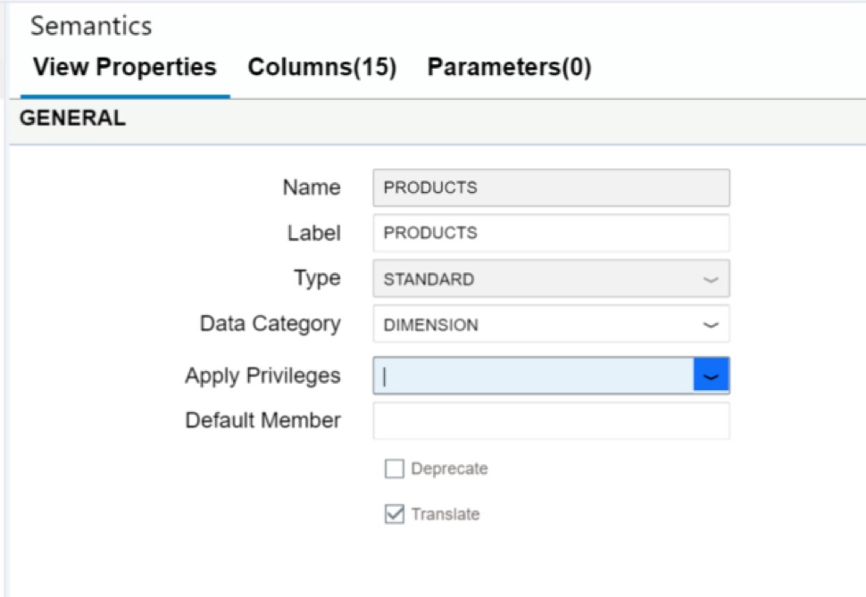

[DONE]
[ACCORDION-END]

[ACCORDION-BEGIN [Step 33: ](Save your work)]

Save your model

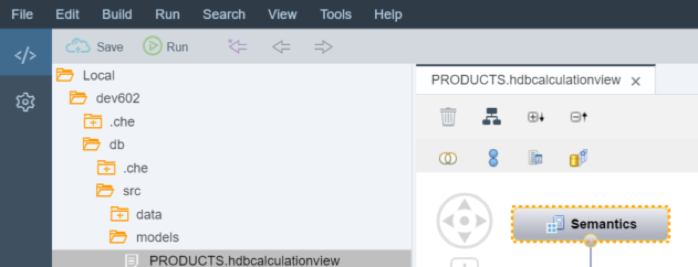

[DONE]
[ACCORDION-END]

[ACCORDION-BEGIN [Step 34: ](Build module)]

Build the `hdb` module and then return to the HRTT tool. Your container will now have an entry in the Column Views folder for this new Calculation View.

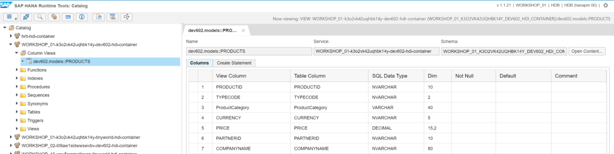

[DONE]
[ACCORDION-END]

[ACCORDION-BEGIN [Step 35: ](Test the output)]

For an initial test make sure your output looks similar to the following:


[DONE]
[ACCORDION-END]

---

## Next Steps
- [Creating a Calculation View with a Cube data type and Star Join](http://www.sap.com/developer/tutorials/xsa-sqlscript-cube.html)
