---
title: SAP HANA XS Advanced, Creating an HDI Module
description: Create your first HDI module for database content within your XSA application
primary_tag: products>sap-hana
tags: [products>sap-hana, products>sap-hana\,-express-edition  , topic>big-data, tutorial>beginner ]

---

## Prerequisites  
 - **Proficiency:** Beginner
 - **Tutorials:** [SAP HANA XS Advanced Create an HTML5 Module](http://www.sap.com/developer/tutorials/xsa-html5-module.html)

## Next Steps
 - Select a tutorial from the [Tutorial Navigator](http://www.sap.com/developer/tutorial-navigator.html) or the [Tutorial Catalog](http://www.sap.com/developer/tutorials.html)


## Details
### You will learn  
You will now create the HTML5 module to add basic web based content to your XSA application.


### Time to Complete
**25 Min**.

---

The goal of HDI is to manage database artifacts from design time objects but in a way that allows multiple copies/versions of the same core objects to be used on the same HANA database at the same time.

HDI introduces the concept of the container as an abstraction of the Schema. The container in turn dynamically generates the Schema, a container-specific Database User who owns all objects, and a password for that database user. XS Advanced based services then only need access to the container and never need to know the actual Schema, technical user, or password. All of that information is stored within the container definition.

HANA Deployment Infrastructure was introduced with SPS11, and is thoroughly explained here: [SAP HANA SPS 11: New Developer Features; HDI](https://blogs.sap.com/2015/12/08/sap-hana-sps-11-new-developer-features-hdi/)

[ACCORDION-BEGIN [Step 1: ](Create HDB Module)]

Begin by selecting your project and then choosing `New -> More`

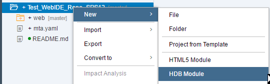

And `SAP HANA Database Module` from the Template selection menu. Click on **next**:

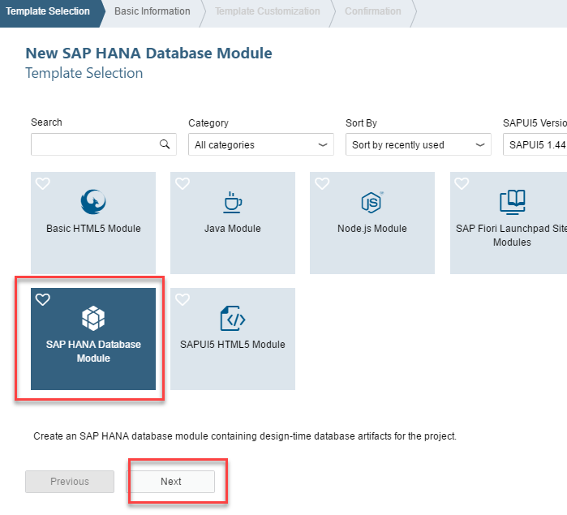

Name this new module `db`. Then press Next.

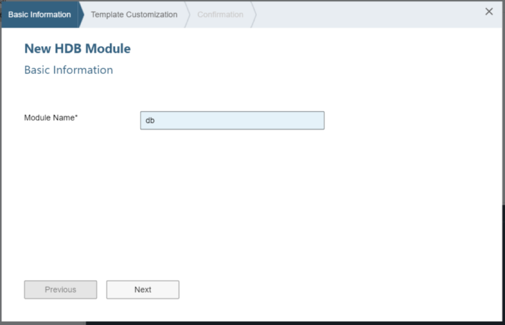

**Clear the namespace field** (they are not of any use anymore), enter a name for the schema and check the `Build Module after creation` tick box. Press Next.

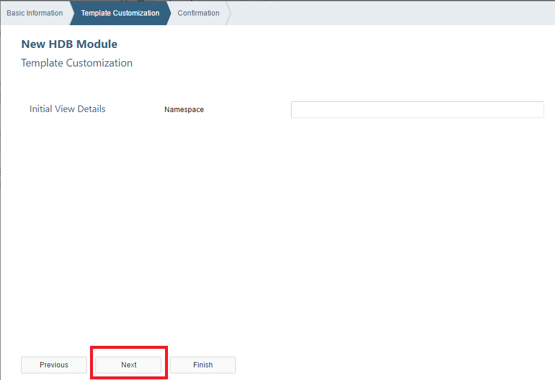

Press Finish to complete the creation of the HDB Module.


The wizard has created the `db` folder as well as the `hdi-container` resource and the `db` module in the `mta.yaml` file for you.

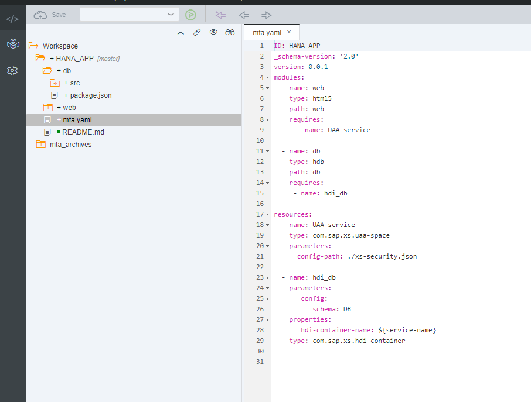

You will be able to see some of the additional files that the module creation wizard created if you choose `View->Show Hidden Files`  

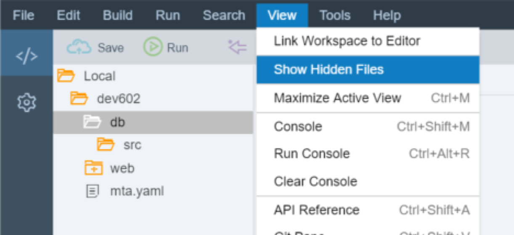


[DONE]
[ACCORDION-END]

[ACCORDION-BEGIN [Step 2: ](Create CDS Table)]


The `db/src` folder is where your actual database development objects belong. There are two configuration files in the root of this folder. The `.hdiconfig` file maps the file extensions to the specific server side activation plug-ins. This way you can choose any file extensions you wish to use as long as you map them to the correct plug-ins. However you will use the default mappings for now.

In the `src` folder we will create several development objects. First create a folder called `data`.

Then `New->CDS Artifact` to create the core database tables and views in our application.

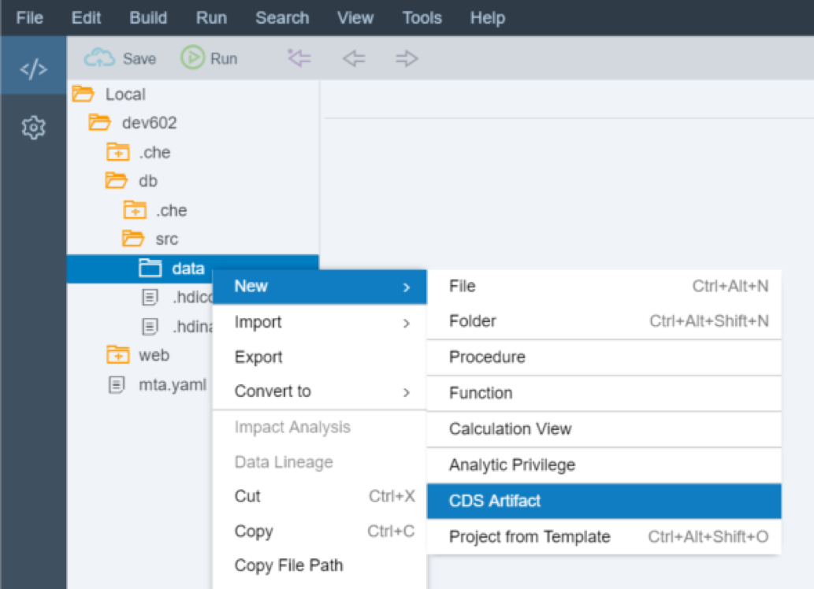

Name the new CDS file `PurchaseOrder` and press Create

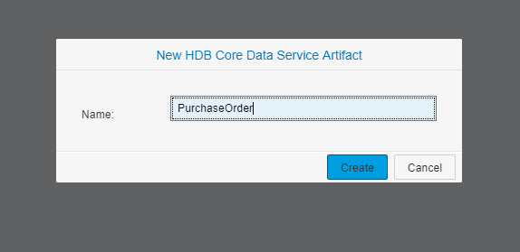

As of SPS12, `hdbcds` is the new file extension replacing `hdbdd`. It contains the table and view definitions. You are creating a simple Purchase Order Header and Item data model.

The syntax is the same as `CDS-based` development objects previously. You will review this content in the next step.

```


context PurchaseOrder {
type BusinessKey : String(10);
type SDate : LocalDate;
type CurrencyT : String(5);
type AmountT : Decimal(15,2);
type QuantityT : Decimal(13,3);
type UnitT: String(3);
type StatusT: String(1);

Type HistoryT {
        CREATEDBY : BusinessKey;
        CREATEDAT : SDate;
        CHANGEDBY : BusinessKey;
        CHANGEDAT : SDate;
      };

  Entity Header {
      key  PURCHASEORDERID: BusinessKey;
      ITEMS: Association[*] to Item on ITEMS.PURCHASEORDERID = PURCHASEORDERID;        
      HISTORY: HistoryT;
      NOTEID: BusinessKey null;
      PARTNER: BusinessKey;
      CURRENCY: CurrencyT;
      GROSSAMOUNT: AmountT;
      NETAMOUNT: AmountT;
      TAXAMOUNT: AmountT;
      LIFECYCLESTATUS: StatusT;
      APPROVALSTATUS: StatusT;
      CONFIRMSTATUS: StatusT;
      ORDERINGSTATUS: StatusT;
      INVOICINGSTATUS: StatusT;
    } technical configuration {
        column store;
    };

  Entity Item {
      key  PURCHASEORDERID: BusinessKey;
      key  PURCHASEORDERITEM: BusinessKey;
      HEADER: Association[1] to Header on HEADER.PURCHASEORDERID = PURCHASEORDERID;
      PRODUCT:  BusinessKey;
      NOTEID: BusinessKey null;
      CURRENCY: CurrencyT;
      GROSSAMOUNT: AmountT;
      NETAMOUNT: AmountT;
      TAXAMOUNT: AmountT;
      QUANTITY: QuantityT;
      QUANTITYUNIT: UnitT;
      DELIVERYDATE: SDate;
    } technical configuration {
        column store;
    };

 define view ItemView as SELECT from Item {
    PURCHASEORDERID as "PurchaseOrderItemId",
    PURCHASEORDERITEM as "ItemPos",
    HEADER.PARTNER as "PartnerId",
    PRODUCT as "ProductID",
    CURRENCY as "CurrencyCode",
    GROSSAMOUNT as "Amount",
    NETAMOUNT as "NetAmount",
    TAXAMOUNT as "TaxAmount",
    QUANTITY as "Quantity",
    QUANTITYUNIT as "QuantityUnit",
    DELIVERYDATE as "DeliveryDate1"
 } with structured privilege check;

};
```

Save the artifact after entering this code.

[DONE]
[ACCORDION-END]

[ACCORDION-BEGIN [Step 3: ](Review CDS Entities and Types)]

Look at the syntax you just entered into the `PurchaseOrder.hdbcds` file in more detail.

First, you need to define some reusable elemental types. These will later be used to define the data type of individual columns in our tables. Within the `PurchaseOrder` context, create element types for `BusinessKey`, `SDate`, `CurrencyT`, `AmountT`, `QuantityT`, `UnitT`, and `StatusT`.

	```
	context PurchaseOrder {
	type BusinessKey : String(10);
		type SDate : LocalDate;
		type CurrencyT : String(5);
		type AmountT : Decimal(15,2);
		type QuantityT : Decimal(13,3);
		type UnitT: String(3);
		type StatusT: String(1);
	```

You can also create reusable structures with multiple fields. This is useful when the same sets of fields are repeated in multiple tables. Create a reusable structure for History – with `CREATEDBY`, `CREATEDAT`, `CHANGEDBY`, and `CHANGEDAT` fields.


```
	Type HistoryT {
          CREATEDBY : BusinessKey;
          CREATEDAT : SDate;
          CHANGEDBY : BusinessKey;
          CHANGEDAT : SDate;
        };
```

  The syntax for creating Entities is similar to types. Entities will become database tables when activating the `hdbcds` file.

```
	Entity Header {
        key  PURCHASEORDERID: BusinessKey;
        ITEMS: Association[*] to Item on ITEMS.PURCHASEORDERID = PURCHASEORDERID;        
        HISTORY: HistoryT;
        NOTEID: BusinessKey null;
        PARTNER: BusinessKey;
        CURRENCY: CurrencyT;
        GROSSAMOUNT: AmountT;
        NETAMOUNT: AmountT;
        TAXAMOUNT: AmountT;
        LIFECYCLESTATUS: StatusT;
        APPROVALSTATUS: StatusT;
        CONFIRMSTATUS: StatusT;
        ORDERINGSTATUS: StatusT;
        INVOICINGSTATUS: StatusT;
      } technical configuration {
          column store;
      };
```

We are now ready to **Build**. Right click on the project and on the Build button. This process technically executes a `node.js` application which will call over to HANA and deploy these database artifacts into their container.

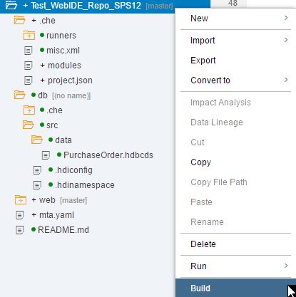

The log should say that the Build of your project has completed successfully:

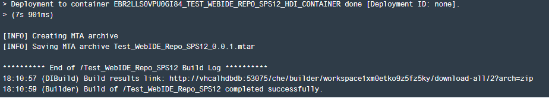

> Hint: As of HANA 2.0, you can choose to build just the `db` folder or a specific module

[DONE]
[ACCORDION-END]

[ACCORDION-BEGIN [Step 4: ](Create Sequence for Primary Key)]

With the tables you created, you use a unique order id number as the primary key. Therefore you need a sequence to have an auto incrementing unique id generated when new data is inserted. Create a new sequence by right-clicking on the data folder and choosing `New`, then `File`.

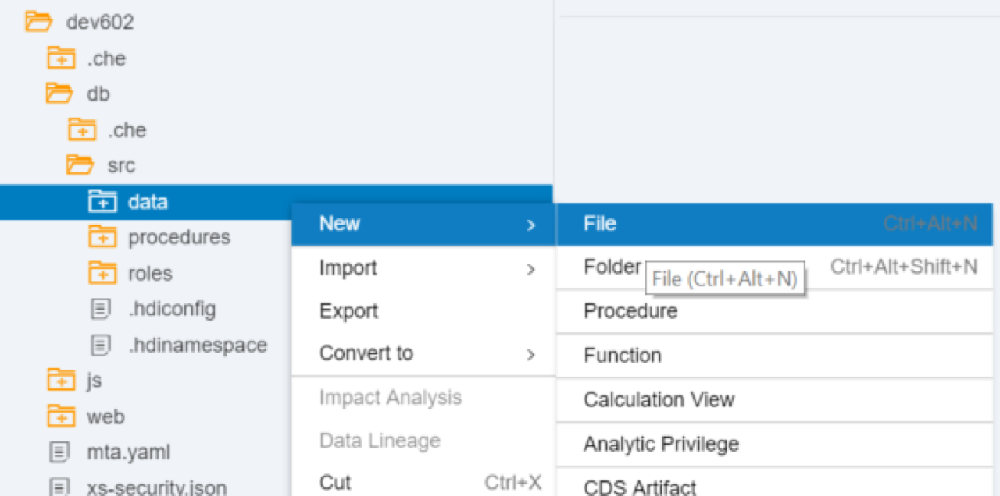

Enter the name of the file as `orderId.hdbsequence`. Click "OK".


Create a non-cycling sequence within your schema starting from 200000000 and ending with 299999999. Make it dependent upon your header table with the full package id on the front of the header table name. Save your sequence file.

```
SEQUENCE "orderId"
INCREMENT BY 1 START WITH 200000000
MINVALUE 1 MAXVALUE 2999999999
NO CYCLE
RESET BY
SELECT IFNULL(MAX(PURCHASEORDERID), 0)+1
FROM "PurchaseOrder.Header"

```

**Build** the `orderId.hdbsequence` and the dictionary definitions (`PurchaseOrder.hdbcds`) file by right-clicking on it and selecting `Build Selected Files`.

[DONE]
[ACCORDION-END]

[ACCORDION-BEGIN [Step 5: ](Check the Database Explorer)]

It is now time to check what you have created so far. Open the Database Explorer from the `Tools -> Database Explorer` menu or using the middle icon in the left side bar.  

>In SPS12, this was known as the `HANA Runtime Tool` and it was separate from the Web IDE. You can open a new browser tab and navigate to `http://<hostname>:51006` to access this tool. For `SAP HANA, express edition` you will need to navigate to `http://<hostname>:51018`

Click on the **+** sign:

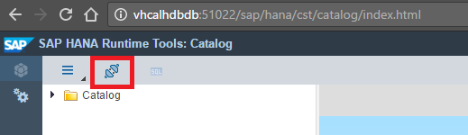

Search for your container based on your user name or the repository name. Select it, insert `db` as a display name and click **OK**.

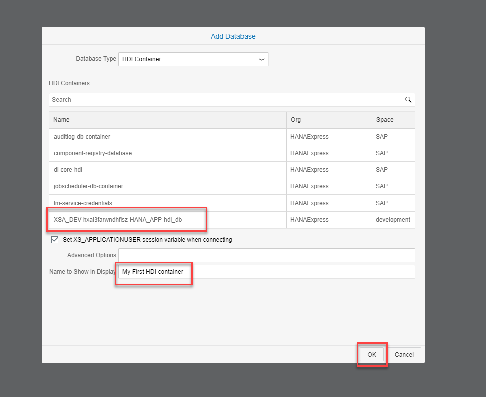

You can now see the container, table definitions and contents you have created so far:

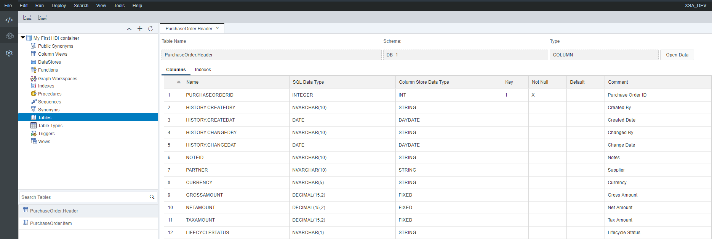

[DONE]
[ACCORDION-END]

[ACCORDION-BEGIN [Step 6: ](Create and Upload Data)]

You may want to deliver an initial set of data within a table – in particular, a configuration table. In this exercises we will learn how to create automatic data load configuration and the accompanying `CSV` files for just such a situation.

The data load for the table requires two files:
 1. A `csv` (comma separated) file which holds the data you want to load.
 2. An `hdbtabledata` file which specifies the target table for a source `csv` file.

You also have the `hdbtabledata` development object. This is the replacement for the old `hdbti` development object. Although the syntax of this object is new, the purpose is the same – to allow the loading of initial data from `CSV` files to target tables during their creation.

In your `data` folder, create a file named `Purchase.hdbtabledata` and enter this text into it. Don't forget to save the file afterwards.

```
	{
	"format_version": 1,
	"imports": [{
	"target_table": "PurchaseOrder.Header",
	"source_data": {
	"data_type": "CSV",
		"file_name": "header.csv",
		"has_header": false,
		"dialect": "HANA",
		"type_config": {
		"delimiter": ","
		}
	},
	"import_settings": {
	"import_columns": [
	"PURCHASEORDERID",
		"NOTEID",
		"PARTNER",
		"CURRENCY",
		"GROSSAMOUNT",
		"NETAMOUNT",
		"TAXAMOUNT",
		"LIFECYCLESTATUS",
		"APPROVALSTATUS",
		"CONFIRMSTATUS",
		"ORDERINGSTATUS",

	"INVOICINGSTATUS"]
	},
	"column_mappings": {
		"PURCHASEORDERID": 1,
		"NOTEID": 6,
		"PARTNER": 7,
		"CURRENCY": 8,
		"GROSSAMOUNT": 9,
		"NETAMOUNT": 10,
		"TAXAMOUNT": 11,
		"LIFECYCLESTATUS": 12,
		"APPROVALSTATUS": 13,
		"CONFIRMSTATUS": 14,
		"ORDERINGSTATUS": 15,
		"INVOICINGSTATUS": 16
		}
	},
	{
	"target_table": "PurchaseOrder.Item",
	"source_data": {
		"data_type": "CSV",
		"file_name": "item.csv",
		"has_header": false,
		"dialect": "HANA",
		"type_config": {
		"delimiter": ","
		}
	},
	"import_settings": {
	"import_columns": [
	"PURCHASEORDERID",
		"PURCHASEORDERITEM",
		"PRODUCT",
		"NOTEID",
		"CURRENCY",
		"GROSSAMOUNT",
		"NETAMOUNT",
		"TAXAMOUNT",
		"QUANTITY",
		"QUANTITYUNIT" ]
		},
	"column_mappings": {
		"PURCHASEORDERID": 1,
		"PURCHASEORDERITEM": 2,
		"PRODUCT": 3,
		"NOTEID": 4,
		"CURRENCY": 5,
		"GROSSAMOUNT": 6,
		"NETAMOUNT": 7,
		"TAXAMOUNT": 8,
		"QUANTITY": 9,
		"QUANTITYUNIT": 10
		}
	}]
	}
```

You need some `CSV` files to hold some initial test data to be loaded by the `hdbtabledata` configuration file. Enter this data into a file named `header.csv` and save it.

```
0500000000,0000000033,20120101,0000000033,20120101,9000000001,0100000000,EUR,13224.47,11113,2111.47,N,I,I,I,I
0500000001,0000000033,20120102,0000000033,20120102,9000000001,0100000002,EUR,12493.73,10498.94,1994.79,N,I,I,I,I
```

And data for the item table named `item.csv`.  Don't forget to **save**.

```
0500000000,0000000010,HT-1000,,EUR,1137.64,956,181.64,1,EA,20121204
0500000000,0000000020,HT-1091,,EUR,61.88,52,9.88,2,EA,20121204
0500000000,0000000030,HT-6100,,EUR,1116.22,938,178.22,2,EA,20121204
0500000000,0000000040,HT-1000,,EUR,2275.28,1912,363.28,2,EA,20121204
0500000000,0000000050,HT-1091,,EUR,92.82,78,14.82,3,EA,20121204
0500000000,0000000060,HT-6100,,EUR,1116.22,938,178.22,2,EA,20121204
0500000000,0000000070,HT-1000,,EUR,2275.28,1912,363.28,2,EA,20121204
0500000000,0000000080,HT-1091,,EUR,61.88,52,9.88,2,EA,20121204
0500000000,0000000090,HT-6100,,EUR,1674.33,1407,267.33,3,EA,20121204
0500000000,0000000100,HT-1000,,EUR,3412.92,2868,544.92,3,EA,20121204
0500000001,0000000010,HT-1100,,USD,213.96,179.8,34.16,2,EA,20121204
0500000001,0000000020,HT-2026,,USD,35.69,29.99,5.7,1,EA,20121204
0500000001,0000000030,HT-1002,,USD,3736.6,3140,596.6,2,EA,20121204
0500000001,0000000040,HT-1100,,USD,213.96,179.8,34.16,2,EA,20121204
0500000001,0000000050,HT-2026,,USD,71.38,59.98,11.4,2,EA,20121204
0500000001,0000000060,HT-1002,,USD,3736.6,3140,596.6,2,EA,20121204
0500000001,0000000070,HT-1100,,USD,320.94,269.7,51.24,3,EA,20121204
0500000001,0000000080,HT-2026,,USD,107.06,89.97,17.09,3,EA,20121204
0500000001,0000000090,HT-1002,,USD,3736.6,3140,596.6,2,EA,20121204
0500000001,0000000100,HT-1100,,USD,320.94,269.7,51.24,3,EA,20121204
```

**Build** the `db` module and go back to the Database Explorer.


>See the records being inserted? Make sure you understand how that happened using the `Purchase.hdbtabledata` file

Right-click on any of the tables and you will see data.

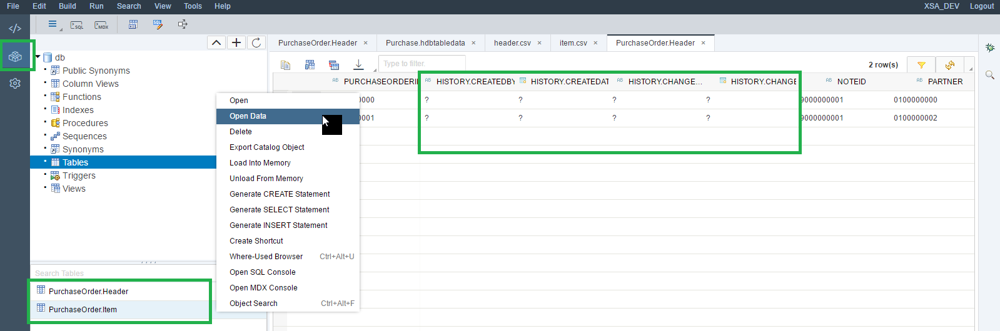

Notice the column names where you used the complex type definition called `History`.

[DONE]
[ACCORDION-END]

[ACCORDION-BEGIN [Step 7: ](Create Synonyms)]
 You also need synonyms now to access any table or view outside of our container.  Therefore you will create an `hdbsynonym` to allow the access the dummy view.

 When you click on `New -> File`, name the file `sys.hdbsynonym`. The extension will make the IDE open the synonym editor automatically. Fill in the details for the dummy view in a synonym called `_DUMMY`

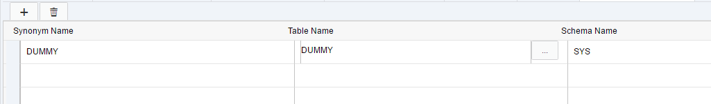

[DONE]
[ACCORDION-END]

[ACCORDION-BEGIN [Step 8: ](Create Procedures)]

Create a `procedures` folder in the `src` folder. In the procedures folder you can create an `hdbprocedure` file via `New->Procedure`

>The syntax for stored procedures hasn't changed from previous Support Package Stacks of HANA.

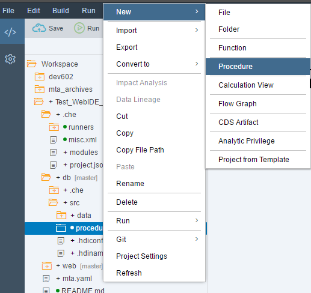

With name `getPOItems`

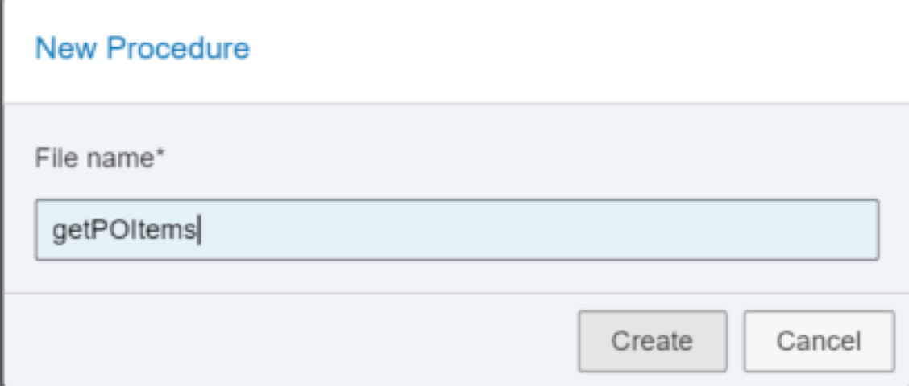

Here is the source of `getPOItems.hdbprocedure`

```
PROCEDURE "getPOItems" ( OUT ex_addresses "PurchaseOrder.Item" )
   LANGUAGE SQLSCRIPT
     SQL SECURITY INVOKER
     --DEFAULT SCHEMA <default_schema_name>
     READS SQL DATA AS
  BEGIN
     /*************************************
         Write your procedure logic
     *************************************/

     	   ex_addresses =
  	     select *
  	              from "PurchaseOrder.Item";
  END
```

Remember to **Save**.

[DONE]
[ACCORDION-END]

[ACCORDION-BEGIN [Step 9: ](Create Roles)]

All access to our HDI database objects from XSA is done automatically by the HDI container technical user. However if you want to allow access via other database users (for use cases such as external reporting tools) you must create a database role. The same applies if you want to add additional privileges to the technical user. Create another folder called `roles` under `src`.

First, you need to create a structured privilege. This is the logical successor to the analytic privilege and allows us to perform instance filtering for our `CDS` view you created earlier. Enter this code into the file `PurchaseOrder.hdbstructuredprivilege` and save.

This will limit the access to your view to only allow users with this privilege to see items for Euros.

```
	STRUCTURED PRIVILEGE
	    "PO_VIEW_PRIVILEGE"
	    FOR SELECT ON
	    "PurchaseOrder.ItemView"
	    WHERE "CurrencyCode" = 'EUR'
```

Now create a role named `admin.hdbrole` and enter this code. Don't forget to save.

```
{
	"role":{
		"name": "admin",
		"schema_privileges": [{
		   "privileges": ["SELECT METADATA",
		    			  "SELECT CDS METADATA",
		    			  "SELECT",
		    			  "INSERT",
		    			  "EXECUTE",
		    			  "DELETE",
		    			  "UPDATE",
		    			  "CREATE TEMPORARY TABLE",
		    			  "TRIGGER"
		   ]
		}],
		"schema_analytic_privileges": [
            {
                "privileges":[ "PO_VIEW_PRIVILEGE" ]
            }
        ]

      }
}

```


Finally, this role needs to be granted to our technical user. In order for this to be automatic, we will create a specific folder and role in the `src` folder.
Create a folder named `defaults` in `src`. Inside this folder, create a file named `default_access_role.hdbrole` with the following contents:

```
{
	"role":{
		"name": "default_access_role",
		"schema_roles": [{
		 "names": ["admin"]
		}]
	}
}

```

This is what the folder structure finally looks like:

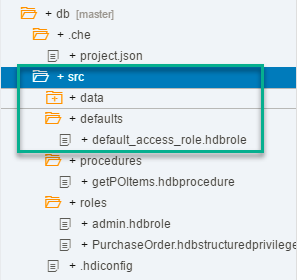

We are now ready to perform the final **Build**. HDB modules are now complete and can be checked in the Database Explorer.

[DONE]
[ACCORDION-END]


## Next Steps
 - Select a tutorial from the [Tutorial Navigator](http://www.sap.com/developer/tutorial-navigator.html) or the [Tutorial Catalog](http://www.sap.com/developer/tutorials.html)
