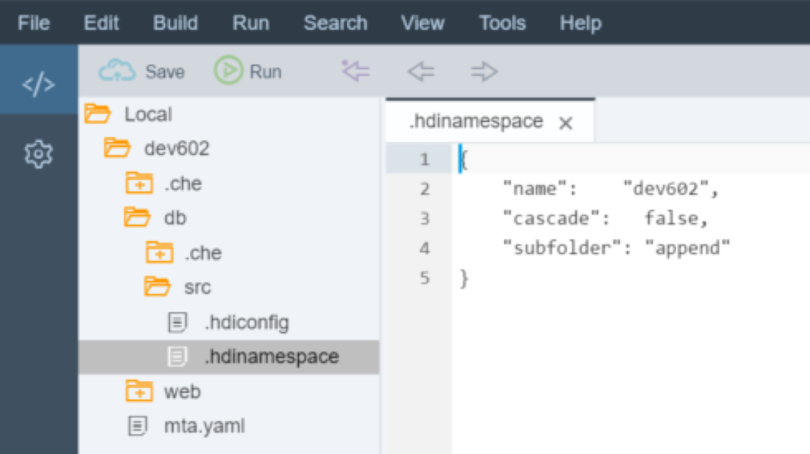
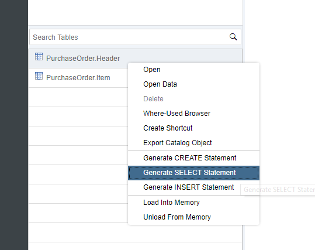
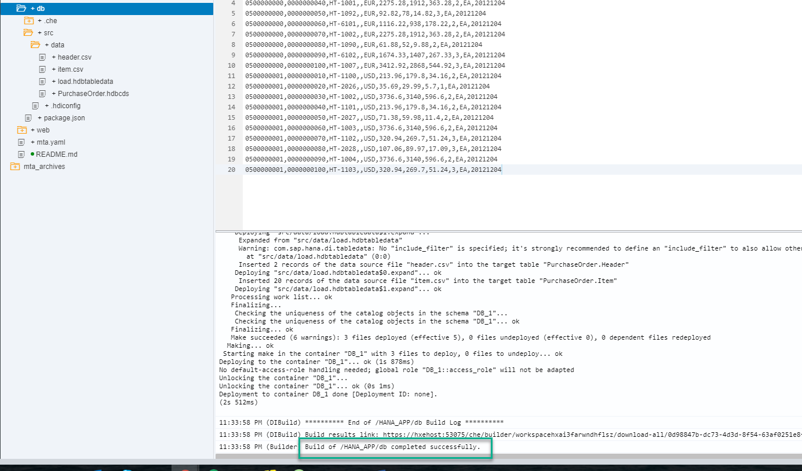

## Prerequisites  
 - This tutorial is designed for SAP HANA on premise and SAP HANA, express edition. It is not designed for SAP HANA Cloud.
 - **Proficiency:** Beginner
 - **Tutorials:** [SAP HANA XS Advanced Create an HTML5 Module](https://developers.sap.com/tutorials/xsa-html5-module.html)

## Next Steps
 - [SAP HANA XS Advanced - Create a Node.js module](https://developers.sap.com/tutorials/xsa-xsjs-xsodata.html)


## Details
### You will learn  
You will now create the HTML5 module to add basic web based content to your XSA application.


### Time to Complete
**25 Min**.

---

The goal of HDI is to manage database artifacts from design time objects but in a way that allows multiple copies/versions of the same core objects to be used on the same HANA database at the same time.

HDI introduces the concept of the container as an abstraction of the Schema. The container in turn dynamically generates the Schema, a container-specific Database User who owns all objects and a password for that database user. XS Advanced based services then only need access to the container and never need to know the actual Schema, technical user, or password. All of that information is stored within the container definition.

SAP HANA Deployment Infrastructure was introduced with SPS11 and is thoroughly explained here: [SAP HANA SPS 11: New Developer Features; HDI](https://blogs.sap.com/2015/12/08/sap-hana-sps-11-new-developer-features-hdi/)

[ACCORDION-BEGIN [Step 1: ](Create HDB Module)]

Begin by selecting your project and then choosing `New -> SAP HANA Database Module`


Name this new module `db`. Then press Next.


**Clear the namespace field** (namespaces are only really there for backwards compatibility with the old HANA repository), enter a name for the schema and check the `Build Module after creation` tick box. Press **Finish**.


The wizard has created the `db` folder as well as the `hdi-container` resource and the `db` module in the `mta.yaml` file for you.


You will be able to see some of the additional files that the module creation wizard created if you choose `View->Show Hidden Files`  


[DONE]

[ACCORDION-END]

[ACCORDION-BEGIN [Step 2: ](Create Table)]


The `db/src` folder is where your actual database development objects belong. There are two configuration files in the root of this folder.



> Note the `.hdiconfig` file. It maps the file extensions to the specific server side activation plug-ins. This way you can choose any file extensions you wish to use as long as you map them to the correct plug-ins. You can use the default configurations for now.

In the `src` folder we will create several development objects. Use the Database Artifact wizard to create a new `hdbtable` artifact


Name the new file `data/PurchaseOrder`, choose `hdbtable` as the file type and press Create


The syntax of the `hdbtable` artifact is the same as `SQLDDL` development objects previously.

Paste the following content:

```sql
COLUMN TABLE "PurchaseOrder.Header" (
     "PURCHASEORDERID" INTEGER GENERATED BY DEFAULT AS IDENTITY (NO CYCLE NO CACHE NO MINVALUE START WITH 200000000 INCREMENT BY 1 MAXVALUE 2999999999) NOT NULL COMMENT 'Purchase Order ID',
	 "HISTORY.CREATEDBY" NVARCHAR(10) COMMENT 'Created By',
	 "HISTORY.CREATEDAT" DATE COMMENT 'Created Date',
	 "HISTORY.CHANGEDBY" NVARCHAR(10) COMMENT 'Changed By',
	 "HISTORY.CHANGEDAT" DATE COMMENT 'Change Date',
	 "NOTEID" NVARCHAR(10) COMMENT 'Notes',
	 "PARTNER" NVARCHAR(10) COMMENT 'Supplier',
	 "CURRENCY" NVARCHAR(5) COMMENT 'Currency',
	 "GROSSAMOUNT" DECIMAL(15,2) COMMENT 'Gross Amount',
	 "NETAMOUNT" DECIMAL(15,2) COMMENT 'Net Amount',
	 "TAXAMOUNT" DECIMAL(15,2) COMMENT 'Tax Amount',
	 "LIFECYCLESTATUS" NVARCHAR(1) COMMENT 'Lifecycle Status',
	 "APPROVALSTATUS" NVARCHAR(1) COMMENT 'Approval Status',
	 "CONFIRMSTATUS" NVARCHAR(1) COMMENT 'Confirmation Status',
	 "ORDERINGSTATUS" NVARCHAR(1) COMMENT 'Ordering Status',
	 "INVOICINGSTATUS" NVARCHAR(1) COMMENT 'Invoicing Status',
	 PRIMARY KEY ("PURCHASEORDERID"))
	 COMMENT 'Purchase Order Header'
	 WITH ASSOCIATIONS( JOIN "PurchaseOrder.Item" AS "ITEMS" ON "PURCHASEORDERID" = "PURCHASEORDERID")
	 UNLOAD PRIORITY 5 AUTO MERGE
```
Save the artifact after entering this code.

Repeat the above process and create another `hdbtable` object in the data folder named `PurchaseOrderItem`.  Paste the following content into this file:

```sql
COLUMN TABLE "PurchaseOrder.Item" (
     "POHeader.PURCHASEORDERID" INTEGER NOT NULL COMMENT 'Purchase Order ID',
	 "PRODUCT" NVARCHAR(10) NOT NULL COMMENT 'Product ID',
	 "NOTEID" NVARCHAR(10) COMMENT 'Notes',
	 "CURRENCY" NVARCHAR(5) COMMENT 'Currency',
	 "GROSSAMOUNT" DECIMAL(15,2) COMMENT 'Gross Amount',
	 "NETAMOUNT" DECIMAL(15,2) COMMENT 'Net Amount',
	 "TAXAMOUNT" DECIMAL(15,2) COMMENT 'Tax Amount',
	 "QUANTITY" DECIMAL(13,3)  COMMENT 'Quantity',
	 "QUANTITYUNIT" NVARCHAR(3) COMMENT 'Quantity Unit',
	 "DELIVERYDATE" DATE COMMENT 'Delivery Date',
	 PRIMARY KEY ("POHeader.PURCHASEORDERID","PRODUCT"))
	 COMMENT 'Purchase Order Item'	 
	 WITH ASSOCIATIONS( JOIN "PurchaseOrder.Header" AS "POHeader" ON "POHeader"."PURCHASEORDERID" = "POHeader.PURCHASEORDERID")
	 UNLOAD PRIORITY 5 AUTO MERGE
```
Save the artifact after entering this code.

Create one more database artifact in the data folder, but this time the type will be `hdbview`. Name this file, `PurchaseOrderItemView`.

Paste the following content into this file:

```sql
VIEW "PurchaseOrder.ItemView" COMMENT 'Purchase Order Item View' (
     "PurchaseOrderItemId",
	 "PartnerId",
	 "ProductID",
	 "CurrencyCode",
	 "Amount",
	 "NetAmount",
	 "TaxAmount",
	 "Quantity",
	 "QuantityUnit",
	 "DeliveryDate1"
	 ) AS SELECT
	 "Item_$0"."POHeader"."PURCHASEORDERID" AS "PurchaseOrderItemId" ,
	 "Item_$0"."POHeader"."PARTNER" AS "PartnerId" ,
	 "Item_$0"."PRODUCT" AS "ProductID" ,
	 "Item_$0"."CURRENCY" AS "CurrencyCode" ,
	 "Item_$0"."GROSSAMOUNT" AS "Amount" ,
	 "Item_$0"."NETAMOUNT" AS "NetAmount" ,
	 "Item_$0"."TAXAMOUNT" AS "TaxAmount" ,
	 "Item_$0"."QUANTITY" AS "Quantity" ,
	 "Item_$0"."QUANTITYUNIT" AS "QuantityUnit" ,
	 "Item_$0"."DELIVERYDATE" AS "DeliveryDate1"
FROM "PurchaseOrder.Item" AS "Item_$0"
WITH READ ONLY STRUCTURED PRIVILEGE CHECK  
```
Save the artifact after entering this code.

[DONE]
[ACCORDION-END]

[ACCORDION-BEGIN [Step 3: ](Build the Objects in the Database)]

We are now ready to **Build**. Right click the `db` folder and the **Build** button. This process technically executes a `node.js` application which will call over to HANA and deploy these database artifacts into their container.


The log should say that the Build of your project has completed successfully:


[DONE]

[ACCORDION-END]


[ACCORDION-BEGIN [Step 4: ](Check the Database Explorer)]

It is now time to check what you have created so far. Open the Database Explorer from the `Tools -> Database Explorer` menu or using the middle icon in the left side bar.  

You will be prompted to add a new database. if you are not, click on the **+** sign. Search for your container based on your user name or the project name. Select it, insert `My First HDI Container` as a display name and click **OK**.


You can now see the container, table definitions and contents you have created so far:


Right-click on the Header table and use the generated SQL statement in the validation below.



[VALIDATE_1]

[ACCORDION-END]

[ACCORDION-BEGIN [Step 5: ](Create and Upload Data)]

There are several ways to load data into your tables in SAP HANA. You will use an artifact that allows you to upload a file into your directory in SAP Web IDE for SAP HANA and load the data into a table or tables according to the configuration. This is handy for initial loads or small configuration tables.

In your `db/src/data` folder, **create a file** named `load.hdbtabledata` and enter this text into it. Don't forget to save the file afterwards.

```json
{
	"format_version": 1,
	"imports": [{
		"target_table": "PurchaseOrder.Header",
		"source_data": {
			"data_type": "CSV",
			"file_name": "header.csv",
			"has_header": false,
			"dialect": "HANA",
			"type_config": {
				"delimiter": ","
			}
		},
		"import_settings": {
         	"include_filter" : [ ],		
			"import_columns": ["PURCHASEORDERID",
			"NOTEID",
			"PARTNER",
			"CURRENCY",
			"GROSSAMOUNT",
			"NETAMOUNT",
			"TAXAMOUNT",
			"LIFECYCLESTATUS",
			"APPROVALSTATUS",
			"CONFIRMSTATUS",
			"ORDERINGSTATUS",
			"INVOICINGSTATUS"]
		},
		"column_mappings": {
			"PURCHASEORDERID": 1,
			"NOTEID": 6,
			"PARTNER": 7,
			"CURRENCY": 8,
			"GROSSAMOUNT": 9,
			"NETAMOUNT": 10,
			"TAXAMOUNT": 11,
			"LIFECYCLESTATUS": 12,
			"APPROVALSTATUS": 13,
			"CONFIRMSTATUS": 14,
			"ORDERINGSTATUS": 15,
			"INVOICINGSTATUS": 16
		}
	},
	{
		"target_table": "PurchaseOrder.Item",
		"source_data": {
			"data_type": "CSV",
			"file_name": "item.csv",
			"has_header": false,
			"dialect": "HANA",
			"type_config": {
				"delimiter": ","
			}
		},
		"import_settings": {
           	"include_filter" : [ ],		
			"import_columns": ["POHeader.PURCHASEORDERID",
			"PRODUCT",
			"NOTEID",
			"CURRENCY",
			"GROSSAMOUNT",
			"NETAMOUNT",
			"TAXAMOUNT",
			"QUANTITY",
			"QUANTITYUNIT" ]
		},
		"column_mappings": {
			"POHeader.PURCHASEORDERID": 1,
			"PRODUCT": 3,
			"NOTEID": 4,
			"CURRENCY": 5,
			"GROSSAMOUNT": 6,
			"NETAMOUNT": 7,
			"TAXAMOUNT": 8,
			"QUANTITY": 9,
			"QUANTITYUNIT": 10

		}
	}]
}
```

> Note: You can find a reference of the `.hdbtabledata` artifact in the [official SAP Help](https://help.sap.com/viewer/4505d0bdaf4948449b7f7379d24d0f0d/latest/en-US/35c4dd829d2046f29fc741505302f74d.html?q=hdbtabledata)

Skim through the contents of the file you have just created and you will see the `file_name` fields.

**Create a file** in that same `db/src/data` folder named `header.csv` with the following content:

```text
0500000000,0000000033,20120101,0000000033,20120101,9000000001,0100000000,EUR,13224.47,11113,2111.47,N,I,I,I,I
0500000001,0000000033,20120102,0000000033,20120102,9000000001,0100000002,EUR,12493.73,10498.94,1994.79,N,I,I,I,I
```

**Create a file** in the same folder named `item.csv` and use the following data.  Don't forget to **save** all of the files.

```text
0500000000,0000000010,HT-1000,,EUR,1137.64,956,181.64,1,EA,20121204
0500000000,0000000020,HT-1091,,EUR,61.88,52,9.88,2,EA,20121204
0500000000,0000000030,HT-6100,,EUR,1116.22,938,178.22,2,EA,20121204
0500000000,0000000040,HT-1001,,EUR,2275.28,1912,363.28,2,EA,20121204
0500000000,0000000050,HT-1092,,EUR,92.82,78,14.82,3,EA,20121204
0500000000,0000000060,HT-6101,,EUR,1116.22,938,178.22,2,EA,20121204
0500000000,0000000070,HT-1002,,EUR,2275.28,1912,363.28,2,EA,20121204
0500000000,0000000080,HT-1090,,EUR,61.88,52,9.88,2,EA,20121204
0500000000,0000000090,HT-6102,,EUR,1674.33,1407,267.33,3,EA,20121204
0500000000,0000000100,HT-1007,,EUR,3412.92,2868,544.92,3,EA,20121204
0500000001,0000000010,HT-1100,,USD,213.96,179.8,34.16,2,EA,20121204
0500000001,0000000020,HT-2026,,USD,35.69,29.99,5.7,1,EA,20121204
0500000001,0000000030,HT-1002,,USD,3736.6,3140,596.6,2,EA,20121204
0500000001,0000000040,HT-1101,,USD,213.96,179.8,34.16,2,EA,20121204
0500000001,0000000050,HT-2027,,USD,71.38,59.98,11.4,2,EA,20121204
0500000001,0000000060,HT-1003,,USD,3736.6,3140,596.6,2,EA,20121204
0500000001,0000000070,HT-1102,,USD,320.94,269.7,51.24,3,EA,20121204
0500000001,0000000080,HT-2028,,USD,107.06,89.97,17.09,3,EA,20121204
0500000001,0000000090,HT-1004,,USD,3736.6,3140,596.6,2,EA,20121204
0500000001,0000000100,HT-1103,,USD,320.94,269.7,51.24,3,EA,20121204
```

**Build** the `db` module.



[DONE]

[ACCORDION-END]

[ACCORDION-BEGIN [Step 7: ](Check data in the database explorer)]

Go back to the database explorer and look for your tables again. This time, use the **Open Data** option to see the data:


Use the option to edit the **SQL** statement and enter the following statement:

```sql
SELECT SUM("GROSSAMOUNT")
FROM "PurchaseOrder.Item";
```

What was the total gross amount?

[VALIDATE_2]
[ACCORDION-END]
