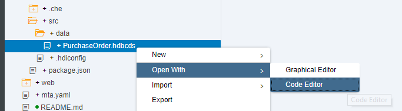
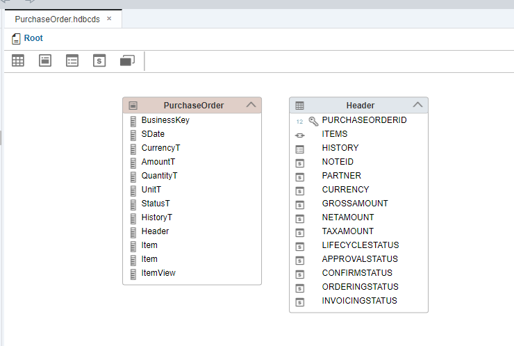

## Prerequisites  
 - **Proficiency:** Beginner
 - **Tutorials:** [SAP HANA XS Advanced Create an HTML5 Module](https://developers.sap.com/tutorials/xsa-html5-module.html)

## Next Steps
 - [SAP HANA XS Advanced - Create a Node.js module](https://developers.sap.com/tutorials/xsa-xsjs-xsodata.html)


## Details
### You will learn  
You will now create the HTML5 module to add basic web based content to your XSA application.


### Time to Complete
**25 Min**.

---

The goal of HDI is to manage database artifacts from design time objects but in a way that allows multiple copies/versions of the same core objects to be used on the same HANA database at the same time.

HDI introduces the concept of the container as an abstraction of the Schema. The container in turn dynamically generates the Schema, a container-specific Database User who owns all objects and a password for that database user. XS Advanced based services then only need access to the container and never need to know the actual Schema, technical user, or password. All of that information is stored within the container definition.

SAP HANA Deployment Infrastructure was introduced with SPS11 and is thoroughly explained here: [SAP HANA SPS 11: New Developer Features; HDI](https://blogs.sap.com/2015/12/08/sap-hana-sps-11-new-developer-features-hdi/)

[ACCORDION-BEGIN [Step 1: ](Create HDB Module)]

Begin by selecting your project and then choosing `New -> SAP HANA database module`


> In previous versions of SAP Web IDE, you may need to click `More`

Name this new module `db`. Then press Next.


**Clear the namespace field** (they are not of any use anymore), enter a name for the schema and check the `Build Module after creation` tick box. Press **Finish**.


The wizard has created the `db` folder as well as the `hdi-container` resource and the `db` module in the `mta.yaml` file for you.


You will be able to see some of the additional files that the module creation wizard created if you choose `View->Show Hidden Files`  


[DONE]

[ACCORDION-END]

[ACCORDION-BEGIN [Step 2: ](Create CDS Table)]


The `db/src` folder is where your actual database development objects belong. There are two configuration files in the root of this folder.


> Note the `.hdiconfig` file. It maps the file extensions to the specific server side activation plug-ins. This way you can choose any file extensions you wish to use as long as you map them to the correct plug-ins. You can use the default configurations for now.

In the `src` folder we will create several development objects. Create a new data folder under `src`. Then use the wizard to create a new HDB CDS artifact


Name the new CDS file `PurchaseOrder` and press Create


> Note: In some older versions of SAP Web IDE, the wizard for CDS may take too long to complete and finally throw an error about a missing context. As a workaround, close the graphical editor and open the file using the text editor, which you can find by right-clicking the file

As of SPS12, `hdbcds` is the new file extension replacing `hdbdd`. It contains the table and view definitions. You are creating a simple Purchase Order Header and Item data model.

The syntax is the same as `CDS-based` development objects previously. The graphical editor will be opened automatically. Open the text editor:



Paste the following content:

```sql

context PurchaseOrder {
    type BusinessKey : String(10);
    type SDate : LocalDate;
    type CurrencyT : String(5);
    type AmountT : Decimal(15, 2);
    type QuantityT : Decimal(13, 3);
    type UnitT : String(3);
    type StatusT : String(1);
    type HistoryT {
        @Comment : 'Created By'
        CREATEDBY : BusinessKey;
        @Comment : 'Created Date'
        CREATEDAT : SDate;
        @Comment : 'Changed By'
        CHANGEDBY : BusinessKey;
        @Comment : 'Change Date'
        CHANGEDAT : SDate;
    };

    @Comment : 'Purchase Order Header'
    entity Header {
            @Comment : 'Purchase Order ID'
        key PURCHASEORDERID : Integer generated by default as identity(start with 200000000 increment by 1 no minvalue maxvalue 2999999999 no cache no cycle);
            ITEMS           : association[1, 0..*] to Item on Header.PURCHASEORDERID = PURCHASEORDERID;
            HISTORY         : HistoryT;
            @Comment : 'Notes'
            NOTEID          : BusinessKey null;
            @Comment : 'Supplier'
            PARTNER         : BusinessKey;
            @Comment : 'Currency'
            CURRENCY        : CurrencyT;
            @Comment : 'Gross Amount'
            GROSSAMOUNT     : AmountT;
            @Comment : 'Net Amount'
            NETAMOUNT       : AmountT;
            @Comment : 'Tax Amount'
            TAXAMOUNT       : AmountT;
            @Comment : 'Lifecycle Status'
            LIFECYCLESTATUS : StatusT;
            @Comment : 'Approval Status'
            APPROVALSTATUS  : StatusT;
            @Comment : 'Confirmation Status'
            CONFIRMSTATUS   : StatusT;
            @Comment : 'Ordering Status'
            ORDERINGSTATUS  : StatusT;
            @Comment : 'Invoicing Status'
            INVOICINGSTATUS : StatusT;
    }
    technical configuration {
        column store;
    };

    @Comment : 'Purchase Order Item'
    entity Item {
        key POHeader     : association[*, 1..1] to Header { PURCHASEORDERID };
            @Comment : 'Product ID'
        key PRODUCT      : BusinessKey;
            @Comment : 'Notes'
            NOTEID       : BusinessKey null;
            @Comment : 'Currency'
            CURRENCY     : CurrencyT;
            @Comment : 'Gross Amount'
            GROSSAMOUNT  : AmountT;
            @Comment : 'Net Amount'
            NETAMOUNT    : AmountT;
            @Comment : 'Tax Amount'
            TAXAMOUNT    : AmountT;
            @Comment : 'Quantity'
            QUANTITY     : QuantityT;
            @Comment : 'Quantity Unit'
            QUANTITYUNIT : UnitT;
            @Comment : 'Delivery Date'
            DELIVERYDATE : SDate;
    }
    technical configuration {
        column store;
        //    index PURCHASEORDER_ITEM_ID on (POHeader.PURCHASEORDERID) asc;
    };

    @Comment : 'Purchase Order Item View'
    define view ItemView as
        select from Item
        {
            POHeader.PURCHASEORDERID as "PurchaseOrderItemId",
            POHeader.PARTNER         as "PartnerId",
            PRODUCT                  as "ProductID",
            CURRENCY                 as "CurrencyCode",
            GROSSAMOUNT              as "Amount",
            NETAMOUNT                as "NetAmount",
            TAXAMOUNT                as "TaxAmount",
            QUANTITY                 as "Quantity",
            QUANTITYUNIT             as "QuantityUnit",
            DELIVERYDATE             as "DeliveryDate1"
        }
        with structured privilege check;
};

```
> Note: This snippet is valid as of SPS02. Some annotations, such as Comment or the sequence generation may be invalid in previous versions. You can remove them from the file and manually create the sequence as explained in the next step.  

Save the artifact after entering this code. Go back to the graphical editor to gain better clarity of the data model



[DONE]
[ACCORDION-END]

[ACCORDION-BEGIN [Step 3: ](Review CDS Entities and Types)]

Look at the syntax you just entered into the `PurchaseOrder.hdbcds` file in more detail.

First, you need to define some reusable elemental types. These will later be used to define the data type of individual columns in our tables. Within the `PurchaseOrder` context, create element types for `BusinessKey`, `SDate`, `CurrencyT`, `AmountT`, `QuantityT`, `UnitT`, and `StatusT`.

```
  context PurchaseOrder {
      type BusinessKey : String(10);
      type SDate : LocalDate;
      type CurrencyT : String(5);
      type AmountT : Decimal(15, 2);
      type QuantityT : Decimal(13, 3);
      type UnitT : String(3);
      type StatusT : String(1);

```

You can also create reusable structures with multiple fields. This is useful when the same sets of fields are repeated in multiple tables. Create a reusable structure for History – with `CREATEDBY`, `CREATEDAT`, `CHANGEDBY`, and `CHANGEDAT` fields.


```
type HistoryT {
        @Comment : 'Created By'
        CREATEDBY : BusinessKey;

        @Comment : 'Created Date'
        CREATEDAT : SDate;

        @Comment : 'Changed By'
        CHANGEDBY : BusinessKey;

        @Comment : 'Change Date'
        CHANGEDAT : SDate;
    };

```

  The syntax for creating Entities is similar to types. Entities will become database tables when activating the `hdbcds` file.

```
@Comment : 'Purchase Order Header'
    entity Header {
            @Comment : 'Purchase Order ID'
        key PURCHASEORDERID : Integer generated by default as identity(start with 200000000 increment by 1 no minvalue maxvalue 2999999999 no cache no cycle);
            ITEMS           : association[1, 0..*] to Item on Header.PURCHASEORDERID = PURCHASEORDERID;
            HISTORY         : HistoryT;

            @Comment : 'Notes'
            NOTEID          : BusinessKey null;

...
    }
    technical configuration {
        column store;
    };

```

An alternative to the creation of the sequence for the filed `PURCHASEORDERID`, valid in older versions, would have been a file with the extension `.hdbsequence` and the following code:

```SQL
SEQUENCE "orderId"
INCREMENT BY 1 START WITH 200000000
MINVALUE 1 MAXVALUE 2999999999
NO CYCLE
RESET BY
SELECT IFNULL(MAX(PURCHASEORDERID), 0)+1
FROM "PurchaseOrder.Header"

```

We are now ready to **Build**. Right click the `db` folder and the **Build** button. This process technically executes a `node.js` application which will call over to HANA and deploy these database artifacts into their container.


The log should say that the Build of your project has completed successfully:


[DONE]

[ACCORDION-END]


[ACCORDION-BEGIN [Step 4: ](Check the Database Explorer)]

It is now time to check what you have created so far. Open the Database Explorer from the `Tools -> Database Explorer` menu or using the middle icon in the left side bar.  

> Still in SPS12? This was known as the `SAP HANA Runtime Tool` and it was separate from the Web IDE. For SAP HANA, express edition you can navigate to `http://<hostname>:51018`

You will be prompted to add a new database. if you are not, click on the **+** sign. Search for your container based on your user name or the repository name. Select it, insert `db` as a display name and click **OK**.


You can now see the container, table definitions and contents you have created so far:


Right-click on the Header table and use the generated SQL statement in the validation below.


[VALIDATE_1]

[ACCORDION-END]

[ACCORDION-BEGIN [Step 5: ](Create and Upload Data)]

There are several ways to load data into your tables in SAP HANA. you will use an artifact similar to the former `.hdbti` development object, that allows you to upload a file into your directory in SPA Web IDE and load the data into a table or tables according to the configuration. This is handy for initial loads or small configuration tables.

In your `data` folder, **create a file** named `load.hdbtabledata` and enter this text into it. Don't forget to save the file afterwards.

```json
{
"format_version": 1,
"imports": [{
  "target_table": "PurchaseOrder.Header",
  "source_data": {
    "data_type": "CSV",
    "file_name": "header.csv",
    "has_header": false,
    "dialect": "HANA",
    "type_config": {
      "delimiter": ","
    }
  },
  "import_settings": {
    "import_columns": ["PURCHASEORDERID",
    "NOTEID",
    "PARTNER",
    "CURRENCY",
    "GROSSAMOUNT",
    "NETAMOUNT",
    "TAXAMOUNT",
    "LIFECYCLESTATUS",
    "APPROVALSTATUS",
    "CONFIRMSTATUS",
    "ORDERINGSTATUS",
    "INVOICINGSTATUS"]
  },
  "column_mappings": {
    "PURCHASEORDERID": 1,
    "NOTEID": 6,
    "PARTNER": 7,
    "CURRENCY": 8,
    "GROSSAMOUNT": 9,
    "NETAMOUNT": 10,
    "TAXAMOUNT": 11,
    "LIFECYCLESTATUS": 12,
    "APPROVALSTATUS": 13,
    "CONFIRMSTATUS": 14,
    "ORDERINGSTATUS": 15,
    "INVOICINGSTATUS": 16
  }
},
{
  "target_table": "PurchaseOrder.Item",
  "source_data": {
    "data_type": "CSV",
    "file_name": "item.csv",
    "has_header": false,
    "dialect": "HANA",
    "type_config": {
      "delimiter": ","
    }
  },
  "import_settings": {
    "import_columns": ["POHeader.PURCHASEORDERID",
    "PRODUCT",
    "NOTEID",
    "CURRENCY",
    "GROSSAMOUNT",
    "NETAMOUNT",
    "TAXAMOUNT",
    "QUANTITY",
    "QUANTITYUNIT" ]
  },
  "column_mappings": {
    "POHeader.PURCHASEORDERID": 1,
    "PRODUCT": 3,
    "NOTEID": 4,
    "CURRENCY": 5,
    "GROSSAMOUNT": 6,
    "NETAMOUNT": 7,
    "TAXAMOUNT": 8,
    "QUANTITY": 9,
    "QUANTITYUNIT": 10

  }
}]
}

```

> Note: You can find a reference of the `.hdbtabledata` artifact in the [official SAP Help](https://help.sap.com/viewer/4505d0bdaf4948449b7f7379d24d0f0d/2.0.03/en-US/35c4dd829d2046f29fc741505302f74d.html?q=hdbtabledata)

Skim through the contents of the file you have just created and you will see the `file_name` fields.

**Create a file** called `header.csv` with the following content:

```text
0500000000,0000000033,20120101,0000000033,20120101,9000000001,0100000000,EUR,13224.47,11113,2111.47,N,I,I,I,I
0500000001,0000000033,20120102,0000000033,20120102,9000000001,0100000002,EUR,12493.73,10498.94,1994.79,N,I,I,I,I
```

**Create a file** called `item.csv` and use the following data.  Don't forget to **save** all of the files.

```text
0500000000,0000000010,HT-1000,,EUR,1137.64,956,181.64,1,EA,20121204
0500000000,0000000020,HT-1091,,EUR,61.88,52,9.88,2,EA,20121204
0500000000,0000000030,HT-6100,,EUR,1116.22,938,178.22,2,EA,20121204
0500000000,0000000040,HT-1001,,EUR,2275.28,1912,363.28,2,EA,20121204
0500000000,0000000050,HT-1092,,EUR,92.82,78,14.82,3,EA,20121204
0500000000,0000000060,HT-6101,,EUR,1116.22,938,178.22,2,EA,20121204
0500000000,0000000070,HT-1002,,EUR,2275.28,1912,363.28,2,EA,20121204
0500000000,0000000080,HT-1090,,EUR,61.88,52,9.88,2,EA,20121204
0500000000,0000000090,HT-6102,,EUR,1674.33,1407,267.33,3,EA,20121204
0500000000,0000000100,HT-1007,,EUR,3412.92,2868,544.92,3,EA,20121204
0500000001,0000000010,HT-1100,,USD,213.96,179.8,34.16,2,EA,20121204
0500000001,0000000020,HT-2026,,USD,35.69,29.99,5.7,1,EA,20121204
0500000001,0000000030,HT-1002,,USD,3736.6,3140,596.6,2,EA,20121204
0500000001,0000000040,HT-1101,,USD,213.96,179.8,34.16,2,EA,20121204
0500000001,0000000050,HT-2027,,USD,71.38,59.98,11.4,2,EA,20121204
0500000001,0000000060,HT-1003,,USD,3736.6,3140,596.6,2,EA,20121204
0500000001,0000000070,HT-1102,,USD,320.94,269.7,51.24,3,EA,20121204
0500000001,0000000080,HT-2028,,USD,107.06,89.97,17.09,3,EA,20121204
0500000001,0000000090,HT-1004,,USD,3736.6,3140,596.6,2,EA,20121204
0500000001,0000000100,HT-1103,,USD,320.94,269.7,51.24,3,EA,20121204
```

**Build** the `db` module.


[DONE]

[ACCORDION-END]

[ACCORDION-BEGIN [Step 7: ](Check data in the database explorer)]

Go back to the database explorer and look for your tables again. This time, use the **Open Data** option to see the data:


Use the option to edit the **SQL** statement and enter the following statement:

```sql
SELECT SUM("GROSSAMOUNT")
FROM "DB_1"."PurchaseOrder.Item";
```

What was the total gross amount?

[VALIDATE_2]
[ACCORDION-END]


