## Prerequisites  
 - This tutorial is designed for SAP HANA on premise and SAP HANA, express edition. It is not designed for SAP HANA Cloud.
 - **Proficiency:** Beginner
 - Create a Node.js module to expose an OData service (https://developers.sap.com/tutorials/xsa-xsjs-xsodata.html)

## Details
### You will learn  
How to perform a very simple addition to the default HTML5 module to consume the OData service by binding a model. This is a very simple example that will be later expanded to incorporate better practices and is only intended to demonstrate a basic test consumption of a data model and the basic troubleshooting tools.

### Time to Complete  
**15 Min**

---

[ACCORDION-BEGIN [Step 1: ](Remove the default scripts)]

Open the file `index.html` under resources. You will find the default code creates a button that fades away when pressed

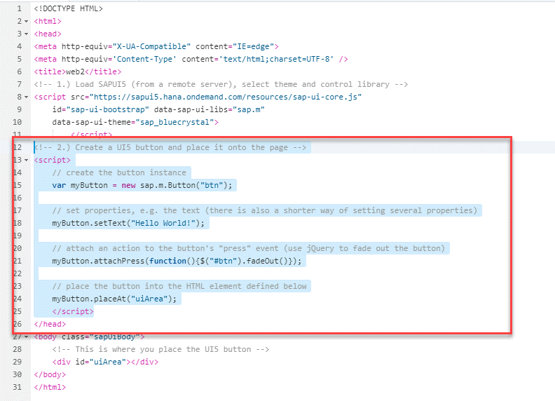

Remove the logic for the button


[DONE]

[ACCORDION-END]

[ACCORDION-BEGIN [Step 2: ](Bind the OData model to a table)]

In [this previous tutorial](https://developers.sap.com/tutorials/xsa-xsjs-xsodata.html), you created an XSJS compatible Node.js module to expose an OData V2 service that provides data from your database module. Consuming that model using SAP UI5 is simplified thanks to the concept of binding.

Take a look at the output of the OData service in JSON format

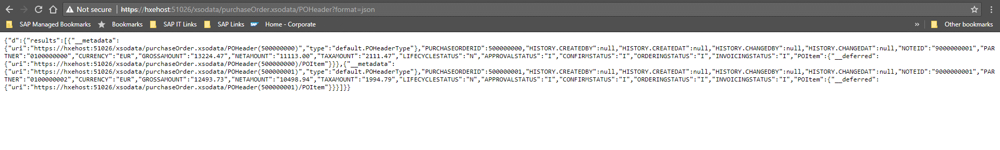


Add the following script to your `index.html` file, where the logics for the button used to be.

```javascript

<script>

	var oModel = new sap.ui.model.odata.v2.ODataModel("/xsodata/purchaseOrder.xsodata", true);
	var oTable = new sap.ui.table.Table({ title: "My first table" });
	oTable.addColumn(new sap.ui.table.Column({ label: "PO ID", template: "PURCHASEORDERID" }));
	oTable.setModel(oModel);
	oTable.bindRows("/POHeader");
	oTable.placeAt("uiArea");

	</script>
```

> ### More about binding
> You are using an OData model that will load data as required by the client and delegate the sorting and filtering operations to the server-side. This model will provide the data from the service you defined before. You are then creating a table and binding the model to the table, so that all changes in the data are reflected also in the table.  Check the Help for [more information about SAPUI5 and binding](https://help.sap.com/viewer/40826922922346f890185c8ff02d30da/latest/en-US/91f0ca956f4d1014b6dd926db0e91070.html)

Save and run the HTML5 module. You should get an error. Press `F12` in your browser and look at the errors in the console.

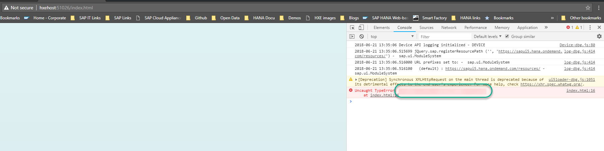

[VALIDATE_1]
[ACCORDION-END]

[ACCORDION-BEGIN [Step 4: ](Add missing libraries)]

You can see the available libraries in the `Sources` tab in the panel. Notice the resources that are loaded:

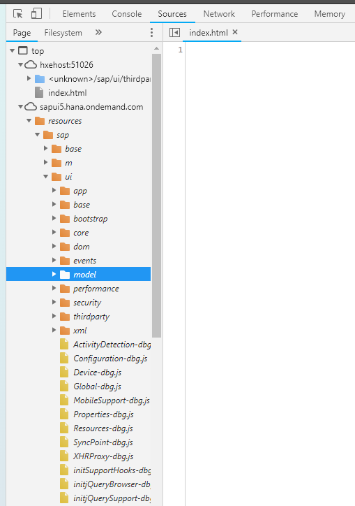

Go back and look at the code in `index.html` .

You are using `sap.ui.table` and `sap.ui.model` to display the table. If you compare the libraries you are using to the libraries that are loaded, you will see `sap.ui.table` is not present as a resource. This is why you are getting the error in the console.

> ### More about these libraries
> You will see there is a reference to `sap-ui-core.js`, a control library (`sap.m`) and a theme, `sap_bluecrystal`.
>`sap-ui-core.js` is the bootstrap file for SAPUI5, it contains the minimum required parts of the core library.  This will load and initialize the SAPUI5 library as soon as the script is executed by the browser. After its initialization, and because it has been added by default in the `index.html`, the library `sap.m` is loaded, together with its dependencies.

Add `sap.ui.table` to the `index.html` file as a required library.

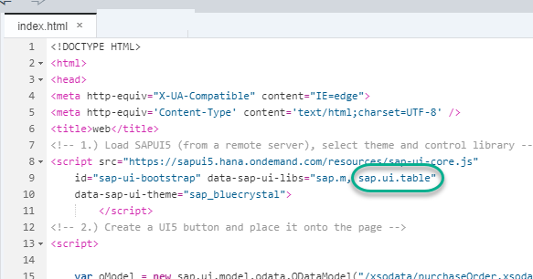

**Save** and **run** the web module again. You should see the table with results. Additionally, if you refresh while in the `Network` tab, you will see the requests, the sequence in which they are called and how long it takes them to load.

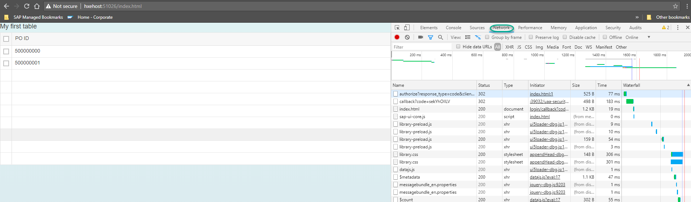

[DONE]

[ACCORDION-END]

[ACCORDION-BEGIN [Step 4: ](Add the SAPUI5 service as a dependency)]

Just like with the UAA service, you want to bind the instance you have created to your Multi-Target Application. Open the `MTA.yaml` file and click **add a new resource** called `ui5`.

Use `org.cloudfoundry.managed-service` as the type and the following key-value pairs under parameters for HANA 2.0 SPS04 (for other releases, use the `xs marketplace` command to view the available service-plans):

- service : `sapui5_sb`
- `service-plan` : `sapui5-1.60`

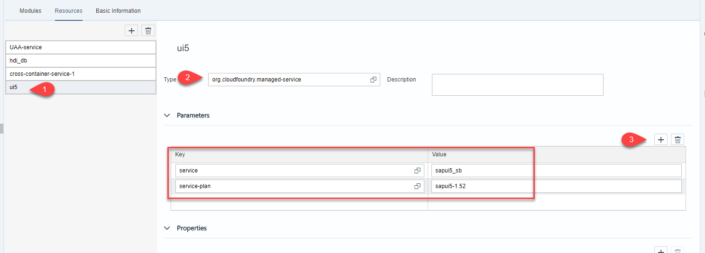

> ### Where are the values coming from?
> The name of the service instance, the type of service and service plan are use to bind the instance of the UI5 service to the web module. You can see these values under `Service Instances` in the XS Advanced cockpit or by listing them using the XS CLI with command `xs services`

**Save** the `yaml` file and navigate to the `resources` tab. Use the drop-down menu to choose the newly created resource.

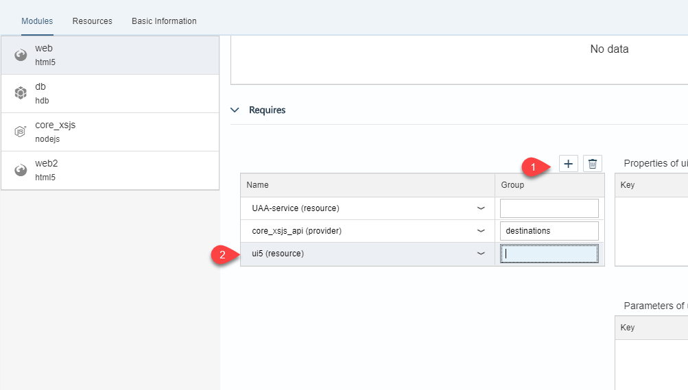

[DONE]
[ACCORDION-END]

[ACCORDION-BEGIN [Step 5: ](Adjust the AppRouter replacement)]

Open the file `xs-app.json` and add the following code at the end of the route declarations

```text
{
		"source": "/(.*)",
		"localDir": "resources",
		"authenticationType": "xsuaa",
		"replace": {
			"pathSuffixes": ["index.html", "odataTest.html"],
			"services": {
				"sapui5_sb": {
					"tag": "ui5"
					}
				}		
				}
			}
```
You will need to add a comma before adding the new route with the replacement values, the full file looks as follows:

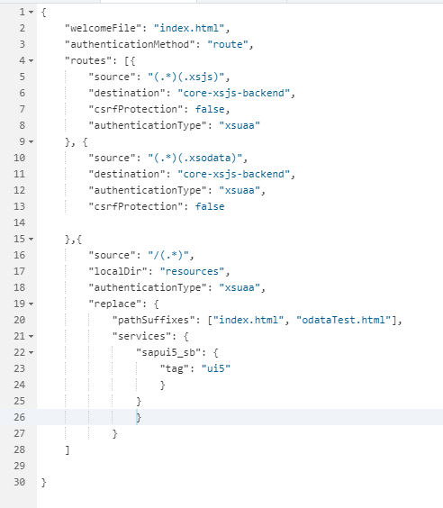

**Save the file**

> ### What does this mean?
> Take a look at the `package.json` file. You will notice a node module,`approuter.js`, is called. This module will read the file `xs-app.json`, use the `welcomeFile` value to redirect to `index.html` by default, and interpret the routes requests should take according to the regular expressions in the `source` key.
> It can also replace placeholders in static text resources, such as a placeholder for the URL to the UI5 service in `index.html`. In this case, the `AppRouter` finds the service with tag `ui5` like  you created in step 4, bound to the web application. If you use command `xs env APP`, where APP is the name of your web application, you will see the configuration details for the UI5 service.
>  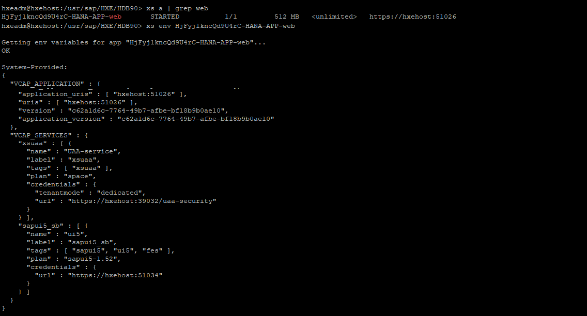
> You can find more information about the AppRouter in the [SAP Help portal](https://help.sap.com/viewer/4505d0bdaf4948449b7f7379d24d0f0d/latest/en-US/6ba89596e3a64a5480c3977d4ea7fdba.html)

[DONE]
[ACCORDION-END]

[ACCORDION-BEGIN [Step 6: ](Call the micro-service in your HTML file)]

Open the `index.html` file and replace the remote URL with the variable `{{{sapui5_sb.url}}}`.  

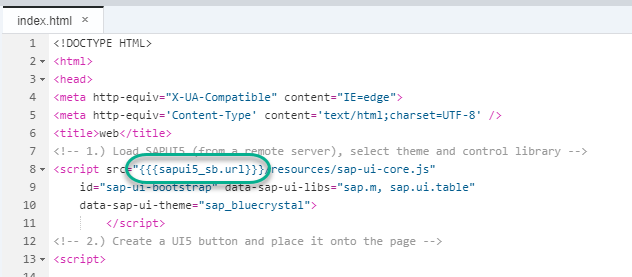

**Save and Run** the `index.html` file.

Right-click on the site and use the `view source` option to see the replacement:

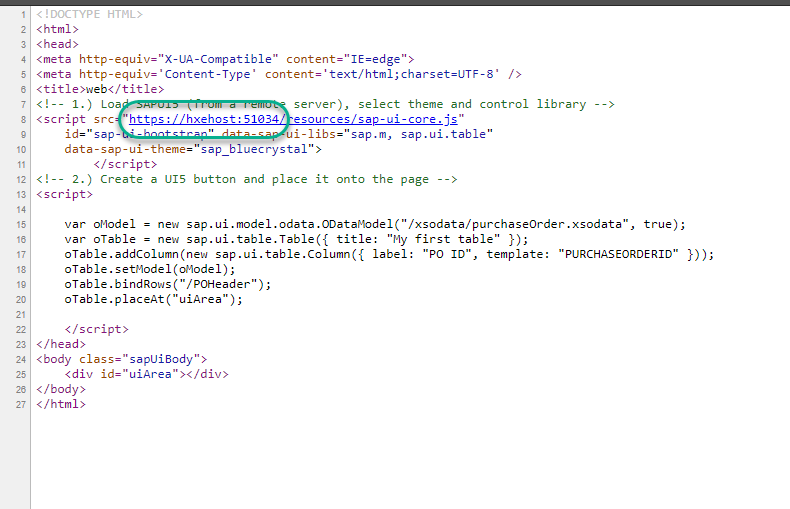

Press `CTRL + SHIT + ALT + S` and wait for the diagnostics window.

[VALIDATE_3]
[ACCORDION-END]


---
