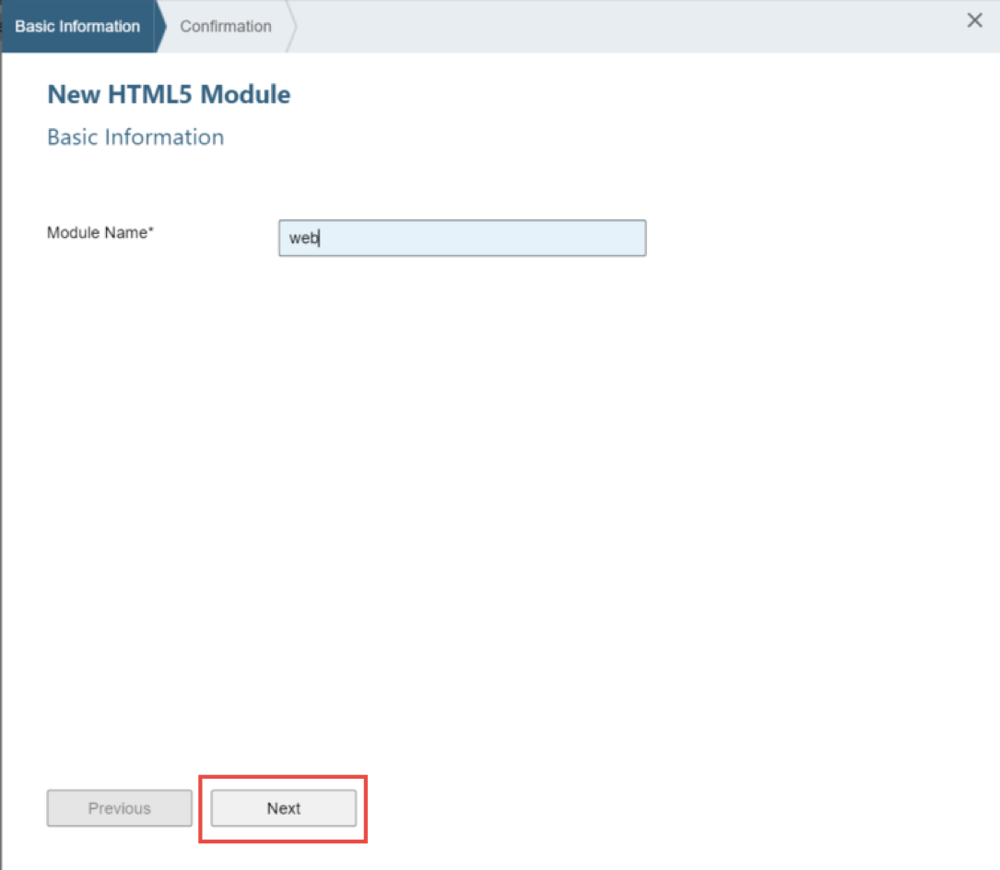
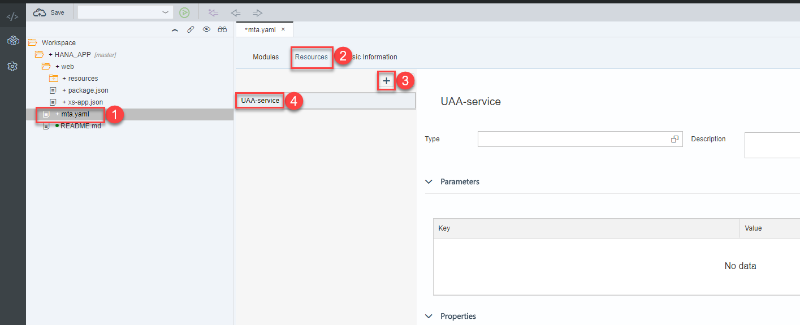
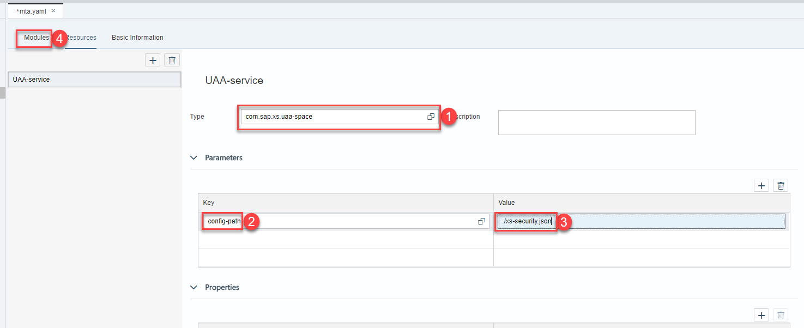
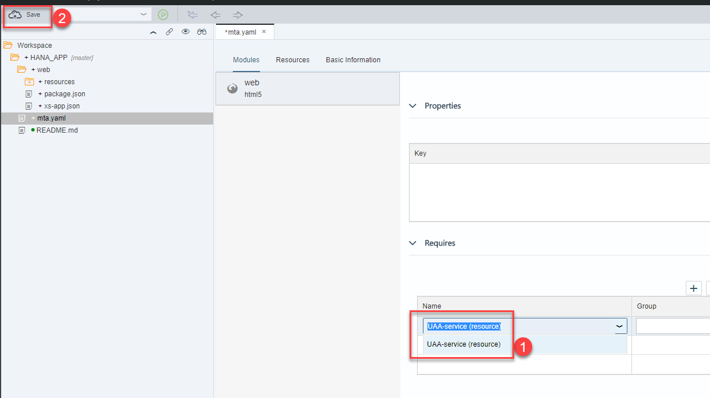
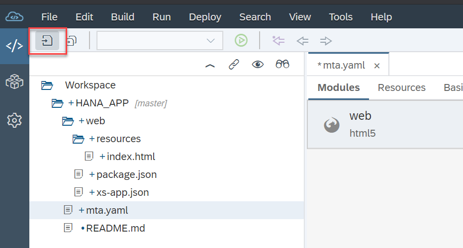
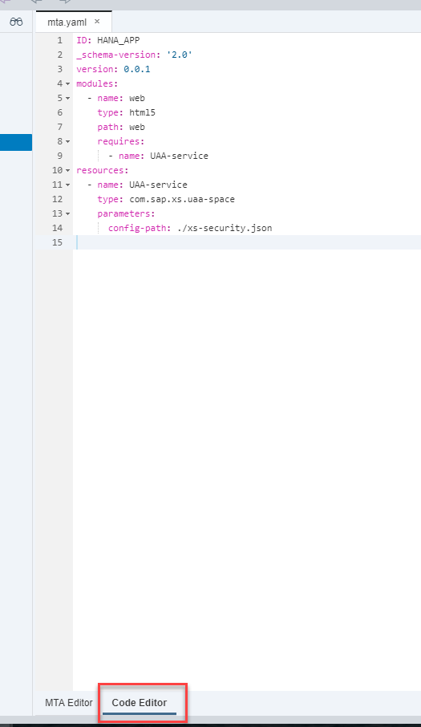
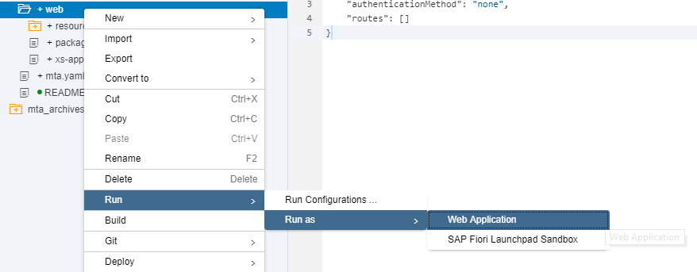
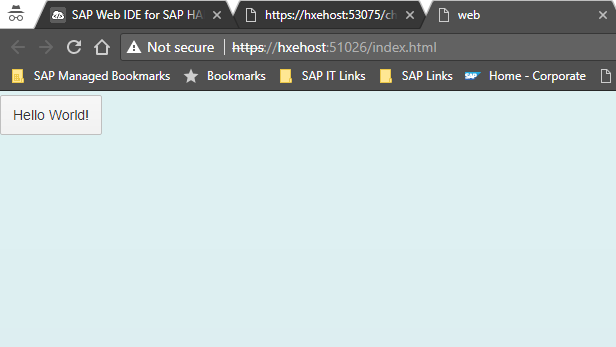

## Prerequisites  
 - This tutorial is designed for SAP HANA on premise and SAP HANA, express edition. It is not designed for SAP HANA Cloud.
 - You have created a  Multi-Target Application as explained in this tutorial: [SAP HANA XS Advanced Connect to Web IDE and clone Git Repository](https://developers.sap.com/tutorials/xsa-connecting-webide.html)


## Details
### You will learn  
You will learn how to create an HTML5 endpoint with authentication using the User Account and Authorization (UAA) service.


### Time to Complete
**15 Min**.

---


[ACCORDION-BEGIN [Step 1: ](Add the HTML5 Module in your existing MTA project)]

> ***What is a Multi-Target Application?***: The XS Advanced application platform is based on Cloud Foundry, an open-source platform that provides a layer of abstraction between your application and the underlying infrastructure. This is useful because it allows you to deploy the same application in different cloud providers. Cloud Foundry allows for a micro-service approach. A Multi-Target Application allows you to bundle all the different micro-services conforming `your business application into the same lifecycle`. For more information about multi-target applications (MTA), refer to [this blog post](https://blogs.sap.com/2017/09/05/xs-advanced-for-not-so-dummies-pt-2-multi-target-applications/).

 Begin by right-clicking on your project and then choosing `New -> HTML5 Module`


Name the module `web`. Press Next to see the confirmation. Then press **Finish**.



You will notice a new folder under the project folder. SAP Web IDE has automatically created the appropriate folder structure for you. Open the `resources` folder to answer the validation below.

[VALIDATE_1]

[ACCORDION-END]


[ACCORDION-BEGIN [Step 2: ](Add the UAA service as a dependent resource)]

The User Account and Authentication service validates users and their roles and provides them with an authentication token. You can find more information on the UAA service in [the developer guide](https://help.sap.com/viewer/4505d0bdaf4948449b7f7379d24d0f0d/latest/en-US/c6f36d5d49844bd790798ea36538e024.html).

Before you can establish a dependency between your HTML5 module and the UAA service instance, you need to list the UAA service instance as a resource in your applications. Open the `mta.yaml` file in graphical mode and got to the resources tab. Create a new resource using the **+** Sign




Fill in the name,  choose `com.sap.xs.uaa-space` from the search help.


Click **Modules** to add the dependency to the UAA service in the web module



>***What is this `mta.yaml` file for?***
>We have so far created a Multi Target Application, that is, an application that will contain different modules, such as an HTML5 module and some database artifacts within a HANA Database Module. This file is a design-time descriptor, that will be used by the platform to create a deployment descriptor. This file contains information related to the application (ID, version, description) as well as resources, modules and parameters that will be deployed and required at runtime.

</br>


And click on **Save**



Open the `Code Editor` tab in the bottom to see the actual contents of the  `mta.yaml` file.



[DONE]
[ACCORDION-END]


[ACCORDION-BEGIN [Step 3: ](Change Authentication Method)]

The web folder in your project contains the resources that will be served out by this HTML5 module. This HTML5 module manages all HTML/client side UI resources (in the resources folder) and performs the task of reverse proxy for all other internal services, like a application router. This way you have a single HTTP endpoint and avoid any CORS issues. Among other files, the `Basic HTML5 Module` wizard created a file called `xs-app.json`.

In this file you can map the routes to destinations you defined in the `mta.yaml`. We can also set authentication and other options. Go ahead and change the `authenticationMethod` to route in the `xs-app.json` file.

```
{
	"welcomeFile": "index.html",
	"authenticationMethod": "route",
	"routes": [ ]
}
```

You will learn how to add routes to backend modules in the next tutorials. You can check [this post](https://blogs.sap.com/2018/02/16/xs-advanced-for-not-so-dummies-routing/) to learn more about how this works.

[DONE]

[ACCORDION-END]

[ACCORDION-BEGIN [Step 4: ](Build and Run!)]

Click on the web folder and click on **Run as Web Application**. This  will open a new browser tab to the default page of this web service.



The console will be updated with the status of the service. Notice there is a **logs** URL that will be of use if something goes wrong. Click the URL link in the Run console to open the application in a new browser tab.


A new tab will open and you will see the default **Hello World** button has been placed for you:



[VALIDATE_2]

[ACCORDION-END]
