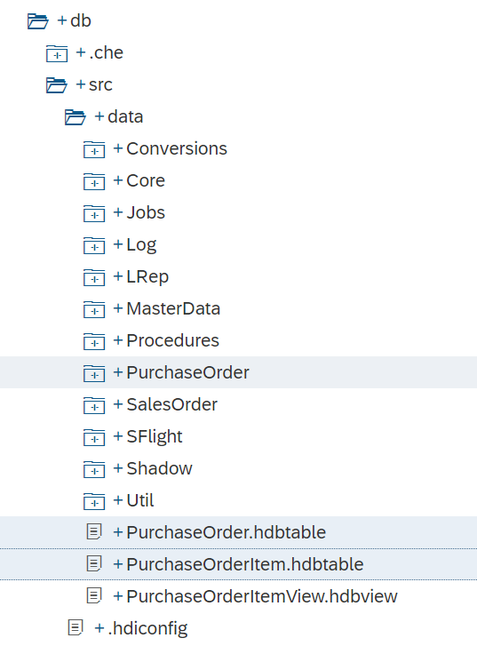
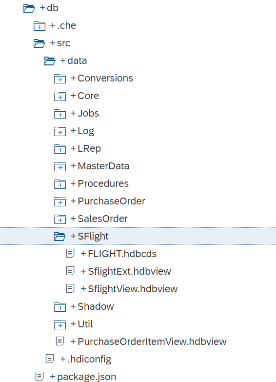
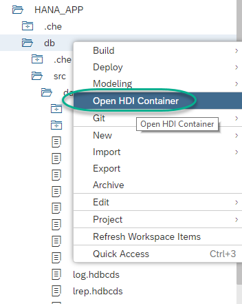
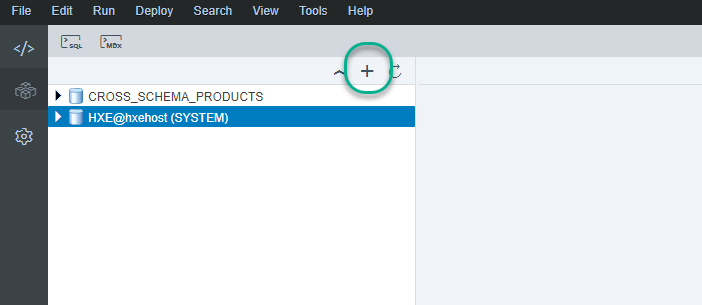
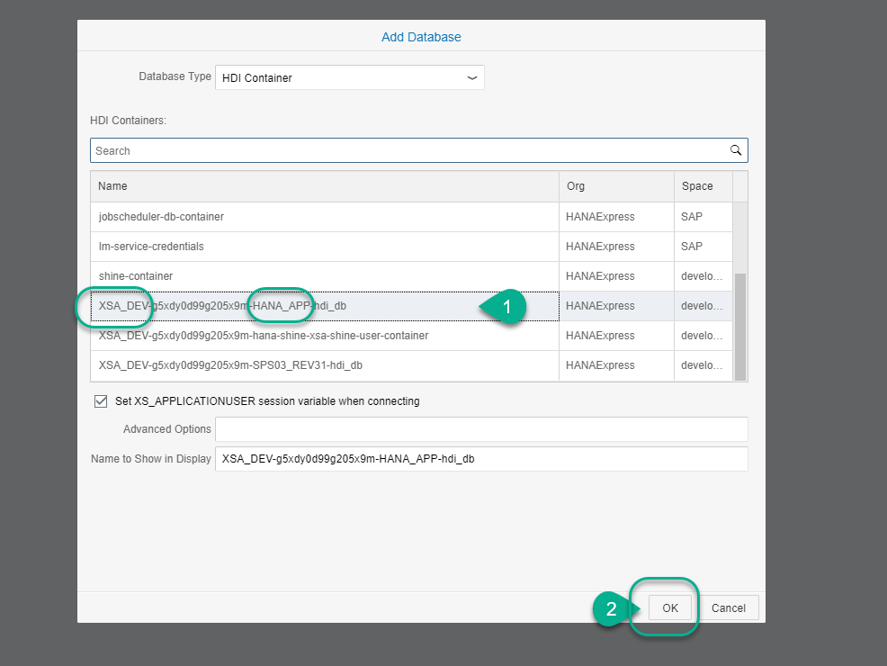
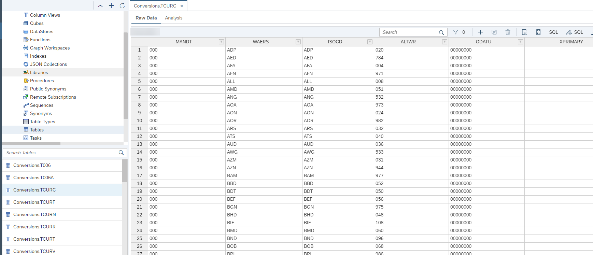

## Prerequisites  
 - This tutorial is designed for SAP HANA on premise and SAP HANA, express edition. It is not designed for SAP HANA Cloud.
 - **Tutorials:** [Create an HDI Module](https://developers.sap.com/tutorials/xsa-hdi-module.html)

## Details
### You will learn  
This tutorial will guide you through the process of downloading sample data and database artifacts and importing it into SAP HANA using SAP Web IDE for SAP HANA.

If you are looking to import the entire SAP HANA `INteractive` Education model for XS Advanced, follow this tutorial instead: [https://developers.sap.com/tutorials/xsa-ml-e2e-access-shine.html](xsa-ml-e2e-access-shine)

---

[ACCORDION-BEGIN [Step 1: ](Download the archive)]

Download the file `data.zip` from our public [GitHub repository](https://github.com/SAP-samples/hana-xsa-opensap-hana7/raw/snippets_2.4.0/ex2/core-db/data.zip).

[DONE]
[ACCORDION-END]

[ACCORDION-BEGIN [Step 2: ](Import Archive)]

Import the archive into the data folder. This will probably be `src\data`. Right-click on the folder and choose `Import->From File System`:

**Browse** for the downloaded `data.zip` file, keep the **Extract archive** flag and click on **OK**.

 **Confirm** that files with the same name will be overwritten

[DONE]
[ACCORDION-END]

[ACCORDION-BEGIN [Step 3: ](Purge duplicates and Build)]

Delete the files  `header.csv`,  `item.csv` and `load.hdbtabledata` (if available) to avoid conflicts during build:

Also delete `PurchaseOrder.hdbtable` and `PurchaseOrderItem.hdbtable` (if available).

Also delete the `SFlight` folder (if available).

**Build** the db module:

[DONE]
[ACCORDION-END]

[ACCORDION-BEGIN [Step 4: ](Check the imported entities in the Database Explorer)]

The Database Explorer allows you to see the database artifacts you create in the different HDI containers.

Right-click on the database module and choose **Open HDI Container**

> Note: If you do not find this option, use the middle icon on the left sidebar or from the menu, `Tools-Database Explorer`:
> Use the `+` icon to add a database container into the Explorer.
> 
> Locate your HDI container and add it. You will find it as a concatenation of your user ID and the name of your project.
> 

You can now navigate the tables and check their content. Click on **Open Data** for table `TCURC`

[VALIDATE_1]
[ACCORDION-END]

---
