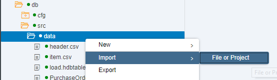
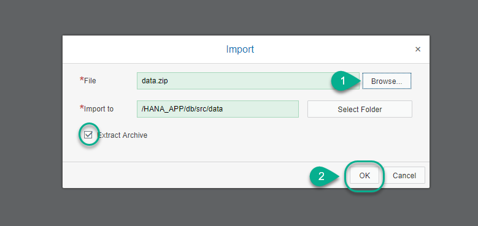
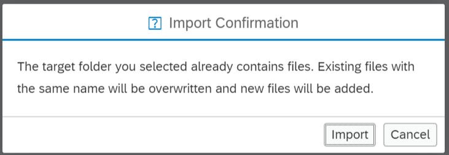
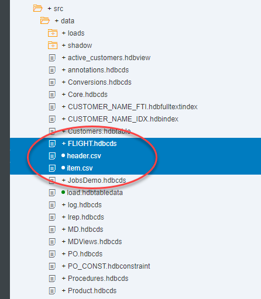
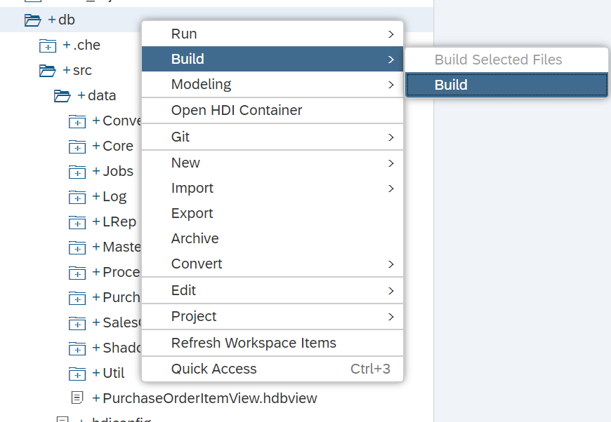
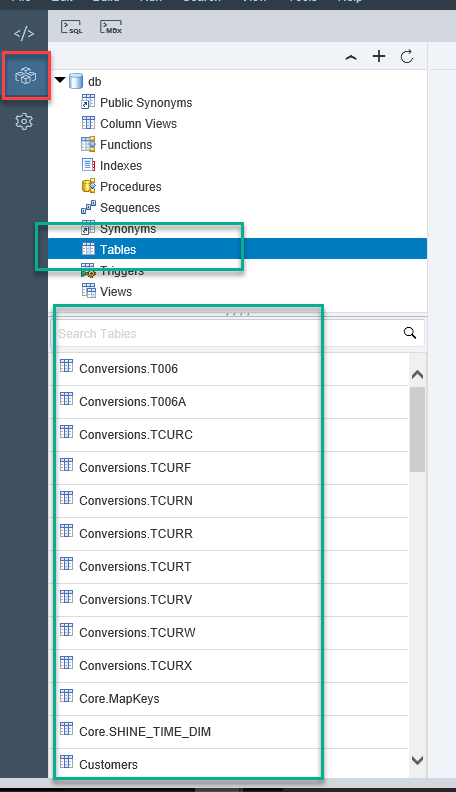

## Prerequisites  
 - **Proficiency:** Beginner | Intermediate | Advanced
 - **Tutorials:** [Create an HDI Module](http://www.sap.com/developer/tutorials/xsa-hdi-module.html)

## Next Steps
  - Select a tutorial group from the [Tutorial Navigator](http://www.sap.com/developer/tutorial-navigator.html) or the [Tutorial Catalog](https://www.sap.com/developer/tutorial-navigator.tutorials.html)

## Details
### You will learn  
This tutorial will guide you through the process of downloading sample data and database artifacts and importing it into SAP HANA using SAP Web IDE for SAP HANA.

### Time to Complete
**5 Min**

---

[ACCORDION-BEGIN [Step 1: ](Download the archive)]

Download the file `data.zip` from our public [GitHub repository](https://github.com/SAP/com.sap.openSAP.hana5.templates/raw/hana2_sps01/ex2/core-db/data.zip).

[DONE]
[ACCORDION-END]

[ACCORDION-BEGIN [Step 2: ](Import Archive)]

Import the archive into the data folder. This will probably be `src\data`. Right-click on the folder and choose `Import->From File System`:

**Browse** for the downloaded `data.zip` file, keep the **Extract archive** flag and click on **OK**.

 **Confirm** that files with the same name will be overwritten

[DONE]
[ACCORDION-END]

[ACCORDION-BEGIN [Step 3: ](Purge duplicates and Build)]

Delete the files `FLIGHT.hdbcds`, `header.csv`, `item.csv` and `Purchase.hdbtabledata` to avoid conflicts during build:

**Build** the db module:

[DONE]
[ACCORDION-END]

[ACCORDION-BEGIN [Step 4: ](Check the imported entities in the Database Explorer)]

Formerly known as HANA Runtime Tools or `HRTT` in previous versions, the Database Explorer allows you to see the database artifacts you create in the different HDI containers. Use the middle icon on the left sidebar or from the menu, `Tools->Database Explorer`:

>In SPS12, the HANA Runtime Tool was accessed from `https://<hostname>:51006` or, for `SAP HANA, express edition`. from `http://<hostname>:51018`

[DONE]
[ACCORDION-END]

---

## Next Steps
- Select a tutorial from the [Tutorial Navigator](http://www.sap.com/developer/tutorial-navigator.html) or the [Tutorial Catalog](http://www.sap.com/developer/tutorials.html)
