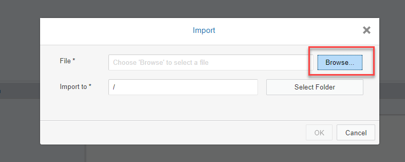
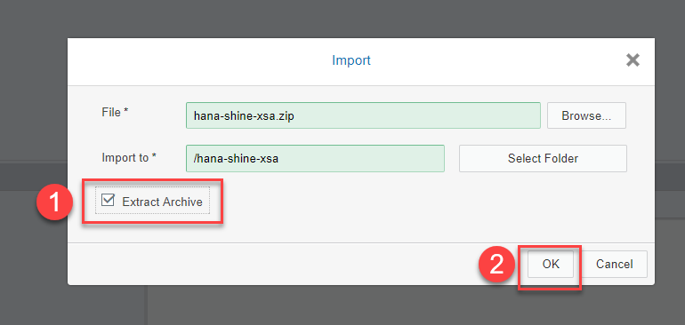
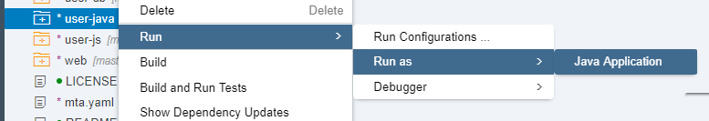

## Prerequisites
 - **Proficiency:** Beginner

## Details
### You will learn  
Import a pre-configured SHINE (SAP HANA interactive Education) module and generate additional sample data.

### Time to Complete
**15 Min**

---

[ACCORDION-BEGIN [Step 1: ](Import SHINE modules)]

Right-click on the **Workspace** and click on **Import**: 

Then click **Browse**:

Navigate to the folder on the Desktop called `SHINE Package` and choose the file `hana-shine-xsa.zip`

Click on **Extract Archive** and then on **OK**

[DONE]
[ACCORDION-END]

[ACCORDION-BEGIN [Step 2: ](Set the project space and edit setting)]

Right-click on the imported project and go to `Project Settings`:

Set the space `development` to the project:

**Close** the settings dialog.

[DONE]
[ACCORDION-END]

[ACCORDION-BEGIN [Step 3: ](Build the SHINE database modules)]

You will build the database modules first.  

Start with the module `user-db`. Right click on its folder and then on **Build**:

And make sure the build is successful.

Repeat the steps with the `core-db` module. The rest of the modules will be built automatically before they are run in the next step.

>Note: There are some prerequisites for the SHINE model to run properly that have been fulfilled for you in the Virtual Machine provided at TechEd.
&nbsp;

[DONE]
[ACCORDION-END]

[ACCORDION-BEGIN [Step 4: ](Run the SHINE applications)]

You will now run the modules. They will take a bit longer because they will be automatically built first.

Right-click con the `user-js` module and then click on `Run->Run as->Node.js Application`

Then run the `core-js` module:

Then run the `user-java` module:

Check all the modules are running. You can quickly verify because you will see a green tick next to each one of them:

Finally, run the web module. Right-click on the `web->resource->launchpad->index.html` and click on **Run**:

A new tab will open in the browser. You can click on the generated URL if the pop-up blocker did not allow the application to start.

[DONE]
[ACCORDION-END]

[ACCORDION-BEGIN [Step 5: ](Check prerequisites)]

You may need to log in again. Use **`XSA_DEV`** and the password you set up.

The first execution of the SHINE `launchpad` will help you make sure the technical prerequisites are fulfilled. Click on the **Check Prerequisites** button:

Any missing dependencies will be marked for you. Click on each of the buttons for them to be automatically corrected:

[DONE]
[ACCORDION-END]

[ACCORDION-BEGIN [Step 6: ](Generate data)]

You are finally presented with different options in the `launchpad`. Click on `Generate Data`:

You can increase the number of transactions in your database or reload master data:

[VALIDATE_3]
[ACCORDION-END]
